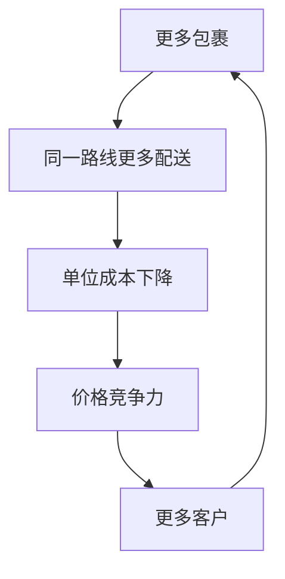

# 运输行业概览 - 经济动脉的投资逻辑

## 行业定义与重要性

运输行业是经济的基础设施，负责将货物和人员从一地移动到另一地。作为经济的"动脉"，运输行业的健康状况直接反映经济活动水平，是重要的经济先行指标。

**行业特征**：
- 经济敏感性：与GDP高度相关
- 基础设施属性：高固定成本
- 网络效应：规模越大，效率越高
- 监管影响：政府监管较多
- 周期性：中等至强

## 行业细分与规模

### 美国运输市场规模

**各细分市场**（年收入）：
- 卡车运输：约9,000亿美元（最大）
- 快递与包裹：约1,500亿美元
- 铁路货运：约800亿美元
- 航空货运：约600亿美元
- 海运：约400亿美元（美国境内）
- 管道运输：约700亿美元

**总市场**：约1.3万亿美元

### 主要细分市场

**1. 快递与包裹（Express & Parcel）**

**市场特征**：
- 高增长：电商驱动
- 网络效应：密度经济
- 品牌重要：信任与可靠性

**主要玩家**：
- UPS：约28%市场份额
- FedEx：约25%
- USPS：约20%
- Amazon Logistics：约15%（快速增长）

**增长驱动**：
- 电商渗透率提升
- B2C包裹增长
- 跨境电商

**2. 铁路货运（Rail Freight）**

**市场特征**：
- 寡头格局：7大I级铁路
- 高固定成本：铁路基础设施
- 规模经济：显著
- 监管：STB（地面运输委员会）

**主要玩家**：
- Union Pacific（UP）：西部
- BNSF（Berkshire Hathaway旗下）：西部
- CSX：东部
- Norfolk Southern（NS）：东部
- Canadian National（CN）：跨境
- Canadian Pacific Kansas City（CPKC）：跨境

**货物类型**：
- 散货：煤炭、谷物、化肥
- 工业品：汽车、钢铁、化工
- 集装箱（Intermodal）：电商、消费品
- 能源：原油、液化天然气

**3. 卡车运输（Trucking）**

**市场特征**：
- 高度分散：数十万家公司
- 低进入壁垒：相对
- 劳动力密集：司机短缺问题
- 周期性：强

**细分**：
- 整车（TL）：单一货主
- 零担（LTL）：多货主拼车
- 特种运输：危险品、超重

**主要玩家**：
- Old Dominion（LTL领导者）
- XPO Logistics
- Saia
- Werner Enterprises（TL）

**4. 航空货运（Air Freight）**

**市场特征**：
- 高价值货物：电子、医药、奢侈品
- 时间敏感：快速交付
- 与航空公司协同

**主要玩家**：
- FedEx Express：最大航空货运网络
- UPS Airlines
- Amazon Air（快速增长）
- 货运航空公司：Atlas Air、ATSG

## 行业经济学

### 网络效应与密度经济

**快递行业**：

**铁路行业**：
- 固定成本：铁路、机车、设施
- 边际成本：相对低
- 规模效应：货量越大，单位成本越低

**卡车行业**：
- 相对较低的网络效应
- 规模优势：采购、技术
- 密度优势：LTL更明显

### 成本结构

**快递（UPS/FedEx）**：
- 人工：约60%
- 燃油：约10-15%
- 设施：约10%
- 其他：约15-20%

**铁路（Union Pacific）**：
- 人工：约25%
- 燃油：约15-20%
- 折旧：约15%
- 维护：约15%
- 其他：约25%

**卡车**：
- 人工（司机）：约35-40%
- 燃油：约25-30%
- 设备：约15%
- 其他：约15-25%

### 定价机制

**快递**：
- 基础费率：按重量/尺寸
- 附加费：燃油、住宅、超大
- 旺季附加费：Peak Surcharge
- 年度涨价：4-6%

**铁路**：
- 合同定价：长期合同
- 现货定价：市场供需
- 监管约束：STB监管
- 通胀调整：年度涨价

**卡车**：
- 市场定价：供需决定
- 周期性强：运力过剩时价格下跌
- 燃油附加费：随油价调整

## 行业周期性分析

### 经济周期影响

**强周期性（卡车）**：
- 与工业生产高度相关
- 运力调整：司机进出
- 价格波动：大

**中等周期性（快递）**：
- 电商提供结构性支撑
- B2B部分：周期性
- B2C部分：相对稳定

**弱周期性（铁路）**：
- 多元化货物：平滑周期
- 长期合同：稳定收入
- 但仍受经济影响

### 历史周期

**2008-2009年金融危机**：
- 卡车：运量下降20-30%
- 铁路：运量下降15-20%
- 快递：下降10-15%

**2020年新冠疫情**：
- 初期：工业货物下降
- 后期：电商爆发，快递激增
- 铁路：混合影响

**2021-2022年供应链危机**：
- 运力紧张：价格飙升
- 港口拥堵：影响铁路
- 快递：利润率提升

**2023年正常化**：
- 运力过剩：价格下降
- 快递：需求回落
- 铁路：相对稳定

## 结构性趋势

### 电商持续增长

**影响**：
- 快递：最大受益者
- 最后一英里：竞争加剧
- 退货物流：新增需求

**挑战**：
- Amazon自建物流：威胁UPS/FedEx
- 成本压力：住宅配送成本高
- 密度：农村地区效率低

### 自动化与技术

**仓储自动化**：
- 机器人分拣：提升效率
- 自动化仓库：降低人工成本
- AI路线优化：减少燃油消耗

**自动驾驶**：
- 卡车：长途干线最先商业化
- 快递：最后一英里机器人
- 时间线：2025-2030年商业化

**无人机配送**：
- 试点：Amazon、Wing、UPS
- 监管：FAA逐步放开
- 商业化：2025年+

### 可持续发展

**电动化**：
- 快递：电动配送车（UPS、FedEx、Amazon）
- 卡车：特斯拉Semi、Freightliner eCascadia
- 铁路：混合动力机车

**碳中和目标**：
- UPS：2050年净零排放
- FedEx：2040年碳中和
- Union Pacific：2050年净零

**成本影响**：
- 短期：电动车成本高
- 长期：燃油成本节省
- 基础设施：充电网络投资

### Amazon的颠覆性影响

**Amazon Logistics增长**：
- 2016年：几乎为零
- 2023年：约50亿包裹/年
- 市场份额：约15%（快速增长）

**对UPS/FedEx的影响**：
- Amazon业务量减少：主动降低依赖
- 定价压力：Amazon自建降低议价
- 长期威胁：Amazon可能对外开放

**应对策略**：
- UPS：聚焦高价值B2B和医疗
- FedEx：与Amazon竞争，开放第三方
- 差异化：服务质量、可靠性

## 投资框架

### 各细分市场投资逻辑

**快递（UPS/FedEx）**：
- 核心命题：电商增长 + 网络效应 + 定价权
- 关键指标：包裹量、定价实现率、利润率
- 风险：Amazon威胁、劳动力成本
- 适合：长期价值投资者

**铁路（Union Pacific/BNSF）**：
- 核心命题：寡头定价权 + 精益运营 + 稳定现金流
- 关键指标：运营比率（OR）、RTM增长、定价
- 风险：经济衰退、监管
- 适合：价值+收入投资者

**卡车（Old Dominion/XPO）**：
- 核心命题：周期底部买入 + 运营效率
- 关键指标：运量、定价、运营比率
- 风险：周期性强、运力过剩
- 适合：周期投资者

### 关键投资指标

**快递**：
- 包裹量增长（YoY）
- 收入/包裹（定价）
- 运营利润率
- 自由现金流

**铁路**：
- 运营比率（OR）：越低越好，目标<60%
- 收入吨英里（RTM）增长
- 定价（收入/RTM）
- 自由现金流

**卡车**：
- 运量（装载量）
- 收入/英里
- 运营比率
- 运力利用率

### 估值方法

**快递**：
- P/E：15-20倍
- EV/EBITDA：10-13倍
- FCF收益率：4-6%

**铁路**：
- P/E：18-22倍（高质量溢价）
- EV/EBITDA：12-15倍
- FCF收益率：3-5%

**卡车**：
- P/E：10-15倍（周期底部）
- EV/EBITDA：6-10倍
- 周期调整估值

## 主要公司速览

### UPS（NYSE: UPS）
- 定位：全球最大快递公司之一
- 优势：地面网络密度、B2C
- 当前：需求正常化，成本压力
- 投资主题：稳定收益+电商增长

### FedEx（NYSE: FDX）
- 定位：航空快递领导者
- 优势：航空网络、B2B
- 当前：整合TNT，成本削减
- 投资主题：运营改善+利润率提升

### Union Pacific（NYSE: UNP）
- 定位：美国西部最大铁路
- 优势：西部网络、精益运营
- 当前：稳定增长，定价权
- 投资主题：稳定现金流+股息增长

### BNSF（Berkshire Hathaway旗下）
- 定位：美国最大铁路（按收入）
- 优势：西部+中部网络
- 当前：私有，不可直接投资
- 投资主题：通过BRK.B间接投资

### Old Dominion（NASDAQ: ODFL）
- 定位：LTL卡车运输领导者
- 优势：服务质量、运营效率
- 当前：周期性压力
- 投资主题：高质量周期股

## 关键学习点

**1. 网络效应的护城河**
- 快递和铁路：网络越大越有优势
- 密度经济：规模降低单位成本
- 难以复制：基础设施投资巨大

**2. 周期性管理**
- 不同细分：周期性不同
- 买入时机：周期底部
- 长期持有：结构性增长

**3. 技术变革的双刃剑**
- 自动化：降低成本，提升效率
- Amazon：颠覆传统格局
- 电动化：长期成本优势

**4. 定价权的重要性**
- 铁路：寡头定价权最强
- 快递：网络效应支撑
- 卡车：市场定价，周期性强

## 参考文献

1. American Trucking Associations. (2023). "Trucking Activity Report".
2. Association of American Railroads. (2023). "Railroad Statistics".
3. Pitney Bowes. (2023). "Parcel Shipping Index".
4. McKinsey & Company. (2023). "Future of Logistics".
5. Deloitte. (2023). "Transportation & Logistics Trends".
6. Morgan Stanley. (2023). "Transportation Industry Report".
7. Wolfe Research. (2023). "Transportation Sector Analysis".
8. Bernstein Research. (2023). "Logistics & Transportation".
9. U.S. Bureau of Transportation Statistics. (2023). Various reports.
10. Oliver Wyman. (2023). "Rail Industry Outlook".
