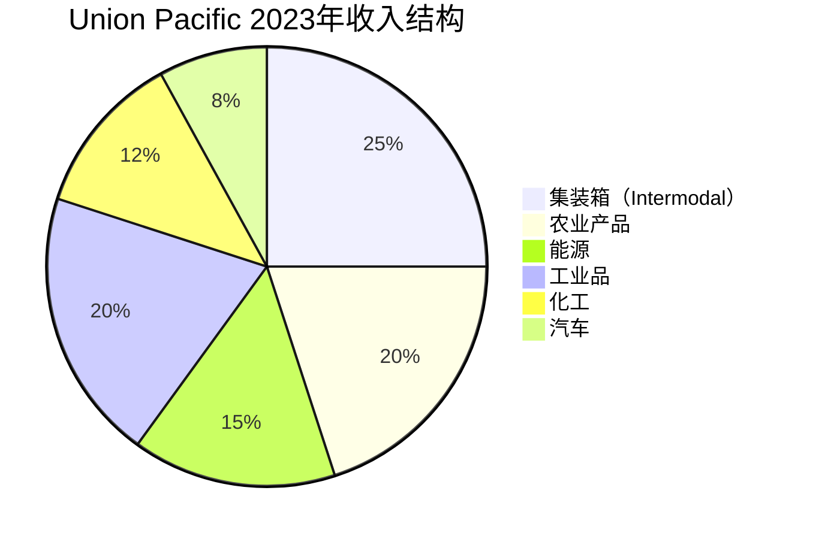
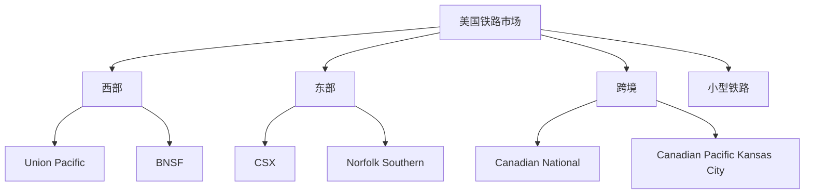

# Union Pacific - 美国西部铁路的精益王者

## 公司概况

**基本信息**：
- 成立时间：1862年（林肯总统签署太平洋铁路法案）
- 总部：奥马哈，内布拉斯加州
- 上市时间：NYSE: UNP
- 市值：约1,400-1,600亿美元
- 员工数：约3.2万人
- 年收入：约230-250亿美元

**主营业务**：
Union Pacific是美国最大的铁路公司之一，运营着覆盖美国西部23个州的32,000英里铁路网络，连接美国西海岸港口与中部、东部市场，是美国经济的核心动脉。

**行业地位**：
- 美国西部最大铁路公司
- 全球市值最高的铁路公司之一
- 标普500成分股
- 巴菲特长期持有（通过BNSF间接竞争）

## 铁路网络：地理优势

### 网络覆盖

**地理范围**：
- 覆盖：美国西部23个州
- 里程：约32,000英里
- 连接：太平洋港口（洛杉矶、长滩、西雅图）至中部、东部
- 边境：墨西哥6个口岸

**战略位置**：
- 亚洲进口：太平洋港口是亚洲货物进入美国的门户
- 农业出口：中西部粮食出口通道
- 能源运输：德克萨斯、怀俄明能源产区
- 工业走廊：连接主要制造业中心

### 网络的护城河

**不可复制性**：
- 土地成本：数千亿美元
- 建设时间：数十年
- 监管许可：极难获得
- 历史积累：160年

**双寡头格局（西部）**：
- Union Pacific：南部走廊（洛杉矶-芝加哥）
- BNSF：北部走廊（西雅图-芝加哥）
- 两家公司：基本不重叠，各有领地

## 货物结构分析

### 六大货物类别

**1. 集装箱运输（Intermodal）**

**业务特征**：
- 海运集装箱：亚洲进口货物
- 国内集装箱：电商、零售
- 与卡车竞争：长途更有优势

**增长驱动**：
- 亚洲进口：持续增长
- 电商：包裹量增加
- 卡车替代：环保+成本

**收入占比**：约25%
**利润率**：中等

**2. 农业产品（Agricultural Products）**

**主要货物**：
- 谷物：玉米、小麦、大豆
- 化肥：农业投入品
- 食品：加工食品
- 乙醇：生物燃料

**特点**：
- 季节性：收获季节高峰
- 出口导向：通过墨西哥湾港口出口
- 稳定需求：食品需求刚性

**收入占比**：约20%

**3. 能源（Energy）**

**主要货物**：
- 煤炭：电力行业（下降趋势）
- 原油：德克萨斯Permian盆地
- 液化天然气（LNG）
- 可再生能源设备：风机叶片、太阳能板

**趋势**：
- 煤炭：长期下降（能源转型）
- 原油：波动，与油价相关
- 可再生能源：新增长点

**收入占比**：约15%

**4. 工业品（Industrial Products）**

**主要货物**：
- 建筑材料：木材、水泥、钢铁
- 金属：铝、铜
- 矿产：砂石、矿石
- 废料：回收金属

**特点**：
- 与建筑/制造业相关
- 周期性：中等
- 重量大：铁路优势明显

**收入占比**：约20%

**5. 化工（Chemicals）**

**主要货物**：
- 塑料原料
- 工业化学品
- 危险品（专业运输）
- 液体化学品

**特点**：
- 高价值：利润率高
- 专业化：需要特殊车厢
- 稳定需求：工业基础需求

**收入占比**：约12%

**6. 汽车（Automotive）**

**主要货物**：
- 整车：新车运输
- 零部件：汽车供应链
- 墨西哥：跨境汽车贸易

**特点**：
- 与汽车销售相关
- 墨西哥工厂：重要来源
- 电动车：新增长点

**收入占比**：约8%

## 精益铁路运营（PSR）

### 什么是精益铁路运营（Precision Scheduled Railroading）

**PSR理念**：
- 创始人：Hunter Harrison（已故）
- 核心：像工厂一样运营铁路
- 目标：提高资产利用率，降低成本

**PSR的六大原则**：
1. 按时刻表运行：固定时刻表，减少等待
2. 减少车厢数量：提高利用率
3. 延长列车长度：提高效率
4. 减少分类场：简化网络
5. 提高机车利用率：减少闲置
6. 降低运营比率：核心KPI

### Union Pacific的PSR实施

**实施时间**：2019年开始全面推行

**关键指标改善**：

| 指标 | PSR前（2018） | PSR后（2022） | 改善 |
|------|-------------|-------------|------|
| 运营比率（OR） | 62.7% | 60.1% | -2.6pp |
| 机车利用率 | 基准 | +15% | 提升 |
| 列车速度 | 基准 | +10% | 提升 |
| 停留时间 | 基准 | -15% | 减少 |

**运营比率（Operating Ratio）**：
- 定义：运营成本/收入
- 越低越好：代表效率越高
- 行业目标：<60%
- Union Pacific：约60-62%

### PSR的财务影响

**成本节省**：
- 人工：减少员工数量
- 燃油：提高效率
- 设备：减少机车、车厢

**收入影响**：
- 服务可靠性：提升客户满意度
- 定价能力：服务质量支撑
- 但：部分客户流失（服务变化）

**争议**：
- 服务质量：部分客户抱怨
- 监管关注：STB调查
- 平衡：效率 vs 服务

## 竞争分析

### 铁路行业格局

**美国I级铁路（7家）**：

**Union Pacific vs BNSF**：

| 特征 | Union Pacific | BNSF |
|------|-------------|------|
| 所有权 | 上市公司 | Berkshire Hathaway私有 |
| 网络 | 南部走廊 | 北部走廊 |
| 优势 | 墨西哥贸易 | 煤炭、农业 |
| 利润率 | 相近 | 相近 |

**竞争优势**：
- 地理垄断：西部南部走廊无竞争
- 墨西哥贸易：USMCA受益
- 太平洋港口：亚洲进口门户

### 与卡车的竞争

**铁路优势**：
- 长途：>500英里，铁路更经济
- 重货：铁路成本优势明显
- 环保：铁路碳排放低4倍
- 燃油效率：一加仑燃油运货500吨英里

**卡车优势**：
- 灵活性：门到门
- 短途：<500英里
- 时间敏感：更快

**趋势**：
- 卡车司机短缺：推动货物转向铁路
- 环保法规：铁路受益
- 电商：集装箱运输增长

## 财务分析

### 历史财务表现

**收入增长**（单位：十亿美元）：
- 2018年：$22.8B
- 2019年：$21.7B（-5%，贸易战）
- 2020年：$19.5B（-10%，疫情）
- 2021年：$21.8B（+12%，复苏）
- 2022年：$24.9B（+14%，通胀+定价）
- 2023年：$23.7B（-5%，需求正常化）

**盈利能力**：
- 营业利润率：约38-42%（极高）
- 净利率：约25-28%
- ROIC：约15-18%

**为什么利润率这么高**：
- 固定成本：已摊薄
- 定价权：寡头
- 规模效应：显著
- 资产密集：高折旧后利润率

### 运营比率（核心指标）

**历史运营比率**：
- 2018年：62.7%
- 2019年：61.0%
- 2020年：60.0%（疫情中改善）
- 2021年：57.2%（历史最低）
- 2022年：60.1%（劳动力问题）
- 2023年：60.9%

**目标**：
- 短期：<60%
- 长期：55-57%（行业最佳）

### 现金流分析

**经营现金流**：
- 年度：约80-90亿美元
- 稳定性：高
- 增长性：稳定

**自由现金流**：
- 年度：约50-60亿美元
- 资本开支：约30-35亿美元/年
- FCF/收入：约20-25%（极高）

**资本开支用途**：
- 轨道维护：约40%
- 机车更新：约25%
- 技术升级：约15%
- 扩容：约20%

**资本配置**：
- 股息：约35亿美元/年（收益率约2.5%）
- 股票回购：约50-60亿美元/年
- 股息增长：连续15年+

### 资本结构

**债务水平**：
- 总债务：约280-300亿美元
- 净债务：约250-270亿美元
- 净债务/EBITDA：约2.5-3.0倍

**信用评级**：
- 标普：A-
- 穆迪：A3
- 稳定展望

**杠杆策略**：
- 铁路：稳定现金流支持较高杠杆
- 利率敏感：长期固定利率债务
- 再融资：分散到期时间

## 投资论点

### 看多理由

**1. 地理垄断与定价权**

**护城河**：
- 西部南部走廊：无竞争
- 不可复制：160年历史
- 定价权：年均涨价4-6%

**定价能力**：
- 通胀传导：合同有价格调整
- 服务溢价：可靠性定价
- 长期合同：锁定收入

**2. 精益运营持续改善**

**运营比率目标**：
- 当前：约61%
- 目标：<60%（短期）
- 长期：55-57%

**每降低1%运营比率**：
- 节省约$2.4亿成本
- 利润增加约$1.8亿（税后）
- 每股收益提升约$0.30

**3. 墨西哥贸易增长（近岸外包）**

**趋势**：
- 中美脱钩：制造业转移
- 近岸外包（Nearshoring）：墨西哥受益
- USMCA：贸易协定支持

**Union Pacific受益**：
- 墨西哥6个口岸：独特优势
- 跨境货物：快速增长
- 汽车、电子：主要货物

**量化影响**：
- 墨西哥贸易：年增长10-15%
- 收入贡献：约$20-30亿（增量）

**4. 稳定高质量现金流**

**现金流特征**：
- 年FCF：50-60亿美元
- 可预测性：高
- 增长性：稳定3-5%

**股东回报**：
- 股息+回购：约85-95亿美元/年
- 股息增长：连续15年+
- 总回报率：年化8-12%

**5. 电商与集装箱增长**

**长期趋势**：
- 电商：持续增长
- 亚洲进口：长期增长
- 集装箱：铁路最快增长细分

**Union Pacific优势**：
- 太平洋港口连接
- 内陆分拨中心
- 与卡车公司合作

### 风险因素

**1. 经济周期性**

**敏感性**：
- 工业生产：高度相关
- 贸易量：与GDP相关
- 历史：2008-2009年收入下降20%

**2. 监管风险**

**STB监管**：
- 服务质量：监管关注
- 定价：反垄断审查
- 合并：严格审查

**PSR争议**：
- 服务下降：客户投诉
- 监管调查：STB介入
- 可能：强制服务改善

**3. 能源转型**

**煤炭下降**：
- 煤炭：约10-15%收入
- 长期：持续下降
- 替代：可再生能源设备

**影响**：
- 收入损失：需要其他货物替代
- 已部分替代：集装箱、化工

**4. 劳动力问题**

**铁路工人**：
- 工会谈判：2022年危机
- 工资上涨：成本压力
- 人员精简：PSR引发争议

**5. 竞争加剧**

**卡车**：
- 自动驾驶：长期威胁
- 电动卡车：成本下降
- 灵活性：卡车优势

**BNSF**：
- 同为西部铁路
- 部分路线竞争
- Berkshire支持：资本充足

## 估值分析

### DCF估值

**假设**：
- 收入增长：3-5%（长期）
- FCF利润率：22-25%
- WACC：7%
- 永续增长率：2%

**估值区间**：
- 保守：$200-220/股
- 基准：$230-260/股
- 乐观：$280-320/股

### 相对估值

**铁路行业估值**：

| 公司 | P/E | EV/EBITDA | FCF收益率 |
|------|-----|-----------|---------|
| Union Pacific | 18-22x | 12-15x | 3-4% |
| CSX | 18-20x | 12-14x | 3-4% |
| Norfolk Southern | 16-20x | 11-13x | 3-5% |
| Canadian National | 20-23x | 13-15x | 3-4% |

**估值溢价**：
- 铁路行业：相对市场溢价
- 原因：稳定现金流、定价权、护城河
- 合理性：高质量资产应有溢价

### 巴菲特视角

**为什么巴菲特买BNSF（2009年）**：
- "经济的动脉"：不可或缺
- 护城河：不可复制
- 定价权：通胀保护
- 稳定现金流：可预测

**Union Pacific类比**：
- 同样的逻辑
- 可直接投资（上市）
- 长期持有：复利增长

## 投资策略

### 适合投资者类型

**长期价值投资者**：
- 护城河明确
- 稳定现金流
- 合理估值

**收入型投资者**：
- 股息收益率：约2.5%
- 股息增长：年均8-10%
- 股息安全性：高

**通胀保护型**：
- 定价权：通胀传导
- 实物资产：铁路网络
- 长期价值保护

### 持有策略

**长期持有**：
- 持有期：10年+
- 股息再投资
- 复利增长

**监测指标**：
- 运营比率（季度）
- 货运量（月度）
- 定价（收入/RTM）
- 自由现金流
- 墨西哥贸易增长

**买入时机**：
- 经济衰退担忧时
- 运营问题短期影响
- FCF收益率 > 4%
- P/E < 18倍

## 关键学习点

**1. 地理垄断的价值**
- 不可复制的网络
- 160年历史积累
- 定价权的基础

**2. 精益运营的持续改善**
- PSR：工厂化管理铁路
- 运营比率：核心KPI
- 持续改善：复利效应

**3. 铁路是通胀保护资产**
- 定价权：通胀传导
- 实物资产：保值
- 长期合同：价格调整

**4. 近岸外包的结构性机遇**
- 中美脱钩：制造业转移
- 墨西哥受益：Union Pacific独特优势
- 长期趋势：10-20年

**5. 巴菲特式投资的典范**
- 护城河：不可复制
- 稳定现金流：可预测
- 长期持有：复利增长

## 参考文献

1. Union Pacific. (2023). *Annual Report*.
2. Association of American Railroads. (2023). "Railroad Statistics".
3. Surface Transportation Board. (2023). "Railroad Performance Measures".
4. McKinsey & Company. (2023). "Future of Rail".
5. Oliver Wyman. (2023). "Rail Industry Outlook".
6. Morgan Stanley. (2023). "Union Pacific Analysis".
7. Bernstein Research. (2023). "Railroad Sector Outlook".
8. Wolfe Research. (2023). "Transportation Industry Report".
9. Wall Street Journal. (2023). "Union Pacific Coverage".
10. Warren Buffett. (2009). "BNSF Acquisition Letter to Shareholders".
11. Hunter Harrison. (2017). "Precision Scheduled Railroading".
12. U.S. Bureau of Transportation Statistics. (2023). "Rail Statistics".
