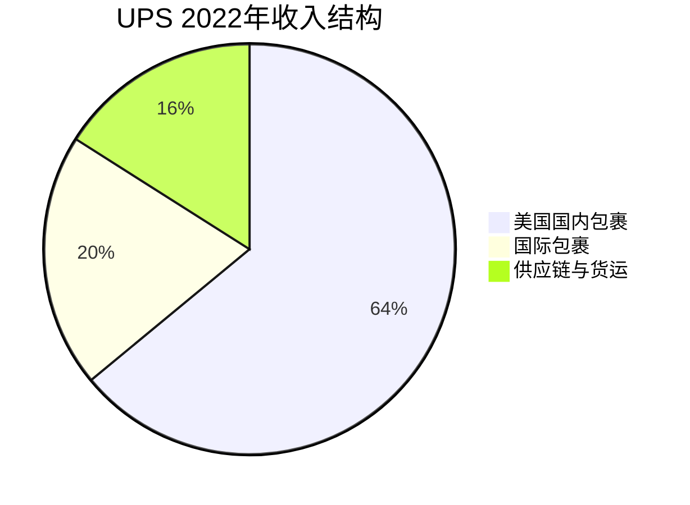
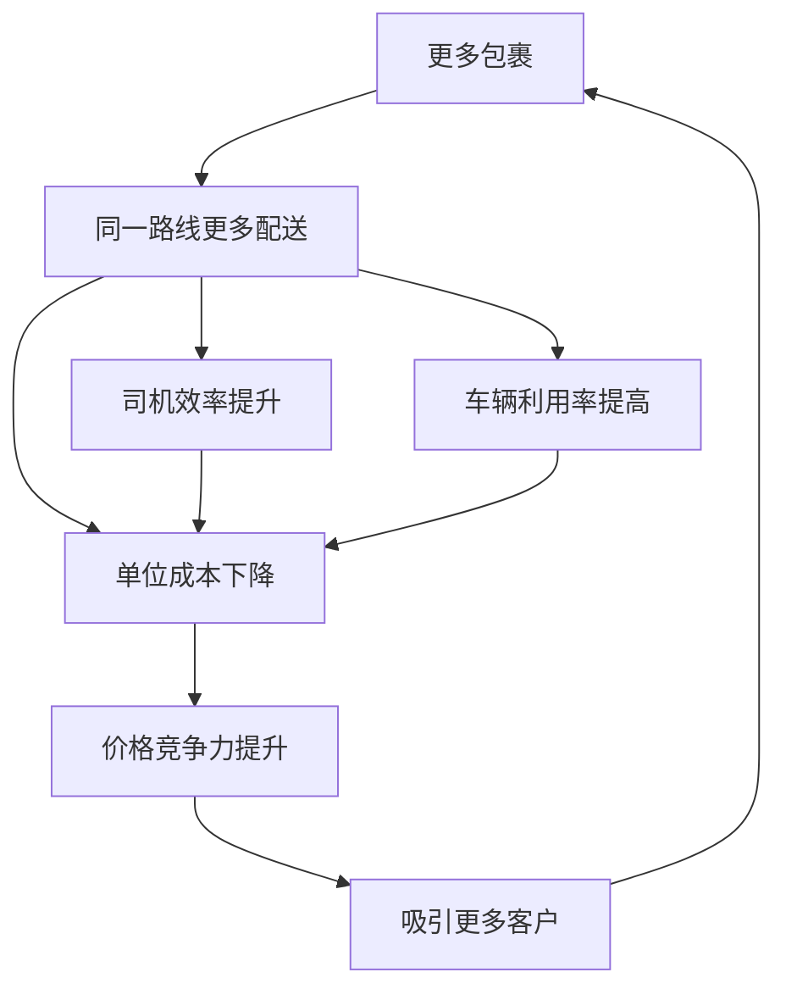
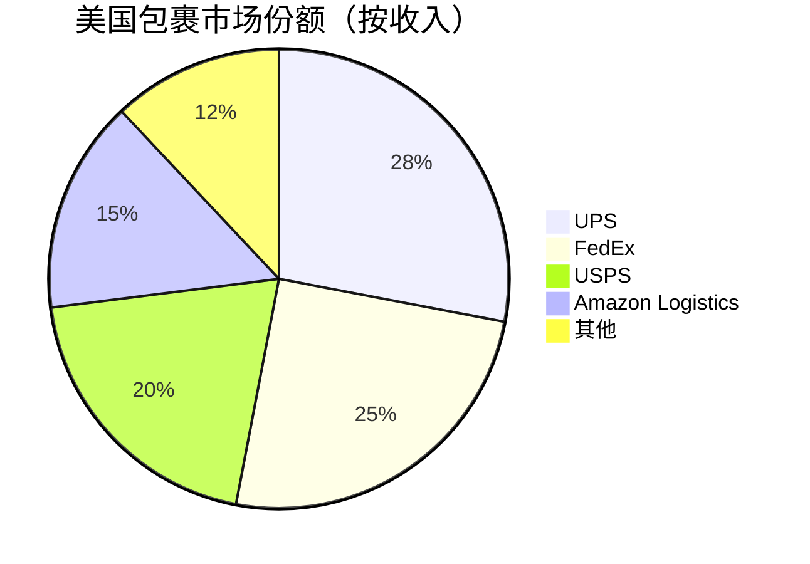

# UPS - 物流网络的护城河

## 公司概况

**基本信息**：
- 全称：United Parcel Service
- 成立时间：1907年
- 总部：亚特兰大，佐治亚州
- 上市时间：1999年（NYSE: UPS）
- 市值：约1,300-1,600亿美元
- 员工数：约50万人
- 年收入：约1,000亿美元

**主营业务**：
UPS是全球最大的快递物流公司之一，提供包裹递送、供应链管理和货运服务。

**行业地位**：
- 美国包裹递送市场份额：约25-30%
- 全球快递市场：前三名
- B2C电商物流：领先地位
- 品牌认知度：标志性棕色卡车

## 商业模式分析

### 业务结构

**1. 美国国内包裹（U.S. Domestic Package）**

**服务类型**：
- **地面服务（Ground）**：
  - 1-5天送达
  - 最大业务量：约70%包裹
  - 成本最低，利润率中等

- **航空服务（Air）**：
  - Next Day Air：次日达
  - 2nd Day Air：两日达
  - 高价格，高利润率

- **SurePost**：
  - UPS+USPS合作
  - 最后一英里由邮局配送
  - 低价格，服务农村地区

**客户类型**：
- B2C（企业到消费者）：约60%
  - 电商包裹主导
  - Amazon、Walmart、Target等
- B2B（企业到企业）：约40%
  - 工业零部件
  - 医疗用品
  - 文件快递

**收入占比**：约64%
**营业利润率**：约10-12%

**2. 国际包裹（International Package）**

**服务网络**：
- 覆盖220+国家和地区
- 国际航空网络
- 海关清关能力
- 本地配送网络

**主要市场**：
- 欧洲：成熟市场
- 亚洲：增长市场
- 拉美：新兴市场

**服务类型**：
- 国际快递：1-3天
- 国际标准：3-7天
- 跨境电商：专门解决方案

**收入占比**：约20%
**营业利润率**：约15-18%（最高）

**3. 供应链与货运（Supply Chain & Freight）**

**供应链解决方案**：
- 仓储管理
- 订单履行
- 逆向物流（退货）
- 医疗物流（温控）

**货运服务**：
- LTL（零担货运）
- 整车货运
- 货运代理
- 海运、空运

**收入占比**：约16%
**营业利润率**：约5-8%

### 网络效应与规模优势

**密度经济（Density Economics）**：

**网络效应特征**：
- 同一区域包裹越多，单位成本越低
- 每增加一个包裹，边际成本递减
- 规模优势难以复制

**基础设施投资**：
- 分拣中心：全球数百个
- 车辆：约12.5万辆
- 飞机：约570架
- 设施：约5,000个

**投资回报**：
- 高固定成本
- 规模效应显著
- 进入壁垒高

## 竞争分析

### 市场格局

**美国包裹递送市场**：

**主要竞争对手**：

**1. FedEx**
- 市场份额：约25%
- 优势：航空网络、B2B
- 劣势：地面网络密度
- 定位：速度与可靠性

**2. USPS（美国邮政）**
- 市场份额：约20%
- 优势：最后一英里覆盖、价格
- 劣势：财务困境、效率低
- 定位：普遍服务

**3. Amazon Logistics**
- 市场份额：约15%（快速增长）
- 优势：自有货源、技术
- 劣势：网络不完整、成本高
- 威胁：垂直整合

**4. 区域性快递**
- OnTrac、LaserShip等
- 市场份额：<5%
- 定位：区域专注、低价

### UPS vs FedEx

**战略差异**：

**UPS**：
- 地面网络优势
- B2C电商强
- 密度经济
- 稳定增长

**FedEx**：
- 航空网络优势
- B2B快递强
- 速度优先
- 激进扩张

**财务对比**：
- 收入规模：UPS略大
- 利润率：UPS更高
- 资本开支：FedEx更高
- 现金流：UPS更稳定

### 竞争优势（护城河）

**1. 网络效应**

**密度优势**：
- 美国最密集地面网络
- 每天1,600万个包裹
- 单位成本最低

**规模经济**：
- 固定成本摊薄
- 采购议价能力
- 技术投资回报

**2. 品牌与信任**

**品牌价值**：
- 116年历史
- 标志性棕色
- 可靠性声誉

**客户忠诚度**：
- B2B客户粘性高
- 长期合同
- 服务质量

**3. 基础设施**

**资产规模**：
- 12.5万辆车
- 570架飞机
- 5,000+设施
- 难以复制

**技术系统**：
- 包裹追踪
- 路线优化
- 自动化分拣
- 数据分析

**4. 运营效率**

**精益运营**：
- 工业工程优化
- 持续改进文化
- 司机培训体系

**关键指标**：
- 每小时包裹处理量
- 车辆利用率
- 准时率：>95%

## 财务分析

### 历史财务表现

**收入增长**（单位：十亿美元）：
- 2018年：$71.9B
- 2019年：$74.1B
- 2020年：$84.6B（疫情电商爆发）
- 2021年：$97.3B（峰值）
- 2022年：$100.3B
- 2023年：$91.0B（需求正常化）

**增长驱动**：
- 电商增长：长期趋势
- 定价权：Peak Surcharge
- 国际扩张
- 供应链服务

### 盈利能力

**利润率趋势**：
- 营业利润率：10-13%
- 净利率：7-10%
- 疫情期间：利润率提升（定价权）
- 2023年：利润率压力（成本上升）

**盈利质量**：
- 现金流转化：优秀
- 资本回报率：ROIC 20-25%
- 周期性：中等

### 成本结构

**主要成本**：
- 人工成本：约60%
  - 司机、分拣工、管理
  - 工会合同（Teamsters）
  - 福利与退休金
- 运输成本：约15%
  - 燃油
  - 车辆维护
  - 飞机租赁
- 设施成本：约10%
- 其他：约15%

**成本压力**：
- 劳动力短缺
- 工资上涨
- 燃油价格波动
- 自动化投资需求

### 现金流分析

**经营现金流**：
- 年度：约100-120亿美元
- 经营现金流/收入：约10-12%
- 稳定性：高

**自由现金流**：
- 年度：约50-70亿美元
- 资本开支：约50-60亿美元/年
- FCF/收入：约5-7%

**资本配置**：
- 股息：约50亿美元/年
- 回购：约20-30亿美元/年
- 股息收益率：约3-4%
- 派息率：约60-70%

### 资本结构

**债务水平**：
- 总债务：约200-250亿美元
- 净债务：约150-200亿美元
- 净债务/EBITDA：约1.5-2.0倍

**信用评级**：
- 标普：A-
- 穆迪：A3
- 稳定展望

**退休金负债**：
- 重要考虑因素
- 资金状况：基本充足
- 长期负债

## 投资论点

### 看多理由

**1. 电商长期增长**

**趋势**：
- 美国电商渗透率：约15%
- 增长空间：目标25-30%
- 年增长率：5-8%

**UPS受益**：
- B2C包裹增长
- 高价值包裹
- 最后一英里优势

**2. 定价权**

**定价策略**：
- 年度费率上调：4-6%
- Peak Surcharge：旺季附加费
- 大客户重新谈判
- 服务分级定价

**定价权来源**：
- 网络不可替代性
- 服务质量
- 客户转换成本

**3. 运营效率提升**

**自动化投资**：
- 自动化分拣：提升50%效率
- 路线优化：AI算法
- 无人机配送：试点
- 电动车队：降低燃油成本

**回报**：
- 单位成本下降
- 利润率提升
- 资本回报率提高

**4. 国际增长**

**市场机会**：
- 亚洲电商增长
- 跨境电商
- 新兴市场

**投资**：
- 网络扩张
- 本地化能力
- 海关清关

**5. 稳定现金流与股息**

**现金流特征**：
- 年度FCF：50-70亿美元
- 可预测性：高
- 增长性：稳定

**股东回报**：
- 股息收益率：3-4%
- 股息增长：年均5-7%
- 股息贵族：连续增长

### 风险因素

**1. Amazon威胁**

**Amazon Logistics**：
- 自建物流网络
- 垂直整合
- UPS业务量流失

**影响**：
- Amazon占UPS收入：约10-15%
- 长期依赖度下降
- 定价压力

**2. 劳动力成本**

**工会谈判**：
- Teamsters工会
- 工资与福利压力
- 罢工风险

**劳动力短缺**：
- 司机招聘困难
- 工资上涨
- 利润率压缩

**3. 经济周期性**

**需求波动**：
- 经济衰退：B2B需求下降
- 消费者支出：影响B2C
- 库存周期

**历史表现**：
- 2008-2009：收入下降15%
- 2020：疫情初期下降后反弹

**4. 技术颠覆**

**新技术**：
- 无人机配送
- 自动驾驶卡车
- 机器人配送

**不确定性**：
- 技术成熟度
- 监管批准
- 成本效益

**5. 竞争加剧**

**FedEx**：
- 地面网络投资
- 价格竞争

**区域快递**：
- 低价竞争
- 区域市场份额

## 估值分析

### DCF估值

**假设**：
- 收入增长：3-5%（长期）
- FCF利润率：6-7%
- WACC：7-8%
- 永续增长率：2-3%

**估值结果**：
- 每股内在价值：$180-220
- 当前价格（假设$170）：略低估
- 安全边际：5-20%

### 相对估值

**可比公司**：
- FedEx：P/E 12-15倍，EV/EBITDA 8-10倍
- 其他物流：P/E 15-20倍

**UPS估值**：
- P/E：15-18倍
- EV/EBITDA：10-12倍
- FCF收益率：4-5%

**估值溢价**：
- 相对FedEx：合理溢价
- 反映：更高利润率、更稳定现金流

### 股息折现模型

**股息增长模型**：
- 当前股息：约$6/股
- 股息增长率：5-7%
- 要求回报率：8-9%

**估值**：
- 内在价值：$150-250/股
- 股息收益率：吸引力

## 投资策略

### 适合投资者类型

**价值投资者**：
- 稳定商业模式
- 护城河明确
- 合理估值

**收入投资者**：
- 股息收益率：3-4%
- 股息增长：年均5-7%
- 股息安全性：高

**周期投资者**：
- 经济复苏受益
- 电商增长趋势
- 定价权改善

### 持有策略

**长期持有**：
- 持有期：5-10年
- 股息再投资
- 复利增长

**监测指标**：
- 包裹量增长
- 定价实现率
- 运营利润率
- 自由现金流
- Amazon业务占比

### 配置建议

**核心持仓**：
- 价值组合：5-10%
- 收入组合：10-15%
- 工业板块：20-30%

**与其他物流股搭配**：
- FedEx：对冲风险
- 区域物流：增长潜力

## 关键学习点

**1. 网络效应的价值**
- 密度经济创造护城河
- 规模优势难以复制
- 边际成本递减

**2. 基础设施投资**
- 高固定成本
- 长期回报
- 进入壁垒

**3. 定价权的重要性**
- 网络不可替代性
- 服务质量
- 客户转换成本

**4. 电商趋势受益**
- 长期结构性增长
- B2C包裹增长
- 最后一英里价值

**5. 劳动力成本管理**
- 工会关系
- 自动化投资
- 效率提升

## 延伸阅读

### 推荐书籍

1. **《Big Brown》** - Greg Niemann，UPS历史
2. **《The Box》** - Marc Levinson，物流革命
3. **《Delivering Happiness》** - Tony Hsieh，客户服务
4. **《The Everything Store》** - Brad Stone，Amazon物流

### 研究资源

**公司资源**：
- UPS年报
- 季度财报
- 投资者日
- 运营数据

**行业数据**：
- Pitney Bowes包裹指数
- 美国人口普查局
- 电商数据
- 物流协会

**分析报告**：
- 投行研究
- 物流分析师
- 行业报告

## 参考文献

1. UPS. (2023). *Annual Report*.
2. Pitney Bowes. (2023). "Parcel Shipping Index".
3. U.S. Census Bureau. (2023). "E-commerce Statistics".
4. Morgan Stanley. (2023). "Transportation & Logistics Research".
5. Bernstein Research. (2023). "UPS Analysis".
6. Wolfe Research. (2023). "Transportation Industry Report".
7. McKinsey & Company. (2023). "Future of Logistics".
8. Deloitte. (2023). "Transportation & Logistics Trends".
9. The Wall Street Journal. (2023). "UPS Coverage".
10. Supply Chain Dive. (2023). Various articles.

## 深度分析

### 核心机制解析

理解本主题需要从多个维度进行系统性分析。以下从理论基础、实践应用和历史验证三个层面展开深度探讨。

**理论基础层面**：本主题的核心逻辑建立在经济学和金融学的基本原理之上。通过对基础理论的深入理解，投资者能够建立起稳固的分析框架，避免被市场短期噪音所干扰。

**实践应用层面**：理论必须与实践相结合才能产生价值。在实际投资决策中，需要将抽象的概念转化为具体的分析工具和决策标准。

**历史验证层面**：金融市场有着丰富的历史记录，通过研究历史案例，我们可以验证理论的有效性，并从中提炼出具有普遍意义的规律。

### 关键影响因素

影响本主题的关键因素可以从以下几个维度进行分析：

1. **宏观经济环境**：利率水平、通货膨胀率、经济增长速度等宏观变量对本主题有着深远影响。在不同的宏观经济周期中，相关指标的表现会呈现出显著差异。

2. **市场结构因素**：市场参与者的构成、信息传播机制、流动性状况等市场结构因素决定了价格发现的效率和准确性。

3. **政策监管环境**：政府政策、监管框架的变化会直接影响相关市场的运作规则和参与者行为。

4. **技术创新驱动**：技术进步不断改变着金融市场的运作方式，从算法交易到区块链技术，每一次技术革新都带来新的机遇和挑战。

5. **全球化与地缘政治**：在全球化背景下，各国市场之间的联动性日益增强，地缘政治风险的影响也越来越不可忽视。

### 量化分析框架

为了更精确地分析和评估，可以采用以下量化框架：

| 分析维度 | 关键指标 | 参考基准 | 分析方法 |
|---------|---------|---------|---------|
| 规模评估 | 绝对值与相对值 | 历史均值 | 趋势分析 |
| 质量评估 | 稳定性指标 | 行业对标 | 横向比较 |
| 风险评估 | 波动率指标 | 风险阈值 | 情景分析 |
| 价值评估 | 估值倍数 | 历史区间 | 回归分析 |

通过系统性地应用上述框架，投资者可以对目标进行全面、客观的评估，从而做出更加理性的投资决策。

