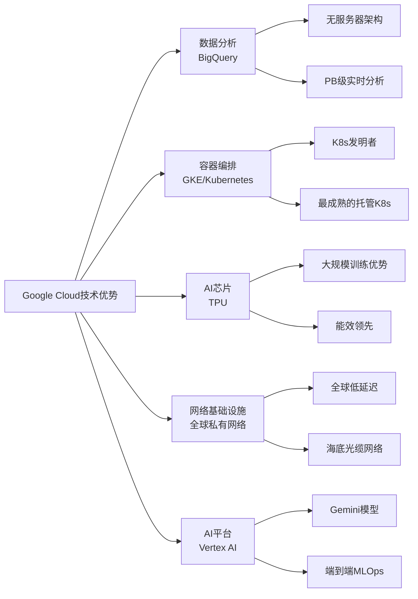

# Google Cloud：AI原生云平台的技术领导者

## 概述

Google Cloud是全球第三大云计算平台，2023年营收337亿美元，同比增长28%，是三大Hyperscaler中增速最快的。更重要的是，Google Cloud在2023年首次实现全年盈利，运营利润约18亿美元，标志着其从"战略投资"阶段进入"商业化收获"阶段。

Google Cloud的独特价值在于其技术深度——Google是Kubernetes、TensorFlow、MapReduce、Bigtable等众多云计算基础技术的发明者，在AI/ML、数据分析、网络基础设施方面拥有无可比拟的技术积累。Gemini大模型的发布使Google Cloud在AI云服务领域重新确立了技术领先地位。

然而，Google Cloud也面临独特的挑战：企业销售能力相对薄弱、与AWS和Azure的市场份额差距显著、以及Alphabet内部对云业务盈利压力的持续关注。

## Google进入云计算的战略逻辑

### 从互联网基础设施到公有云

Google在云计算领域有着独特的起点——Google本身就是全球最大的"云"用户，其搜索、YouTube、Gmail等服务每天处理数十亿次请求，驱动Google构建了全球最先进的数据中心和网络基础设施。

Google将这些内部技术能力对外开放，形成了Google Cloud Platform（GCP）。与AWS"从零构建"不同，Google Cloud的许多核心技术（BigQuery、Spanner、Kubernetes）都是Google内部系统的对外版本，经过了Google自身大规模生产环境的验证。

### 战略定位：AI优先的企业云

Google Cloud的战略定位是"AI优先的企业云"：

**技术差异化**：在AI/ML、数据分析、网络性能方面建立技术领先优势，而非在所有领域与AWS全面竞争。

**开源生态**：通过贡献Kubernetes、TensorFlow、Apache Beam等开源项目，建立开发者社区和技术影响力。

**数据云**：BigQuery是全球最受欢迎的云数据仓库之一，围绕数据分析构建差异化生态。

**AI云**：Vertex AI + Gemini模型，提供从模型训练到部署的完整AI平台。

## 核心技术优势

### 数据分析：BigQuery的领导地位

BigQuery是Google Cloud最具竞争力的产品，也是Google Cloud赢得企业客户的核心武器：

**技术特点**：
- 无服务器架构：无需管理集群，按查询量付费
- 超大规模：单次查询可处理PB级数据，秒级返回结果
- 内置ML：BigQuery ML允许直接在SQL中训练和调用ML模型
- 实时分析：BigQuery Streaming支持实时数据摄入和分析
- 多云支持：BigQuery Omni可以分析存储在AWS S3或Azure Blob的数据

**市场地位**：BigQuery在云数据仓库市场与Snowflake、AWS Redshift形成三足鼎立，但在技术性能和易用性方面通常被评为最优。Gartner将BigQuery列为云数据库管理系统的领导者。

**商业价值**：BigQuery是Google Cloud的"粘合剂"——企业一旦将核心数据分析迁移到BigQuery，迁移成本极高，形成强大的客户锁定效应。

### Kubernetes：容器编排的发明者

Google于2014年开源了Kubernetes（K8s），这是Google内部容器编排系统Borg的开源版本。Kubernetes已成为云原生应用管理的事实标准，全球超过90%的容器化应用使用Kubernetes。

**Google Kubernetes Engine（GKE）**：Google Cloud的托管Kubernetes服务，被普遍认为是三大云服务商中最成熟、最稳定的K8s实现，因为Google是K8s的发明者和最大贡献者。

**战略意义**：Kubernetes的广泛采用使应用可以在不同云平台间迁移，这看似削弱了云服务商的锁定效应，但实际上提升了Google Cloud的吸引力——开发者信任GKE的K8s实现质量。

### 网络基础设施：全球最快的私有网络

Google运营着全球最大的私有光纤网络之一，连接全球数据中心，提供极低延迟的全球通信：

- 全球超过100,000英里的海底光缆
- 超过200个网络接入点（PoP）
- 全球平均延迟低于50毫秒

这一网络优势使Google Cloud在需要全球低延迟的应用场景（游戏、金融交易、实时通信）中具有竞争优势。

### TPU：AI训练的专用芯片

Google自研的TPU（Tensor Processing Unit）是专为深度学习设计的AI芯片，在特定工作负载上性能超过英伟达GPU：

| 指标 | TPU v4 | NVIDIA A100 |
|-----|--------|------------|
| 峰值算力（BF16） | 275 TFLOPS | 312 TFLOPS |
| 内存带宽 | 1.2 TB/s | 2 TB/s |
| 互联带宽 | 1.1 Tbps | 600 Gbps |
| 能效 | 更高 | 标准 |

TPU的优势在于大规模集群的互联效率——TPU Pod可以将数千块TPU连接成超级计算机，训练效率远超同等规模的GPU集群。Google的Gemini模型就是在TPU上训练的。

## Gemini与AI战略

### Gemini：Google的AI反击

2023年12月，Google发布Gemini系列大模型，这是Google对ChatGPT/GPT-4的正式反击：

**Gemini Ultra**：Google最强大的模型，在MMLU（大规模多任务语言理解）基准测试中首次超越GPT-4，是第一个在该基准上超越人类专家水平的AI模型。

**Gemini Pro**：平衡性能和效率，集成到Google Bard（现更名为Gemini）和Google Workspace。

**Gemini Nano**：专为移动设备设计的轻量级模型，集成到Pixel手机，支持端侧AI推理。

**多模态能力**：Gemini从设计之初就是多模态的，原生支持文本、图像、音频、视频的理解和生成，这是其相对于GPT-4的重要差异化。

### Vertex AI：企业AI平台

Vertex AI是Google Cloud的企业AI平台，提供完整的ML工作流：

**模型花园（Model Garden）**：提供超过130个预训练模型，包括Gemini系列、Llama 2、Stable Diffusion等，企业可以直接调用或微调。

**AutoML**：无代码ML工具，允许非技术人员构建ML模型。

**MLOps工具链**：模型训练、评估、部署、监控的完整工具链，与BigQuery深度集成。

**Grounding**：将Gemini模型与企业私有数据连接，实现基于企业知识库的AI问答，类似于RAG（检索增强生成）架构。

### Google Workspace AI集成

Google将AI能力深度集成到Workspace（原G Suite）产品中：

- **Duet AI for Workspace**（现更名为Gemini for Workspace）：在Gmail、Docs、Sheets、Slides中提供AI辅助
- 定价：每用户每月30美元（与Microsoft 365 Copilot相同定价）
- 目标用户：全球超过30亿Gmail用户，其中约3亿付费Workspace用户

Google Workspace AI与Microsoft 365 Copilot的直接竞争，是2024-2025年企业AI市场最重要的竞争焦点之一。

### AI对Google Cloud的战略意义

AI对Google Cloud的意义超越了收入增长：

**重新定义竞争格局**：AI能力成为云服务商的核心差异化因素，Google在AI研究领域的深厚积累（DeepMind + Google Brain合并为Google DeepMind）使其有机会在AI云服务领域超越AWS。

**防御搜索业务**：生成式AI对Google搜索业务构成潜在威胁，Google Cloud的AI布局也是防御性战略——通过提供AI基础设施，确保AI时代的基础设施收益归属Google。

**数据飞轮**：Google Cloud的AI服务产生大量数据，这些数据可以用于改进模型，形成数据飞轮效应。

## 财务分析

### 收入增长与盈利转折

Google Cloud的财务表现正在经历重要转折：

| 年份 | 收入（亿美元） | 同比增长 | 运营利润（亿美元） | 运营利润率 |
|-----|------------|---------|-----------------|----------|
| 2020 | 131 | +46% | -57 | -44% |
| 2021 | 191 | +46% | -31 | -16% |
| 2022 | 263 | +38% | -19 | -7% |
| 2023 | 337 | +28% | +18 | +5% |
| 2024E | 420 | +25% | +45 | ~11% |
| 2025E | 520 | +24% | +80 | ~15% |

**盈利转折的意义**：2023年Google Cloud首次实现全年盈利，这是一个重要里程碑。随着收入规模扩大，固定成本摊薄，利润率有望持续提升，预计2025年运营利润率达到15%，2027年接近AWS水平（25%+）。

### 与Alphabet整体的关系

Google Cloud在Alphabet中的战略地位正在提升：

| 业务 | 2023收入（亿美元） | 占比 | 增速 |
|-----|-----------------|-----|-----|
| Google搜索 | 1756 | 57% | +5% |
| YouTube广告 | 317 | 10% | +8% |
| Google Cloud | 337 | 11% | +28% |
| Google其他 | 307 | 10% | +15% |
| Other Bets | 18 | 1% | +15% |

Google Cloud是Alphabet增速最快的业务，且增速远高于核心广告业务。随着规模扩大，Google Cloud对Alphabet整体增长的贡献将持续提升。

### 估值中的隐含价值

Google Cloud在Alphabet的估值中被严重低估：

**分部估值**：
- Google搜索（按20x P/E）：约1.5万亿美元
- YouTube（按25x EV/Revenue）：约8000亿美元
- Google Cloud（按10x EV/Revenue）：约3000-4000亿美元
- Other Bets + 其他：约2000亿美元
- 合计：约3.5-4万亿美元

Alphabet当前市值约2万亿美元，意味着Google Cloud等业务被市场低估。随着Google Cloud盈利能力提升，其估值贡献将更加显著。

## 竞争挑战与弱点

### 企业销售能力的短板

Google Cloud最大的弱点是企业销售能力相对薄弱：

**文化差异**：Google的工程师文化使其在面向企业的销售和服务方面不如微软和AWS。企业客户需要的不仅是技术，还有长期的关系维护、定制化支持和合规保障。

**销售团队规模**：Google Cloud的企业销售团队规模远小于微软和AWS，覆盖的企业客户数量有限。

**合作伙伴生态**：AWS Marketplace有超过12,000个软件产品，Azure有数万家合作伙伴，Google Cloud的合作伙伴生态相对薄弱。

**改进措施**：Google Cloud CEO Thomas Kurian（前Oracle高管）上任后，大力加强企业销售能力，招募了大量有企业销售经验的高管，合作伙伴生态也在快速扩张。

### 市场份额差距

Google Cloud约11%的市场份额与AWS（32%）和Azure（23%）存在显著差距：

- 这一差距意味着Google Cloud在规模经济方面处于劣势
- 大型企业在选择主云服务商时，通常优先考虑AWS或Azure
- Google Cloud更多作为"第二云"或特定工作负载（AI/ML、数据分析）的选择

### 内部竞争压力

Alphabet内部对Google Cloud的盈利压力持续存在：

- 广告业务是Alphabet的核心利润来源，云业务的大规模投资需要向股东解释
- 2023年Alphabet进行了大规模裁员，Google Cloud也受到影响
- 如果云业务盈利改善不及预期，可能面临进一步的成本压缩压力

## 投资分析

### 核心投资逻辑

Google Cloud的投资逻辑建立在三个支柱上：

**1. 盈利能力的持续改善**：从2023年的5%利润率提升至2025年的15%+，利润增速将远超收入增速，带来显著的盈利弹性。

**2. AI技术优势的商业化**：Gemini模型 + Vertex AI + TPU的技术组合，使Google Cloud在AI云服务领域具有独特竞争力，有望在AI时代缩小与AWS/Azure的市场份额差距。

**3. Alphabet估值中的低估**：Google Cloud在Alphabet整体估值中被低估，随着盈利能力提升，市场将给予更高的估值权重。

### 关键跟踪指标

- 季度收入增速（目标维持25%+）
- 运营利润率趋势（关键转折指标）
- 大型企业客户数量增长
- Vertex AI和Gemini API的使用量
- BigQuery活跃用户数

### 风险与机会的平衡

**机会**：AI时代的技术重新洗牌，Google的AI研究实力可能使其在下一代云服务中超越AWS和Azure。

**风险**：企业销售能力的改善需要时间，市场份额提升可能慢于预期；Alphabet内部的盈利压力可能限制云业务的投资力度。

## 常见问题

### Q1：Google Cloud能否超越Azure成为第二大云服务商？

短期内（3-5年）可能性较低。Azure在企业市场的深度渗透和微软生态的协同效应难以快速复制。但在特定领域（AI/ML、数据分析、Kubernetes），Google Cloud已经是领导者。

### Q2：Gemini是否真的超越了GPT-4？

在某些基准测试上是的，但实际应用中的差距因任务类型而异。更重要的是，Gemini的多模态能力和与Google Cloud的深度集成，使其在企业AI应用中具有独特价值。

### Q3：Google Cloud的盈利改善是否可持续？

是的，随着收入规模扩大，固定成本（数据中心折旧、人员）的摊薄效应将持续推动利润率提升。参考AWS的发展路径，Google Cloud的利润率有望在5-7年内达到20%+。

## Google Cloud核心服务深度分析

### BigQuery：数据分析的王者

BigQuery是Google Cloud最具竞争力的产品，也是Google Cloud赢得企业客户的核心武器。

**BigQuery的技术架构**：
- 无服务器架构：计算和存储完全分离，无需管理集群，按查询量付费
- Dremel引擎：Google内部开发的分布式查询引擎，支持PB级数据的秒级查询
- Capacitor列式存储：高度压缩的列式存储格式，查询效率极高
- Jupiter网络：Google的高速数据中心网络，确保计算节点与存储之间的高带宽低延迟

**BigQuery的核心功能**：
- BigQuery ML：在SQL中直接训练和调用ML模型，无需将数据导出到专用ML平台
- BigQuery Omni：跨云数据分析，可以直接分析存储在AWS S3或Azure Blob的数据，无需数据迁移
- BigQuery Streaming：实时数据摄入，支持每秒数百万行的实时数据写入
- BigQuery BI Engine：内存加速层，将常用查询的响应时间从秒级降至毫秒级
- BigQuery Studio：集成的数据分析开发环境，支持SQL、Python、Spark

**市场地位**：
- Gartner将BigQuery列为云数据库管理系统的领导者（2023年）
- Forrester将BigQuery列为云数据仓库的领导者（2023年）
- 全球超过50,000家企业使用BigQuery，包括Twitter、Spotify、Airbus等

**与竞争对手的对比**：

| 维度 | BigQuery | Snowflake | AWS Redshift | Azure Synapse |
|-----|---------|---------|------------|-------------|
| 架构 | 无服务器 | 虚拟仓库 | 集群 | 混合 |
| 扩展性 | 自动（无限） | 手动/自动 | 手动 | 自动 |
| 定价模式 | 按查询量 | 按计算时间 | 按节点 | 混合 |
| 跨云支持 | 是（Omni） | 是 | 否 | 否 |
| ML集成 | 原生（BigQuery ML） | 有限 | SageMaker集成 | Azure ML集成 |
| 实时分析 | 强（Streaming） | 中等 | 弱 | 中等 |

### Vertex AI：企业AI平台的全面布局

Vertex AI是Google Cloud的企业AI平台，提供完整的ML工作流，是Google Cloud AI战略的核心载体：

**模型花园（Model Garden）**：
- 提供超过130个预训练模型，包括Gemini系列、Llama 2/3、Stable Diffusion、Mistral等
- 企业可以直接调用模型API，或使用自己的数据进行微调（Fine-tuning）
- 支持模型评估（Evaluation）和A/B测试，帮助企业选择最适合的模型

**Vertex AI Agent Builder**：
- 构建AI代理（Agent）的低代码平台
- 支持RAG（检索增强生成）架构，将Gemini模型与企业知识库连接
- 与Google Search和Google Maps集成，使AI代理能够访问实时信息

**Vertex AI Workbench**：
- 托管的Jupyter Notebook环境，与BigQuery、Cloud Storage深度集成
- 支持GPU加速（NVIDIA A100/H100），适合大规模模型训练

**AutoML**：
- 无代码ML工具，允许非技术人员构建ML模型
- 支持图像分类、文本分类、表格数据预测等常见ML任务
- 与BigQuery深度集成，可以直接在BigQuery数据上训练AutoML模型

### Google Workspace AI：与Microsoft 365 Copilot的正面竞争

Google Workspace AI（Gemini for Workspace）是Google Cloud在企业AI应用层的核心产品，与Microsoft 365 Copilot直接竞争：

**产品功能对比**：

| 功能 | Gemini for Workspace | Microsoft 365 Copilot |
|-----|---------------------|---------------------|
| 邮件摘要 | ✅ Gmail | ✅ Outlook |
| 文档生成 | ✅ Docs | ✅ Word |
| 数据分析 | ✅ Sheets | ✅ Excel |
| 演示文稿 | ✅ Slides | ✅ PowerPoint |
| 会议记录 | ✅ Meet | ✅ Teams |
| 代码助手 | ✅ Duet AI for Developers | ✅ GitHub Copilot |
| 定价 | $30/用户/月 | $30/用户/月 |

**Google的竞争优势**：
- 全球超过30亿Gmail用户，其中约3亿付费Workspace用户
- Google Workspace在教育和中小企业市场的渗透率高于Microsoft 365
- Gemini的多模态能力（原生支持图像、音频、视频）可能在某些场景超越GPT-4

**Google的竞争劣势**：
- 企业市场的历史积累不如微软，大型企业更倾向于选择Microsoft 365
- Microsoft Teams在企业协作市场的地位更为稳固
- Microsoft的企业销售能力更强

## Gemini模型深度分析

### Gemini系列的技术架构

Gemini是Google DeepMind开发的多模态大语言模型，代表了Google在AI领域的最新技术成果：

**Gemini Ultra（最强版本）**：
- 参数规模：未公开，估计超过1万亿
- 训练数据：多模态数据（文本、图像、音频、视频、代码）
- 性能：在MMLU基准测试中首次超越GPT-4，得分90.0%（GPT-4为86.4%）
- 多模态能力：原生支持文本、图像、音频、视频的理解和生成
- 推理能力：在数学推理（MATH）和代码生成（HumanEval）方面表现优异

**Gemini Pro（平衡版本）**：
- 定位：平衡性能和效率，适合大多数企业应用场景
- 集成：Google Bard（现更名为Gemini）、Google Workspace
- API：通过Vertex AI提供企业级API访问

**Gemini Nano（轻量版本）**：
- 定位：专为移动设备设计，支持端侧AI推理
- 集成：Google Pixel手机，支持本地AI功能（无需联网）
- 参数规模：约1.8B-3.25B，适合在手机上运行

**Gemini 1.5 Pro（2024年发布）**：
- 上下文窗口：100万tokens（相比GPT-4的128K，提升约8倍）
- 多模态：支持长视频（最长1小时）的理解和分析
- 性能：在长上下文任务上显著超越GPT-4

**Gemini 1.5 Flash（2024年发布）**：
- 定位：高速低成本版本，适合高并发推理场景
- 速度：比Gemini 1.5 Pro快约3倍
- 成本：比Gemini 1.5 Pro低约10倍
- 适用场景：实时对话、大规模内容处理

### TPU v5：AI训练的专用芯片

Google TPU（Tensor Processing Unit）是专为深度学习设计的AI芯片，是Google Cloud在AI基础设施层的核心差异化优势：

**TPU v5p（2023年发布）**：
- 峰值算力：459 TFLOPS（BF16）
- 内存带宽：2.7 TB/s
- 互联：ICI（Inter-Chip Interconnect），带宽4.8 Tbps
- 功耗：约200W（远低于NVIDIA H100的700W）
- 集群规模：TPU v5p Pod可以连接8,960块TPU，总算力约4.1 EFLOPS

**TPU的核心优势**：
- 能效比：TPU的每瓦特算力远高于GPU，特别适合大规模推理
- 大规模集群：TPU Pod的互联效率远高于GPU集群，训练超大模型时优势明显
- 与TensorFlow/JAX深度优化：在Google内部工作负载上性能最优

**TPU的局限性**：
- 生态封闭：TPU只能通过Google Cloud使用，不对外销售
- 框架限制：主要支持TensorFlow和JAX，PyTorch支持有限（通过PyTorch/XLA）
- 灵活性不足：TPU针对特定模型架构优化，对新型模型架构的支持滞后

## 财务模型与估值框架

### Google Cloud详细财务预测

| 年份 | 收入（亿美元） | 同比增长 | 运营利润（亿美元） | 运营利润率 |
|-----|------------|---------|-----------------|----------|
| 2021 | 191 | +46% | -31 | -16% |
| 2022 | 263 | +38% | -19 | -7% |
| 2023 | 337 | +28% | +18 | +5% |
| 2024E | 420 | +25% | +50 | +12% |
| 2025E | 520 | +24% | +90 | +17% |
| 2026E | 640 | +23% | +140 | +22% |

### Alphabet分部估值

| 业务 | 2024E收入（亿美元） | 增速 | 估值方法 | 估值（亿美元） |
|-----|-----------------|-----|---------|-------------|
| Google搜索 | 1850 | +8% | 20x P/E | 15000 |
| YouTube广告 | 340 | +10% | 25x EV/Revenue | 8500 |
| Google Cloud | 420 | +25% | 12x EV/Revenue | 5000 |
| Google其他 | 330 | +12% | 15x EV/Revenue | 5000 |
| Other Bets | 20 | +15% | 1x Revenue | 200 |
| **企业价值合计** | - | - | - | **~33700** |
| 减：净债务 | - | - | - | +1000（净现金） |
| **股权价值** | - | - | - | **~34700** |

注：Alphabet当前市值约2万亿美元，分部估值显示约70%的上行空间，主要来自Google Cloud的低估和搜索业务的稳健增长。

### 情景分析

**牛市情景（概率25%）**：
- 假设：Gemini在企业AI市场取得重大突破，Google Cloud增速重新加速至30%+，搜索业务AI化成功
- 2026年Google Cloud收入：约750亿美元
- Alphabet目标市值：约3.5万亿美元
- 对应股价：约280美元

**基准情景（概率50%）**：
- 假设：Google Cloud维持25%增速，利润率稳步提升，搜索业务稳健增长
- 2026年Google Cloud收入：约640亿美元
- Alphabet目标市值：约2.5万亿美元
- 对应股价：约200美元

**熊市情景（概率25%）**：
- 假设：AI搜索替代传统搜索，广告收入下滑，Google Cloud增速放缓至15%
- 2026年Google Cloud收入：约480亿美元
- Alphabet目标市值：约1.5万亿美元
- 对应股价：约120美元

## 参考文献

1. Alphabet. *2023 Annual Report and 10-K Filing*. 2024.
2. Alphabet. *Q4 2023 Earnings Call Transcript*. 2024.
3. Alphabet. *Q2 2024 Earnings Call Transcript*. 2024.
4. Synergy Research Group. *Cloud Market Share Q2 2024*. 2024.
5. Gartner. *Magic Quadrant for Cloud Database Management Systems*. 2023.
6. Morgan Stanley. *Google Cloud: The Undervalued AI Asset*. 2024.
7. Goldman Sachs. *Alphabet Sum-of-the-Parts Valuation*. 2024.
8. Google. *Google Cloud Next 2024 Keynote*. 2024.
9. IDC. *Google Cloud Market Analysis*. 2024.
10. Forrester Research. *The Forrester Wave: Cloud Data Warehouses*. 2023.
11. CNCF. *Kubernetes Annual Survey 2023*. 2023.
12. Google DeepMind. *Gemini: A Family of Highly Capable Multimodal Models*. 2023.
13. Bernstein Research. *Google Cloud: The AI Opportunity*. 2024.
14. Citi Research. *Alphabet: Google Cloud Valuation Analysis*. 2024.
15. Google. *Gemini 1.5 Technical Report*. 2024.

---

**风险提示**：本文所有分析仅供参考，不构成投资建议。

---

[← Microsoft Azure](microsoft-azure.html) | [Oracle Cloud →](oracle-cloud.html)
