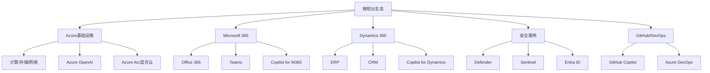

# Microsoft Azure：企业云与AI融合的领导者

## 概述

Microsoft Azure是全球第二大云计算平台，2023财年（截至2023年6月）云业务收入约1118亿美元（包含Azure、Office 365商业版、Dynamics 365），Azure本身收入约750亿美元，同比增长约28%。微软整体市值超过3万亿美元，是全球市值最高的公司之一，Azure是其估值的核心驱动力。

Azure的独特之处在于其与微软企业软件生态的深度融合——全球数十万家企业使用Windows Server、SQL Server、Office 365，这些客户自然成为Azure的潜在用户。更重要的是，微软与OpenAI的战略合作使Azure成为生成式AI时代最重要的云平台之一，Copilot系列产品正在重新定义企业软件的价值。

## 微软的云转型历程

### 从"错过移动互联网"到云计算领导者

微软在移动互联网时代错失了智能手机操作系统的机会（Windows Phone失败），但在云计算时代实现了华丽转身。这一转变的关键是2014年萨提亚·纳德拉（Satya Nadella）出任CEO，他将微软的战略重心从"Windows优先"转向"云优先、移动优先"。

纳德拉的核心洞见是：微软的真正优势不是Windows，而是与企业客户的深度关系和信任。企业IT决策者熟悉微软产品，信任微软品牌，愿意将核心业务迁移到Azure。这一判断被证明是正确的——Azure在企业级市场的渗透率远高于AWS。

### 云业务的三大支柱

微软将云业务定义为"商业云"（Commercial Cloud），包含三大支柱：

**Azure（IaaS/PaaS）**：基础设施和平台服务，与AWS直接竞争。

**Microsoft 365商业版**：Office 365 + Teams + 安全服务，是全球最大的SaaS产品，月活用户超过3亿。

**Dynamics 365**：企业ERP和CRM云服务，与Salesforce、SAP竞争。

这三大支柱相互协同，形成了微软独特的"全栈云"战略——从基础设施到应用软件，微软提供完整的企业云解决方案。

## Azure的技术架构与核心服务

### 计算与基础设施

**虚拟机（Azure VMs）**：提供数百种虚拟机规格，从通用型到GPU加速型（ND H100系列用于AI训练）。

**Azure Kubernetes Service（AKS）**：托管Kubernetes服务，与GitHub Actions深度集成，支持DevOps工作流。

**Azure Functions**：Serverless计算，与AWS Lambda竞争，在.NET生态中优势明显。

**Azure VMware Solution**：允许企业将VMware工作负载直接迁移到Azure，无需重构，是企业迁移的重要路径。

### 数据与AI服务

**Azure SQL Database**：托管SQL Server，与AWS RDS/Aurora竞争，对SQL Server用户迁移成本极低。

**Azure Cosmos DB**：全球分布式NoSQL数据库，支持多种API（SQL、MongoDB、Cassandra等）。

**Azure Synapse Analytics**：数据仓库和大数据分析平台，集成Power BI，与Snowflake、Databricks竞争。

**Azure OpenAI Service**：独家提供GPT-4、DALL-E、Whisper等OpenAI模型的企业级API，是Azure增长最快的服务。

**Azure Machine Learning**：端到端ML平台，与SageMaker竞争，在微软生态中集成度更高。

### 混合云与边缘计算

**Azure Arc**：将Azure管理能力延伸到任何基础设施（本地、其他云、边缘），是微软混合云战略的核心。

**Azure Stack**：在本地数据中心运行Azure服务，满足数据主权和低延迟需求。

**Azure Edge Zones**：在运营商网络边缘部署Azure服务，支持5G和低延迟应用。

### 安全与合规

微软是全球最大的企业安全软件供应商，安全业务年收入超过200亿美元：

**Microsoft Defender**：端点安全、云安全、身份安全的统一平台。

**Microsoft Sentinel**：云原生SIEM（安全信息和事件管理），与Splunk竞争。

**Azure Active Directory（Entra ID）**：身份和访问管理，全球超过5亿用户，是企业零信任安全的基础。

安全业务与Azure深度集成，形成了"安全即平台"的差异化优势，是Azure在企业市场的重要护城河。

## OpenAI合作：AI时代的战略先机

### 合作的战略价值

微软与OpenAI的合作是近年来科技行业最重要的战略布局之一：

**投资规模**：微软累计向OpenAI投资约130亿美元，持有约49%的股权（非控股），是OpenAI最大的外部投资者。

**独家云合作**：OpenAI的所有训练和推理工作负载都在Azure上运行，这为Azure带来了巨额的GPU算力收入。

**模型独家授权**：微软获得了将OpenAI模型集成到自身产品的独家权利，Azure OpenAI Service是唯一提供GPT-4企业级API的云平台。

**Copilot战略**：微软将AI助手"Copilot"嵌入到几乎所有产品中——Microsoft 365 Copilot、GitHub Copilot、Bing Copilot、Azure Copilot，形成了全面的AI产品矩阵。

### GitHub Copilot：AI编程助手的领导者

GitHub Copilot是微软AI战略最成功的商业化案例之一：

- 2022年正式商业化，每月29美元/用户（企业版）
- 2024年付费用户超过180万，年化收入超过6亿美元
- 研究显示，使用Copilot的开发者编程效率提升55%
- 企业版（GitHub Copilot Enterprise）提供代码库感知功能，定价39美元/用户/月

GitHub Copilot证明了AI在企业软件中的商业化可行性，也为微软其他Copilot产品的定价提供了参考。

### Microsoft 365 Copilot：企业AI的杀手级应用

Microsoft 365 Copilot于2023年11月正式推出，定价30美元/用户/月（在M365基础上叠加）：

**核心功能**：
- Word Copilot：根据提示生成文档草稿，总结长文档
- Excel Copilot：自然语言数据分析，自动生成图表
- PowerPoint Copilot：根据文档自动生成演示文稿
- Teams Copilot：会议实时记录、总结、行动项提取
- Outlook Copilot：邮件摘要、智能回复

**商业潜力**：微软M365商业版有约3亿月活用户，如果10%的用户升级到Copilot版本，年化收入增量约108亿美元。这是微软历史上最大的单次提价机会。

### AI对Azure收入的直接贡献

微软CEO纳德拉在2024年财报电话会议上披露：
- Azure AI服务年化收入超过100亿美元
- Azure增速中约6-7个百分点来自AI服务
- OpenAI的工作负载是Azure GPU算力的最大单一消费者

这些数据表明，AI已经成为Azure增长的核心驱动力，而非仅仅是概念。

## 财务分析

### 微软整体财务表现

| 财年 | 总收入（亿美元） | 商业云收入（亿美元） | 运营利润（亿美元） | 运营利润率 |
|-----|--------------|-----------------|-----------------|----------|
| FY2020 | 1430 | 518 | 530 | 37% |
| FY2021 | 1681 | 692 | 698 | 42% |
| FY2022 | 1983 | 915 | 833 | 42% |
| FY2023 | 2119 | 1118 | 884 | 42% |
| FY2024E | 2450 | 1350 | 1050 | 43% |

微软的运营利润率约42%，是全球最高盈利能力的大型科技公司之一，体现了软件业务的高毛利特性。

### 云业务分部分析

**Intelligent Cloud（智能云）**：包含Azure、SQL Server、Windows Server、GitHub等，是微软增速最快的业务单元。

| 财年 | 智能云收入（亿美元） | 同比增长 | Azure增速 |
|-----|-----------------|---------|---------|
| FY2021 | 600 | +26% | +50% |
| FY2022 | 750 | +25% | +46% |
| FY2023 | 874 | +17% | +29% |
| FY2024E | 1050 | +20% | +30%+ |

**Productivity and Business Processes（生产力与商业流程）**：包含Microsoft 365、LinkedIn、Dynamics 365，是微软最大的业务单元，也是Copilot货币化的主战场。

### 估值分析

微软当前（2024年）交易于约35倍P/E，相对于其增长质量和AI潜力，估值合理甚至偏低：

**DCF估值**：假设未来5年收入年均增长15%，之后降至8%，折现率10%，内在价值约400-450美元/股。

**相对估值**：与苹果（约30x P/E）、Alphabet（约25x P/E）相比，微软的AI溢价合理，因为其AI货币化路径最为清晰。

**分部估值**：
- Azure（按25x EV/EBITDA）：约8000亿美元
- Microsoft 365（按30x P/E）：约1.2万亿美元
- LinkedIn + Dynamics + 其他：约3000亿美元
- 合计：约2.3-2.5万亿美元

### 资本配置

微软的资本配置策略极为股东友好：

**股息**：连续20年增加股息，2024年股息约3美元/股，股息率约0.7%。

**回购**：每年回购约200-250亿美元股票，过去5年累计回购超过1000亿美元。

**并购**：重大并购包括LinkedIn（262亿美元，2016年）、GitHub（75亿美元，2018年）、Nuance（197亿美元，2022年）、动视暴雪（690亿美元，2023年）。

**研发投入**：年研发支出约280亿美元，占收入约13%，主要投向AI和云计算。

## 竞争优势与护城河

### 企业关系的深度护城河

微软与全球企业的关系是其最深的护城河：

**软件许可关系**：全球数十万家企业持有微软企业协议（EA），涵盖Windows、Office、SQL Server等。这些企业在续签协议时，自然会将Azure纳入考量。

**IT决策者的信任**：企业CIO和IT管理员对微软产品最为熟悉，迁移到Azure的学习成本和风险感知最低。

**合规与安全**：微软在企业合规（SOC 2、ISO 27001、FedRAMP等）方面认证最为全面，对于金融、医疗、政府等高合规要求行业，Azure是首选。

**混合云优势**：大多数企业无法一次性将所有工作负载迁移到云端，需要长期维持混合云状态。Azure Arc + Azure Stack使混合云管理最为顺畅，这是AWS和Google Cloud难以复制的优势。

### 生态系统的协同效应

微软的产品生态形成了强大的协同效应：

- Office 365用户 → Teams用户 → Azure用户 → Copilot用户
- GitHub开发者 → Azure DevOps → Azure云服务
- SQL Server用户 → Azure SQL Database → Azure Synapse
- Windows Server用户 → Azure Virtual Machines → Azure Arc

每个产品都是其他产品的入口，形成了难以打破的生态闭环。

### AI先机的可持续性

微软通过OpenAI合作获得的AI先机是否可持续？

**支持可持续的论点**：
- OpenAI的独家云合作协议长期有效
- GPT-4在企业级应用中的领先地位短期难以撼动
- Copilot产品矩阵已形成规模，用户习惯正在建立
- 微软的企业销售能力是AI商业化的关键优势

**挑战可持续性的论点**：
- Google Gemini、Anthropic Claude等竞争模型快速追赶
- 开源模型（Meta Llama）降低了对专有模型的依赖
- 企业可能采用多模型策略，不会独家依赖OpenAI/Azure

综合来看，微软的AI先机在2-3年内具有较强的可持续性，但长期来看竞争将加剧。

## 风险因素

### OpenAI关系风险

**OpenAI独立性**：OpenAI是独立公司，其战略决策不受微软控制。如果OpenAI与其他云服务商合作，或自建云基础设施，将削弱微软的AI优势。

**OpenAI估值泡沫**：微软对OpenAI的130亿美元投资面临减值风险，如果OpenAI商业化不及预期。

**监管风险**：美国FTC和欧盟对微软-OpenAI合作的反垄断审查可能限制合作深度。

### 竞争风险

**AWS的反击**：AWS通过Bedrock提供多模型选择，Anthropic Claude是其主要AI合作伙伴。AWS的规模优势和生态系统不容忽视。

**Google的AI实力**：Google在AI研究领域的积累（Gemini、TPU）可能在技术层面超越OpenAI，削弱Azure的AI差异化。

**Salesforce等SaaS竞争**：在企业应用层，Salesforce、ServiceNow等公司也在积极布局AI，与Microsoft 365 Copilot形成竞争。

### 估值风险

微软当前估值已反映了较多的AI预期，如果AI商业化进展不及预期（Copilot付费转化率低、企业采购周期长），估值面临压缩风险。

### 宏观风险

企业IT支出与宏观经济高度相关。经济衰退期间，企业可能推迟云迁移和AI升级，影响Azure和M365 Copilot的增长。

## 投资分析总结

### 核心投资逻辑

微软是AI时代最确定的受益者之一，投资逻辑清晰：

1. **Azure增速重新加速**：AI服务驱动Azure增速从2023年的29%重新加速至30%+
2. **Copilot货币化**：M365 Copilot的大规模推广将带来每用户30美元/月的增量收入
3. **利润率持续提升**：云业务规模效应 + AI服务高毛利，推动整体利润率从42%提升至45%+
4. **股东回报**：持续的股息增长和股票回购提供稳定回报

### 关键跟踪指标

- Azure季度增速（最重要）
- M365 Copilot付费用户数
- GitHub Copilot用户增长
- 商业云整体收入增速
- 运营利润率趋势

## Azure技术架构深度解析

### Azure全球基础设施

Azure在全球运营超过60个数据中心区域，是三大云服务商中区域数量最多的，覆盖全球140个国家和地区。

**区域分布优势**：
- 欧洲：15个区域，满足GDPR数据本地化要求，是Azure在欧洲市场的核心竞争优势
- 亚太：12个区域，覆盖中国（通过世纪互联运营）、日本、韩国、印度、澳大利亚等主要市场
- 北美：10个区域，包括专门的政府云（Azure Government）
- 中东/非洲：8个区域，是三大云服务商中在中东布局最完整的

**Azure Government的战略价值**：
- 专为美国政府设计，满足FedRAMP High、DoD IL2/IL4/IL5等合规要求
- 美国国防部（DoD）的JEDI合同（100亿美元，后被取消）和JWCC合同（90亿美元）均包含Azure
- 美国情报界（IC）的商业云合同（C2E，约100亿美元）Azure是主要受益者之一
- 政府云市场是Azure相对AWS的重要差异化领域

### Azure核心服务深度分析

**Azure Virtual Machines（虚拟机）**：
- 提供超过800种虚拟机规格，从通用型（D系列）到GPU加速型（ND H100系列）
- ND H100 v5系列：搭载8块NVIDIA H100 GPU，专为AI训练设计，是Azure AI基础设施的核心
- Azure Spot VMs：利用闲置容量，价格比按需实例低约60-90%，适合批处理和容错工作负载
- Azure Reserved VM Instances：预付1-3年，节省约40-72%的成本

**Azure Kubernetes Service（AKS）**：
- 托管Kubernetes服务，与GitHub Actions深度集成，支持DevOps工作流
- 支持Windows和Linux容器，是企业混合工作负载的理想选择
- Azure Arc for Kubernetes：将AKS管理能力延伸到任何Kubernetes集群（本地、其他云）
- 市场地位：在企业Kubernetes市场，AKS与AWS EKS和Google GKE形成三足鼎立

**Azure SQL Database**：
- 托管SQL Server，与AWS RDS/Aurora竞争，对SQL Server用户迁移成本极低
- Hyperscale层：支持最高100TB数据库，自动扩展，读取副本可在几分钟内添加
- Azure SQL Managed Instance：完整的SQL Server兼容性，适合需要SQL Server特定功能的迁移
- 市场优势：全球约70%的企业使用SQL Server，Azure SQL Database是这些企业迁移到云的自然选择

**Azure Cosmos DB**：
- 全球分布式NoSQL数据库，支持多种API（SQL、MongoDB、Cassandra、Gremlin、Table）
- 99.999%的SLA，是Azure SLA最高的服务之一
- 多主写入：支持在多个区域同时写入，实现真正的全球分布式应用
- 竞争对手：AWS DynamoDB、Google Firestore

**Azure Synapse Analytics**：
- 数据仓库和大数据分析平台，集成Power BI，与Snowflake、Databricks竞争
- Synapse Link：实时将Azure Cosmos DB数据同步到Synapse，无需ETL
- 与Microsoft Fabric深度集成，是微软数据平台战略的核心

### Azure OpenAI Service深度分析

Azure OpenAI Service是Azure增长最快的服务，也是微软AI战略最重要的商业化载体：

**服务内容**：
- GPT-4 Turbo：最强大的语言模型，128K上下文窗口
- GPT-4o：多模态模型，支持文本、图像、音频
- GPT-3.5 Turbo：性价比最优的语言模型
- DALL-E 3：图像生成模型
- Whisper：语音转文字模型
- Embeddings：文本向量化，用于语义搜索和RAG

**企业级特性**：
- 数据隐私：企业数据不会用于训练OpenAI模型
- 私有部署：支持在Azure私有网络中部署，数据不离开企业网络
- 合规认证：满足SOC 2、ISO 27001、HIPAA等企业合规要求
- SLA：99.9%的可用性保证

**定价模式**：
- 按token计费：GPT-4 Turbo约10美元/百万输入tokens，30美元/百万输出tokens
- 预置吞吐量（PTU）：预购固定吞吐量，适合高并发场景，成本更低
- 企业协议：大型企业可签订年度协议，获得折扣

**市场规模**：
- 截至2024年，超过65%的Fortune 500企业使用Azure OpenAI Service
- Azure AI服务年化收入超过100亿美元（微软CEO纳德拉披露）
- 增速超过100%（同比），是Azure增速最快的服务

## Microsoft 365 Copilot货币化深度分析

### Copilot的产品矩阵与定价

微软构建了覆盖全场景的Copilot产品线，形成了AI时代最完整的企业AI产品矩阵：

| 产品 | 目标用户 | 定价 | 核心功能 | 状态 |
|-----|---------|------|---------|-----|
| M365 Copilot | 企业办公用户 | +$30/用户/月 | Word/Excel/Teams/Outlook AI | 快速增长 |
| GitHub Copilot Individual | 个人开发者 | $10/月 | 代码补全 | 成熟 |
| GitHub Copilot Business | 企业开发者 | $19/用户/月 | 代码补全+安全 | 快速增长 |
| GitHub Copilot Enterprise | 大型企业 | $39/用户/月 | 代码库感知+定制 | 早期阶段 |
| Copilot for Security | 安全团队 | 按SCU计费 | 安全事件分析 | 早期阶段 |
| Azure OpenAI Service | 企业开发者 | 按token计费 | GPT-4 API | 高速增长 |
| Bing Copilot Pro | 消费者 | $20/月 | 搜索+生成 | 成熟 |
| Copilot+ PC | AI PC用户 | 硬件内置 | 本地AI功能 | 新兴 |

### M365 Copilot的货币化潜力量化

M365 Copilot是微软历史上最重要的单次提价机会，其货币化潜力极为可观：

**市场规模计算**：
- M365商业版月活用户：约3亿
- 企业版用户（E3/E5）：约1.5亿（Copilot的主要目标用户）
- 当前Copilot渗透率：约5-10%（截至2024年初）
- 目标渗透率（2027年）：约25-30%

**收入潜力**：
- 若25%的企业版用户（约3750万）升级Copilot：3750万 × $30/月 × 12 = 约135亿美元/年
- 若30%升级：约162亿美元/年
- 这相当于微软当前总收入的约6-7%，是重大的增量收入来源

**采用障碍与解决方案**：
- 价格敏感性：$30/用户/月对中小企业较高，微软推出了更低价格的Copilot for Microsoft 365（$30）和Copilot Pro（$20）
- 数据准备：Copilot需要企业数据治理到位，许多企业需要先完成数据清理
- 变革管理：员工需要培训才能有效使用Copilot，微软提供了大量培训资源
- 价值证明：微软发布了多项研究，显示Copilot用户生产效率提升约29%，会议时间减少约40%

### GitHub Copilot的市场地位

GitHub Copilot是微软AI战略最成功的商业化案例之一，也是AI代码助手市场的领导者：

**市场数据**：
- 付费用户：超过180万（截至2024年初）
- 年化收入：超过6亿美元
- 增速：同比超过100%
- 企业客户：超过5万家企业

**竞争格局**：

| 产品 | 公司 | 定价 | 优势 | 劣势 |
|-----|-----|-----|-----|-----|
| GitHub Copilot | 微软 | $10-39/月 | 生态最完整，GitHub集成 | 价格较高 |
| Amazon Q Developer | 亚马逊 | 免费（基础版） | AWS集成，免费 | 功能相对有限 |
| Tabnine | Tabnine | $12/月 | 隐私保护，本地部署 | 功能不如Copilot |
| Cursor | Cursor | $20/月 | 代码库理解能力强 | 独立IDE，不集成VS Code |
| Codeium | Codeium | 免费（个人版） | 免费，多IDE支持 | 企业功能有限 |

GitHub Copilot的核心优势在于与GitHub（全球最大代码托管平台，1亿+开发者）的深度集成，以及与VS Code（全球最流行的代码编辑器）的无缝体验。

## Azure的混合云战略深度分析

### Azure Arc：混合云的核心引擎

Azure Arc是微软混合云战略的核心产品，允许企业将Azure管理能力延伸到任何基础设施：

**Azure Arc的核心功能**：
- Arc-enabled Servers：将本地服务器、其他云的VM纳入Azure管理
- Arc-enabled Kubernetes：管理任何Kubernetes集群（本地、AWS EKS、Google GKE）
- Arc-enabled Data Services：在任何基础设施上运行Azure SQL Managed Instance和PostgreSQL
- Arc-enabled Machine Learning：在边缘和本地运行Azure ML工作负载

**与AWS Outposts和Google Anthos的对比**：

| 维度 | Azure Arc | AWS Outposts | Google Anthos |
|-----|---------|------------|-------------|
| 部署模式 | 软件代理，无需专用硬件 | 专用硬件（AWS机架） | 软件代理 |
| 支持的基础设施 | 任何（本地、多云、边缘） | 仅本地 | 任何 |
| 成本 | 较低（无硬件成本） | 较高（硬件+服务费） | 中等 |
| 功能完整性 | 高 | 高（AWS服务完整） | 中等 |
| 企业采用率 | 高（微软企业关系） | 中等 | 较低 |

Azure Arc的最大优势是无需专用硬件，企业可以在现有基础设施上安装Arc代理，立即获得Azure管理能力。这使Arc的部署门槛远低于AWS Outposts。

### Azure Stack HCI：超融合基础设施

Azure Stack HCI是微软的超融合基础设施产品，将Azure服务延伸到本地数据中心：

**核心特点**：
- 基于Windows Server和Azure Stack HCI操作系统
- 支持在本地运行Azure Kubernetes Service（AKS）
- 与Azure Arc深度集成，统一管理本地和云端资源
- 支持Azure Virtual Desktop（AVD）本地部署

**竞争对手**：Nutanix、VMware vSAN（现Broadcom）、Dell VxRail

**市场机遇**：随着VMware收购后的激进定价，大量企业正在评估替代方案，Azure Stack HCI是重要的受益者之一。

## 财务模型与估值框架

### 微软详细财务预测

| 财年 | 总收入（亿美元） | 商业云（亿美元） | Azure增速 | Non-GAAP EPS（美元） |
|-----|--------------|--------------|---------|-------------------|
| FY2022 | 1983 | 915 | +46% | 9.65 |
| FY2023 | 2119 | 1118 | +29% | 10.99 |
| FY2024E | 2450 | 1350 | +30% | 13.00 |
| FY2025E | 2800 | 1600 | +25% | 15.50 |
| FY2026E | 3200 | 1900 | +22% | 18.50 |

### 情景分析

**牛市情景（概率30%）**：
- 假设：M365 Copilot渗透率超预期（>20%），Azure增速重新加速至35%+，AI资本开支效率提升
- FY2026收入：约3500亿美元
- FY2026 EPS：约21美元
- 合理P/E：38倍
- 目标股价：约798美元

**基准情景（概率50%）**：
- 假设：M365 Copilot渗透率约15%，Azure维持25%增速，利润率稳步提升
- FY2026收入：约3200亿美元
- FY2026 EPS：约18.5美元
- 合理P/E：33倍
- 目标股价：约611美元

**熊市情景（概率20%）**：
- 假设：AI货币化进展缓慢，Azure增速放缓至15%，AI资本开支压制利润率
- FY2026收入：约2700亿美元
- FY2026 EPS：约14美元
- 合理P/E：26倍
- 目标股价：约364美元

### 微软的护城河量化评估

| 护城河维度 | 强度（1-10） | 持续时间 | 主要威胁 |
|---------|-----------|---------|---------|
| 企业软件生态（M365/Windows） | 10 | 长期 | Google Workspace竞争 |
| Azure云基础设施 | 8 | 长期 | AWS规模优势 |
| OpenAI AI合作 | 9 | 3-5年 | 竞争模型追赶 |
| GitHub开发者生态 | 9 | 长期 | GitLab等竞争 |
| LinkedIn职业社交 | 8 | 长期 | 新兴职业平台 |
| 企业安全（Defender/Sentinel） | 8 | 长期 | CrowdStrike等专业安全公司 |

## 参考文献

1. Microsoft. *FY2024 Annual Report and 10-K Filing*. 2024.
2. Microsoft. *Q4 FY2024 Earnings Call Transcript*. 2024.
3. Synergy Research Group. *Cloud Market Share Q4 2023*. 2024.
4. Gartner. *Magic Quadrant for Cloud Infrastructure and Platform Services*. 2023.
5. Morgan Stanley. *Microsoft: The AI Monetization Leader*. 2024.
6. Goldman Sachs. *Microsoft Copilot: Quantifying the AI Revenue Opportunity*. 2024.
7. Satya Nadella. *Hit Refresh: The Quest to Rediscover Microsoft's Soul and Imagine a Better Future for Everyone*. HarperBusiness, 2017.
8. IDC. *Microsoft Azure Market Analysis*. 2024.
9. Forrester Research. *The Total Economic Impact of Microsoft Azure*. 2023.
10. Bloomberg Intelligence. *Microsoft Cloud Business Deep Dive*. 2024.
11. Microsoft. *GitHub Copilot Impact Study*. 2024.
12. Gartner. *Magic Quadrant for Enterprise Low-Code Application Platforms*. 2024.
13. IDC. *Microsoft 365 Copilot Adoption Study*. 2024.
14. Bernstein Research. *Microsoft: The AI Platform Company*. 2024.
15. Citi Research. *Azure Arc and Hybrid Cloud Strategy Analysis*. 2024.

---

**风险提示**：本文所有分析仅供参考，不构成投资建议。

---

[← Amazon AWS](amazon-aws.html) | [Google Cloud →](google-cloud.html)
