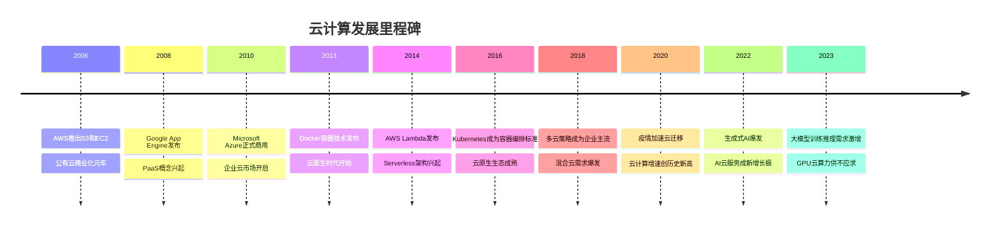
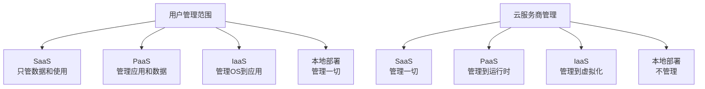
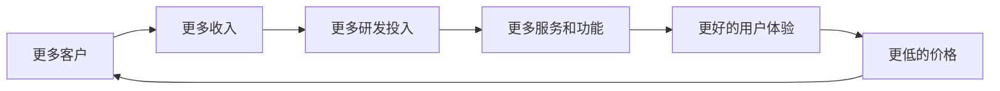
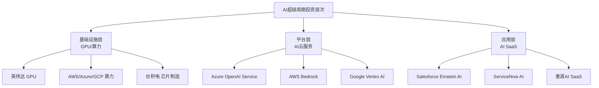

# 全球云计算产业深度研究

## 概述

云计算是过去二十年最重要的技术革命之一，将IT基础设施从资本密集型的自建模式转变为按需付费的服务模式。2023年全球云计算市场规模约6000亿美元，预计2030年将突破2万亿美元。AWS、Microsoft Azure、Google Cloud三大超大规模云服务商（Hyperscaler）合计占据全球公有云市场约65%份额，构成了现代数字经济的核心基础设施。

云计算不仅是一个行业，更是一种范式转变——它重新定义了企业如何消费IT资源，如何开发和部署软件，以及如何利用数据创造价值。对于投资者而言，云计算既是直接的投资标的，也是理解整个科技行业演变的关键视角。

## 云计算的本质与演进

### 从数据中心到云：范式转变

传统IT模式下，企业需要自建数据中心，购买服务器、存储、网络设备，雇佣IT团队维护，面临高昂的前期资本支出（CapEx）和持续的运营成本（OpEx）。更重要的是，自建基础设施难以应对业务的弹性需求——峰值时资源不足，平时资源闲置。

云计算通过三个核心特性解决了这些问题：

**弹性伸缩（Elasticity）**：资源可以根据需求动态扩展或收缩，电商平台在双十一可以瞬间扩容10倍，活动结束后立即释放资源，只为实际使用的资源付费。

**按需付费（Pay-as-you-go）**：将IT支出从资本支出转变为运营支出，降低了企业的财务风险和进入门槛，初创公司可以用极低成本获得与大企业相同的基础设施能力。

**全球化部署（Global Reach）**：云服务商在全球数十个区域（Region）部署数据中心，企业可以一键将应用部署到全球任意位置，实现低延迟的本地化服务。

### 云计算的发展历程

### 云计算的服务层次

云计算按服务层次分为三大类，形成完整的技术栈：

**IaaS（基础设施即服务）**：提供虚拟化的计算、存储、网络资源。用户管理操作系统及以上层次，云服务商管理物理硬件。代表产品：AWS EC2、Azure Virtual Machines、Google Compute Engine。

**PaaS（平台即服务）**：在IaaS之上提供开发和运行应用的平台，包括数据库、中间件、开发工具等。用户只需关注应用代码，无需管理底层基础设施。代表产品：AWS RDS、Azure App Service、Google App Engine。

**SaaS（软件即服务）**：直接提供完整的软件应用，用户通过浏览器或API使用，无需安装和维护。代表产品：Salesforce CRM、Microsoft 365、Google Workspace。

## 全球云计算市场格局

### 市场规模与增长

2023年全球公有云服务市场规模约5970亿美元，较2022年增长约21%。尽管宏观经济压力导致企业IT支出趋于谨慎，云计算仍保持了远高于整体IT市场的增速。

| 年份 | 市场规模（亿美元） | 同比增长 |
|------|------------------|---------|
| 2019 | 2428 | +22% |
| 2020 | 3124 | +29% |
| 2021 | 4082 | +31% |
| 2022 | 4942 | +21% |
| 2023 | 5970 | +21% |
| 2024E | 7230 | +21% |
| 2025E | 8800 | +22% |
| 2030E | 20000+ | ~15% |

云计算的长期增长驱动力来自：企业IT支出从本地部署向云端迁移（目前仅约30%的工作负载在云上，迁移空间巨大）、AI/ML工作负载的爆发式增长、以及新兴市场的数字化加速。

### 三大超大规模云服务商

全球公有云市场高度集中，三大Hyperscaler主导格局：

| 云服务商 | 2023年云收入（亿美元） | 市场份额 | 增速 |
|---------|---------------------|---------|-----|
| AWS（亚马逊） | 908 | ~32% | +13% |
| Azure（微软） | 约750 | ~23% | +28% |
| Google Cloud | 337 | ~11% | +28% |
| 阿里云 | 约120 | ~4% | +3% |
| Salesforce | 约340 | ~6% | +11% |
| 其他 | 约1500 | ~24% | 不一 |

**AWS**：2006年率先商业化，先发优势显著，服务最全面，生态最成熟。在IaaS/PaaS领域市场份额最高，是亚马逊最重要的利润来源（贡献约70%的运营利润）。

**Azure**：依托微软强大的企业客户基础和Office 365/Teams生态，在混合云和企业级市场优势突出。与OpenAI的深度合作使其在AI云服务领域占据先机。

**Google Cloud**：在数据分析（BigQuery）、AI/ML（Vertex AI）、Kubernetes（GKE）等领域技术领先，但企业销售能力相对较弱，市场份额提升较慢。

### 中国云计算市场

中国是全球第二大云计算市场，2023年规模约4400亿元人民币（约600亿美元），但增速已从高峰期的50%+降至约15%。

| 中国云服务商 | 市场份额 | 特点 |
|------------|---------|-----|
| 阿里云 | ~36% | 电商起家，IaaS最强 |
| 华为云 | ~18% | 政企市场，混合云 |
| 腾讯云 | ~16% | 游戏/社交生态 |
| 百度智能云 | ~9% | AI/自动驾驶 |
| 移动云/联通云 | ~8% | 运营商背景 |

中国云市场的特殊性在于：政策合规要求（数据本地化）、国产化替代趋势、以及与美国云服务商的竞争隔离。外资云服务商在中国市场受到严格限制，AWS、Azure等通过与本地合作伙伴合作提供服务。

## 云计算商业模式深度解析

### 超大规模云的经济学

超大规模云服务商的商业模式建立在规模经济和网络效应的双重基础上：

**规模经济**：数据中心建设、服务器采购、网络带宽都存在显著的规模效应。AWS每年采购数百万台服务器，采购成本远低于普通企业。数据中心的PUE（电能利用效率）随规模提升而改善，大型云服务商的PUE可达1.1-1.2，而普通企业数据中心通常在1.5-2.0。

**网络效应**：云平台上的服务越多，吸引的开发者越多；开发者越多，构建的应用越多；应用越多，吸引的企业客户越多。AWS Marketplace上有数万个第三方软件，形成了强大的生态护城河。

**客户粘性（Switching Cost）**：企业一旦将核心业务迁移到某个云平台，迁移成本极高——不仅是技术迁移成本，还包括团队技能重建、合同重签、应用重构等。研究显示，企业平均在同一云平台使用7年以上。

**飞轮效应**：

### SaaS的商业模式优越性

SaaS是云计算中商业模式最优越的细分领域，核心指标包括：

**ARR（年度经常性收入）**：订阅制收入的可预测性远高于一次性软件销售，投资者给予更高估值溢价。

**NRR（净收入留存率）**：衡量现有客户的收入增长情况。NRR > 120%意味着即使不获取新客户，收入也能增长20%以上。顶级SaaS公司（如Snowflake、Datadog）的NRR长期维持在130%+。

**CAC/LTV比率**：客户获取成本与客户生命周期价值之比。优秀SaaS公司的LTV/CAC通常在5倍以上，意味着每投入1美元获客，可获得5美元以上的回报。

**Rule of 40**：增长率 + 利润率 ≥ 40%，是评估SaaS公司健康度的经验法则。高增长阶段可以牺牲利润，但增长+利润之和应超过40%。

| SaaS公司 | NRR | Rule of 40 | 特点 |
|---------|-----|-----------|-----|
| Snowflake | ~130% | ~40% | 数据云平台 |
| Datadog | ~120% | ~45% | 可观测性 |
| Salesforce | ~110% | ~35% | CRM龙头 |
| ServiceNow | ~125% | ~50% | IT服务管理 |
| Workday | ~115% | ~30% | HR/财务 |

### 云计算的定价策略

云服务的定价极为复杂，主要模式包括：

**按需定价（On-Demand）**：按实际使用量付费，灵活但单价最高。适合不可预测的工作负载。

**预留实例（Reserved Instances）**：预付1-3年使用承诺，可获得40-70%的折扣。适合稳定的基础工作负载。

**竞价实例（Spot Instances）**：利用云服务商的闲置容量，价格可低至按需价格的10%，但可能随时被中断。适合批处理、大数据分析等可中断工作负载。

**承诺使用折扣（Committed Use Discounts）**：Google Cloud和Azure的类似机制，承诺一定使用量换取折扣。

这种复杂的定价体系使云成本优化（FinOps）成为一个专门的职业领域，也催生了Apptio、CloudHealth等云成本管理工具市场。

## 技术趋势与演进方向

### 云原生（Cloud Native）

云原生是指专为云环境设计和构建的应用架构，核心技术包括：

**容器化（Containerization）**：Docker将应用及其依赖打包成容器，实现"一次构建，到处运行"。容器比虚拟机更轻量，启动更快，资源利用率更高。

**Kubernetes（K8s）**：Google开源的容器编排系统，已成为云原生应用管理的事实标准。三大云服务商均提供托管Kubernetes服务（EKS/AKS/GKE）。

**微服务架构（Microservices）**：将单体应用拆分为独立部署的小服务，每个服务专注单一功能，可独立扩展和更新。Netflix、Uber等公司的技术架构是微服务的典型案例。

**Serverless（无服务器）**：开发者只需编写函数代码，无需管理服务器。AWS Lambda、Azure Functions、Google Cloud Functions按函数调用次数计费，极大简化了运维工作。

**服务网格（Service Mesh）**：管理微服务间通信的基础设施层，Istio是最流行的开源实现。

### AI云服务：新的增长极

生成式AI的爆发正在重塑云计算市场格局：

**GPU云算力**：训练大型语言模型需要数千块GPU，只有超大规模云服务商才有能力提供。AWS（P4d/P5实例）、Azure（ND H100系列）、Google Cloud（A3实例）争相扩充GPU算力。

**AI平台服务**：
- AWS SageMaker：端到端ML平台，从数据准备到模型部署
- Azure Machine Learning + OpenAI Service：与GPT-4深度集成
- Google Vertex AI：集成Gemini模型，BigQuery ML数据分析
- 各平台均提供预训练模型API，降低AI应用开发门槛

**推理服务**：随着AI应用普及，推理（Inference）需求将超过训练需求。云服务商正在优化推理基础设施，降低每次推理的成本。

**AI对云收入的影响**：微软CEO纳德拉表示，Azure AI服务已成为增长最快的业务线，2024年AI相关收入年化超过100亿美元。Google Cloud的AI/ML服务也是其增速超越AWS的重要原因。

### 混合云与多云策略

**混合云（Hybrid Cloud）**：将本地数据中心与公有云结合，敏感数据留在本地，弹性工作负载放在云上。Azure Arc、AWS Outposts、Google Anthos是主要的混合云解决方案。

**多云（Multi-Cloud）**：企业同时使用多个云服务商，避免供应商锁定，利用各家优势。调查显示，87%的企业采用多云策略，平均使用2.6个云服务商。

**边缘计算（Edge Computing）**：将计算能力推向数据产生的边缘位置，减少延迟，满足实时处理需求。AWS Wavelength、Azure Edge Zones、Google Distributed Cloud是主要产品。

### 主权云与数据本地化

随着各国数据保护法规（GDPR、中国数据安全法等）日趋严格，主权云（Sovereign Cloud）成为重要趋势：

- 数据必须存储在特定国家/地区
- 政府和关键基础设施的数据不能出境
- 云服务商需要在当地建立独立的云区域，由当地实体运营

这一趋势为云服务商带来了新的合规成本，但也创造了差异化竞争机会。AWS GovCloud、Azure Government、Google Cloud Sovereign等专门面向政府和高合规要求客户。

## 投资分析框架

### 超大规模云的估值方法

超大规模云服务商（AWS、Azure、Google Cloud）通常作为母公司（亚马逊、微软、Alphabet）的一部分进行估值，需要进行分部估值（Sum-of-the-Parts）：

**AWS的估值**：
- 2023年营收908亿美元，运营利润约247亿美元
- 按25-30倍EV/EBITDA估值，对应市值约6000-8000亿美元
- 占亚马逊总市值约40-50%

**Azure的估值**：
- Azure收入约占微软总收入的30%，但增速最快
- 微软整体按30-35倍P/E估值，AI溢价显著
- Azure是微软估值提升的核心驱动力

**Google Cloud的估值**：
- 2023年首次实现全年盈利，运营利润约18亿美元
- 相对于AWS和Azure仍处于投资阶段，盈利能力提升空间大
- 是Alphabet估值中被低估的部分

### SaaS公司估值框架

SaaS公司的估值通常采用EV/NTM Revenue（企业价值/未来12个月收入）倍数：

| 增长阶段 | 典型增速 | 合理估值倍数 |
|---------|---------|------------|
| 高速增长 | >40% | 15-25x |
| 成长期 | 20-40% | 8-15x |
| 成熟期 | 10-20% | 5-8x |
| 稳定期 | <10% | 3-5x |

**估值影响因素**：
- NRR（净收入留存率）：每提升10%，估值倍数提升约2-3x
- 毛利率：SaaS毛利率通常70-80%，高于此水平享受溢价
- 市场规模（TAM）：可寻址市场越大，增长天花板越高
- 竞争护城河：是否有网络效应、数据优势、转换成本

### 关键财务指标对比

| 公司 | 2023收入（亿美元） | 增速 | 毛利率 | 运营利润率 |
|-----|-----------------|-----|-------|----------|
| AWS | 908 | +13% | ~65% | ~27% |
| Microsoft Cloud | 1118 | +22% | ~73% | ~45% |
| Google Cloud | 337 | +28% | ~27% | +5% |
| Salesforce | 346 | +11% | ~77% | ~17% |
| ServiceNow | 87 | +25% | ~79% | ~25% |
| Snowflake | 28 | +36% | ~68% | -5% |

### 投资时机与周期

云计算股票的投资时机与宏观利率环境高度相关：

**利率上升期（2022-2023）**：高增长科技股估值压缩，SaaS公司EV/Revenue从20x+压缩至5-8x。企业IT支出趋于谨慎，云优化（减少云支出）成为主题。

**利率下降期（预期2024-2025）**：估值倍数扩张，高增长SaaS重新受到追捧。AI驱动的新一轮云支出增长周期开启。

**AI超级周期**：生成式AI正在开启新一轮云基础设施投资周期，类似2010-2015年的移动互联网浪潮。GPU算力、AI平台服务、AI应用层SaaS是三个层次的投资机会。

## 竞争格局与护城河分析

### 三大Hyperscaler的差异化竞争

三大超大规模云服务商在技术能力、客户结构、增长策略上各有侧重：

**AWS的护城河**：
- 先发优势：比Azure早4年、比Google Cloud早6年商业化
- 服务广度：超过200项云服务，覆盖几乎所有IT需求
- 开发者生态：数百万开发者基于AWS构建应用，形成强大的网络效应
- 盈利能力：运营利润率约27%，是三者中最高的

**Azure的护城河**：
- 企业关系：微软与全球数十万企业有深度的软件许可关系，云迁移自然延伸
- 混合云优势：Azure Arc + Azure Stack使混合云部署最为顺畅
- AI先机：与OpenAI的独家合作，GPT-4集成到Azure服务中
- Office 365协同：Microsoft 365用户自然迁移到Azure

**Google Cloud的护城河**：
- 技术深度：Kubernetes、TensorFlow、BigQuery等开源技术的发明者
- AI研究：DeepMind、Google Brain合并，AI研究实力全球顶尖
- 数据分析：BigQuery在数据仓库领域技术领先
- 网络基础设施：全球最大的私有光纤网络之一

### 新兴竞争者

**Oracle Cloud（OCI）**：凭借数据库优势和激进定价，在企业级市场快速增长。与微软的互操作协议使Oracle数据库客户可以无缝迁移到Azure或OCI。

**阿里云**：在东南亚、中东等新兴市场具有竞争力，但受地缘政治影响，在欧美市场扩张受限。

**IBM Cloud**：专注混合云和企业级市场，Red Hat OpenShift是其核心竞争力。

**Cloudflare**：在CDN、网络安全、边缘计算领域快速扩张，被视为"第四朵云"的潜力选手。

### 行业整合趋势

云计算行业正在经历垂直整合：
- 云服务商向上延伸：自研AI芯片（AWS Trainium/Inferentia、Google TPU）
- 云服务商向下延伸：收购SaaS公司（微软收购Nuance、GitHub；Salesforce收购Slack）
- SaaS公司云化：传统软件公司（SAP、Oracle）向SaaS转型

## 风险因素

### 宏观经济风险

**IT支出周期**：企业IT支出与宏观经济高度相关。2022-2023年，企业在经济不确定性下削减云支出，进行"云优化"，导致AWS、Azure增速明显放缓。

**利率敏感性**：高增长SaaS公司的估值对利率极为敏感，利率上升导致未来现金流折现值下降，估值倍数压缩。

### 竞争风险

**价格战**：三大云服务商持续降价，AWS自2006年以来已降价超过100次。价格竞争压缩利润率，但也扩大了市场规模。

**开源替代**：Kubernetes、Kafka、PostgreSQL等开源技术降低了云服务商的差异化优势，企业可以在不同云平台间迁移。

**垂直整合威胁**：大型企业客户（苹果、Netflix、Meta）自建基础设施，减少对公有云的依赖。

### 监管风险

**反垄断**：美国、欧盟对大型科技公司的反垄断审查日益严格，可能限制云服务商的并购扩张。

**数据隐私**：GDPR、CCPA等数据保护法规增加合规成本，限制数据跨境流动。

**国家安全**：美国政府对中国云服务商的限制，以及中国对外资云服务商的限制，形成市场分割。

### 技术风险

**量子计算**：量子计算可能颠覆现有加密体系，云服务商需要提前布局后量子密码学。

**AI颠覆**：生成式AI可能改变软件开发模式，减少对传统SaaS的需求（GitHub Copilot已在改变开发者工作方式）。

**能源约束**：AI训练和推理对电力需求巨大，数据中心的能源供应和碳排放成为制约因素。

## 投资机会总结

### 短期机会（1-2年）

1. **AI算力受益者**：AWS、Azure、Google Cloud的GPU算力业务，受益于大模型训练和推理需求爆发
2. **AI平台SaaS**：将AI能力集成到现有产品的SaaS公司（Salesforce Einstein、ServiceNow AI）
3. **数据基础设施**：Snowflake、Databricks等数据平台，AI时代数据价值凸显

### 中期机会（3-5年）

1. **云迁移加速**：全球仍有约70%的工作负载在本地部署，迁移空间巨大
2. **垂直SaaS**：医疗、法律、金融等垂直行业的专业SaaS，AI赋能后价值提升
3. **新兴市场云化**：东南亚、印度、中东等新兴市场的云计算渗透率提升

### 长期主题（5年以上）

1. **AI原生应用**：完全基于AI构建的新一代SaaS，可能颠覆现有软件格局
2. **边缘云融合**：5G + 边缘计算 + 云的融合，催生新的应用场景
3. **量子云服务**：量子计算商业化后，云服务商将是主要的量子算力提供者

## 常见问题

### Q1：云计算市场是否已经饱和？

远未饱和。目前全球企业IT支出中，云计算占比约30%，本地部署仍占70%。即使不考虑AI带来的新增需求，仅云迁移就有数万亿美元的市场空间。

### Q2：AWS的市场份额是否会持续下滑？

AWS的绝对收入仍在增长，但相对份额因Azure和Google Cloud的更快增速而有所下降。这是成熟市场的正常竞争格局，不代表AWS竞争力下降。AWS的盈利能力仍是三者中最强的。

### Q3：SaaS公司的高估值是否合理？

SaaS的高估值来自于可预测的经常性收入、高毛利率和强客户粘性。在利率正常化后，估值倍数已从峰值大幅压缩，当前估值相对合理。关键是选择有真实竞争护城河和持续增长能力的公司。

### Q4：AI会颠覆现有云计算格局吗？

AI更可能是现有云服务商的增量机会，而非颠覆者。三大Hyperscaler都在积极布局AI，并且拥有AI所需的算力、数据和客户关系。AI可能颠覆的是传统软件公司，而非云基础设施。

### Q5：如何评估云计算公司的竞争护城河？

关键指标：NRR（客户扩张意愿）、客户集中度（是否过度依赖少数大客户）、产品集成深度（是否嵌入客户核心业务流程）、生态系统规模（合作伙伴和开发者数量）。

## 参考文献

1. Gartner. *Forecast: Public Cloud Services, Worldwide, 2021-2027*. 2024.
2. Synergy Research Group. *Cloud Market Share Q4 2023*. 2024.
3. Amazon. *2023 Annual Report*. 2024.
4. Microsoft. *FY2024 Annual Report*. 2024.
5. Alphabet. *2023 Annual Report*. 2024.
6. IDC. *Worldwide Public Cloud Services Forecast, 2023-2027*. 2023.
7. Morgan Stanley. *Cloud Computing: The Next Decade*. 2023.
8. Goldman Sachs. *AI Investment and the Cloud Infrastructure Buildout*. 2024.
9. Bessemer Venture Partners. *State of the Cloud 2024*. 2024.
10. CNCF. *Cloud Native Survey 2023*. 2023.
11. Flexera. *State of the Cloud Report 2024*. 2024.
12. McKinsey & Company. *Cloud's trillion-dollar prize is up for grabs*. 2021.

---

**风险提示**：本文所有分析仅供参考，不构成投资建议。云计算行业受宏观经济、技术变革、监管政策等多重因素影响，投资者需充分了解相关风险。

---

[← 返回云计算行业](index.html) | [Amazon AWS →](amazon-aws.html)
