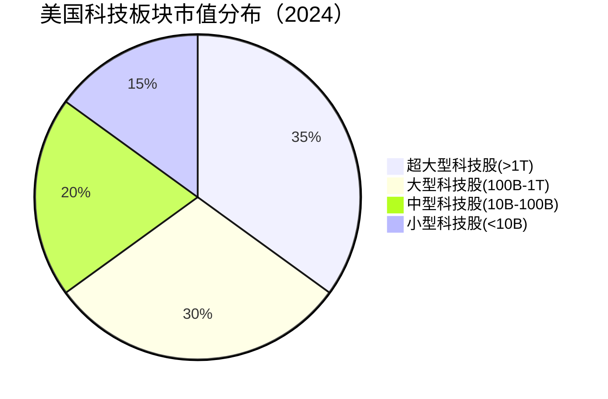
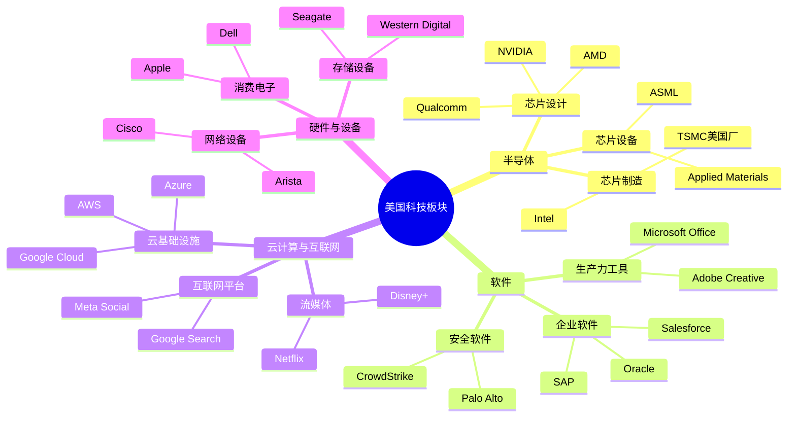
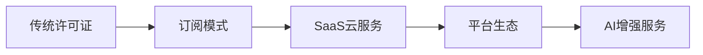
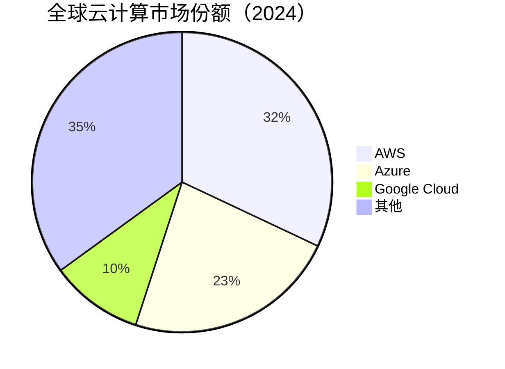
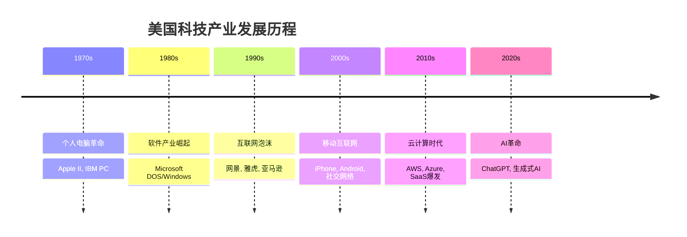
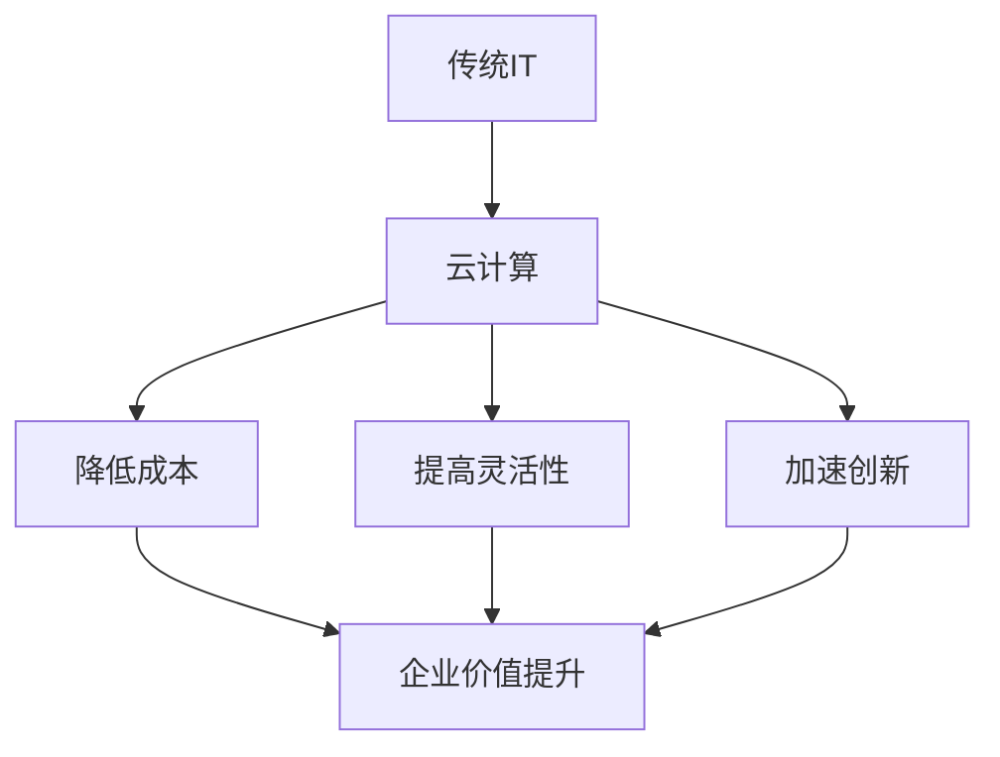

# 美国科技板块总览

## 概述

美国科技板块是全球最具创新力和价值的产业集群，代表着人类技术进步的最前沿。从硅谷的车库创业到市值数万亿美元的科技巨头，美国科技产业不仅塑造了现代商业格局，更深刻改变了人类的生活方式。

**学习目标**：
- 理解美国科技板块的整体规模和市场地位
- 掌握科技板块的细分领域和产业结构
- 分析科技板块的发展历史和演进趋势
- 识别科技投资的关键机会和风险因素
- 建立系统化的科技股投资框架

**为什么重要**：
科技板块占标普500指数市值的约30%，是美国股市最重要的驱动力。理解科技板块对于把握市场趋势、识别长期投资机会至关重要。

## 板块规模与市场地位

### 市值规模

截至2024年，美国科技板块展现出惊人的规模：

**整体数据**：
- 总市值：约15万亿美元
- 占标普500比重：28-32%
- 占纳斯达克比重：超过50%
- 全球科技市值占比：约60%

**市值分布**：

**七大科技巨头（Magnificent 7）**：
1. **Apple** - 市值约3.0万亿美元
2. **Microsoft** - 市值约3.0万亿美元
3. **Alphabet (Google)** - 市值约1.8万亿美元
4. **Amazon** - 市值约1.7万亿美元
5. **NVIDIA** - 市值约1.5万亿美元
6. **Meta (Facebook)** - 市值约1.0万亿美元
7. **Tesla** - 市值约0.8万亿美元

这七家公司合计市值超过12万亿美元，占整个科技板块的80%以上。

### 收入与盈利

**年度收入**：
- 板块总收入：约3.5万亿美元
- 年增长率：10-15%（历史平均）
- 利润率：平均20-25%（远高于其他行业）

**盈利能力对比**：
| 指标 | 科技板块 | 标普500平均 |
|------|---------|------------|
| 净利润率 | 22% | 11% |
| ROE | 28% | 15% |
| ROIC | 25% | 12% |
| 自由现金流率 | 18% | 8% |

### 研发投入

美国科技公司是全球研发投入的领导者：

**年度研发支出**：
- 板块总研发：约4500亿美元
- 占收入比：平均12-15%
- 全球研发占比：约40%

**研发投入前五**：
1. Amazon - 730亿美元
2. Alphabet - 450亿美元
3. Microsoft - 280亿美元
4. Meta - 380亿美元
5. Apple - 300亿美元

## 板块结构与细分领域

### 四大核心领域

### 1. 半导体行业

**市场规模**：约6000亿美元年收入

**细分领域**：
- **芯片设计**：GPU、CPU、AI芯片、移动芯片
- **芯片制造**：晶圆代工、IDM模式
- **芯片设备**：光刻机、蚀刻机、测试设备
- **芯片材料**：硅片、光刻胶、特殊气体

**关键公司**：
- NVIDIA（GPU与AI芯片领导者）
- Intel（传统CPU巨头）
- AMD（CPU与GPU挑战者）
- Qualcomm（移动芯片领导者）
- Broadcom（多元化芯片公司）

**投资特点**：
- 高度周期性（受库存周期影响）
- 技术壁垒极高
- 资本密集型
- AI浪潮带来新增长

### 2. 软件行业

**市场规模**：约8000亿美元年收入

**细分领域**：
- **企业软件（SaaS）**：CRM、ERP、协作工具
- **生产力软件**：办公套件、创意工具
- **安全软件**：网络安全、端点保护
- **数据分析**：商业智能、数据仓库

**商业模式演进**：

**关键公司**：
- Microsoft（全方位软件巨头）
- Salesforce（CRM领导者）
- Adobe（创意软件垄断者）
- ServiceNow（企业工作流）
- Workday（人力资源与财务）

**投资特点**：
- 高毛利率（70-90%）
- 订阅收入稳定
- 强大的客户粘性
- 网络效应明显

### 3. 云计算与互联网

**市场规模**：约2万亿美元年收入

**细分领域**：
- **云基础设施（IaaS）**：计算、存储、网络
- **云平台（PaaS）**：开发工具、数据库、AI服务
- **云软件（SaaS）**：各类应用服务
- **互联网服务**：搜索、社交、电商、流媒体

**云计算市场份额**：

**关键公司**：
- Amazon（AWS云计算领导者）
- Microsoft（Azure快速增长）
- Google（云计算与搜索）
- Meta（社交网络巨头）
- Netflix（流媒体先驱）

**投资特点**：
- 规模效应显著
- 转换成本高
- 持续高增长
- 竞争格局稳定

### 4. 硬件与设备

**市场规模**：约1.2万亿美元年收入

**细分领域**：
- **消费电子**：智能手机、平板、可穿戴设备
- **个人电脑**：笔记本、台式机
- **网络设备**：路由器、交换机、防火墙
- **存储设备**：硬盘、固态硬盘、企业存储

**关键公司**：
- Apple（消费电子王者）
- Dell（PC与企业IT）
- HP（打印与PC）
- Cisco（网络设备领导者）
- Arista（数据中心网络）

**投资特点**：
- 产品周期性强
- 竞争激烈
- 利润率差异大
- 品牌溢价重要

## 发展历史与演进

### 历史演进阶段

### 第一阶段：个人电脑革命（1970s-1980s）

**关键事件**：
- 1976：Apple I 发布
- 1981：IBM PC 推出
- 1984：Macintosh 革命性图形界面
- 1985：Windows 1.0 发布

**代表公司**：
- Apple（硬件创新）
- Microsoft（软件标准）
- Intel（芯片动力）
- IBM（企业计算）

**投资启示**：
平台标准的建立者获得长期价值（Windows、x86架构）

### 第二阶段：互联网泡沫（1990s-2000）

**关键事件**：
- 1995：网景IPO，互联网商业化
- 1998：Google成立
- 1999：纳斯达克突破5000点
- 2000：互联网泡沫破裂

**泡沫特征**：
- 市盈率失去意义（"眼球经济"）
- 烧钱换增长
- 大量公司倒闭
- 纳斯达克暴跌78%

**幸存者**：
- Amazon（电商）
- Google（搜索）
- eBay（拍卖）
- PayPal（支付）

**投资启示**：
真正有商业模式的公司最终胜出，泡沫破裂是长期投资机会

### 第三阶段：移动互联网（2007-2015）

**关键事件**：
- 2007：iPhone发布
- 2008：Android推出
- 2010：iPad开创平板市场
- 2012：Facebook IPO

**新巨头崛起**：
- Apple（硬件生态）
- Google（移动操作系统）
- Facebook（社交网络）
- Netflix（流媒体）

**投资启示**：
移动互联网创造全新商业模式，生态系统价值巨大

### 第四阶段：云计算时代（2015-2020）

**关键事件**：
- AWS成为亚马逊最赚钱业务
- Azure快速增长
- SaaS公司大规模IPO
- 企业数字化转型加速

**商业模式转变**：

**投资启示**：
订阅模式创造稳定现金流，云计算是不可逆转的趋势

### 第五阶段：AI革命（2020-至今）

**关键事件**：
- 2022：ChatGPT发布
- 2023：生成式AI爆发
- 2024：AI应用全面落地
- NVIDIA市值突破万亿

**AI产业链**：
1. **基础层**：芯片（NVIDIA、AMD）
2. **平台层**：云服务（AWS、Azure、Google Cloud）
3. **模型层**：大语言模型（OpenAI、Anthropic）
4. **应用层**：各行业AI应用

**投资启示**：
AI是新一轮技术革命，早期投资基础设施（芯片、云计算）风险较低

## 投资分析框架

### 科技股估值方法

**1. 成长股估值**：
- **PEG比率**：PE / 增长率
- **PS比率**：市值 / 销售额（适用于高增长亏损公司）
- **EV/Sales**：企业价值 / 销售额

**2. 成熟科技股估值**：
- **PE比率**：市盈率
- **DCF模型**：现金流折现
- **股息折现模型**：适用于分红公司

**3. 平台公司估值**：
- **用户价值**：市值 / 活跃用户数
- **网络效应**：用户增长与价值增长的关系
- **生态系统价值**：平台上的交易额或开发者数量

### 关键投资指标

**财务指标**：
| 指标 | 优秀标准 | 说明 |
|------|---------|------|
| 收入增长率 | >20% | 持续高增长能力 |
| 毛利率 | >60% | 软件>80%，硬件>40% |
| 营业利润率 | >20% | 运营效率 |
| 自由现金流率 | >15% | 现金创造能力 |
| ROE | >25% | 股东回报 |
| 研发占比 | 10-20% | 创新投入 |

**运营指标**：
- **用户增长**：DAU、MAU增长率
- **用户留存**：月留存率、年留存率
- **客户获取成本（CAC）**：营销费用 / 新客户数
- **客户生命周期价值（LTV）**：LTV/CAC > 3为健康
- **净收入留存率（NRR）**：>110%为优秀（SaaS公司）

### 竞争优势分析

**科技公司的护城河**：

1. **网络效应**：
   - 用户越多，价值越大
   - 例子：Facebook、LinkedIn、Uber

2. **平台生态**：
   - 开发者和用户双边市场
   - 例子：iOS、Android、AWS

3. **转换成本**：
   - 迁移困难或成本高
   - 例子：企业软件、云服务

4. **技术领先**：
   - 专利保护、技术壁垒
   - 例子：NVIDIA GPU、ASML光刻机

5. **品牌溢价**：
   - 强大品牌认知
   - 例子：Apple、Adobe

6. **规模效应**：
   - 规模越大，成本越低
   - 例子：云计算、芯片制造

### 风险因素

**行业风险**：
- **技术迭代风险**：技术快速变化导致产品过时
- **竞争加剧**：新进入者或替代技术
- **监管风险**：反垄断、数据隐私、国家安全
- **周期性风险**：半导体等行业的周期波动

**公司风险**：
- **创始人依赖**：关键人物离开的影响
- **单一产品依赖**：收入过度集中
- **客户集中度**：大客户流失风险
- **执行风险**：战略失误、产品失败

**宏观风险**：
- **利率敏感**：科技股对利率变化敏感
- **经济衰退**：企业IT支出削减
- **地缘政治**：中美科技脱钩、供应链风险
- **汇率波动**：海外收入占比高

## 投资策略

### 核心-卫星策略

**核心持仓（60-70%）**：
- 七大科技巨头（Magnificent 7）
- 成熟、盈利、现金流稳定
- 长期持有，低换手

**卫星持仓（30-40%）**：
- 高成长细分领域龙头
- 新兴技术主题（AI、云计算、网络安全）
- 适度轮动，把握趋势

### 主题投资机会

**1. AI革命**：
- 芯片：NVIDIA、AMD
- 云服务：AWS、Azure、Google Cloud
- AI应用：各垂直领域的AI公司

**2. 云计算**：
- 基础设施：云服务商
- SaaS：企业软件公司
- 网络安全：云安全公司

**3. 数字化转型**：
- 企业软件：Salesforce、ServiceNow
- 协作工具：Microsoft Teams、Zoom
- 数据分析：Snowflake、Databricks

**4. 半导体周期**：
- 周期底部：布局芯片设备、材料
- 周期顶部：关注库存和需求变化
- 长期趋势：AI、汽车电子、IoT

### 估值纪律

**买入时机**：
- 市场恐慌时（如2022年科技股暴跌）
- 公司短期利空但长期逻辑未变
- 估值回到历史合理区间

**卖出时机**：
- 估值过高（PE超过历史90分位）
- 基本面恶化（增长放缓、竞争加剧）
- 更好的投资机会出现

**估值参考**：
| 公司类型 | 合理PE | 贵PE | 便宜PE |
|---------|--------|------|--------|
| 成熟科技巨头 | 25-30 | >40 | <20 |
| 高成长SaaS | 40-60 | >100 | <30 |
| 半导体 | 20-25 | >35 | <15 |
| 互联网平台 | 25-35 | >50 | <20 |

## 当前市场环境（2024）

### 宏观背景

**利率环境**：
- 美联储利率：5.25-5.50%（2024年初）
- 预期降息：2024年可能降息2-3次
- 影响：利率下降利好科技股估值

**经济环境**：
- GDP增长：2-3%
- 通胀：3-4%，逐步回落
- 企业IT支出：保持增长但增速放缓

### 板块表现

**2023年表现**：
- 纳斯达克指数：+43%
- 七大科技股：平均+75%
- 其他科技股：+15%

**分化明显**：
- AI相关：大幅上涨（NVIDIA +239%）
- 传统科技：表现平平
- 小型科技股：仍在底部

### 投资机会

**看好领域**：
1. **AI基础设施**：芯片、云计算
2. **企业软件**：估值合理，增长稳定
3. **网络安全**：需求持续增长
4. **云计算**：长期趋势不变

**谨慎领域**：
1. **消费电子**：需求疲软
2. **广告科技**：经济敏感
3. **高估值成长股**：利率风险

## 实战应用

### 构建科技股组合

**示例组合（100万美元）**：

**核心持仓（70万）**：
- Microsoft：15万（15%）
- Apple：12万（12%）
- NVIDIA：10万（10%）
- Amazon：10万（10%）
- Google：10万（10%）
- Meta：8万（8%）
- Salesforce：5万（5%）

**卫星持仓（30万）**：
- Adobe：5万（5%）
- ServiceNow：5万（5%）
- CrowdStrike：4万（4%）
- Snowflake：4万（4%）
- AMD：4万（4%）
- Arista：4万（4%）
- 其他：4万（4%）

**组合特征**：
- 预期收益：12-15%年化
- 波动率：20-25%
- 夏普比率：0.6-0.8
- 最大回撤：-30%至-40%

### 研究清单

**公司研究步骤**：
1. **业务理解**：产品、商业模式、客户
2. **竞争分析**：市场地位、护城河、竞争对手
3. **财务分析**：增长、盈利、现金流
4. **估值分析**：PE、PS、DCF
5. **风险评估**：行业风险、公司风险
6. **投资决策**：买入、持有、卖出

**持续跟踪**：
- 季度财报：收入、利润、指引
- 产品发布：新产品、新功能
- 行业动态：竞争、监管、技术趋势
- 管理层变动：CEO、CFO、关键高管

## 常见误区

### 误区1：只看增长不看盈利

**错误认知**：
"只要增长快，亏损不重要"

**正确理解**：
- 增长必须有质量（单位经济模型健康）
- 最终要实现盈利
- 关注盈利路径的清晰度

**案例**：
WeWork高增长但商业模式有缺陷，最终破产

### 误区2：忽视估值

**错误认知**：
"好公司可以不看估值"

**正确理解**：
- 估值决定未来回报
- 再好的公司买贵了也会亏钱
- 等待合理价格

**案例**：
2000年互联网泡沫，Cisco PE超过200倍，之后20年未创新高

### 误区3：追逐热点

**错误认知**：
"什么涨买什么"

**正确理解**：
- 热点往往已经涨过头
- 理解基本面比追涨重要
- 逆向思维寻找机会

**案例**：
2021年元宇宙概念火爆，相关股票暴涨后暴跌

### 误区4：过度分散

**错误认知**：
"买100只科技股分散风险"

**正确理解**：
- 科技股相关性高，分散效果有限
- 集中持有真正理解的公司
- 15-25只股票足够

### 误区5：忽视宏观

**错误认知**：
"只看公司不看宏观"

**正确理解**：
- 利率对科技股估值影响大
- 经济周期影响企业IT支出
- 地缘政治影响供应链

## 延伸阅读

### 必读书籍

1. **《创新者的窘境》** - Clayton Christensen
   - 理解技术颠覆的规律

2. **《从0到1》** - Peter Thiel
   - 科技创业与投资思维

3. **《浪潮之巅》** - 吴军
   - 科技产业发展史

4. **《The Innovators》** - Walter Isaacson
   - 数字革命的历史

5. **《Platform Revolution》** - Geoffrey Parker
   - 平台商业模式

### 研究资源

**数据来源**：
- SEC EDGAR：公司财报
- Bloomberg Terminal：实时数据
- FactSet：财务分析
- Gartner：行业研究

**新闻媒体**：
- TechCrunch：科技新闻
- The Information：深度报道
- Stratechery：行业分析
- Benedict Evans：趋势洞察

**分析师报告**：
- Morgan Stanley
- Goldman Sachs
- Bernstein Research
- ARK Invest

### 相关文章

- 半导体行业深度分析
- [软件行业投资指南](./software/overview.html)
- [云计算产业研究](./cloud/overview.html)
- NVIDIA深度研究
- [Microsoft投资分析](../../../03-company-analysis/case-studies/tech-giants/microsoft.html)

## 参考文献

1. Damodaran, A. (2024). "Valuation of Technology Companies". NYU Stern.
2. Morgan Stanley Research. (2024). "US Technology Sector Outlook".
3. ARK Invest. (2024). "Big Ideas 2024: Technology Trends".
4. Gartner. (2024). "IT Spending Forecast".
5. McKinsey & Company. (2024). "The State of AI in 2024".
6. Goldman Sachs. (2024). "Technology Sector Deep Dive".
7. Bernstein Research. (2024). "Semiconductor Industry Analysis".
8. Benedict Evans. (2024). "Tech Trends and Opportunities".
9. Stratechery. (2024). "Platform Economics and Strategy".
10. CB Insights. (2024). "State of Venture Capital in Tech".

---

**下一步行动**：
1. 深入研究具体细分领域（半导体、软件、云计算）
2. 分析重点公司案例（NVIDIA、Microsoft、Amazon）
3. 建立科技股投资组合
4. 持续跟踪行业动态和公司财报
