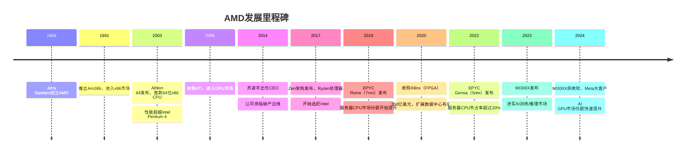
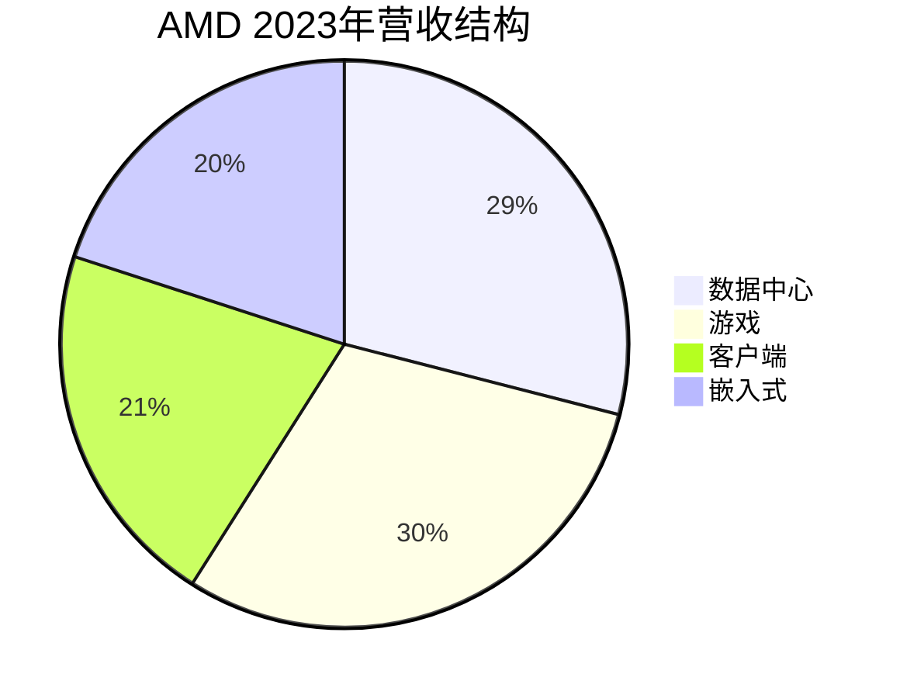

# AMD深度分析：从困境反转到AI挑战者

## 公司概况

### 基本信息

Advanced Micro Devices（纳斯达克：AMD）成立于1969年，总部位于美国加利福尼亚州圣克拉拉。公司由Jerry Sanders创立，现任CEO苏姿丰（Lisa Su）自2014年接任以来，带领AMD完成了半导体行业最令人瞩目的困境反转之一。

AMD是全球仅有的两家能够设计x86架构CPU的公司之一（另一家是Intel），同时也是NVIDIA在GPU市场最重要的竞争对手。AMD采用Fabless模式，芯片由台积电代工。

| 基本指标 | 数值（2023年） |
|---------|-------------|
| 营收 | 227亿美元 |
| 净利润 | 8.5亿美元 |
| 毛利率 | 46.1% |
| 净利率 | 3.7% |
| 研发支出 | 54亿美元 |
| 员工数量 | 约26,000人 |
| 市值 | ~2500亿美元 |

### 发展历程

## 商业模式分析

### 业务结构

AMD的业务分为两大板块：

**数据中心（Data Center）**：2023年营收约66亿美元，占总营收29%。包括EPYC服务器CPU和Instinct GPU（MI系列）。这是AMD增长最快的业务，也是未来最重要的增长引擎。

**客户端（Client）**：2023年营收约47亿美元，占总营收21%。包括Ryzen桌面/笔记本CPU和Radeon消费级GPU。受PC市场周期影响较大。

**游戏（Gaming）**：2023年营收约68亿美元，占总营收30%。包括Radeon游戏GPU和为微软Xbox、索尼PlayStation提供的半定制SoC。

**嵌入式（Embedded）**：2023年营收约46亿美元，占总营收20%。主要来自收购Xilinx获得的FPGA和自适应SoC业务，面向工业、汽车、通信等市场。

### Fabless模式与台积电合作

AMD是Fabless模式的典型代表，所有芯片均由台积电代工。AMD的EPYC服务器CPU和Instinct GPU均采用台积电最先进制程（5nm/4nm），这是AMD能够在性能上与Intel竞争的关键因素之一。

AMD的Chiplet（小芯片）架构是其技术创新的核心——将CPU核心（CCD）和I/O芯片（IOD）分开制造，CCD采用最先进制程（5nm），IOD采用成熟制程（6nm），在保持高性能的同时降低了成本和良率风险。

### 收购Xilinx的战略意义

2022年完成的350亿美元收购Xilinx是AMD历史上最重要的战略决策之一。Xilinx是全球最大的FPGA（现场可编程门阵列）公司，其产品广泛应用于数据中心、5G通信、汽车、工业等领域。

收购Xilinx的战略价值：
- **产品组合多元化**：从纯CPU/GPU扩展到FPGA和自适应SoC
- **数据中心布局完善**：CPU（EPYC）+ GPU（Instinct）+ FPGA（Xilinx Alveo）+ 网络（Pensando）
- **汽车市场进入**：Xilinx在汽车ADAS领域有深厚积累
- **稳定的嵌入式收入**：FPGA业务毛利率高，客户粘性强

## 技术分析：Zen架构的崛起

### 从濒临破产到技术领先

2014年苏姿丰接任CEO时，AMD面临严峻困境：市场份额持续下滑，财务状况岌岌可危，Bulldozer架构的CPU在性能上远落后于Intel。苏姿丰做出了一个关键决策：放弃短期修补，从头开始设计全新的CPU架构——Zen。

**Zen架构的核心创新**：
- 全新的微架构设计，IPC（每时钟周期指令数）相比Bulldozer提升约52%
- 采用台积电14nm工艺（后续升级至7nm/5nm）
- Chiplet设计理念，提升良率和成本效率
- 统一的架构平台，同时覆盖桌面、笔记本、服务器市场

### Zen架构代际演进

| 架构 | 发布年份 | 制程 | 代表产品 | 关键改进 |
|-----|---------|-----|---------|---------|
| Zen | 2017 | 14nm | Ryzen 1000/EPYC Naples | IPC +52%（vs Bulldozer） |
| Zen+ | 2018 | 12nm | Ryzen 2000 | 频率提升，延迟优化 |
| Zen 2 | 2019 | 7nm | Ryzen 3000/EPYC Rome | IPC +15%，Chiplet架构 |
| Zen 3 | 2020 | 7nm | Ryzen 5000/EPYC Milan | IPC +19%，统一L3缓存 |
| Zen 4 | 2022 | 5nm | Ryzen 7000/EPYC Genoa | IPC +13%，DDR5/PCIe 5.0 |
| Zen 5 | 2024 | 4nm | Ryzen 9000/EPYC Turin | IPC +16%，AI性能大幅提升 |

### EPYC服务器CPU：蚕食Intel市场

EPYC是AMD在数据中心市场的核心产品，自2019年EPYC Rome（7nm）发布以来，持续蚕食Intel Xeon的市场份额：

- **2019年**：EPYC市场份额约5%
- **2021年**：EPYC市场份额约10%
- **2022年**：EPYC市场份额约20%
- **2023年**：EPYC市场份额约25-30%
- **2024年**：EPYC Genoa/Bergamo持续扩张，目标30%+

EPYC的竞争优势：
- **核心数量**：EPYC Genoa最高96核，Intel Sapphire Rapids最高60核
- **内存带宽**：EPYC支持12通道DDR5，Intel支持8通道
- **PCIe通道数**：EPYC提供128条PCIe 5.0通道，Intel提供80条
- **性价比**：相同性能下，EPYC通常比Xeon便宜20-30%

主要云厂商（AWS、微软Azure、谷歌Cloud）均已大规模采用EPYC，这是AMD服务器CPU市场份额快速提升的关键驱动力。

## MI300X：进军AI市场

### 产品定位与技术规格

MI300X是AMD于2023年底发布的AI加速器，是AMD挑战NVIDIA H100的核心武器。其关键技术规格：

- **制程**：台积电5nm（GPU核心）+ 6nm（内存控制器）
- **架构**：CDNA 3
- **HBM3内存**：192GB（远超H100的80GB）
- **内存带宽**：5.3 TB/s
- **FP8训练性能**：1,307 TFLOPS
- **功耗**：750W
- **售价**：约1.5-2万美元（低于H100的3-4万美元）

MI300X最大的差异化优势是192GB的超大HBM3内存容量，这使其在运行大型语言模型推理时具有显著优势——更大的内存意味着可以在单卡上运行更大的模型，减少模型分片和跨卡通信的开销。

### 客户采用情况

MI300X已获得多家重要客户采用：

- **微软Azure**：宣布将MI300X用于Azure AI服务，是AMD最重要的AI客户
- **Meta**：采用MI300X用于推理工作负载
- **Oracle Cloud**：提供MI300X实例
- **Hugging Face**：在MI300X上优化开源模型推理

AMD预计2024年AI GPU（主要是MI300X）营收将超过35亿美元，2025年有望突破70亿美元。虽然与NVIDIA的数据中心GPU营收（FY2024约475亿美元）相比仍有较大差距，但增速极快。

### ROCm生态：最大的短板

AMD在AI市场最大的挑战是ROCm（Radeon Open Compute）软件生态与CUDA的差距：

**ROCm的现状**：
- 支持PyTorch和TensorFlow，但优化程度不及CUDA
- 部分CUDA算子在ROCm上没有对应实现
- 调试工具和性能分析工具不如NVIDIA成熟
- 社区规模和文档质量落后于CUDA

**AMD的改进努力**：
- 大幅增加ROCm研发投入
- 与PyTorch社区深度合作，改善框架支持
- 推出ROCm 6.0，显著提升兼容性和性能
- 收购Nod.ai（AI编译器公司），加速软件生态建设

ROCm生态的成熟需要时间，这是AMD在AI市场短期内难以完全替代NVIDIA的根本原因。

## 财务分析

### 营收增长分析

| 年份 | 总营收（亿美元） | 数据中心（亿美元） | 同比增长 |
|-----|--------------|----------------|---------|
| 2019 | 67 | 13 | +4% |
| 2020 | 97 | 16 | +45% |
| 2021 | 164 | 35 | +68% |
| 2022 | 236 | 60 | +44% |
| 2023 | 227 | 66 | -4% |
| 2024E | ~260 | ~120 | ~15% |

2023年营收小幅下滑主要受游戏和嵌入式业务拖累（PC市场疲软、Xilinx嵌入式去库存），数据中心业务仍保持增长。2024年AI GPU（MI300X）的放量将推动数据中心业务大幅增长。

### 盈利能力分析

| 指标 | 2021 | 2022 | 2023 |
|-----|------|------|------|
| 毛利率 | 48.3% | 44.5% | 46.1% |
| 营业利润率 | 22.4% | 5.5% | 1.7% |
| 净利率 | 19.2% | 5.6% | 3.7% |
| 自由现金流（亿美元） | 31 | 13 | 11 |

AMD的盈利能力在2022-2023年受到Xilinx收购摊销（约35亿美元/年）和市场下行的双重压制。随着AI GPU业务放量和摊销影响减弱，盈利能力预计将在2024-2025年显著改善。

### 估值对比

| 估值指标 | AMD | NVIDIA | Intel |
|---------|-----|-------|-------|
| P/E（2024E） | ~35x | ~40x | ~25x |
| EV/Sales（2024E） | ~8x | ~20x | ~2x |
| EV/EBITDA（2024E） | ~25x | ~30x | ~12x |

AMD的估值介于NVIDIA和Intel之间，反映了其在AI市场的挑战者地位和CPU市场的持续增长。相比NVIDIA，AMD的估值更具吸引力，但需要AI GPU业务的持续兑现。

## 竞争格局分析

### CPU市场：持续蚕食Intel

在x86 CPU市场，AMD与Intel的竞争是半导体行业最经典的双寡头博弈：

**桌面CPU**：AMD Ryzen 7000系列（Zen 4）在性能和性价比上与Intel Core 13/14代旗鼓相当，市场份额约30-35%。

**笔记本CPU**：AMD Ryzen 7000系列在轻薄本市场表现出色，但Intel凭借更广泛的OEM合作关系维持约65%的市场份额。

**服务器CPU**：AMD EPYC是增长最快的细分市场，市场份额从2019年的约5%提升至2023年的约25-30%，且仍在持续增长。

**竞争优势来源**：
- 台积电先进制程（5nm/4nm）vs Intel自有制程（Intel 7/Intel 4）
- Chiplet架构的成本和良率优势
- 更高的核心数量和内存带宽
- 更具竞争力的定价策略

### GPU市场：游戏+AI双线作战

**游戏GPU**：AMD Radeon RX 7000系列（RDNA 3架构）在中端市场有竞争力，但高端市场仍被NVIDIA GeForce RTX 4000系列主导。AMD游戏GPU市场份额约20%。

**AI GPU**：MI300X是AMD在AI市场的核心产品，主要竞争对手是NVIDIA H100/H200。MI300X在推理场景（尤其是大内存需求的大模型推理）有竞争力，但在训练场景仍落后于NVIDIA。

### 苏姿丰的战略执行力

苏姿丰被广泛认为是半导体行业最优秀的CEO之一。她的核心战略贡献：

1. **聚焦高价值市场**：将资源集中在数据中心（EPYC+Instinct）和高端消费市场（Ryzen）
2. **技术路线清晰**：坚持Zen架构的持续迭代，每代IPC提升10-20%
3. **Chiplet架构创新**：率先在商业产品中大规模应用Chiplet设计
4. **战略收购**：Xilinx收购完善了数据中心产品组合
5. **客户关系建设**：与主要云厂商建立深度合作关系

## 投资价值评估

### 看多论点

1. **EPYC持续蚕食Intel市场**：服务器CPU市场份额从5%提升至30%+的趋势仍在持续，每提升1个百分点约带来约5亿美元营收增量
2. **MI300X的AI市场机遇**：AI GPU市场规模巨大，即使AMD只获得10-15%的市场份额，也意味着数百亿美元的营收
3. **Xilinx协同效应**：FPGA+CPU+GPU的组合在数据中心市场具有独特价值，协同效应逐步显现
4. **估值相对合理**：相比NVIDIA，AMD的EV/Sales约8倍更具吸引力，且增长潜力同样可观
5. **苏姿丰的执行力**：过去10年的成功转型证明了管理团队的战略执行能力

### 看空论点

1. **ROCm生态差距**：CUDA生态的护城河短期内难以逾越，限制了AMD在AI训练市场的渗透
2. **Intel反击**：Intel Meteor Lake/Arrow Lake在笔记本市场的竞争力有所提升，可能减缓AMD的市场份额增长
3. **游戏业务承压**：PC游戏市场增长放缓，Radeon GPU的竞争压力持续
4. **嵌入式业务去库存**：Xilinx嵌入式业务在2023年经历深度去库存，复苏时间存在不确定性
5. **执行风险**：MI300X的量产爬坡和ROCm生态建设均面临执行风险

### 投资建议

AMD是半导体行业最具吸引力的"第二选择"投资标的。在AI GPU市场，AMD是NVIDIA最有力的挑战者；在服务器CPU市场，AMD的市场份额提升趋势清晰可见。

**买入逻辑**：若AMD能够将AI GPU（MI300X/MI350）的市场份额提升至15-20%，同时EPYC服务器CPU市场份额继续提升至35%+，AMD的营收和盈利将有显著上行空间。

**风险控制**：关注ROCm生态进展、MI300X客户采用速度、以及Intel在服务器市场的反击力度。

## 常见问题

### Q1：AMD能否真正挑战NVIDIA的AI霸主地位？

短期内（1-2年），AMD难以撼动NVIDIA的主导地位，CUDA生态的护城河太深。但中长期（3-5年），随着ROCm生态改善和MI系列产品迭代，AMD有望在推理市场获得更大份额。更可能的情景是：AMD成为AI GPU市场的"第二选择"，在性价比敏感的推理场景获得15-25%的市场份额。

### Q2：AMD的Chiplet架构是否可持续？

Chiplet架构是AMD的核心技术创新，也是整个行业的发展趋势。台积电、Intel、三星均在推进先进封装技术，Chiplet将成为下一代芯片设计的主流范式。AMD在Chiplet架构上的先发优势将持续带来竞争优势。

### Q3：苏姿丰离职风险如何评估？

苏姿丰是AMD最重要的资产之一，其离职将对股价产生重大负面影响。目前没有迹象显示她有离职计划，且AMD的战略方向已经清晰，管理团队整体实力较强。这是一个需要持续关注的风险因素，但不是当前的主要担忧。

### Q4：AMD的嵌入式业务何时复苏？

Xilinx嵌入式业务在2023年经历了深度去库存（营收同比下滑约50%），主要原因是2021-2022年的过度备货。预计2024年下半年至2025年逐步复苏，工业自动化、5G通信、汽车ADAS等下游需求的回暖将推动嵌入式业务恢复增长。

### Q5：AMD的股票是否比NVIDIA更具性价比？

从估值角度，AMD的EV/Sales约8倍低于NVIDIA的约20倍，确实更具性价比。但需要注意：NVIDIA的毛利率（72%）远高于AMD（46%），NVIDIA的盈利能力更强。如果投资者相信AI GPU市场将持续高速增长，NVIDIA的高估值有其合理性；如果认为竞争将加剧、NVIDIA的市场份额将被侵蚀，AMD是更好的选择。

## Zen 5架构深度解析

### Zen 5的技术突破

2024年发布的Zen 5架构是AMD CPU技术演进的重要里程碑，代表了AMD在微架构设计上的重大突破。

**Zen 5核心改进**：
- **IPC提升**：相比Zen 4提升约16%，是Zen架构历代中最大的单代IPC提升之一
- **AI性能**：集成XDNA 2 NPU架构，AI推理性能提升约3倍，支持Windows AI PC认证
- **制程升级**：台积电4nm工艺（CCD核心），相比Zen 4的5nm进一步提升密度和能效
- **前端改进**：指令解码宽度从4路扩展至8路，大幅提升指令级并行度
- **内存子系统**：改进的预取器和缓存层次结构，降低内存访问延迟
- **AVX-512支持**：完整的AVX-512指令集支持，提升科学计算和AI推理性能

**Zen 5代表产品**：
- Ryzen 9000系列（桌面）：最高16核，主频最高5.7GHz
- EPYC Turin（服务器）：最高192核（双路），采用Zen 5 + Zen 5c混合架构
- Ryzen AI 300系列（笔记本）：集成XDNA 2 NPU，50 TOPS AI性能，主打AI PC市场

**EPYC Turin的竞争意义**：
EPYC Turin（第五代EPYC）是AMD服务器CPU的重大升级，最高192核的配置远超Intel Xeon（最高60核），在核心密集型工作负载（虚拟化、容器、大数据）中具有压倒性优势。预计EPYC Turin将推动AMD服务器CPU市场份额从约30%进一步提升至35-40%。

## MI300X vs H100全面对比

### 技术规格详细对比

| 规格 | AMD MI300X | NVIDIA H100 SXM | 优势方 |
|-----|-----------|----------------|------|
| 制程 | 台积电5nm+6nm | 台积电4nm | NVIDIA |
| 晶体管数量 | 1530亿 | 800亿 | AMD |
| HBM内存 | 192GB HBM3 | 80GB HBM3 | AMD（2.4倍） |
| 内存带宽 | 5.3 TB/s | 3.35 TB/s | AMD（1.6倍） |
| FP8训练性能 | 1,307 TFLOPS | 3,958 TFLOPS | NVIDIA（3倍） |
| FP16训练性能 | 654 TFLOPS | 1,979 TFLOPS | NVIDIA（3倍） |
| 功耗 | 750W | 700W | NVIDIA（略低） |
| 售价 | ~1.5-2万美元 | ~3-4万美元 | AMD（约2倍价格优势） |
| 互联带宽 | 896 GB/s（Infinity Fabric） | 900 GB/s（NVLink 4.0） | 基本持平 |

### 推理场景的深度分析

MI300X在推理场景的优势主要来自其192GB的超大内存容量：

**大模型推理的内存需求**：
- Llama 2 70B（FP16）：约140GB显存
- Llama 2 70B（INT8）：约70GB显存
- GPT-4（估计1.8万亿参数，INT4）：约900GB显存（需要多卡）

**MI300X的内存优势**：
- 单卡可运行Llama 2 70B（FP16），无需模型分片
- H100单卡只能运行Llama 2 70B（INT8），或需要2卡运行FP16版本
- 减少模型分片意味着减少跨卡通信开销，推理延迟更低

**实际推理性能对比**（以Llama 2 70B为例）：
- MI300X：约2,100 tokens/秒（FP16，单卡）
- H100：约1,800 tokens/秒（FP16，双卡，含通信开销）
- 结论：MI300X在大模型推理场景的性价比优于H100约2-3倍

**训练场景的差距**：
在训练场景，H100的优势来自：
- 更高的FP8/FP16算力（约3倍）
- 更成熟的CUDA生态（训练框架优化更深）
- NVLink 4.0的高效多卡通信
- 结论：训练场景H100仍有明显优势，MI300X主要竞争力在推理

### 总拥有成本（TCO）分析

对于大规模AI推理部署，MI300X的TCO优势显著：

**假设场景**：部署100个Llama 2 70B推理实例，每实例需要1块GPU

| 成本项 | MI300X方案 | H100方案 | 差异 |
|------|-----------|---------|-----|
| GPU采购成本 | 100块 × 1.5万 = 150万美元 | 200块 × 3.5万 = 700万美元 | MI300X节省550万美元 |
| 服务器成本 | 100台 × 3万 = 300万美元 | 200台 × 3万 = 600万美元 | MI300X节省300万美元 |
| 电力成本（3年） | 100 × 750W × 3年 = 约200万美元 | 200 × 700W × 3年 = 约370万美元 | MI300X节省170万美元 |
| **总TCO** | **约650万美元** | **约1670万美元** | **MI300X节省约1020万美元（61%）** |

注：以上为简化估算，实际TCO还需考虑软件许可、运维成本、机房改造等因素。

## ROCm生态建设进展

### ROCm 6.0的重大改进

AMD于2024年发布ROCm 6.0，这是ROCm历史上最重要的版本更新：

**框架支持改进**：
- PyTorch 2.1完整支持：99%的PyTorch操作可在ROCm上无缝运行
- Flash Attention 2完整支持：大幅提升Transformer模型训练效率
- vLLM支持：主流LLM推理框架，支持MI300X的大内存优势
- DeepSpeed支持：微软的分布式训练框架，支持大规模模型训练

**性能优化**：
- 矩阵乘法（GEMM）性能提升约20%（相比ROCm 5.x）
- 内存管理优化，减少显存碎片化
- 多GPU通信（RCCL）性能提升约15%

**开发者工具改进**：
- ROCm Profiler：性能分析工具，功能接近NVIDIA Nsight
- ROCm Debugger：调试工具，支持GPU内核调试
- HIPify：自动将CUDA代码转换为HIP（ROCm的编程模型）代码的工具

### ROCm与CUDA的差距量化

尽管ROCm在快速改善，与CUDA的差距仍然存在：

| 维度 | CUDA | ROCm 6.0 | 差距 |
|-----|------|---------|-----|
| PyTorch操作支持率 | 100% | ~99% | 约1% |
| 训练性能（相同硬件） | 基准 | 约85-90% | 约10-15% |
| 推理性能（相同硬件） | 基准 | 约90-95% | 约5-10% |
| 调试工具成熟度 | 极高 | 中等 | 显著差距 |
| 社区资源（教程/答案） | 极丰富 | 有限 | 显著差距 |
| 第三方库支持 | 极广泛 | 主流库支持 | 中等差距 |
| 企业支持 | 完善 | 改善中 | 中等差距 |

**AMD的改进路线图**：
- 2024年：ROCm 6.x系列，重点改善PyTorch和vLLM支持
- 2025年：ROCm 7.0，目标实现与CUDA 95%以上的功能对等
- 2026年：ROCm 8.0，目标实现与CUDA完全功能对等

## EPYC服务器CPU市场深度分析

### EPYC Genoa/Bergamo/Turin技术规格对比

| 产品 | 架构 | 制程 | 最大核心数 | 最大内存 | 发布时间 |
|-----|-----|-----|---------|---------|---------|
| EPYC Genoa（第四代） | Zen 4 | 5nm | 96核 | 6TB DDR5 | 2022年11月 |
| EPYC Bergamo（第四代） | Zen 4c | 5nm | 128核 | 6TB DDR5 | 2023年6月 |
| EPYC Turin（第五代） | Zen 5/5c | 4nm | 192核 | 12TB DDR5 | 2024年 |

**EPYC Bergamo的差异化**：Bergamo采用Zen 4c（紧凑型）核心，在相同功耗下实现128核，专为云计算虚拟化场景优化。每核心的性能略低于Zen 4，但核心密度更高，适合需要大量vCPU的云服务商。

**EPYC Turin的竞争优势**：
- 192核（双路384核）：远超Intel Xeon的最高60核（双路120核）
- 12TB DDR5内存支持：适合内存密集型工作负载（数据库、内存计算）
- PCIe 5.0 + CXL 2.0：支持最新的高速互联标准
- 能效提升：相比Genoa，每瓦特性能提升约30%

### 主要云厂商采用情况

| 云厂商 | EPYC采用情况 | 代表实例 |
|------|-----------|---------|
| AWS | 大规模采用 | M6a、C6a、R6a、M7a、C7a系列 |
| 微软Azure | 大规模采用 | Dasv5、Easv5、Lasv3系列 |
| 谷歌Cloud | 大规模采用 | N2D、C2D、T2D系列 |
| 阿里云 | 采用 | ecs.c7a、ecs.g7a系列 |
| 腾讯云 | 采用 | SA3系列 |

三大超大规模云厂商均已大规模采用EPYC，这是AMD服务器CPU市场份额快速提升的关键驱动力。云厂商采用EPYC的主要原因：更高的核心数量（降低每核心成本）、更大的内存带宽（提升内存密集型工作负载性能）、更具竞争力的定价（降低采购成本）。

### 与Intel Xeon的详细对比

| 对比维度 | AMD EPYC Genoa | Intel Sapphire Rapids | 优势方 |
|---------|--------------|---------------------|------|
| 最大核心数 | 96核 | 60核 | AMD（1.6倍） |
| 内存通道数 | 12通道DDR5 | 8通道DDR5 | AMD（1.5倍带宽） |
| PCIe通道数 | 128条PCIe 5.0 | 80条PCIe 5.0 | AMD（1.6倍） |
| L3缓存 | 最高384MB | 最高112.5MB | AMD（3.4倍） |
| 制程 | 台积电5nm | Intel 7（约等于10nm） | AMD（显著领先） |
| 单核性能 | 优秀 | 优秀 | 基本持平 |
| 功耗（TDP） | 360W | 350W | 基本持平 |
| 定价 | 约6000-12000美元 | 约8000-15000美元 | AMD（约20-30%价格优势） |

## Xilinx协同效应实现

### FPGA在AI推理中的应用

Xilinx（现AMD Adaptive Computing）的FPGA在AI推理领域具有独特价值：

**FPGA推理的优势**：
- 超低延迟：FPGA可以实现微秒级推理延迟，远低于GPU的毫秒级
- 高能效：针对特定模型优化后，FPGA的每瓦特推理性能可超过GPU
- 可重编程：可以根据模型更新重新编程，无需更换硬件
- 确定性延迟：FPGA的延迟高度确定，适合实时控制系统

**主要应用场景**：
- 金融高频交易：微秒级延迟的风险计算和交易决策
- 网络安全：实时流量分析和威胁检测
- 5G基站：实时信号处理和波束成形
- 汽车ADAS：实时传感器融合和决策

**Versal AI Core系列**：AMD的Versal AI Core是FPGA与AI加速器的融合产品，集成了：
- 可编程逻辑（PL）：传统FPGA功能
- AI引擎（AIE）：专为AI推理设计的向量处理器阵列
- 处理系统（PS）：ARM Cortex-A72处理器

Versal AI Core在边缘AI推理场景（自动驾驶、工业机器人、医疗影像）中具有独特竞争力，是AMD差异化产品组合的重要组成部分。

### 与CPU/GPU的协同

AMD的独特优势在于能够提供CPU（EPYC）+ GPU（Instinct）+ FPGA（Xilinx）的完整数据中心解决方案：

**协同场景示例**：
- 数据中心AI推理管道：EPYC处理数据预处理 → Instinct GPU进行模型推理 → Xilinx FPGA进行后处理和网络加速
- 5G基站：Xilinx FPGA处理实时信号 → EPYC处理控制平面 → Instinct GPU进行AI优化
- 自动驾驶：Xilinx FPGA处理传感器数据 → Instinct GPU进行感知推理 → EPYC处理规划决策

这种"全栈"能力使AMD能够为特定行业（电信、汽车、金融）提供定制化的完整解决方案，是NVIDIA（无FPGA）和Intel（GPU较弱）难以复制的差异化优势。

## 财务模型与估值框架

### 详细财务预测

| 年份 | 总收入（亿美元） | 数据中心（亿美元） | 毛利率 | Non-GAAP EPS（美元） |
|-----|--------------|----------------|-------|-------------------|
| 2022 | 236 | 60 | 44.5% | 3.50 |
| 2023 | 227 | 66 | 46.1% | 2.65 |
| 2024E | 260 | 120 | 50.0% | 3.30 |
| 2025E | 340 | 200 | 52.0% | 5.00 |
| 2026E | 430 | 280 | 53.0% | 7.00 |

### 情景分析

**牛市情景（概率30%）**：
- 假设：MI300X/MI350市场份额快速提升至15%，EPYC服务器CPU市场份额突破35%，ROCm生态快速成熟
- 2026年收入：约500亿美元
- 2026年EPS：约9美元
- 合理P/E：35倍
- 目标股价：约315美元

**基准情景（概率50%）**：
- 假设：AI GPU市场份额稳步提升至10-12%，EPYC维持30%市场份额，ROCm生态逐步改善
- 2026年收入：约430亿美元
- 2026年EPS：约7美元
- 合理P/E：30倍
- 目标股价：约210美元

**熊市情景（概率20%）**：
- 假设：ROCm生态改善缓慢，AI GPU市场份额停滞在5%以下，Intel反击成功
- 2026年收入：约300亿美元
- 2026年EPS：约4美元
- 合理P/E：22倍
- 目标股价：约88美元

### 与NVIDIA的估值对比

| 估值指标 | AMD（2024年） | NVIDIA（2024年） | 差异分析 |
|---------|------------|----------------|---------|
| P/E（NTM） | ~35x | ~40x | AMD略低，反映增速差异 |
| EV/Sales（NTM） | ~8x | ~20x | AMD显著低估，若AI GPU成功则有重估空间 |
| PEG比率 | ~1.2x | ~0.7x | NVIDIA更具性价比（增速更高） |
| 毛利率 | ~50% | ~73% | NVIDIA显著更高，反映定价权差异 |
| FCF Yield | ~3% | ~2.5% | AMD略高，但绝对金额远低于NVIDIA |

**投资结论**：AMD是NVIDIA的"平价替代"投资选择。若投资者看好AI GPU市场但认为NVIDIA估值过高，AMD提供了更具性价比的参与方式。AMD的上行空间来自AI GPU市场份额提升和EPYC持续蚕食Intel市场，下行风险来自ROCm生态建设失败和Intel反击。

## 苏姿丰的战略执行力分析

### 2014-2024年战略决策复盘

苏姿丰于2014年接任AMD CEO时，公司面临严峻困境：市值约25亿美元（现约2500亿美元，增长100倍），连续多年亏损，Bulldozer架构的CPU在性能上远落后于Intel，GPU业务被NVIDIA压制。

**关键战略决策复盘**：

**决策1：押注Zen架构（2014-2017）**
- 背景：Bulldozer架构失败，AMD需要全新的CPU架构
- 决策：放弃对Bulldozer的修补，从头设计Zen架构，投入约10亿美元研发
- 结果：Zen架构于2017年发布，IPC提升52%，重新确立AMD在CPU市场的竞争力
- 评价：正确且勇敢的决策，需要在公司财务困难时期坚持长期投入

**决策2：Chiplet架构创新（2019）**
- 背景：台积电7nm工艺的良率挑战，大芯片良率低
- 决策：将CPU核心（CCD）和I/O芯片（IOD）分开制造，CCD用7nm，IOD用12nm
- 结果：EPYC Rome（7nm）成功量产，良率大幅提升，成本降低
- 评价：行业领先的技术创新，后来成为整个行业的标准做法

**决策3：收购Xilinx（2020-2022）**
- 背景：AMD需要扩展数据中心产品组合，FPGA是重要的补充
- 决策：以350亿美元收购Xilinx，是AMD历史上最大的并购
- 结果：获得FPGA业务和Versal AI Core产品线，数据中心产品组合更完整
- 评价：战略正确，但整合过程中嵌入式业务经历了深度去库存，短期财务压力较大

**决策4：进军AI GPU市场（2023）**
- 背景：ChatGPT引爆AI需求，NVIDIA H100供不应求
- 决策：加速MI300X研发，以192GB大内存为差异化，主打推理市场
- 结果：MI300X获得微软、Meta等大客户采用，2024年AI GPU营收预计超过35亿美元
- 评价：时机把握准确，差异化定位清晰，执行效果良好

**管理层评估**：苏姿丰是半导体行业最优秀的CEO之一，其核心能力在于：技术判断力（能够识别正确的技术路线）、战略执行力（能够在资源有限的情况下聚焦关键优先级）、客户关系（与主要云厂商建立深度合作）。AMD的成功转型是苏姿丰最重要的职业成就，也是半导体行业近20年最精彩的管理案例之一。

## 延伸阅读

### 推荐资料
- AMD官方技术博客（community.amd.com）
- 苏姿丰历年财报电话会议记录
- AnandTech AMD处理器评测
- SemiAnalysis AMD MI300X深度分析

### 研究报告
- 摩根士丹利AMD深度研究
- 花旗集团半导体行业报告
- 高盛AI芯片竞争格局分析

## 参考文献

1. AMD. *2023 Annual Report (Form 10-K)*. 2024.
2. AMD. *Q4 2023 Earnings Call Transcript*. 2024.
3. TrendForce. *Server CPU Market Share Analysis 2023*. 2024.
4. IDC. *Worldwide Server Market Quarterly Tracker Q4 2023*. 2024.
5. Morgan Stanley. *AMD: The AI Challenger*. 2024.
6. Goldman Sachs. *Semiconductor Competitive Dynamics 2024*. 2024.
7. AnandTech. *AMD EPYC Genoa Review: 96 Cores of Zen 4*. 2023.
8. SemiAnalysis. *AMD MI300X: The H100 Killer?*. 2024.
9. Bernstein Research. *AMD vs NVIDIA: The AI GPU Battle*. 2024.
10. TSMC. *Advanced Packaging Technology Overview*. 2024.
11. IEEE Spectrum. *AMD's Chiplet Strategy: A New Paradigm*. 2023.
12. The Information. *How AMD Is Challenging NVIDIA in AI*. 2024.
13. Gartner. *Server Processor Market Share 2023*. 2024.
14. Mercury Research. *x86 CPU Market Share Q4 2023*. 2024.
15. Su, Lisa. *AMD Financial Analyst Day 2022 Presentation*. 2022.

---

**投资建议**：
AMD是半导体行业最具吸引力的"第二选择"，EPYC服务器CPU市场份额持续提升+MI300X AI GPU放量是核心增长驱动力。相比NVIDIA估值更具吸引力，适合作为科技组合的重要配置。关注ROCm生态进展和AI GPU客户采用速度。

**风险提示**：
本文所有分析仅供参考，不构成投资建议。AMD面临NVIDIA的强力竞争和Intel的反击，ROCm生态建设存在执行风险。投资者需充分了解相关风险，结合自身风险承受能力做出投资决策。

---

[← NVIDIA深度分析](nvidia.html) | [Intel深度分析 →](intel.html)
