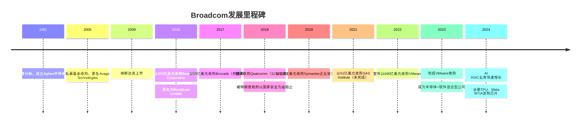
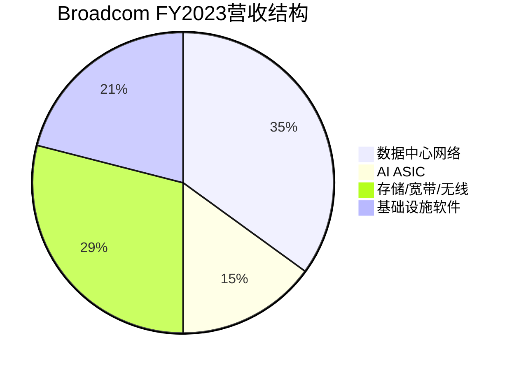

# Broadcom深度分析：数据中心网络芯片与AI ASIC的隐形冠军

## 公司概况

### 基本信息

Broadcom Inc.（纳斯达克：AVGO）是全球领先的半导体和基础设施软件公司，总部位于美国加利福尼亚州圣何塞。现任CEO陈福阳（Hock Tan）自2006年接任，以其独特的"并购整合"战略将Broadcom打造成半导体行业最成功的平台型公司之一。

Broadcom的核心业务是数据中心网络芯片（以太网交换芯片、光纤通道）、存储控制器、宽带接入芯片，以及为谷歌、Meta等超大规模云厂商定制的AI ASIC。2023年完成的690亿美元VMware收购大幅扩展了Broadcom的软件业务，使其成为半导体+软件的混合型科技公司。

| 基本指标 | 数值（FY2023） |
|---------|-------------|
| 营收 | 359亿美元 |
| 净利润 | 141亿美元 |
| 毛利率 | 74.2% |
| 净利率 | 39.3% |
| 研发支出 | 49亿美元 |
| 员工数量 | 约20,000人（半导体）+约30,000人（VMware） |
| 市值 | ~7000亿美元 |

### 发展历程

## 商业模式分析

### 业务结构

Broadcom的业务分为两大板块：

**半导体解决方案（Semiconductor Solutions）**：FY2023营收约282亿美元，占总营收79%。主要产品：
- 数据中心网络芯片（Tomahawk/Trident以太网交换芯片）
- AI ASIC（谷歌TPU、Meta MTIA定制芯片）
- 存储控制器（MegaRAID、HBA）
- 宽带接入芯片（有线电视调制解调器、DSL）
- 无线连接芯片（Wi-Fi、蓝牙，主要供应苹果）

**基础设施软件（Infrastructure Software）**：FY2023营收约77亿美元，占总营收21%（VMware收购后大幅提升）。主要产品：
- VMware虚拟化平台（vSphere、vSAN、NSX）
- CA Technologies企业软件
- Symantec企业安全软件
- Brocade存储网络软件

### 陈福阳的"并购整合"战略

陈福阳是半导体行业最具争议也最成功的CEO之一。其核心战略：

1. **收购细分市场龙头**：专注收购在特定细分市场拥有垄断或寡头地位的公司
2. **激进成本削减**：收购后大幅削减研发和运营成本，提升利润率
3. **提高客户粘性**：通过产品组合和长期合同锁定客户
4. **持续分红和回购**：将高利润率转化为丰厚的股东回报

这一战略使Broadcom的毛利率从2015年的约50%提升至2023年的约74%，是半导体行业中最高的毛利率之一。

### VMware收购：从芯片到软件的战略跨越

2023年完成的690亿美元VMware收购是Broadcom历史上最大的并购，也是科技行业历史上最大的并购之一。

**战略逻辑**：
- VMware是企业虚拟化市场的绝对霸主，市占率超过70%
- 企业IT基础设施的核心软件，客户粘性极强
- 订阅化转型提升收入可预测性
- 与Broadcom网络芯片业务的协同效应

**整合进展**：
- 将VMware产品线整合为"VMware Cloud Foundation"订阅套件
- 大幅削减VMware员工（约20%）
- 提高VMware授权费用，引发部分客户不满
- 预计FY2024 VMware贡献营收约120亿美元

**争议**：VMware收购后的激进定价策略引发部分企业客户不满，一些客户开始评估替代方案（Nutanix、微软Hyper-V等）。这是Broadcom当前面临的主要业务风险之一。

## 技术分析：数据中心网络芯片的护城河

### 以太网交换芯片：市场垄断

Broadcom的Tomahawk和Trident系列以太网交换芯片是数据中心网络的核心组件，市占率超过50%。这些芯片用于数据中心内部的服务器互联，是云计算基础设施的关键组成部分。

**Tomahawk系列**（高性能核心交换）：
- Tomahawk 5：51.2 Tbps交换容量，支持400G/800G端口
- 主要用于数据中心核心层和汇聚层
- 客户：思科、Arista、Juniper等网络设备厂商

**Trident系列**（高性价比接入交换）：
- Trident 4：12.8 Tbps交换容量
- 主要用于数据中心接入层
- 客户：同上，以及超大规模云厂商自建网络

**竞争优势**：
- 20年以上的技术积累，软件生态完善
- 与主流网络操作系统（Cisco IOS、Arista EOS、SONiC）深度集成
- 持续的代际领先，竞争对手（Marvell、Intel）难以追赶

### AI ASIC：定制芯片的新增长极

Broadcom是全球最重要的AI ASIC（专用集成电路）设计合作伙伴，为谷歌、Meta等超大规模云厂商定制AI芯片：

**谷歌TPU**：Broadcom是谷歌TPU（Tensor Processing Unit）的主要设计合作伙伴，协助谷歌设计用于AI训练和推理的专用芯片。TPU v4/v5均有Broadcom的参与。

**Meta MTIA**：Broadcom协助Meta设计MTIA（Meta Training and Inference Accelerator），用于Meta内部的AI推理工作负载。

**AI ASIC的商业逻辑**：
- 超大规模云厂商希望降低对NVIDIA的依赖，自研AI芯片
- 自研ASIC针对特定工作负载优化，性价比优于通用GPU
- Broadcom提供芯片设计服务，客户保留IP所有权
- Broadcom从每颗芯片的销售中获得收入，无需承担研发风险

Broadcom预计AI ASIC业务将在FY2024贡献超过100亿美元营收，成为公司最重要的增长引擎之一。

### 无线连接：苹果的核心供应商

Broadcom是苹果iPhone和Mac的Wi-Fi/蓝牙芯片的主要供应商，约占Broadcom无线业务营收的约20%。苹果正在开发自研Wi-Fi/蓝牙芯片，预计2025-2026年逐步替代Broadcom，这是Broadcom面临的另一个客户集中度风险。

## 财务分析

### 营收增长分析

| 财年 | 总营收（亿美元） | 半导体（亿美元） | 软件（亿美元） | 同比增长 |
|-----|--------------|--------------|------------|---------|
| FY2020 | 237 | 178 | 59 | +6% |
| FY2021 | 274 | 207 | 67 | +15% |
| FY2022 | 332 | 263 | 69 | +21% |
| FY2023 | 359 | 282 | 77 | +8% |
| FY2024E | ~510 | ~310 | ~200 | ~42% |

FY2024营收预计大幅增长，主要驱动力是VMware收购（贡献约120亿美元增量）和AI ASIC业务的快速增长。

### 盈利能力：行业顶尖水平

| 指标 | FY2021 | FY2022 | FY2023 |
|-----|-------|-------|-------|
| 毛利率 | 73.0% | 74.0% | 74.2% |
| 营业利润率 | 43.5% | 46.8% | 42.1% |
| 净利率 | 35.0% | 38.5% | 39.3% |
| 自由现金流（亿美元） | 113 | 145 | 177 |

Broadcom的毛利率约74%，是半导体行业中最高的之一，反映了其在细分市场的垄断定价能力。自由现金流充裕，为持续并购和股东回报提供了坚实基础。

### 股东回报

Broadcom是半导体行业中股东回报最慷慨的公司之一：
- 股息收益率约1.5-2%，连续多年大幅提升股息
- FY2023股息总额约74亿美元
- 持续股票回购
- 自由现金流转化率极高（>90%）

### VMware收购的财务影响

VMware收购带来了约370亿美元的商誉和无形资产，每年摊销约80亿美元，对GAAP净利润有较大影响。但Non-GAAP（调整后）盈利能力更能反映Broadcom的真实运营状况。

## 竞争格局分析

### 数据中心网络：Marvell是主要竞争对手

在数据中心以太网交换芯片市场，Broadcom的主要竞争对手是Marvell Technology：

| 公司 | 市场份额 | 优势 | 劣势 |
|-----|---------|-----|-----|
| Broadcom | ~55% | 技术领先、生态完善 | 价格较高 |
| Marvell | ~25% | 定制化能力强 | 规模较小 |
| Intel | ~10% | x86生态协同 | 技术落后 |
| 其他 | ~10% | 细分市场 | 规模有限 |

### AI ASIC：与NVIDIA的差异化竞争

Broadcom的AI ASIC业务与NVIDIA并非直接竞争，而是互补关系：
- NVIDIA提供通用GPU，适合灵活的AI训练和推理
- Broadcom提供定制ASIC，适合特定工作负载的大规模推理
- 超大规模云厂商通常同时采购NVIDIA GPU和Broadcom ASIC

随着AI推理需求的爆发，定制ASIC的性价比优势将更加突出，Broadcom的AI ASIC业务有望持续高速增长。

### VMware软件：面临客户流失风险

VMware收购后的激进定价策略引发了部分企业客户的不满：
- 部分客户开始评估Nutanix、微软Hyper-V等替代方案
- 一些客户反映VMware授权费用提升了2-5倍
- 欧盟和部分国家监管机构对Broadcom的定价行为展开调查

这是Broadcom当前面临的主要业务风险，需要持续关注客户流失率和VMware营收增长情况。

## 投资价值评估

### 估值分析

| 估值指标 | Broadcom | NVIDIA | Qualcomm | 行业平均 |
|---------|---------|-------|---------|---------|
| P/E（FY2024E） | ~25x | ~40x | ~18x | ~25x |
| EV/Sales（FY2024E） | ~12x | ~20x | ~5x | ~7x |
| 股息收益率 | ~1.5% | ~0.03% | ~2% | ~1% |
| 自由现金流收益率 | ~3% | ~2% | ~5% | ~3% |

Broadcom的估值合理，考虑到其74%的毛利率、充裕的自由现金流和AI ASIC的高速增长，当前估值具有吸引力。

### 看多论点

1. **AI ASIC的爆发性增长**：谷歌TPU、Meta MTIA等定制芯片需求快速增长，Broadcom是最大受益者之一
2. **数据中心网络的结构性增长**：AI集群需要大量高速网络芯片，Tomahawk/Trident系列需求持续旺盛
3. **VMware的高利润率软件业务**：订阅化转型提升收入可预测性，软件业务毛利率超过80%
4. **陈福阳的并购整合能力**：过去10年的成功并购历史证明了管理团队的执行能力
5. **充裕的自由现金流**：支持持续的股息增长和股票回购

### 看空论点

1. **VMware客户流失风险**：激进定价策略可能导致客户流失，影响软件业务增长
2. **苹果Wi-Fi芯片替代**：苹果自研Wi-Fi/蓝牙芯片将侵蚀Broadcom约10-15%的营收
3. **高负债**：VMware收购带来约370亿美元债务，利率上升增加财务成本
4. **并购依赖**：Broadcom的增长高度依赖并购，有机增长相对有限
5. **监管风险**：VMware定价行为面临监管调查，可能限制定价策略

### 投资建议

Broadcom是半导体+软件混合型公司中最具吸引力的投资标的之一。AI ASIC业务的高速增长、数据中心网络芯片的垄断地位、以及VMware的高利润率软件业务，构成了强大的增长组合。

**核心观察指标**：AI ASIC营收增长、VMware客户留存率、数据中心网络芯片市场份额、债务偿还进度。

## 常见问题

### Q1：Broadcom的AI ASIC业务有多大潜力？

Broadcom预计FY2024 AI ASIC营收超过100亿美元，FY2025有望达到150-200亿美元。谷歌、Meta、微软等超大规模云厂商都在加大自研AI芯片投入，Broadcom作为最重要的设计合作伙伴，将持续受益。长期来看，AI ASIC市场规模可能达到数百亿美元，Broadcom有望占据30-40%的份额。

### Q2：VMware收购是否物有所值？

690亿美元的收购价格相当于VMware约15倍EV/Sales，看似昂贵。但考虑到VMware在企业虚拟化市场的垄断地位（70%+市场份额）、极高的客户粘性和订阅化转型的潜力，长期来看具有战略价值。关键风险是激进定价策略导致的客户流失，需要持续观察。

### Q3：陈福阳退休后Broadcom会怎样？

陈福阳是Broadcom最重要的资产，其并购整合战略是公司增长的核心驱动力。他的退休将是重大风险事件。目前没有明确的接班人计划，这是投资者需要关注的长期风险。

### Q4：Broadcom的高负债是否令人担忧？

VMware收购后，Broadcom的净债务约370亿美元，债务/EBITDA约3倍。这一杠杆水平在投资级公司中属于偏高，但Broadcom的自由现金流极为充裕（约180亿美元/年），债务偿还能力强。预计3-4年内可将债务/EBITDA降至2倍以下。

### Q5：Broadcom是否会继续大型并购？

陈福阳的并购战略是Broadcom的核心增长引擎。VMware收购完成后，Broadcom需要一段时间消化整合。下一个大型并购目标可能在2025-2026年出现，潜在方向包括企业软件、网络安全、或其他基础设施软件领域。

## VMware整合深度分析

### VMware收购的战略逻辑与执行进展

2023年11月完成的690亿美元VMware收购是Broadcom历史上最重要的战略决策，也是科技行业历史上最大的并购之一。

**收购的战略逻辑**：
1. **垄断性市场地位**：VMware在企业虚拟化市场的市占率超过70%，是企业IT基础设施的核心软件，客户粘性极强
2. **订阅化转型潜力**：VMware传统上以永久授权模式销售，订阅化转型可以大幅提升收入可预测性和估值倍数
3. **与半导体业务的协同**：VMware的网络虚拟化（NSX）与Broadcom的网络芯片（Tomahawk/Trident）形成协同，可以提供"芯片+软件"的完整解决方案
4. **高利润率软件业务**：软件业务毛利率超过80%，远高于半导体业务的约70%，有助于提升整体利润率

**整合策略**：陈福阳采用了其一贯的"激进整合"策略：
- 将VMware产品线整合为"VMware Cloud Foundation"（VCF）订阅套件
- 大幅削减VMware员工（约20%，约6000人）
- 提高VMware授权费用（部分客户反映费用提升2-5倍）
- 停止销售独立产品，强制客户购买VCF套件

**整合进展（截至2024年）**：
- VCF订阅转化：约60%的VMware客户已转向VCF订阅模式
- 营收贡献：FY2024 VMware贡献约120亿美元营收（年化）
- 利润率：VMware业务Non-GAAP营业利润率约70%，高于预期

### VMware客户流失风险量化

激进定价策略引发了部分企业客户的强烈不满，客户流失风险是Broadcom当前面临的最重要风险：

**客户反应**：
- 部分大型企业（如AT&T、德意志银行）公开表示正在评估替代方案
- Nutanix（VMware的主要竞争对手）报告称，2024年来自VMware客户的新签约大幅增加
- 微软Hyper-V和Azure Stack HCI的咨询量显著增加

**替代方案评估**：

| 替代方案 | 优势 | 劣势 | 迁移难度 |
|---------|-----|-----|---------|
| Nutanix | 超融合架构，易用性好 | 功能不如VMware全面 | 中等 |
| 微软Hyper-V/Azure Stack | 与Windows生态集成 | 功能相对有限 | 中等 |
| Red Hat OpenShift | 容器化，云原生 | 需要架构重构 | 高 |
| 裸金属+Kubernetes | 成本最低 | 运维复杂度高 | 极高 |

**客户流失率估算**：
- 短期（1-2年）：预计约5-10%的VMware客户流失，主要是对价格最敏感的中小企业
- 中期（3-5年）：预计约15-20%的客户流失，部分大型企业完成迁移
- 长期（5年以上）：若Broadcom维持激进定价，流失率可能达到25-30%

**Broadcom的应对**：
- 对大型战略客户提供定制化定价，避免流失最重要的客户
- 持续增加VCF的功能价值，使客户感受到订阅的价值
- 通过AI功能（VMware AI）提升产品差异化

## AI ASIC业务深度分析

### 谷歌TPU合作的战略价值

Broadcom是谷歌TPU（Tensor Processing Unit）的主要设计合作伙伴，这一合作关系是Broadcom AI ASIC业务的核心。

**合作模式**：
- 谷歌负责TPU的架构设计和算法优化
- Broadcom负责芯片的物理设计（布局布线）、封装设计和量产支持
- 台积电负责晶圆制造
- 谷歌拥有TPU的IP所有权，Broadcom从每颗芯片的销售中获得设计服务费

**TPU v5的规模**：
- 谷歌每年采购数十万块TPU，用于训练Gemini等大模型和提供AI推理服务
- 每块TPU的Broadcom设计服务费约500-1000美元（估算）
- 年收入贡献：约50-100亿美元（估算）

**Meta MTIA合作**：
- Meta的MTIA（Meta Training and Inference Accelerator）同样由Broadcom协助设计
- MTIA主要用于Meta的推荐系统推理，替代部分NVIDIA GPU
- Meta计划在2025-2026年大规模部署MTIA，Broadcom将持续受益

### AI ASIC市场的长期潜力

**市场规模预测**：
- 2023年：AI ASIC市场约100亿美元
- 2025年：约250亿美元（年复合增长率约60%）
- 2027年：约500亿美元
- 2030年：约1000亿美元

**Broadcom的市场份额**：
- 当前：约30-40%（主要来自谷歌TPU和Meta MTIA）
- 2026年目标：约35-45%（随着更多超大规模云厂商自研ASIC）

**潜在新客户**：
- 微软：正在开发自研AI芯片（Maia），Broadcom是潜在设计合作伙伴
- 亚马逊：Trainium 2的设计合作伙伴（部分）
- 苹果：Apple Neural Engine的设计合作伙伴（部分）
- 字节跳动、百度等中国科技公司：在出口管制背景下，自研ASIC需求增加

## 数据中心网络芯片的技术演进

### Tomahawk 5与800G时代

AI数据中心的快速扩张推动了网络芯片需求的爆发式增长。AI训练集群需要极高的网络带宽来同步梯度，网络成为AI算力的关键瓶颈之一。

**Tomahawk 5技术规格**：
- 交换容量：51.2 Tbps（相比Tomahawk 4的25.6 Tbps，翻倍）
- 端口配置：128个400G端口，或64个800G端口
- 功耗：约350W
- 制程：台积电5nm
- 发布时间：2023年

**800G时代的战略意义**：
- AI训练集群的GPU间通信需求推动网络从400G向800G升级
- NVIDIA H100/H200集群通常使用400G InfiniBand或以太网
- NVIDIA B100/B200集群将需要800G网络，Tomahawk 5是核心受益者

**竞争格局**：
- Broadcom Tomahawk 5：市占率约55%，技术领先
- Marvell Teralynx 10：市占率约25%，定制化能力强
- Intel Tofino：市占率约10%，可编程性强
- 其他：约10%

### 以太网 vs InfiniBand：AI网络的路线之争

AI数据中心网络存在两种主要技术路线：

**InfiniBand（NVIDIA主导）**：
- 优势：延迟极低（约1微秒），带宽高，专为HPC/AI优化
- 劣势：生态封闭（NVIDIA主导），成本高，与以太网不兼容
- 市场地位：目前约60%的AI训练集群使用InfiniBand

**以太网（Broadcom主导）**：
- 优势：生态开放，成本低，与现有数据中心基础设施兼容
- 劣势：延迟略高于InfiniBand，需要RDMA（RoCE）技术优化
- 市场地位：约40%的AI训练集群使用以太网，且比例在上升

**Ultra Ethernet Consortium（UEC）**：
- 2023年成立，成员包括AMD、Intel、微软、Meta、谷歌等
- 目标：开发专为AI优化的以太网标准，挑战InfiniBand的主导地位
- Broadcom是UEC的核心成员，其Tomahawk系列是UEC的主要硬件支撑

**对Broadcom的影响**：以太网在AI网络中的份额提升，直接利好Broadcom的Tomahawk/Trident系列。若UEC标准成功，可能进一步侵蚀NVIDIA InfiniBand的市场份额，Broadcom将是最大受益者之一。

## 财务模型与估值框架

### 详细财务预测（含VMware）

| 财年 | 总收入（亿美元） | 半导体（亿美元） | 软件（亿美元） | Non-GAAP EPS（美元） |
|-----|--------------|--------------|------------|-------------------|
| FY2022 | 332 | 263 | 69 | 33.29 |
| FY2023 | 359 | 282 | 77 | 36.61 |
| FY2024E | 510 | 310 | 200 | 46.00 |
| FY2025E | 580 | 350 | 230 | 55.00 |
| FY2026E | 650 | 390 | 260 | 65.00 |

注：FY2024起包含VMware全年贡献（约120亿美元）。

### 情景分析

**牛市情景（概率30%）**：
- 假设：AI ASIC业务超预期增长，VMware客户流失率低于5%，数据中心网络芯片需求持续旺盛
- FY2026收入：约720亿美元
- FY2026 EPS：约75美元
- 合理P/E：28倍
- 目标股价：约2100美元

**基准情景（概率50%）**：
- 假设：AI ASIC稳健增长，VMware客户流失率约10%，网络芯片需求正常
- FY2026收入：约650亿美元
- FY2026 EPS：约65美元
- 合理P/E：25倍
- 目标股价：约1625美元

**熊市情景（概率20%）**：
- 假设：VMware客户大量流失（>20%），AI ASIC竞争加剧，苹果Wi-Fi芯片替代加速
- FY2026收入：约500亿美元
- FY2026 EPS：约45美元
- 合理P/E：20倍
- 目标股价：约900美元

### 陈福阳的并购战略评估

陈福阳是半导体行业最具争议的CEO，其"并购整合"战略的核心逻辑：

**战略的本质**：收购细分市场垄断者 → 激进削减成本 → 提升利润率 → 产生大量自由现金流 → 用于下一次并购

**历史成功案例**：
- 2015年收购Broadcom Corporation（370亿美元）：整合后毛利率从50%提升至70%+
- 2019年收购Symantec企业安全（107亿美元）：整合后利润率大幅提升
- 2023年收购VMware（690亿美元）：整合进行中，预计FY2025实现约70%的Non-GAAP利润率

**战略的风险**：
- 激进定价可能导致客户流失，破坏被收购公司的长期价值
- 大幅削减研发可能导致产品竞争力下降
- 高杠杆在利率上升环境下增加财务风险

**总体评估**：陈福阳的战略在短期内极为有效（毛利率从50%提升至74%），但长期可持续性存在疑问。VMware收购是对这一战略的最大考验——若VMware客户流失率超过20%，将证明这一战略存在边界。

## 延伸阅读

### 推荐资料
- Broadcom官方投资者关系网站
- 陈福阳历年财报电话会议记录
- VMware整合进展跟踪

### 研究报告
- 摩根士丹利Broadcom深度研究
- 高盛AI ASIC市场分析
- 花旗集团Broadcom VMware整合评估

## 参考文献

1. Broadcom Inc. *FY2023 Annual Report (Form 10-K)*. 2023.
2. Broadcom Inc. *Q4 FY2023 Earnings Call Transcript*. 2023.
3. IDC. *Ethernet Switch Market Share Q4 2023*. 2024.
4. Dell'Oro Group. *Data Center Networking Market Report 2023*. 2024.
5. Morgan Stanley. *Broadcom: The AI Infrastructure Play*. 2024.
6. Goldman Sachs. *Custom AI Silicon: The $100B Opportunity*. 2024.
7. Bernstein Research. *Broadcom VMware Integration: Progress and Risks*. 2024.
8. The Information. *Inside Broadcom's AI Chip Business*. 2024.
9. SemiAnalysis. *Broadcom AI ASIC: Google TPU and Meta MTIA*. 2024.
10. Gartner. *Magic Quadrant for x86 Server Virtualization Infrastructure*. 2024.
11. Nutanix. *Competitive Analysis: VMware vs Nutanix*. 2024.
12. IEEE Network. *Data Center Ethernet Switch Technology Evolution*. 2023.
13. Tan, Hock. *Broadcom Investor Day 2023 Presentation*. 2023.
14. European Commission. *Broadcom VMware Merger Investigation*. 2023.
15. Citi Research. *Broadcom: Post-VMware Financial Model*. 2024.

---

**投资建议**：
Broadcom是AI时代数据中心基础设施的核心受益者，AI ASIC业务高速增长+数据中心网络芯片垄断地位+VMware高利润率软件业务构成强大的增长组合。适合作为科技组合的重要配置，关注VMware客户留存率和AI ASIC营收增长。

**风险提示**：
本文所有分析仅供参考，不构成投资建议。Broadcom面临VMware客户流失风险、高负债压力和苹果芯片替代风险。投资者需充分了解相关风险，结合自身风险承受能力做出投资决策。

---

[← Qualcomm深度分析](qualcomm.html) | [TSMC深度分析 →](tsmc.html)
