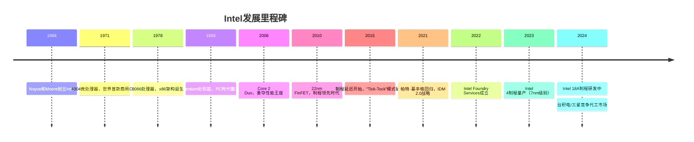
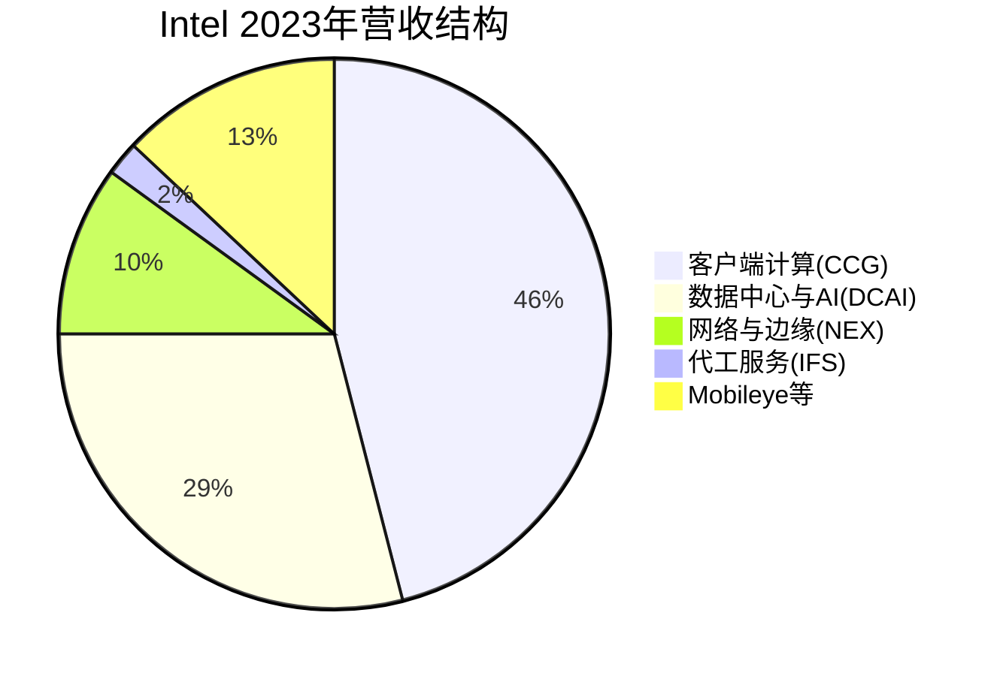

# Intel深度分析：巨人的转型之战

## 公司概况

### 基本信息

Intel Corporation（纳斯达克：INTC）成立于1968年，总部位于美国加利福尼亚州圣克拉拉。由Robert Noyce和Gordon Moore（摩尔定律提出者）共同创立，现任CEO帕特·基辛格（Pat Gelsinger）自2021年2月接任，主导"IDM 2.0"战略转型。

Intel曾是半导体行业无可争议的霸主，x86 CPU的发明者，PC时代和服务器时代的绝对统治者。然而，在移动时代错失ARM架构，在AI时代落后于NVIDIA，加之制程技术的持续落后，Intel正面临其历史上最严峻的战略挑战。

| 基本指标 | 数值（2023年） |
|---------|-------------|
| 营收 | 542亿美元 |
| 净利润 | 17亿美元 |
| 毛利率 | 42.5% |
| 净利率 | 3.1% |
| 研发支出 | 160亿美元 |
| 资本开支 | 250亿美元 |
| 员工数量 | 约124,800人 |
| 市值 | ~1500亿美元 |

### 发展历程

## 商业模式分析

### 业务结构

Intel的业务分为多个板块：

**客户端计算（CCG）**：2023年营收约249亿美元，占总营收46%。包括桌面、笔记本、Chromebook的Core系列CPU。这是Intel最大的业务，但面临AMD的持续竞争压力。

**数据中心与AI（DCAI）**：2023年营收约156亿美元，占总营收29%。包括Xeon服务器CPU、Gaudi AI加速器、FPGA（Altera）。这是Intel最重要的战略业务，但市场份额持续被AMD蚕食。

**网络与边缘（NEX）**：2023年营收约56亿美元，占总营收10%。包括网络处理器、边缘计算芯片。

**Intel Foundry Services（IFS）**：2023年营收约189亿美元（含内部转移），外部客户收入约10亿美元。这是Intel IDM 2.0战略的核心，目标是成为全球第二大晶圆代工厂。

**Mobileye**：2023年营收约21亿美元，自动驾驶视觉芯片领导者，已于2022年独立上市（纳斯达克：MBLY）。

### IDM模式：优势与挑战

Intel是全球最大的IDM（垂直整合制造商），自行完成芯片设计、晶圆制造、封装测试全流程。IDM模式的优势在于：
- 设计与制造的深度协同优化
- 供应链控制能力强
- 制造工艺的专有技术积累

然而，IDM模式也带来了巨大挑战：
- 资本开支极高（2023年约250亿美元）
- 制造业务的固定成本高，产能利用率波动影响盈利
- 需要同时在设计和制造两个领域保持领先，难度极大

### IDM 2.0战略

帕特·基辛格于2021年提出"IDM 2.0"战略，核心要素：

1. **保留并升级自有制造**：重建制程技术领先地位，目标2025年实现Intel 18A（约等于台积电2nm水平）
2. **开放代工服务（IFS）**：向外部客户提供代工服务，目标成为全球第二大代工厂
3. **灵活使用外部代工**：部分产品（如GPU、FPGA）委托台积电代工，利用最先进制程
4. **CHIPS Act支持**：利用美国政府补贴在美国本土扩大制造产能

这一战略的逻辑是：Intel的制造能力是其核心资产，不应放弃；同时通过开放代工服务，将制造能力变现，分摊巨额资本开支。

## 制程技术：追赶之路

### 制程落后的根源

Intel曾是制程技术的绝对领导者，"Tick-Tock"模式（每年交替推进制程微缩和架构升级）使Intel在2010年代初期领先台积电约2年。然而，从2015年开始，Intel的制程推进开始出现延迟：

- **14nm**：2014年量产，比计划延迟约6个月
- **10nm**：原计划2016年量产，实际2019年才量产，延迟约3年
- **7nm**：原计划2021年量产，实际推迟至2023年（以Intel 4命名）

这3-4年的制程延迟使台积电得以追上并超越Intel，AMD借助台积电7nm工艺在性能上实现了对Intel的反超。

### Intel制程命名体系

Intel的制程命名与台积电/三星不同，存在一定的"营销成分"：

| Intel制程名称 | 实际技术水平 | 对应台积电制程 | 量产时间 |
|------------|-----------|------------|---------|
| Intel 7 | 约等于台积电10nm | 10nm | 2021年 |
| Intel 4 | 约等于台积电7nm | 7nm | 2023年 |
| Intel 3 | 约等于台积电5nm | 5nm | 2024年 |
| Intel 20A | 约等于台积电3nm | 3nm | 2024年（内部） |
| Intel 18A | 约等于台积电2nm | 2nm | 2025年目标 |

### Intel 18A：关键里程碑

Intel 18A是Intel IDM 2.0战略的核心技术里程碑，预计2025年量产。其关键技术创新：

**RibbonFET**：Intel的Gate-All-Around（GAA）晶体管技术，相比FinFET在性能和功耗方面有显著提升，与台积电的GAAFET（用于2nm）技术路线相似。

**PowerVia**：背面供电技术（Backside Power Delivery），将电源线移至芯片背面，释放正面空间用于信号线，提升性能和功耗效率。这是Intel相对台积电的潜在差异化优势。

**EUV光刻**：Intel 18A将大规模使用EUV光刻，追赶台积电的先进制程水平。

若Intel 18A能够成功量产并达到预期性能，将是Intel制程追赶的重要里程碑，也是IFS代工业务获得主要客户的关键前提。

### 代工业务（IFS）的挑战

Intel Foundry Services面临的核心挑战：

**技术可信度**：主要芯片设计公司（苹果、高通、NVIDIA等）对Intel代工的技术能力和良率存在疑虑，需要Intel 18A的成功量产来证明。

**客户信任**：Intel既是代工客户的竞争对手（在CPU市场），又是代工服务提供商，存在利益冲突。客户担心Intel会优先保障自有产品的产能。

**成本竞争力**：Intel的制造成本高于台积电，需要通过规模效应和技术差异化来弥补。

**当前进展**：IFS已获得少数客户（包括微软、高通的部分产品），但尚未获得大规模战略客户。2024年Intel宣布将IFS作为独立业务单元运营，以提升透明度和客户信任。

## 竞争格局分析

### 数据中心CPU：市场份额持续流失

Intel Xeon是数据中心CPU的传统霸主，但AMD EPYC的持续进攻使Intel的市场份额从2019年的约95%下降至2023年的约70-75%。

**Intel的应对**：
- Sapphire Rapids（第四代Xeon）：2023年发布，集成AMX（高级矩阵扩展）指令集，提升AI推理性能
- Emerald Rapids（第五代Xeon）：2023年底发布，性能小幅提升
- Granite Rapids（第六代Xeon）：2024年发布，采用Intel 3制程，性能大幅提升

**挑战**：即使Intel推出更有竞争力的产品，AMD EPYC的市场份额提升趋势难以逆转，因为主要云厂商已经建立了AMD的供应链和软件生态。

### 客户端CPU：仍是市场领导者

在PC CPU市场，Intel仍保持约65%的市场份额，但AMD Ryzen的竞争压力持续。Intel的优势在于：
- 更广泛的OEM合作关系（戴尔、惠普、联想等）
- 集成显卡（Intel Iris Xe）在轻薄本市场的竞争力
- Evo认证平台的品牌影响力

Intel Meteor Lake（2023年底发布）是Intel首款采用Chiplet设计的消费级CPU，集成了Intel Arc GPU和NPU，是Intel AI PC战略的核心产品。

### AI芯片：Gaudi的挑战

Intel Gaudi 3是Intel的AI训练/推理加速器，相比H100在性价比上有竞争力，但市场认知度和生态支持远不及NVIDIA。Intel的AI芯片战略面临：
- CUDA生态的强大护城河
- AMD MI300X的竞争
- 自身软件生态（oneAPI）的成熟度不足

## 财务分析

### 营收与盈利趋势

| 年份 | 总营收（亿美元） | 毛利率 | 净利率 | 资本开支（亿美元） |
|-----|--------------|-------|-------|----------------|
| 2020 | 779 | 55.4% | 26.8% | 143 |
| 2021 | 791 | 55.4% | 25.1% | 185 |
| 2022 | 631 | 42.6% | -1.7% | 252 |
| 2023 | 542 | 42.5% | 3.1% | 250 |
| 2024E | ~560 | ~44% | ~5% | ~250 |

Intel的财务状况在2022-2023年显著恶化，主要原因：
- PC市场需求大幅下滑（2022年PC出货量同比下降约16%）
- 数据中心CPU市场份额被AMD蚕食
- 巨额资本开支（制造扩张）压制自由现金流
- 制程追赶的研发投入持续高企

### 资本开支的压力

Intel的资本开支约250亿美元/年，是Fabless公司（NVIDIA约30亿美元/年）的约8倍。这一巨额资本开支是IDM模式的必然代价，也是Intel财务压力的主要来源。

CHIPS Act补贴（约85亿美元直接补贴+约110亿美元贷款担保）将部分缓解Intel的资本开支压力，但仍需要Intel自身的盈利能力支撑。

### 股息政策调整

Intel于2023年将季度股息从每股0.365美元削减至0.125美元，降幅约66%，以保留更多现金用于制造投资。这一决定反映了Intel财务压力的严峻程度，也是管理层对IDM 2.0战略的坚定承诺。

## 投资价值评估

### 困境反转的逻辑

Intel是典型的困境反转投资标的，核心逻辑：

**看多情景**：Intel 18A制程成功量产，性能达到台积电2nm水平；IFS获得1-2家主要战略客户（如苹果、高通）；数据中心CPU市场份额企稳；AI芯片（Gaudi）获得市场认可。在这一情景下，Intel的估值有显著上行空间。

**看空情景**：Intel 18A制程继续延迟或性能不达预期；IFS无法获得主要客户；数据中心CPU市场份额继续下滑；AI芯片市场存在感持续弱。在这一情景下，Intel可能面临进一步的估值压缩。

### 估值分析

| 估值指标 | Intel | AMD | NVIDIA | 台积电 |
|---------|-------|-----|-------|-------|
| P/E（2024E） | ~25x | ~35x | ~40x | ~22x |
| EV/Sales（2024E） | ~2x | ~8x | ~20x | ~8x |
| P/B | ~1.5x | ~3x | ~40x | ~6x |

Intel的估值是主要半导体公司中最低的，反映了市场对其转型不确定性的折价。若转型成功，当前估值具有较大的上行空间；若转型失败，下行风险也不容忽视。

### CHIPS Act的战略价值

Intel是CHIPS Act最大的受益者，获得约85亿美元直接补贴，用于在亚利桑那州、俄亥俄州、新墨西哥州扩建晶圆厂。这不仅降低了Intel的资本开支压力，也赋予了Intel重要的战略价值——作为美国本土先进制程制造的核心，Intel具有不可替代的国家安全意义。

## 常见问题

### Q1：Intel的制程追赶能否成功？

这是最关键也最难预测的问题。Intel 18A的技术路线（RibbonFET + PowerVia）在理论上具有竞争力，但半导体制程的量产良率和性能达标是极其复杂的工程挑战。乐观估计：Intel 18A于2025年成功量产，性能接近台积电2nm；悲观估计：继续延迟至2026年甚至更晚。当前市场共识偏向谨慎乐观。

### Q2：IFS能否获得主要战略客户？

IFS获得主要战略客户（如苹果、高通、NVIDIA）是Intel代工业务成功的关键。目前的障碍：技术可信度（需要18A成功量产证明）、利益冲突担忧（Intel是客户的竞争对手）、台积电的强大竞争。预计2025-2026年是关键窗口期，若18A成功，有望吸引1-2家战略客户。

### Q3：Intel是否应该放弃制造，转型为Fabless？

这是市场上长期存在的争论。放弃制造的优势：大幅降低资本开支，提升盈利能力，专注设计创新。劣势：失去制造能力后难以恢复，失去IDM协同优势，且美国政府不希望Intel放弃本土制造。基辛格坚持IDM 2.0战略，认为制造能力是Intel的核心竞争力。这一判断的正确性将在未来3-5年得到验证。

### Q4：Intel的股息还会进一步削减吗？

2023年的股息削减已经大幅降低了股息支出。在IDM 2.0战略执行期间（2024-2026年），Intel需要维持高资本开支，进一步削减股息的可能性存在，但不是基准情景。若IFS业务开始产生正向现金流，股息有望逐步恢复。

### Q5：Mobileye的独立上市对Intel有何影响？

Mobileye于2022年10月在纳斯达克独立上市，Intel保留约88%的股权。Mobileye是自动驾驶视觉芯片的全球领导者，市值约200亿美元。Intel可以通过出售Mobileye股权获得流动性，但目前倾向于保留控股权，享受自动驾驶市场的长期增长红利。

## Intel 18A制程深度解析

### RibbonFET与PowerVia：技术突破的双引擎

Intel 18A是Intel IDM 2.0战略的核心技术里程碑，集成了两项重大技术创新：

**RibbonFET（全环绕栅极晶体管）**：
- 技术原理：将传统FinFET的鳍式结构替换为纳米片（Nanosheet）结构，栅极完全包围沟道，实现更好的电流控制
- 性能优势：相比Intel 4（FinFET），RibbonFET在相同功耗下性能提升约15%，或在相同性能下功耗降低约30%
- 与台积电对比：台积电2nm（N2）同样采用GAAFET（纳米片）技术，两者技术路线相似，但台积电的量产经验更丰富
- 量产挑战：纳米片晶体管的制造工艺更复杂，良率控制难度更高，这是Intel 18A面临的主要技术挑战

**PowerVia（背面供电技术）**：
- 技术原理：将电源线从芯片正面移至背面，正面空间完全用于信号线
- 性能优势：减少电源线对信号线的干扰，提升信号完整性；降低电阻，减少电压降；允许更密集的信号线布局
- 行业意义：PowerVia是Intel相对台积电的潜在差异化优势，台积电的2nm工艺尚未采用背面供电
- 验证进展：Intel已在测试芯片上验证PowerVia技术，结果显示功耗降低约6%，性能提升约4%

**Intel 18A vs 台积电2nm对比**：

| 技术维度 | Intel 18A | 台积电N2 | 优势方 |
|---------|---------|---------|------|
| 晶体管架构 | RibbonFET（GAAFET） | GAAFET（纳米片） | 技术路线相似 |
| 背面供电 | 是（PowerVia） | 否（N2P才引入） | Intel |
| 预计量产时间 | 2025年 | 2025年 | 基本同步 |
| 预计良率 | 未知（关键风险） | 高（台积电经验丰富） | 台积电 |
| 客户信任度 | 低（需要证明） | 极高 | 台积电 |

### Intel代工业务（IFS）的战略重要性

Intel Foundry Services（IFS）是Intel IDM 2.0战略的核心组成部分，也是Intel估值重估的关键催化剂。

**IFS的战略逻辑**：
- 分摊巨额资本开支：Intel每年约250亿美元的资本开支，若能通过代工业务获得外部收入，将大幅改善资本效率
- 美国本土制造的战略价值：CHIPS Act支持下，美国政府希望在本土建立先进制程制造能力，Intel是最重要的受益者
- 技术验证：外部客户的采用是Intel制程技术可靠性的最佳证明

**IFS当前进展**：
- 已获客户：微软（部分产品）、高通（部分产品）、亚马逊（AWS自研芯片）
- 潜在大客户：苹果（最重要的潜在客户，但需要18A成功量产才能谈判）
- 2024年独立运营：Intel将IFS作为独立业务单元，提升透明度和客户信任

**IFS面临的核心挑战**：
1. 技术可信度：需要18A成功量产，良率达到商业化水平
2. 利益冲突：Intel既是代工客户的竞争对手（CPU市场），又是代工服务提供商
3. 成本竞争力：Intel的制造成本约为台积电的1.5-2倍，需要通过规模效应和技术差异化弥补
4. 交付能力：台积电以极高的交付可靠性著称，Intel需要证明同等水平的交付能力

## Intel的AI战略：Gaudi与AI PC

### Gaudi 3：性价比竞争者

Intel Gaudi 3是Intel的AI训练/推理加速器，2024年发布，定位为H100的性价比替代方案：

**Gaudi 3技术规格**：
- 制程：台积电5nm
- 内存：96GB HBM2e
- 内存带宽：3.7 TB/s
- BF16训练性能：1,835 TFLOPS
- 功耗：600W
- 售价：约1.5万美元（远低于H100的3-4万美元）

**Gaudi 3 vs H100对比**：

| 指标 | Intel Gaudi 3 | NVIDIA H100 | 优势方 |
|-----|-------------|------------|------|
| BF16性能 | 1,835 TFLOPS | 1,979 TFLOPS | NVIDIA（略高） |
| 内存容量 | 96GB HBM2e | 80GB HBM3 | Intel（容量更大） |
| 内存带宽 | 3.7 TB/s | 3.35 TB/s | Intel（略高） |
| 功耗 | 600W | 700W | Intel（更低） |
| 售价 | ~1.5万美元 | ~3-4万美元 | Intel（约2倍价格优势） |
| 软件生态 | oneAPI（不成熟） | CUDA（极成熟） | NVIDIA（决定性优势） |

**Gaudi 3的市场机遇**：
- 对成本极为敏感的推理场景（如大规模部署的推理服务）
- 已有Intel软件生态的企业（使用oneAPI的企业）
- 希望减少对NVIDIA依赖的企业（供应链多元化）

**Gaudi 3的核心挑战**：
- oneAPI软件生态远不成熟，与CUDA的差距比ROCm更大
- 市场认知度低，企业采购决策者对Gaudi的了解有限
- Intel自身的品牌信任度在AI芯片领域较低

### AI PC战略：Meteor Lake与Lunar Lake

Intel的AI PC战略是其消费市场的重要增长点：

**Meteor Lake（2023年底发布）**：
- 首款采用Chiplet设计的Intel消费级CPU
- 集成Intel Arc GPU（独立图形核心）
- 集成NPU（神经网络处理单元），支持AI PC认证
- NPU性能：约11 TOPS，相对较低
- 制程：Intel 4（CPU核心）+ 台积电5nm（GPU核心）

**Lunar Lake（2024年发布）**：
- 专为超薄笔记本设计，功耗极低（约17W TDP）
- NPU性能大幅提升至约48 TOPS，超过Qualcomm骁龙X Elite的45 TOPS
- 集成内存（LPDDR5X），降低延迟
- 续航大幅提升，目标超过20小时
- 竞争对手：Qualcomm骁龙X Elite、AMD Ryzen AI 300

**AI PC市场的战略意义**：
- 全球PC市场每年出货约2.5亿台，AI PC渗透率预计从2024年的约10%提升至2027年的约60%
- AI PC的平均售价高于普通PC约200-300美元，提升Intel的ASP（平均售价）
- NPU性能成为AI PC的核心差异化指标，Intel需要在这一维度保持竞争力

## CHIPS Act与美国制造战略

### CHIPS Act对Intel的财务影响

2022年通过的《芯片与科学法案》（CHIPS Act）为Intel提供了约85亿美元直接补贴和约110亿美元贷款担保，是Intel历史上获得的最大单笔政府支持。

**补贴用途**：
- 亚利桑那州工厂（Intel 18A）：约200亿美元投资，获约20亿美元补贴
- 俄亥俄州工厂（Intel 18A/20A）：约200亿美元投资，获约20亿美元补贴
- 新墨西哥州工厂（封装）：约35亿美元投资，获约10亿美元补贴
- 俄勒冈州研发中心：约30亿美元投资，获约10亿美元补贴

**CHIPS Act的战略意义**：
- 降低Intel的资本开支压力，使其能够在财务困难时期维持制造投资
- 赋予Intel重要的国家战略价值，增加政府对Intel成功的利益相关性
- 吸引台积电、三星等外资在美建厂，形成美国本土半导体制造生态

**对Intel估值的影响**：
- CHIPS Act补贴相当于Intel市值的约5-7%，直接提升了股东价值
- 更重要的是，CHIPS Act赋予Intel"国家战略资产"的地位，降低了被并购或分拆的风险
- 若Intel 18A成功，美国政府将继续支持Intel扩大制造规模，形成正向循环

## 投资框架：困境反转的概率分析

### 关键里程碑与时间节点

Intel的投资价值高度依赖以下关键里程碑的实现：

| 里程碑 | 预计时间 | 成功概率 | 对股价影响 |
|------|---------|---------|---------|
| Intel 18A良率达标 | 2025年H1 | 60% | +30-50% |
| IFS获得首个战略客户 | 2025-2026年 | 40% | +20-40% |
| 数据中心CPU市场份额企稳 | 2025年 | 65% | +10-20% |
| Gaudi AI芯片获得规模客户 | 2025-2026年 | 30% | +10-20% |
| 全部里程碑实现 | 2026年 | 15% | +100%+ |

### 情景分析

**牛市情景（概率20%）**：
- Intel 18A成功量产，IFS获得苹果或高通作为战略客户
- 数据中心CPU市场份额企稳在65%
- Gaudi AI芯片获得市场认可
- 2026年EPS：约4美元，P/E 30倍，目标股价约120美元

**基准情景（概率50%）**：
- Intel 18A量产但良率低于台积电，IFS获得少数中小客户
- 数据中心CPU市场份额继续小幅下滑至60%
- Gaudi AI芯片市场存在感有限
- 2026年EPS：约2美元，P/E 22倍，目标股价约44美元

**熊市情景（概率30%）**：
- Intel 18A继续延迟，IFS无法获得主要客户
- 数据中心CPU市场份额跌破55%
- 财务压力迫使削减资本开支，形成恶性循环
- 2026年EPS：约0.5美元，P/E 15倍，目标股价约8美元

**投资建议**：Intel是高风险高回报的困境反转标的，建议小仓位参与（组合权重3-5%），以Intel 18A量产进展和IFS客户获取作为关键观察指标。若18A成功，当前股价具有显著上行空间；若继续失败，下行风险同样不容忽视。

## 延伸阅读

### 推荐资料
- Intel官方技术博客（intel.com/content/www/us/en/newsroom）
- 帕特·基辛格历年财报电话会议记录
- 《Only the Paranoid Survive》（Andy Grove）
- AnandTech Intel处理器深度评测

### 研究报告
- 摩根士丹利Intel转型分析报告
- 高盛半导体行业竞争格局报告
- 花旗集团Intel IDM 2.0评估

## 参考文献

1. Intel Corporation. *2023 Annual Report (Form 10-K)*. 2024.
2. Intel Corporation. *Q4 2023 Earnings Call Transcript*. 2024.
3. Gelsinger, Pat. *Intel Investor Meeting 2022: IDM 2.0 Strategy*. 2022.
4. TrendForce. *Server CPU Market Share Analysis 2023*. 2024.
5. IDC. *Worldwide PC Market Quarterly Tracker Q4 2023*. 2024.
6. Morgan Stanley. *Intel: The Long Road to Recovery*. 2024.
7. Goldman Sachs. *Intel IDM 2.0: Risk/Reward Analysis*. 2024.
8. AnandTech. *Intel Meteor Lake Review: The Chiplet Era Begins*. 2024.
9. SemiAnalysis. *Intel 18A: Can Intel Catch TSMC?*. 2024.
10. U.S. Department of Commerce. *CHIPS Act: Intel Award Announcement*. 2024.
11. IEEE Spectrum. *Intel's RibbonFET and PowerVia: A Technical Deep Dive*. 2024.
12. The Information. *Inside Intel's Struggle to Rebuild*. 2024.
13. Mercury Research. *x86 CPU Market Share Q4 2023*. 2024.
14. Bernstein Research. *Intel: Turnaround or Trap?*. 2024.
15. Miller, Chris. *Chip War: The Fight for the World's Most Critical Technology*. Scribner, 2022.

---

**投资建议**：
Intel是高风险高回报的困境反转标的。若Intel 18A制程成功、IFS获得战略客户，当前估值具有显著上行空间。建议小仓位参与（组合权重3-5%），以Intel 18A量产进展和IFS客户获取作为关键观察指标。

**风险提示**：
本文所有分析仅供参考，不构成投资建议。Intel转型面临重大执行风险，制程追赶失败将导致进一步的市场份额流失和估值压缩。投资者需充分了解相关风险，结合自身风险承受能力做出投资决策。

---

[← AMD深度分析](amd.html) | [Qualcomm深度分析 →](qualcomm.html)
