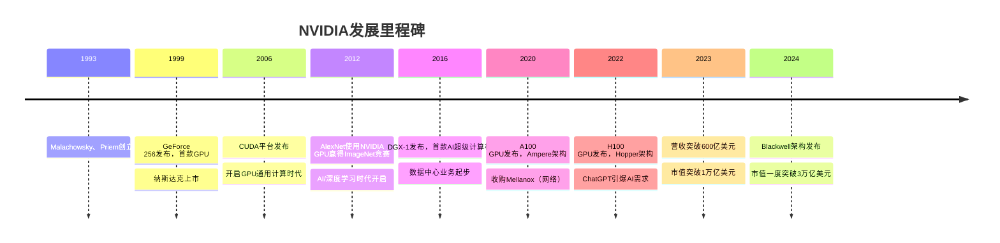
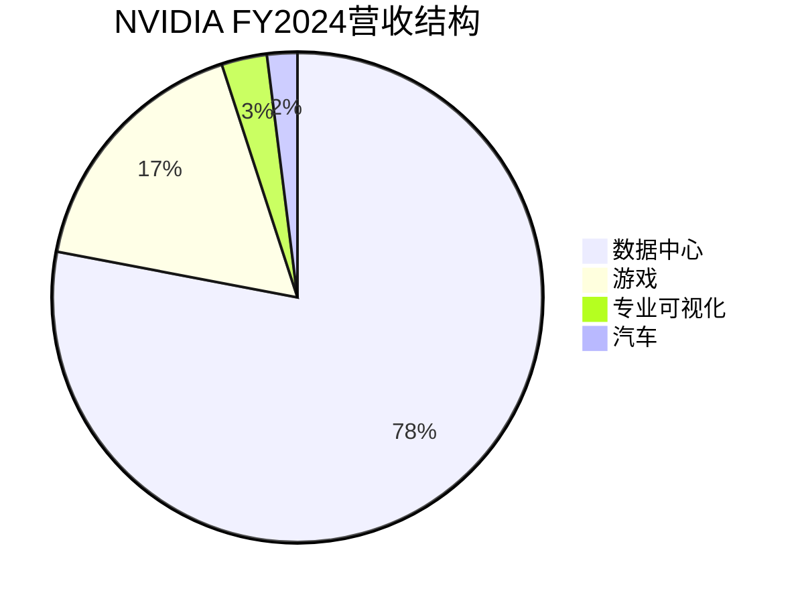
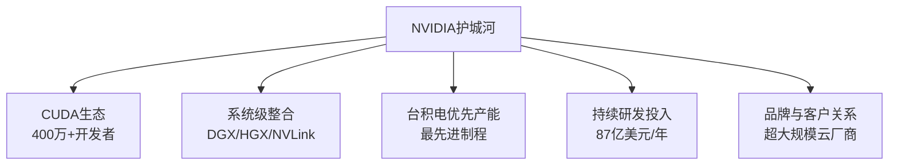

# NVIDIA深度分析：AI时代的算力帝国

## 公司概况

### 基本信息

NVIDIA Corporation（纳斯达克：NVDA）成立于1993年，总部位于美国加利福尼亚州圣克拉拉。公司由黄仁勋（Jensen Huang）、Chris Malachowsky和Curtis Priem共同创立，黄仁勋至今担任CEO，是科技行业任职时间最长的创始人CEO之一。

NVIDIA最初以游戏显卡起家，凭借GeForce系列GPU在游戏市场建立了强大的品牌。然而，真正让NVIDIA成为全球最有价值公司之一的，是其在AI/深度学习领域的战略转型。2024年，NVIDIA市值一度突破3万亿美元，超越苹果和微软，成为全球市值最高的公司。

| 基本指标 | 数值（FY2024） |
|---------|-------------|
| 营收 | 609亿美元 |
| 净利润 | 297亿美元 |
| 毛利率 | 72.7% |
| 净利率 | 55.0% |
| 研发支出 | 87亿美元 |
| 员工数量 | 约29,600人 |
| 市值（峰值） | ~3.3万亿美元 |

### 发展历程

## 商业模式分析

### 业务结构

NVIDIA的业务分为两大板块：

**数据中心（Data Center）**：2024财年营收475亿美元，占总营收78%，同比增长217%。这是NVIDIA增长最快、利润率最高的业务，主要产品包括：
- H100/H200 GPU（AI训练和推理）
- DGX系统（AI超级计算机）
- HGX服务器板卡
- InfiniBand和以太网网络（Mellanox）
- CUDA软件平台

**游戏（Gaming）**：2024财年营收103亿美元，占总营收17%，同比增长15%。GeForce RTX系列显卡是全球最畅销的游戏GPU，RTX 40系列采用Ada Lovelace架构，集成AI加速功能（DLSS 3）。

**专业可视化（Professional Visualization）**：2024财年营收16亿美元，主要面向工作站和专业设计市场，产品为Quadro/RTX系列专业显卡。

**汽车（Automotive）**：2024财年营收11亿美元，DRIVE平台为自动驾驶提供算力支持，客户包括奔驰、沃尔沃、小鹏等。

### Fabless模式的极致体现

NVIDIA是Fabless模式的最佳实践案例。公司不拥有任何晶圆厂，所有芯片均由台积电代工（主要使用4nm/3nm先进制程）。这一模式使NVIDIA能够：
- 将资本集中投入研发（FY2024研发支出87亿美元，占营收14%）
- 快速迭代产品架构（每1-2年推出新一代GPU）
- 保持极高的资产回报率（ROE超过100%）
- 维持70%以上的毛利率

### 软件平台的战略价值

NVIDIA的真正护城河不仅仅是硬件，而是以CUDA为核心的软件生态系统：

**CUDA**：2006年发布的并行计算平台，是AI/深度学习的事实标准。全球超过400万开发者使用CUDA，PyTorch、TensorFlow等主流AI框架均深度优化CUDA支持。

**cuDNN**：深度神经网络加速库，为卷积、池化、归一化等操作提供高度优化的实现。

**TensorRT**：推理优化引擎，将训练好的模型转换为高效的推理格式，在NVIDIA GPU上实现最优性能。

**NCCL**：多GPU/多节点通信库，是大规模分布式训练的关键组件。

**Triton Inference Server**：开源推理服务框架，简化AI模型的生产部署。

这些软件工具共同构成了一个完整的AI开发生态，使开发者从研究到生产的全流程都深度依赖NVIDIA平台，形成极强的生态锁定效应。

## 技术分析：GPU架构演进

### 从图形处理到通用计算

GPU（图形处理单元）最初设计用于处理3D图形渲染，其核心特点是拥有大量并行计算单元（CUDA Core）。与CPU的少量高性能核心不同，GPU拥有数千个相对简单的核心，非常适合处理大规模并行计算任务——而深度学习的矩阵运算恰好是高度并行的。

2012年，多伦多大学的Alex Krizhevsky使用两块NVIDIA GTX 580 GPU训练了AlexNet，在ImageNet竞赛中以压倒性优势获胜，正式开启了深度学习时代。这一事件让NVIDIA意识到GPU在AI领域的巨大潜力，并开始系统性地为AI工作负载优化GPU架构。

### 主要架构代际演进

| 架构 | 发布年份 | 代表产品 | 关键创新 |
|-----|---------|---------|---------|
| Kepler | 2012 | GTX 680 | CUDA计算能力提升 |
| Maxwell | 2014 | GTX 980 | 能效比大幅提升 |
| Pascal | 2016 | P100 | NVLink互联，FP16支持 |
| Volta | 2017 | V100 | Tensor Core，专为AI设计 |
| Turing | 2018 | RTX 2080 | RT Core（光线追踪），DLSS |
| Ampere | 2020 | A100/RTX 3090 | 第三代Tensor Core，MIG多实例GPU |
| Hopper | 2022 | H100 | Transformer Engine，NVLink 4.0 |
| Ada Lovelace | 2022 | RTX 4090 | 第四代Tensor Core，DLSS 3 |
| Blackwell | 2024 | B100/B200 | 第五代Tensor Core，NVLink 5.0 |

### H100：AI时代的核心产品

H100是NVIDIA当前最重要的产品，也是全球AI训练的主力芯片。其关键技术参数：

- **制程**：台积电4nm（SXM版本）
- **晶体管数量**：800亿
- **CUDA Core**：16,896个
- **Tensor Core**：528个（第四代）
- **显存**：80GB HBM3（SXM版本）
- **显存带宽**：3.35 TB/s
- **FP8训练性能**：3,958 TFLOPS
- **NVLink带宽**：900 GB/s（双向）
- **功耗**：700W（SXM版本）
- **售价**：约3-4万美元/块

H100相比A100在AI训练性能上提升约3倍，在推理性能上提升约6倍。Transformer Engine是H100的关键创新——它能够动态选择FP8或FP16精度，在保持模型精度的同时最大化计算效率，专为Transformer架构（GPT、BERT等大语言模型的基础）优化。

### Blackwell架构：下一代算力飞跃

2024年发布的Blackwell架构（B100/B200/GB200）代表了NVIDIA的下一代算力平台：

- **B200 GPU**：208亿晶体管，FP8训练性能约20 PFLOPS（相比H100提升约5倍）
- **GB200 NVL72**：将72块B200 GPU通过NVLink 5.0连接，形成单一计算节点，总算力约1.44 EFLOPS
- **HBM3e内存**：192GB，带宽8 TB/s
- **功耗**：B200约1000W，GB200机架约120kW

Blackwell的推出进一步巩固了NVIDIA在AI训练市场的领先地位，主要云厂商（微软、谷歌、亚马逊、Meta）均已预订大量GB200系统。

## 竞争优势分析

### 护城河一：CUDA生态的不可替代性

CUDA是NVIDIA最深的护城河，也是最难被复制的竞争优势。自2006年发布以来，CUDA已积累了近20年的生态建设：

- **开发者基础**：全球超过400万CUDA开发者，数百万行优化代码
- **框架支持**：PyTorch、TensorFlow、JAX等主流AI框架均深度优化CUDA
- **学术生态**：全球顶尖AI研究机构（MIT、Stanford、CMU等）的研究代码几乎全部基于CUDA
- **工具链完整性**：从开发（CUDA C++）到调试（Nsight）到部署（TensorRT）的完整工具链

迁移成本极高：将现有CUDA代码迁移到AMD ROCm或其他平台，不仅需要大量工程工作，还可能面临性能损失和兼容性问题。对于大型AI公司而言，迁移成本可能高达数亿美元。

### 护城河二：系统级整合能力

NVIDIA不仅提供GPU芯片，还提供完整的AI计算系统：

**DGX系统**：集成8块H100 GPU的AI超级计算机，通过NVLink实现GPU间高速互联，是AI研究机构和企业的标准配置。

**HGX服务器板卡**：供OEM厂商（戴尔、惠普、超微等）集成到自有服务器中，是云厂商AI集群的核心组件。

**NVLink和NVSwitch**：NVIDIA自研的GPU互联技术，带宽远超PCIe，使多GPU系统能够高效协同工作。NVLink 4.0（H100）双向带宽900 GB/s，NVLink 5.0（B100）进一步提升至1.8 TB/s。

**InfiniBand网络**（Mellanox）：2020年以69亿美元收购Mellanox，获得了高性能计算网络技术。InfiniBand是AI集群节点间通信的首选方案，带宽和延迟均优于以太网。

### 护城河三：与台积电的深度合作

NVIDIA是台积电最重要的客户之一，在先进制程产能分配上享有优先权。H100采用台积电4nm工艺，B100/B200采用台积电3nm工艺。这种深度合作关系确保了NVIDIA能够优先获得最先进的制程技术，保持对竞争对手的代际领先。

### 护城河四：持续的研发投入

NVIDIA的研发投入占营收比例约14%，FY2024研发支出87亿美元。这一投入水平确保了NVIDIA能够保持每1-2年推出新一代架构的节奏，持续扩大与竞争对手的技术差距。

## 财务分析

### 营收增长分析

| 财年 | 总营收（亿美元） | 数据中心（亿美元） | 游戏（亿美元） | 同比增长 |
|-----|--------------|----------------|-------------|---------|
| FY2020 | 109 | 30 | 57 | +16% |
| FY2021 | 166 | 67 | 77 | +53% |
| FY2022 | 269 | 106 | 124 | +61% |
| FY2023 | 270 | 151 | 90 | +0.2% |
| FY2024 | 609 | 475 | 103 | +122% |

FY2024的爆炸性增长（+122%）主要由数据中心业务驱动，H100 GPU供不应求，交货周期一度长达6-12个月。这种增长速度在半导体行业历史上极为罕见。

### 盈利能力分析

NVIDIA的盈利能力在半导体行业中处于顶尖水平：

| 指标 | FY2022 | FY2023 | FY2024 |
|-----|-------|-------|-------|
| 毛利率 | 64.9% | 56.9% | 72.7% |
| 营业利润率 | 37.3% | 16.0% | 54.1% |
| 净利率 | 36.2% | 16.2% | 55.0% |
| 自由现金流（亿美元） | 82 | 36 | 269 |

FY2024毛利率达到72.7%，接近软件公司水平，反映了H100的极高定价权（单价3-4万美元）和规模效应。净利率55%意味着每100美元营收中有55美元转化为净利润，这在制造业中几乎是不可思议的。

### 资产负债表健康度

- 现金及等价物：约260亿美元（FY2024末）
- 长期债务：约87亿美元
- 净现金：约173亿美元
- 股东权益：约426亿美元
- ROE：约120%（极高，反映轻资产模式）

NVIDIA的资产负债表极为健康，净现金头寸充裕，为持续研发投入和股东回报提供了坚实基础。FY2024股票回购约95亿美元，股息约4亿美元。

## 市场地位与竞争格局

### AI训练芯片：近乎垄断

在AI训练芯片市场，NVIDIA的市占率约80%，是名副其实的垄断者。主要竞争对手：

**AMD MI300X**：目前最有力的竞争者，在推理场景的性价比优于H100，已获得微软Azure、Meta等大客户采用。但在训练场景，CUDA生态的优势使大多数客户仍选择NVIDIA。

**Google TPU v5**：谷歌自研AI芯片，主要用于内部训练和推理，不对外销售。TPU在特定工作负载（TensorFlow/JAX）上性能优异，但生态封闭。

**Amazon Trainium 2**：亚马逊自研训练芯片，主要用于AWS内部AI服务，成本优势明显，但生态仍在建设中。

**Intel Gaudi 3**：Intel的AI训练芯片，性价比有竞争力，但市场认知度和生态支持远不及NVIDIA。

### 游戏GPU：双寡头格局

在游戏GPU市场，NVIDIA和AMD形成双寡头格局，NVIDIA市占率约80%，AMD约20%。Intel Arc系列进入市场但份额极小。NVIDIA的GeForce RTX系列凭借光线追踪（RT Core）、AI超采样（DLSS）等技术保持领先，溢价定价能力强。

### 专业可视化：绝对主导

在专业工作站GPU市场（CAD、影视制作、科学计算），NVIDIA RTX/Quadro系列市占率超过90%，AMD FirePro/Radeon Pro份额极小。

### 汽车：长期布局

NVIDIA DRIVE平台是自动驾驶算力的重要选择，客户包括奔驰、沃尔沃、小鹏、理想等。但汽车业务目前体量较小（FY2024约11亿美元），是长期增长期权而非当前核心驱动力。

## 投资价值评估

### 估值分析

| 估值指标 | NVIDIA | AMD | Intel | 行业平均 |
|---------|-------|-----|-------|---------|
| P/E（FY2025E） | ~35x | ~35x | ~25x | ~25x |
| EV/Sales（FY2025E） | ~20x | ~8x | ~2x | ~5x |
| EV/EBITDA（FY2025E） | ~30x | ~25x | ~12x | ~15x |
| PEG比率 | ~0.8x | ~1.2x | ~2.5x | ~1.5x |

NVIDIA的高估值（EV/Sales约20倍）在传统半导体公司中极为罕见，但考虑到其70%+的毛利率、55%的净利率和超过100%的盈利增速，PEG比率实际上并不高。关键问题是：这种增速能持续多久？

### 看多论点

1. **AI算力需求的长期性**：大模型参数规模持续增长，训练算力需求呈指数级增加，这一趋势预计持续至2030年以上
2. **CUDA生态的不可替代性**：20年积累的生态护城河，短期内无法被替代
3. **Blackwell超级周期**：GB200系统的推出将推动新一轮采购浪潮，FY2025/2026营收有望继续高速增长
4. **推理市场的爆发**：随着AI应用普及，推理需求将超过训练需求，NVIDIA在推理市场同样具有竞争力
5. **新市场拓展**：汽车（DRIVE）、机器人（Isaac）、数字孪生（Omniverse）等新市场提供长期增长期权

### 看空论点

1. **估值过高**：EV/Sales约20倍，任何增速放缓都可能导致估值大幅压缩
2. **竞争加剧**：AMD MI300X持续改进，谷歌/亚马逊/Meta自研ASIC规模扩大，长期可能侵蚀NVIDIA市场份额
3. **客户集中度**：微软、谷歌、亚马逊、Meta四大云厂商占NVIDIA数据中心营收约40%，客户集中度高
4. **出口管制风险**：中国市场受限，H800/A800等降级产品的销售也面临进一步限制风险
5. **供应链风险**：高度依赖台积电，台海局势是潜在的黑天鹅风险

### 投资建议

NVIDIA是AI时代最重要的基础设施公司，其CUDA生态护城河和持续的技术领先使其具有长期投资价值。对于长期投资者，NVIDIA适合作为科技组合的核心持仓（建议权重10-20%）。

**买入时机**：市场对AI资本开支放缓的担忧导致股价回调时（回调15-20%以上）是较好的买入机会；避免在市场情绪极度乐观时追高。

**持仓策略**：分批建仓，避免一次性重仓；设置止损（建议-25%至-30%）；定期评估竞争格局变化。

## 行业趋势与NVIDIA的机遇

### 趋势一：大模型参数规模持续增长

GPT-3（1750亿参数）→ GPT-4（估计1.8万亿参数）→ 未来模型（可能超过10万亿参数）。每一代模型的训练算力需求约为上一代的10倍，这意味着对NVIDIA GPU的需求将持续增长。

### 趋势二：AI推理需求的爆发

随着ChatGPT、Copilot等AI应用的普及，推理需求正在快速增长。每次用户与AI交互都需要消耗推理算力，全球数十亿用户的日常使用将产生巨大的推理需求。NVIDIA的L40S、H100 NVL等推理优化产品正在受益于这一趋势。

### 趋势三：物理AI（Robotics）的新机遇

黄仁勋在2024年CES上提出"物理AI"概念，NVIDIA的Isaac机器人平台和Omniverse数字孪生平台正在为机器人和自动化领域提供AI算力支持。这是NVIDIA的下一个重要增长方向，预计2025-2030年逐步放量。

### 趋势四：主权AI的全球扩张

各国政府正在建设本国的AI基础设施（"主权AI"），NVIDIA是这一趋势的最大受益者。法国、日本、印度、沙特阿拉伯等国家均已宣布大规模AI基础设施投资计划，NVIDIA DGX系统是标准配置。

## 常见问题

### Q1：NVIDIA的护城河能持续多久？

CUDA生态的护城河是NVIDIA最持久的竞争优势，预计至少在未来5-10年内难以被撼动。但硬件层面的领先优势可能随着AMD、Intel的追赶而逐渐收窄。关键观察指标：AMD ROCm生态的成熟度、主要云厂商自研ASIC的规模、以及NVIDIA在推理市场的份额变化。

### Q2：中国出口管制对NVIDIA影响有多大？

中国市场曾占NVIDIA数据中心营收约20-25%。出口管制实施后，NVIDIA推出了降级版H800/A800，但2023年10月的新规进一步限制了这些产品的出口。中国市场的损失对NVIDIA短期营收有一定影响，但全球其他市场的强劲需求基本弥补了这一缺口。长期来看，中国市场的缺失是NVIDIA的一个持续性风险因素。

### Q3：自研ASIC（谷歌TPU、亚马逊Trainium）会取代NVIDIA吗？

自研ASIC在特定工作负载上可以实现更高的性价比，但无法完全取代NVIDIA。原因在于：ASIC针对特定模型架构优化，灵活性不足；CUDA生态的迁移成本极高；NVIDIA持续迭代保持技术领先。更可能的情景是：自研ASIC承担部分推理工作负载，NVIDIA专注于训练和高性能推理，形成互补而非替代关系。

### Q4：NVIDIA的毛利率能否持续维持在70%以上？

FY2024的72.7%毛利率受益于H100的极高定价权（供不应求）。随着Blackwell产能爬坡和竞争加剧，毛利率可能有所回落，但预计仍能维持在65-70%的高水平。NVIDIA的软件和服务收入（CUDA、DGX Cloud等）占比提升也有助于维持高毛利率。

### Q5：NVIDIA的股票分拆对投资者意味着什么？

NVIDIA于2024年6月完成10:1股票分拆，将股价从约1200美元降至约120美元，降低了散户投资者的参与门槛。股票分拆本身不改变公司基本面，但通常会提升流动性和市场关注度，短期内对股价有一定正面效应。

### Q6：如何判断NVIDIA的AI需求是否可持续？

关键观察指标：
- 主要云厂商（微软、谷歌、亚马逊、Meta）的资本开支指引
- NVIDIA的订单积压（Backlog）和交货周期
- 数据中心GPU的二手市场价格（反映供需关系）
- 新AI应用的商业化进展（推理需求的可持续性）
- 竞争对手（AMD MI系列、自研ASIC）的市场渗透速度

## CUDA生态的深度解析

### CUDA：20年积累的不可替代护城河

CUDA（Compute Unified Device Architecture）于2006年发布，是NVIDIA最重要的战略资产，其价值远超任何单一硬件产品。理解CUDA生态，是理解NVIDIA护城河深度的关键。

**CUDA生态系统的核心组件**：

**cuDNN（CUDA Deep Neural Network Library）**：深度神经网络加速库，为卷积、池化、归一化、激活函数等深度学习基础操作提供高度优化的GPU实现。PyTorch、TensorFlow等主流框架的GPU加速均依赖cuDNN。cuDNN的优化程度极高，同样的操作在cuDNN上运行比手写CUDA代码快2-5倍，这使得AI研究人员几乎没有理由绕过cuDNN直接编写底层代码。

**TensorRT**：推理优化引擎，将训练好的模型（支持PyTorch、TensorFlow、ONNX等格式）转换为高度优化的推理格式。TensorRT通过层融合（Layer Fusion）、精度校准（Precision Calibration）、内核自动调优（Kernel Auto-Tuning）等技术，在NVIDIA GPU上实现最优推理性能。相比未优化的模型，TensorRT通常能提升推理速度2-5倍，同时降低内存占用。

**NCCL（NVIDIA Collective Communications Library）**：多GPU/多节点通信库，是大规模分布式训练的关键组件。NCCL实现了AllReduce、AllGather、Broadcast等集合通信原语，针对NVLink和InfiniBand网络进行了深度优化。在训练GPT-4级别的大模型时，数千块GPU需要频繁同步梯度，NCCL的通信效率直接决定了训练速度。

**Triton Inference Server**：开源推理服务框架，支持多种模型格式（TensorRT、ONNX、PyTorch、TensorFlow），提供动态批处理、并发模型执行、GPU/CPU混合推理等功能。Triton使AI模型的生产部署标准化，是企业AI基础设施的重要组件。

**CUDA-X AI**：覆盖AI全栈的加速库集合，包括：
- cuBLAS：线性代数运算加速
- cuSPARSE：稀疏矩阵运算
- cuFFT：快速傅里叶变换
- cuRAND：随机数生成
- Thrust：并行算法库（类似C++ STL）
- RAPIDS：GPU加速的数据科学库（cuDF、cuML、cuGraph）

**Omniverse**：NVIDIA的3D协作和仿真平台，基于USD（Universal Scene Description）标准，用于数字孪生、机器人仿真、工业元宇宙等场景。Omniverse是NVIDIA进入工业AI和机器人市场的核心平台。

**Isaac**：机器人开发平台，提供从仿真（Isaac Sim）到部署（Isaac ROS）的完整工具链。随着人形机器人和工业机器人的快速发展，Isaac平台的战略价值日益凸显。

### CUDA生态的网络效应量化

CUDA生态的护城河可以从以下维度量化：

**开发者规模**：全球超过400万CUDA开发者，相比之下AMD ROCm的活跃开发者估计不超过10万。这一差距意味着CUDA的社区支持、教程资源、Stack Overflow答案数量远超ROCm。

**学术论文**：在arXiv上搜索"CUDA"相关的AI/ML论文，数量是"ROCm"相关论文的约50倍。学术界的CUDA依赖意味着下一代AI研究人员从入门就在CUDA生态中成长。

**框架优化深度**：PyTorch的CUDA优化代码超过100万行，这些优化是多年积累的结果，无法在短期内为ROCm复制。即使AMD提供了ROCm兼容层，性能差距仍然存在。

**迁移成本估算**：对于一家中型AI公司（100名工程师，代码库100万行），从CUDA迁移到ROCm的估算成本：
- 工程师时间：约50-100人年
- 性能调优：额外20-30%的工程投入
- 测试和验证：约6-12个月
- 总成本：约1000-2000万美元
- 机会成本：迁移期间的研发停滞

这一迁移成本使大多数企业选择维持CUDA生态，即使AMD GPU在某些场景下性价比更高。

## Blackwell架构全面解析

### B100/B200/GB200的技术规格

2024年3月，NVIDIA在GTC大会上发布Blackwell架构，这是NVIDIA历史上最重要的产品发布之一。Blackwell架构代表了AI算力的又一次代际飞跃。

**B200 GPU核心规格**：
- 晶体管数量：2080亿（相比H100的800亿，增加160%）
- 制程：台积电4NP（定制4nm工艺）
- 显存：192GB HBM3e（相比H100的80GB，增加140%）
- 显存带宽：8 TB/s（相比H100的3.35 TB/s，增加138%）
- FP8训练性能：20 PFLOPS（相比H100的3.96 PFLOPS，提升约5倍）
- FP4推理性能：40 PFLOPS（全新精度格式，专为推理优化）
- 功耗：约1000W（相比H100的700W，增加43%）
- 互联：NVLink 5.0，双向带宽1.8 TB/s（相比H100的900 GB/s，翻倍）

**Blackwell的关键技术创新**：

**第五代Tensor Core**：支持FP4精度（全新），在推理场景下相比FP8再提升2倍性能。FP4精度的引入使Blackwell在推理场景的性价比大幅提升，特别适合大规模部署的推理服务。

**RAS Engine（可靠性、可用性、可服务性引擎）**：专用的硬件错误检测和修复引擎，使Blackwell能够在不中断计算的情况下检测和修复内存错误。这对于需要连续运行数周的大模型训练至关重要。

**Confidential Computing**：硬件级别的数据加密和隔离，使敏感数据（如医疗、金融数据）可以在GPU上安全处理，满足企业合规要求。

**NVLink 5.0**：双向带宽从H100的900 GB/s提升至1.8 TB/s，使多GPU系统的通信效率大幅提升。

### GB200 NVL72：AI超级计算机的新标准

GB200 NVL72是Blackwell架构的旗舰系统配置，将72块B200 GPU通过NVLink 5.0连接成单一计算节点：

**系统规格**：
- GPU数量：72块B200
- CPU：36块Grace CPU（ARM架构，NVIDIA自研）
- 总AI算力：约1.44 EFLOPS（FP8）
- 总显存：13.5 TB HBM3e
- 总显存带宽：576 TB/s
- 机架功耗：约120kW
- 互联：NVLink 5.0全互联，任意两块GPU之间带宽1.8 TB/s

**与H100 DGX H100的对比**：
- DGX H100（8块H100）：FP8算力约31.6 PFLOPS，显存640GB
- GB200 NVL72（72块B200）：FP8算力约1440 PFLOPS，显存13.5TB
- 性能提升：约45倍（考虑到GPU数量增加9倍，单GPU性能提升约5倍）

**主要客户预订情况**：
- 微软：预订数万块GB200，用于Azure AI基础设施扩张
- 谷歌：预订大量GB200，用于Gemini模型训练和推理
- 亚马逊：预订GB200，用于AWS AI服务扩张
- Meta：预订超过35万块H100/B200，用于Llama模型训练
- xAI（马斯克）：预订10万块H100，后续转向B200

**供应链挑战**：GB200的生产面临多重供应链挑战：
- CoWoS先进封装产能：台积电CoWoS产能是最大瓶颈，2024年产能约为需求的60-70%
- HBM3e内存：SK海力士和三星的HBM3e产能紧张，供应受限
- 液冷基础设施：GB200机架功耗约120kW，需要液冷散热，数据中心改造成本高
- 预计2024年底至2025年初产能逐步爬坡，供需缺口有望在2025年下半年缓解

## AI推理市场的战略布局

### 推理市场的规模与增长

随着AI应用的普及，推理（Inference）需求正在快速超越训练（Training）需求。根据NVIDIA的估算，到2027年，AI推理市场规模将超过训练市场，成为AI算力需求的主要驱动力。

**推理需求的驱动因素**：
- ChatGPT、Claude等AI助手的日活用户超过1亿，每次对话需要消耗推理算力
- 企业AI应用（代码助手、客服机器人、文档分析）的大规模部署
- AI搜索（Perplexity、Bing AI、Google AI Overview）的快速增长
- 多模态AI（图像生成、视频生成）的推理需求远高于纯文本

**推理与训练的算力需求对比**：
- 训练：一次性大规模算力需求，持续数周至数月，对延迟不敏感
- 推理：持续性算力需求，对延迟极为敏感（用户体验要求<1秒响应），需要高并发处理

### NVIDIA推理产品线

NVIDIA针对推理场景推出了专门优化的产品线：

**L40S**：
- 定位：数据中心推理和图形工作负载
- 规格：48GB GDDR6显存，362 TFLOPS FP8推理性能
- 优势：相比H100，L40S在推理场景的性价比更高，功耗更低（350W vs 700W）
- 适用场景：中等规模的推理服务，图像/视频生成

**H100 NVL**：
- 定位：大规模语言模型推理
- 规格：94GB HBM3显存（相比标准H100的80GB），专为推理优化的内存配置
- 优势：更大的显存允许在单卡上运行更大的模型，减少模型分片开销
- 适用场景：70B+参数的大语言模型推理

**B200推理优化**：
- FP4精度支持：相比FP8再提升2倍推理性能
- 192GB HBM3e：可在单卡上运行超过1000亿参数的模型
- 适用场景：下一代超大规模模型推理

**NVIDIA Inference Microservices（NIM）**：
- 预打包的AI推理容器，包含优化的模型权重和TensorRT推理引擎
- 支持主流开源模型（Llama 3、Mistral、Stable Diffusion等）
- 一键部署，大幅降低AI推理的运维复杂度
- 是NVIDIA软件货币化的重要尝试

### 推理市场的竞争格局

推理市场的竞争比训练市场更为分散，NVIDIA面临更多竞争：

**AMD MI300X**：192GB HBM3内存是其最大优势，在大模型推理场景（需要大内存）中性价比优于H100。微软Azure、Meta等已将MI300X用于部分推理工作负载。

**谷歌TPU v5e**：专为推理优化的TPU版本，在TensorFlow/JAX生态中性能优异，成本低于NVIDIA GPU。谷歌内部大量使用TPU v5e进行Gemini模型推理。

**亚马逊Inferentia 2**：专为推理设计的自研芯片，成本比GPU低约70%，延迟低10倍。AWS内部大量使用Inferentia 2运行推理服务，对外提供Inf2实例。

**Groq LPU**：专为大语言模型推理设计的新型处理器架构，在特定场景下推理速度极快（每秒生成500+ tokens，相比GPU的约100 tokens），但内存容量有限，适合中小规模模型。

**NVIDIA的应对策略**：
1. 推出NIM（推理微服务），降低部署门槛，提升生态粘性
2. 持续优化TensorRT，保持推理性能领先
3. 通过CUDA生态锁定，使开发者优先选择NVIDIA GPU进行推理
4. 在Blackwell架构中引入FP4精度，大幅提升推理性价比

## 主权AI与新兴市场

### 主权AI的全球浪潮

2023-2024年，"主权AI"（Sovereign AI）成为全球政府的重要战略议题。各国政府意识到，AI基础设施是国家战略资产，不能完全依赖外国企业，纷纷宣布建设本国AI基础设施。

**主权AI的定义**：国家或地区自主控制的AI基础设施，包括算力（GPU集群）、数据（本地化存储）、模型（本地训练和部署）和人才（本地AI工程师）。

**NVIDIA的受益情况**：

**法国**：法国政府宣布投资10亿欧元建设国家AI基础设施，采购大量NVIDIA H100 GPU，建设"法国AI超级计算机"。法国总统马克龙亲自出席NVIDIA GTC大会，与黄仁勋会面。

**日本**：日本政府通过NEDO（新能源产业技术综合开发机构）资助建设AI超级计算机，采购NVIDIA H100 GPU。软银、NTT等日本科技巨头也大量采购NVIDIA GPU。

**印度**：印度政府宣布建设国家AI计算基础设施，采购约10,000块H100 GPU。Reliance Industries、Tata等印度企业也在大规模采购NVIDIA GPU。

**沙特阿拉伯**：沙特阿拉伯通过ARAMCO、NEOM等国家项目大规模投资AI基础设施，采购大量NVIDIA GPU。沙特政府宣布投资400亿美元用于AI发展。

**阿联酋**：阿联酋通过G42等国家AI公司大规模采购NVIDIA GPU，建设中东地区最大的AI数据中心。

**新加坡**：新加坡政府通过国家超算中心（NSCC）采购NVIDIA GPU，支持本地AI研究和企业应用。

**主权AI对NVIDIA的财务影响**：
- 2024财年，主权AI相关收入约占数据中心收入的10-15%（约50-70亿美元）
- 主权AI客户通常采购完整的DGX系统（而非单独的GPU），单笔订单金额更大
- 主权AI需求具有政策驱动性，受宏观经济周期影响相对较小
- 预计2025-2026年，主权AI收入将持续增长，成为NVIDIA数据中心业务的重要增量

### 新兴市场的AI基础设施建设

除主权AI外，新兴市场的AI基础设施建设也是NVIDIA的重要增长机会：

**东南亚**：越南、泰国、印度尼西亚等国家正在加速数字化转型，AI基础设施需求快速增长。微软、谷歌、亚马逊在东南亚的数据中心投资带动了NVIDIA GPU需求。

**中东**：除沙特和阿联酋外，卡塔尔、科威特等海湾国家也在大规模投资AI基础设施，将AI作为经济多元化的重要方向。

**拉丁美洲**：巴西、墨西哥等国家的AI基础设施建设加速，微软、谷歌在巴西的数据中心投资带动了当地AI需求。

## 竞争威胁深度评估

### AMD ROCm生态现状

AMD是NVIDIA在AI GPU市场最重要的竞争对手，其ROCm（Radeon Open Compute）软件生态是追赶CUDA的核心战场。

**ROCm 6.0的改进**：
- 与PyTorch 2.0的深度集成，大多数PyTorch操作可以在ROCm上无缝运行
- 支持Flash Attention 2，大幅提升Transformer模型的训练效率
- 改进的分布式训练支持（RCCL，ROCm版本的NCCL）
- 更好的调试工具（ROCm Debugger、ROCm Profiler）

**ROCm与CUDA的差距量化**：
- 支持的PyTorch操作：ROCm约支持95%的PyTorch操作，但部分高级操作（如Flash Attention的某些变体）仍不支持
- 性能差距：在相同硬件条件下，ROCm的训练速度通常比CUDA慢10-20%（主要因为内核优化不足）
- 调试工具：ROCm的调试工具成熟度约为CUDA的60-70%
- 社区规模：ROCm的GitHub Stars约为CUDA相关项目的1/10

**AMD的改进努力**：
- 2023年，AMD将ROCm研发团队规模扩大约50%
- 收购Nod.ai（AI编译器公司），加速软件生态建设
- 与PyTorch基金会深度合作，改善框架支持
- 推出ROCm for Windows，扩大开发者基础

**结论**：ROCm生态在快速改善，但与CUDA的差距仍然显著。预计需要3-5年时间，ROCm才能在大多数场景下实现与CUDA相当的性能和易用性。

### 谷歌TPU v5：技术领先但生态封闭

谷歌TPU v5是目前技术最先进的AI专用芯片之一，但其封闭的生态系统限制了其对NVIDIA的威胁。

**TPU v5技术规格**：
- 峰值算力：459 TFLOPS（BF16）
- 内存带宽：2.7 TB/s
- 互联：ICI（Inter-Chip Interconnect），带宽4.8 Tbps
- 功耗：约200W（远低于H100的700W）

**TPU的优势**：
- 能效比：TPU的每瓦特算力远高于GPU，特别适合大规模推理
- 大规模集群：TPU Pod可以将数千块TPU连接成超级计算机，训练效率极高
- 与TensorFlow/JAX深度优化：在Google内部工作负载上性能最优

**TPU的局限性**：
- 生态封闭：TPU只能通过Google Cloud使用，不对外销售
- 框架限制：主要支持TensorFlow和JAX，PyTorch支持有限
- 灵活性不足：TPU针对特定模型架构优化，对新型模型架构的支持滞后

**对NVIDIA的威胁评估**：TPU主要威胁NVIDIA在Google Cloud内部的市场，对外部市场影响有限。谷歌内部约50%的AI工作负载使用TPU，50%使用NVIDIA GPU，两者互补而非替代。

### 亚马逊Trainium 2：成本优势明显

亚马逊Trainium 2是AWS自研的AI训练芯片，2023年发布，主要用于AWS内部AI服务。

**Trainium 2规格**：
- 性能：相比Trainium 1提升4倍
- 内存：96GB HBM（相比Trainium 1的32GB，大幅提升）
- 互联：NeuronLink，支持大规模集群训练
- 成本：相比NVIDIA H100，训练成本降低约50%

**Trainium 2的战略意义**：
- 减少AWS对NVIDIA GPU的依赖，降低采购成本
- 为AWS提供差异化的AI算力产品，吸引对成本敏感的客户
- 推动NVIDIA在AWS平台上的定价谈判

**局限性**：Trainium 2的软件生态（AWS Neuron SDK）仍不成熟，主要支持PyTorch和TensorFlow，但优化程度不及CUDA。大多数AI公司仍优先选择NVIDIA GPU进行训练。

### Meta MTIA：推理场景的自研探索

Meta的MTIA（Meta Training and Inference Accelerator）是Meta自研的AI推理芯片，主要用于Meta内部的推荐系统和广告排序推理。

**MTIA的特点**：
- 专为Meta的推荐系统工作负载优化
- 相比GPU，在特定工作负载上能效比提升约3倍
- 不对外销售，仅用于Meta内部

**对NVIDIA的影响**：Meta是NVIDIA最大的客户之一（2024年采购超过35万块H100/B200），MTIA主要替代的是推理场景的GPU需求，对训练场景影响有限。Meta预计MTIA将在2025-2026年承担约30%的推理工作负载，但训练仍将继续使用NVIDIA GPU。

## 财务模型与估值框架

### 详细财务预测

| 财年 | 总收入（亿美元） | 数据中心（亿美元） | 毛利率 | 净利率 | EPS（美元） |
|-----|--------------|----------------|-------|-------|-----------|
| FY2023 | 270 | 151 | 56.9% | 16.2% | 1.74 |
| FY2024 | 609 | 475 | 72.7% | 55.0% | 11.93 |
| FY2025E | 1250 | 1050 | 74.5% | 56.0% | 24.50 |
| FY2026E | 1800 | 1550 | 73.0% | 54.0% | 35.00 |
| FY2027E | 2200 | 1900 | 71.0% | 52.0% | 42.00 |

注：FY2025E基于Blackwell超级周期的强劲需求，FY2026E假设需求持续但增速放缓，FY2027E假设市场趋于成熟。

### 情景分析

**牛市情景（概率25%）**：
- 假设：AI算力需求持续超预期，Blackwell供应顺利爬坡，推理市场爆发，主权AI需求持续增长
- FY2026收入：约2200亿美元
- FY2026 EPS：约45美元
- 合理P/E：40倍（考虑高增速）
- 目标市值：约18万亿美元
- 对应股价（10:1分拆后）：约180美元

**基准情景（概率50%）**：
- 假设：AI算力需求稳健增长，Blackwell正常爬坡，竞争加剧但NVIDIA维持主导地位
- FY2026收入：约1800亿美元
- FY2026 EPS：约35美元
- 合理P/E：35倍
- 目标市值：约12万亿美元
- 对应股价：约120美元

**熊市情景（概率25%）**：
- 假设：AI资本开支放缓，AMD/自研ASIC竞争加剧，CUDA生态出现裂缝
- FY2026收入：约1200亿美元
- FY2026 EPS：约22美元
- 合理P/E：25倍
- 目标市值：约5.5万亿美元
- 对应股价：约55美元

### 关键估值指标

| 估值指标 | 当前水平（2024年） | 历史均值 | 合理区间 |
|---------|----------------|---------|---------|
| P/E（NTM） | ~35x | ~30x | 25-45x |
| EV/Sales（NTM） | ~20x | ~15x | 12-25x |
| PEG比率 | ~0.7x | ~1.0x | 0.5-1.2x |
| FCF Yield | ~2.5% | ~2.0% | 1.5-3.5% |

NVIDIA当前的PEG比率约0.7倍，低于1.0的合理水平，意味着相对于其增速，NVIDIA的估值并不昂贵。这是支持NVIDIA长期持有的重要估值依据。

### 资本配置分析

NVIDIA的资本配置策略极为股东友好：

**研发投入**：FY2024研发支出87亿美元，占营收14%。这一投入水平确保了NVIDIA能够保持每1-2年推出新一代架构的节奏。

**股票回购**：FY2024回购约95亿美元，FY2025计划回购约250亿美元（随着自由现金流大幅增长）。

**股息**：FY2024股息约4亿美元，股息率约0.03%（极低，主要回报方式是回购）。

**资本开支**：约30亿美元/年（Fabless模式，资本开支极低），主要用于研发设施和测试设备。

**自由现金流**：FY2024自由现金流约269亿美元，FY2025E预计超过600亿美元，为持续回购和研发投入提供充裕资金。

## 延伸阅读

### 推荐资料
- NVIDIA官方技术博客（developer.nvidia.com）
- 黄仁勋GTC大会主题演讲（每年3月）
- 《芯片战争》（Chris Miller）- 了解半导体产业背景
- Stratechery关于NVIDIA的系列分析文章

### 研究报告
- 摩根士丹利NVIDIA深度研究报告
- 高盛AI基础设施报告
- 花旗集团半导体行业报告

## 参考文献

1. NVIDIA Corporation. *FY2024 Annual Report (Form 10-K)*. 2024.
2. NVIDIA Corporation. *Q4 FY2024 Earnings Call Transcript*. 2024.
3. TrendForce. *AI Server Market Analysis 2024*. 2024.
4. IDC. *Worldwide AI Semiconductor Forecast 2024-2028*. 2024.
5. Morgan Stanley. *NVIDIA: The AI Infrastructure Company*. 2024.
6. Goldman Sachs. *AI Infrastructure: The Next Semiconductor Supercycle*. 2023.
7. Bernstein Research. *NVIDIA Deep Dive: CUDA Moat Analysis*. 2024.
8. Miller, Chris. *Chip War: The Fight for the World's Most Critical Technology*. Scribner, 2022.
9. Huang, Jensen. *GTC 2024 Keynote Address*. NVIDIA, 2024.
10. TSMC. *2023 Annual Report - Customer Concentration Analysis*. 2024.
11. SemiAnalysis. *NVIDIA Blackwell Architecture Deep Dive*. 2024.
12. Anandtech. *NVIDIA H100 SXM5 Review: Hopper Architecture Analysis*. 2023.
13. IEEE Spectrum. *The GPU That's Eating the World*. 2024.
14. The Information. *Inside NVIDIA's AI Dominance*. 2024.
15. Gartner. *Magic Quadrant for Cloud AI Developer Services*. 2024.

---

**投资建议**：
NVIDIA是AI时代最重要的基础设施公司，CUDA生态护城河深厚，Blackwell超级周期将推动FY2025/2026继续高速增长。建议作为科技组合核心持仓，在市场回调时分批买入。关注竞争格局变化（AMD ROCm生态、自研ASIC规模）和AI资本开支可持续性。

**风险提示**：
本文所有分析仅供参考，不构成投资建议。NVIDIA估值较高，对增速放缓敏感；地缘政治风险（台积电依赖、中国出口管制）是持续性风险因素。投资者需充分了解相关风险，结合自身风险承受能力做出投资决策。

---

[← 返回半导体行业](index.html) | [AMD深度分析 →](amd.html)
