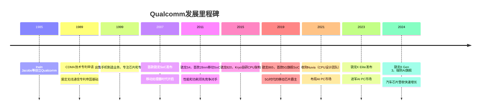
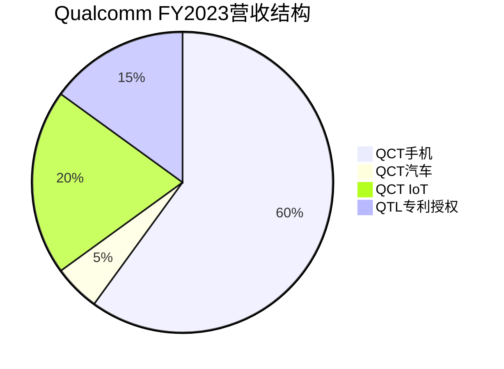

# Qualcomm深度分析：移动芯片霸主的多元化转型

## 公司概况

### 基本信息

Qualcomm Incorporated（纳斯达克：QCOM）成立于1985年，总部位于美国加利福尼亚州圣地亚哥。由Irwin Jacobs等七位工程师创立，现任CEO安蒙（Cristiano Amon）自2021年接任。

Qualcomm是全球最重要的无线通信技术公司，在移动处理器（骁龙SoC）和无线通信专利（CDMA/LTE/5G）领域拥有无可撼动的地位。其独特的双轮驱动商业模式——芯片销售（QCT）+专利授权（QTL）——使Qualcomm在移动互联网时代积累了巨大的竞争优势。

| 基本指标 | 数值（FY2023） |
|---------|-------------|
| 营收 | 357亿美元 |
| 净利润 | 92亿美元 |
| 毛利率 | 55.7% |
| 净利率 | 25.8% |
| 研发支出 | 80亿美元 |
| 员工数量 | 约51,000人 |
| 市值 | ~1800亿美元 |
| 股息收益率 | ~2% |

### 发展历程

## 商业模式分析

### 双轮驱动：QCT + QTL

Qualcomm的商业模式由两个高度互补的业务构成：

**QCT（Qualcomm CDMA Technologies）**：芯片销售业务，FY2023营收约302亿美元，占总营收85%。主要产品：
- 骁龙移动SoC（手机、平板）
- 骁龙汽车芯片（Snapdragon Digital Chassis）
- 骁龙IoT芯片
- 骁龙PC芯片（骁龙X系列）
- 5G基带芯片（X系列调制解调器）

**QTL（Qualcomm Technology Licensing）**：专利授权业务，FY2023营收约52亿美元，占总营收15%，但贡献了约60%的营业利润。QTL向全球手机制造商收取专利授权费，通常为手机售价的2.275%-5%（根据协议不同）。

### 专利授权：高利润率的"印钞机"

QTL业务是Qualcomm最独特的竞争优势之一。Qualcomm在CDMA、LTE、5G等无线通信标准中拥有大量基础专利（SEP，标准必要专利），任何生产手机的公司都必须向Qualcomm支付专利授权费。

QTL业务的特点：
- **毛利率极高**：约75-80%，几乎是纯利润
- **收入稳定**：与全球智能手机出货量挂钩，周期性相对较弱
- **法律风险**：多次面临反垄断诉讼（苹果、欧盟、中国监管机构），但均以和解告终
- **长期可持续性**：5G专利组合比4G更强，未来6G专利布局已开始

### Fabless模式

Qualcomm采用Fabless模式，骁龙芯片主要由台积电代工（旗舰产品使用4nm/3nm制程），部分产品由三星代工。这使Qualcomm能够专注于芯片设计和无线通信技术研发，保持轻资产运营。

## 技术分析：骁龙生态系统

### 骁龙SoC的技术领先性

骁龙是全球最知名的移动处理器品牌，在安卓旗舰手机市场占据约30%的市场份额（联发科约35%，三星Exynos约15%，其他约20%）。骁龙的技术优势体现在：

**CPU性能**：骁龙8 Gen 3采用台积电4nm工艺，集成1个Cortex-X4超大核（3.3GHz）+ 5个Cortex-A720大核 + 2个Cortex-A520小核，多核性能领先竞争对手。

**GPU性能**：Adreno GPU是骁龙的自研图形处理器，在移动GPU性能排行中长期位居前列，支持光线追踪和硬件加速的AI推理。

**5G基带**：骁龙X75调制解调器支持5G Sub-6GHz和毫米波，下行速度最高10 Gbps，是全球性能最强的商用5G基带之一。

**AI性能**：骁龙8 Gen 3集成第七代Hexagon NPU，AI性能约98 TOPS，支持在设备端运行70亿参数的大语言模型（如Llama 2 7B）。

### 骁龙X Elite：AI PC的野心

2023年发布的骁龙X Elite是Qualcomm进军AI PC市场的核心产品，基于收购Nuvia获得的Oryon CPU架构：

**技术规格**：
- CPU：12核Oryon（3.8GHz），多核性能对标Apple M2
- GPU：Adreno（集成显卡），图形性能约4.6 TFLOPS
- NPU：45 TOPS，AI性能领先Intel和AMD同期产品
- 制程：台积电4nm
- 功耗：约23W（TDP），远低于Intel/AMD同性能产品

**竞争优势**：
- 超长续航：轻薄本续航可达20+小时
- 本地AI推理：45 TOPS NPU支持在设备端运行AI模型
- ARM架构生态：Windows on ARM应用兼容性持续改善
- 5G连接：可选集成5G基带，实现"永远在线"

**挑战**：
- x86软件兼容性：部分x86应用需要模拟运行，性能有损失
- 生态建设：Windows on ARM应用数量仍少于x86
- 竞争加剧：Intel Lunar Lake和AMD Ryzen AI也在强化NPU性能

### 汽车芯片：Snapdragon Digital Chassis

Qualcomm的汽车芯片业务是增长最快的新兴市场，FY2023营收约19亿美元，同比增长约35%，订单积压超过450亿美元。

**产品线**：
- **Snapdragon Ride**：自动驾驶平台，支持L2+至L4级自动驾驶
- **Snapdragon Cockpit**：智能座舱平台，支持多屏显示、语音交互、AI助手
- **Snapdragon Auto Connectivity**：车载通信芯片（C-V2X、Wi-Fi、蓝牙）

**主要客户**：宝马、奔驰、通用、本田、沃尔沃、吉利、小鹏、理想等，覆盖全球主要汽车品牌。

**竞争优势**：
- 移动通信技术的深厚积累（5G/C-V2X）
- 骁龙生态的软件开发工具链
- 与Android Automotive的深度集成

## 竞争格局分析

### 移动SoC：与联发科的双寡头竞争

在安卓手机SoC市场，Qualcomm和联发科形成双寡头格局：

| 细分市场 | Qualcomm | 联发科 | 三星Exynos |
|---------|---------|-------|----------|
| 旗舰（>600美元） | ~50% | ~30% | ~15% |
| 中高端（300-600美元） | ~30% | ~50% | ~10% |
| 中低端（<300美元） | ~20% | ~60% | ~5% |

Qualcomm在旗舰市场的优势来自：更强的5G基带性能、更好的AI能力、更完善的生态支持（高通骁龙峰会、开发者工具）。联发科在中低端市场凭借更具竞争力的定价占据主导。

### 苹果自研基带：最大的单一风险

苹果是Qualcomm最大的单一客户，约占QCT营收的20-25%。苹果长期致力于自研基带芯片（Apple Modem），以摆脱对Qualcomm的依赖：

**进展**：苹果于2024年在部分iPhone 16机型上使用自研基带（C1芯片），但初代产品性能仍落后于Qualcomm X75，仅支持Sub-6GHz 5G，不支持毫米波。

**影响时间线**：
- 2024年：部分iPhone 16使用自研基带（低端机型）
- 2025-2026年：逐步扩大自研基带使用范围
- 2027-2028年：可能全面切换至自研基带

**Qualcomm的应对**：通过汽车、AI PC、IoT等新市场的增长来对冲苹果基带收入的逐步减少。Qualcomm预计到2026年，汽车+IoT+PC业务营收将超过手机业务。

### AI PC市场：新的增长引擎

骁龙X Elite的发布标志着Qualcomm正式进入PC市场，与Intel和AMD展开竞争。AI PC市场的竞争格局：

- **Qualcomm骁龙X Elite**：ARM架构，超长续航，45 TOPS NPU，主打轻薄本
- **Intel Meteor Lake/Lunar Lake**：x86架构，AI PC战略，集成NPU
- **AMD Ryzen AI**：x86架构，XDNA NPU，性价比优势
- **Apple M系列**：ARM架构，性能和功耗最优，但仅用于Mac

Qualcomm的差异化优势在于超长续航和5G连接，目标是"永远在线、永远连接"的AI PC体验。微软Surface Pro和多家OEM厂商已推出骁龙X Elite机型。

## 财务分析

### 营收与盈利分析

| 财年 | 总营收（亿美元） | QCT（亿美元） | QTL（亿美元） | 净利率 |
|-----|--------------|------------|------------|-------|
| FY2020 | 235 | 188 | 45 | 17.4% |
| FY2021 | 336 | 277 | 57 | 25.6% |
| FY2022 | 441 | 381 | 57 | 26.0% |
| FY2023 | 357 | 302 | 52 | 25.8% |
| FY2024E | ~380 | ~325 | ~52 | ~26% |

FY2023营收下滑主要受手机市场去库存影响，FY2024随着手机市场复苏和AI PC新品放量，营收预计恢复增长。

### 盈利能力：QTL的高利润贡献

Qualcomm的盈利能力在半导体行业中处于较高水平，主要得益于QTL业务的高利润率：

| 业务 | 营收（FY2023） | 营业利润率 |
|-----|-------------|---------|
| QCT | 302亿美元 | ~25% |
| QTL | 52亿美元 | ~70% |
| 合计 | 357亿美元 | ~32% |

QTL业务以约15%的营收贡献了约30%的营业利润，是Qualcomm盈利能力的重要支柱。

### 股东回报

Qualcomm是半导体行业中股东回报最慷慨的公司之一：
- 股息收益率约2%，连续多年提升股息
- 持续股票回购，FY2023回购约26亿美元
- 自由现金流充裕（FY2023约90亿美元）

## 投资价值评估

### 估值分析

| 估值指标 | Qualcomm | NVIDIA | AMD | 行业平均 |
|---------|---------|-------|-----|---------|
| P/E（FY2024E） | ~18x | ~40x | ~35x | ~25x |
| EV/Sales（FY2024E） | ~5x | ~20x | ~8x | ~7x |
| 股息收益率 | ~2% | ~0.03% | 无 | ~1% |
| PEG比率 | ~1.2x | ~0.8x | ~1.2x | ~1.5x |

Qualcomm的估值相对合理，P/E约18倍低于行业平均，且有约2%的股息收益率，对价值投资者具有吸引力。

### 看多论点

1. **手机市场复苏**：2023年手机市场去库存基本完成，2024年出货量温和复苏，骁龙需求回升
2. **AI手机升级周期**：AI功能（端侧大模型、AI摄影）推动用户换机，骁龙8 Gen 3是AI手机的核心芯片
3. **汽车芯片高速增长**：450亿美元订单积压，汽车业务有望在2026年贡献超过40亿美元营收
4. **AI PC新市场**：骁龙X Elite在轻薄本市场的竞争力，开辟PC市场新增量
5. **估值低估**：相比NVIDIA和AMD，Qualcomm的估值更具吸引力，且有股息保护

### 看空论点

1. **苹果基带替代**：苹果自研基带的逐步推进将侵蚀Qualcomm约20-25%的QCT营收
2. **联发科竞争加剧**：联发科天玑系列持续提升旗舰市场竞争力，压缩Qualcomm的市场份额
3. **手机市场增长有限**：全球智能手机市场已趋于饱和，增长主要来自换机而非新增用户
4. **专利授权法律风险**：QTL业务持续面临反垄断诉讼风险，任何不利判决都可能影响授权费率
5. **AI PC执行风险**：Windows on ARM生态建设需要时间，骁龙X Elite的市场渗透速度存在不确定性

### 投资建议

Qualcomm是半导体行业中估值最合理的优质公司之一，适合作为科技组合的稳健配置。约2%的股息收益率提供了一定的下行保护，汽车和AI PC业务的增长提供了上行期权。

**核心观察指标**：苹果基带替代进度、汽车芯片订单转化率、骁龙X Elite市场渗透速度、QTL专利授权法律进展。

## 常见问题

### Q1：苹果自研基带对Qualcomm的影响有多大？

苹果约占Qualcomm QCT营收的20-25%，约70-90亿美元/年。苹果自研基带的全面替代预计需要3-5年（2024-2028年），影响是渐进式的。Qualcomm正在通过汽车（预计2026年超过40亿美元）、AI PC、IoT等新市场的增长来对冲这一影响。若新市场增长顺利，苹果基带替代的净影响可能相对有限。

### Q2：Qualcomm的专利授权业务能持续多久？

QTL业务的可持续性取决于：5G专利的有效期（通常20年，5G专利将持续至2040年代）、与手机厂商的授权协议续签（通常5-10年一签）、以及反垄断监管风险。5G专利组合比4G更强，且Qualcomm已开始布局6G专利，QTL业务的长期可持续性较强。

### Q3：骁龙X Elite能否在PC市场取得成功？

骁龙X Elite在技术上具有竞争力（超长续航、强大NPU），但面临Windows on ARM生态不完善的挑战。关键观察指标：微软对ARM应用的支持力度、主要软件厂商（Adobe、Autodesk等）的ARM原生版本发布进度、以及OEM厂商的推广力度。预计2024-2025年是关键验证期。

### Q4：Qualcomm在中国市场的风险如何？

中国是Qualcomm最重要的市场之一，约占QCT营收的60%（主要是向中国手机厂商销售骁龙芯片）。中美贸易摩擦是持续性风险，但Qualcomm的芯片（非AI训练芯片）目前不在出口管制范围内。华为的崛起（麒麟芯片）是竞争风险，但其他中国手机厂商（小米、OPPO、vivo）仍大量采用骁龙。

### Q5：Qualcomm的股息是否安全？

Qualcomm的股息支付率约30%，自由现金流充裕（FY2023约90亿美元），股息安全性较高。即使苹果基带替代导致营收下滑，Qualcomm的盈利能力仍足以支撑当前股息水平。股息连续多年提升，是股东回报的重要组成部分。

## 骁龙X Elite深度技术分析

### Oryon CPU架构：从Nuvia收购到性能突破

2021年，Qualcomm以14亿美元收购Nuvia，获得了由前苹果芯片工程师创立的CPU设计团队。Nuvia的核心团队曾参与设计苹果A系列和M系列芯片，拥有世界顶级的ARM CPU设计能力。

**Oryon CPU的技术特点**：
- 架构：基于ARM v9指令集，完全自研微架构（非ARM Cortex公版）
- 核心配置：12核Oryon（骁龙X Elite），全大核设计（无小核）
- 主频：最高3.8GHz
- 缓存：每核心12MB L2缓存，共享36MB L3缓存
- 制程：台积电4nm

**性能对比**：

| 处理器 | 多核性能（Cinebench R23） | 单核性能 | 功耗（TDP） |
|------|---------------------|---------|-----------|
| 骁龙X Elite | ~15,000 | ~2,200 | ~23W |
| Apple M3 | ~15,000 | ~3,000 | ~22W |
| Intel Core Ultra 7 155H | ~14,000 | ~2,100 | ~28W |
| AMD Ryzen 9 7940HS | ~16,000 | ~2,000 | ~35W |

骁龙X Elite的多核性能与Apple M3相当，但单核性能略低。在功耗控制方面，骁龙X Elite与Apple M3相当，显著优于Intel和AMD的x86处理器。

**续航优势量化**：
- 骁龙X Elite笔记本（如微软Surface Pro 11）：视频播放续航约22小时
- Intel Core Ultra笔记本（同等配置）：视频播放续航约12-14小时
- 续航优势约50-80%，这是骁龙X Elite最重要的差异化优势

### Windows on ARM生态现状

骁龙X Elite面临的最大挑战是Windows on ARM的软件生态：

**应用兼容性现状（2024年）**：
- ARM原生应用：约30%的常用应用已有ARM原生版本（包括Chrome、Edge、Office、Adobe Lightroom等）
- x86模拟运行：约65%的x86应用可以通过Prism模拟器运行，性能损失约15-30%
- 不兼容应用：约5%的应用（主要是驱动程序和底层系统工具）无法在ARM上运行

**主要软件厂商的ARM支持进展**：
- 微软：Office、Teams、Edge、Visual Studio Code均已原生支持ARM
- Adobe：Photoshop、Lightroom已原生支持，Premiere Pro和After Effects仍在开发中
- Autodesk：AutoCAD ARM版本已发布
- 游戏：大多数游戏仍需x86模拟，性能损失较大，是骁龙X Elite的主要短板

**生态改善趋势**：
- 微软正在积极推动ARM原生应用开发，提供开发者激励计划
- 苹果M系列的成功证明了ARM架构在PC市场的可行性，激励了更多开发者支持ARM
- 预计2025-2026年，ARM原生应用比例将提升至60-70%，生态问题将基本解决

## 汽车芯片战略深度分析

### 450亿美元订单积压的构成分析

Qualcomm汽车芯片业务的450亿美元订单积压（截至2024年初）是其最重要的增长引擎，值得深入分析：

**订单积压的构成**：
- Snapdragon Cockpit（智能座舱）：约60%，约270亿美元
- Snapdragon Ride（自动驾驶）：约30%，约135亿美元
- 汽车连接（C-V2X、Wi-Fi、蓝牙）：约10%，约45亿美元

**主要客户分布**：
- 欧洲豪华车品牌：宝马、奔驰、大众、沃尔沃（约40%）
- 美国车企：通用、福特（约20%）
- 中国新能源车企：小鹏、理想、吉利（约25%）
- 日韩车企：本田、现代（约15%）

**订单转化时间线**：
- 汽车芯片从签约到量产通常需要3-5年
- 2024年签约的订单将在2027-2029年转化为收入
- 预计汽车业务营收：2024年约19亿美元 → 2026年约40亿美元 → 2028年约80亿美元

### 与竞争对手的对比

| 竞争对手 | 核心产品 | 优势 | 劣势 |
|---------|---------|-----|-----|
| NVIDIA DRIVE | 自动驾驶算力平台 | AI算力最强，软件生态完整 | 功耗高，成本高 |
| Mobileye EyeQ | 自动驾驶视觉芯片 | 感知算法领先，市场份额最大 | 功能相对单一 |
| 德州仪器 | 汽车MCU/SoC | 模拟芯片领先，可靠性高 | AI能力弱 |
| 英飞凌 | 功率半导体/MCU | 功率器件领先 | 计算能力弱 |
| Qualcomm骁龙 | 智能座舱+自动驾驶 | 5G/连接技术领先，生态完整 | 自动驾驶算法积累不足 |

Qualcomm的差异化在于将移动通信技术（5G/C-V2X）与计算能力（Snapdragon SoC）结合，提供"连接+计算"的一体化解决方案，这是其他竞争对手难以复制的。

## 专利授权业务（QTL）深度分析

### 5G专利组合的战略价值

Qualcomm的专利授权业务（QTL）是其最独特的竞争优势，也是最难被复制的护城河。

**专利组合规模**：
- 全球持有超过140,000项专利和专利申请
- 5G标准必要专利（SEP）：约15%的全球5G SEP（根据不同评估机构的数据）
- 4G LTE SEP：约20%的全球4G SEP
- 5G专利组合比4G更强，因为Qualcomm在5G标准制定中投入更多

**授权费率结构**：
- 旗舰手机（售价>400美元）：约5%的手机售价
- 中端手机（售价200-400美元）：约3.25%的手机售价
- 低端手机（售价<200美元）：约2.275%的手机售价
- 年度授权费上限：约400美元/台（旗舰手机）

**QTL的财务特征**：
- 毛利率约75-80%，几乎是纯利润
- 收入与全球智能手机出货量高度相关
- 固定成本极低（主要是法律和专利维护费用）
- 自由现金流转化率接近100%

### 反垄断风险的历史与现状

QTL业务长期面临反垄断诉讼，这是Qualcomm最重要的法律风险：

**主要诉讼历史**：
- 2017年：苹果起诉Qualcomm，指控其专利授权费过高，双方于2019年和解，苹果支付约45亿美元，并签署多年授权协议
- 2019年：美国FTC起诉Qualcomm，指控其"无授权不供货"政策违反反垄断法，联邦法院初审判决Qualcomm败诉，但上诉法院于2020年推翻判决
- 2018年：欧盟对Qualcomm处以9.97亿欧元罚款（独占协议），Qualcomm上诉中
- 2023年：中国监管机构对Qualcomm的授权费率进行审查

**当前风险评估**：
- 主要诉讼已基本解决，短期内重大法律风险相对有限
- 5G时代的专利授权协议正在逐步签署，大多数主要手机厂商已签署授权协议
- 长期风险：随着6G标准制定，各国政府可能对SEP授权费率施加更多监管

## 财务模型与估值框架

### 详细财务预测

| 财年 | 总收入（亿美元） | QCT（亿美元） | QTL（亿美元） | Non-GAAP EPS（美元） |
|-----|--------------|------------|------------|-------------------|
| FY2022 | 441 | 381 | 57 | 12.53 |
| FY2023 | 357 | 302 | 52 | 8.42 |
| FY2024E | 390 | 335 | 52 | 10.00 |
| FY2025E | 450 | 395 | 52 | 12.50 |
| FY2026E | 530 | 475 | 52 | 15.00 |

### 情景分析

**牛市情景（概率25%）**：
- 假设：骁龙X Elite在AI PC市场取得成功（市场份额>15%），汽车芯片超预期增长，苹果基带替代延迟
- FY2026收入：约620亿美元
- FY2026 EPS：约18美元
- 合理P/E：22倍
- 目标股价：约396美元

**基准情景（概率50%）**：
- 假设：AI PC市场份额约10%，汽车芯片按计划增长，苹果基带逐步替代
- FY2026收入：约530亿美元
- FY2026 EPS：约15美元
- 合理P/E：18倍
- 目标股价：约270美元

**熊市情景（概率25%）**：
- 假设：苹果基带替代加速，AI PC市场份额不及预期，手机市场持续疲软
- FY2026收入：约400亿美元
- FY2026 EPS：约10美元
- 合理P/E：14倍
- 目标股价：约140美元

### 股息与股东回报分析

Qualcomm是半导体行业中股东回报最慷慨的公司之一：

**股息历史**：
- 2014年：0.35美元/季度
- 2018年：0.62美元/季度
- 2021年：0.68美元/季度
- 2023年：0.80美元/季度
- 2024年：0.85美元/季度（预计）
- 10年股息年复合增长率约9%

**回购历史**：
- FY2021：回购约47亿美元
- FY2022：回购约47亿美元
- FY2023：回购约26亿美元（因手机市场下行，减少回购）
- FY2024E：回购约30亿美元

**股东回报率**：股息+回购合计，Qualcomm每年向股东返还约50-70亿美元，相当于市值的约3-4%，是半导体行业中最高的股东回报率之一。

## 延伸阅读

### 推荐资料
- Qualcomm官方技术博客（qualcomm.com/news）
- 骁龙峰会（Snapdragon Summit）年度发布会
- 安蒙历年财报电话会议记录

### 研究报告
- 摩根士丹利Qualcomm深度研究
- 高盛移动芯片竞争格局分析
- 花旗集团Qualcomm估值分析

## 参考文献

1. Qualcomm. *FY2023 Annual Report (Form 10-K)*. 2023.
2. Qualcomm. *Q4 FY2023 Earnings Call Transcript*. 2023.
3. IDC. *Worldwide Mobile Phone Tracker Q4 2023*. 2024.
4. Counterpoint Research. *Smartphone AP/SoC Market Share Q4 2023*. 2024.
5. Morgan Stanley. *Qualcomm: Navigating the Apple Transition*. 2024.
6. Goldman Sachs. *Mobile Semiconductor Competitive Dynamics*. 2024.
7. AnandTech. *Snapdragon X Elite Review: ARM Comes to Windows*. 2024.
8. SemiAnalysis. *Qualcomm Automotive: The $45B Opportunity*. 2024.
9. Bernstein Research. *Qualcomm QTL: Patent Licensing Sustainability*. 2024.
10. Strategy Analytics. *Automotive Semiconductor Market Forecast 2024-2030*. 2024.
11. Canalys. *PC Market Analysis Q1 2024: AI PC Momentum*. 2024.
12. The Information. *Qualcomm's Bet on the AI PC*. 2024.
13. IEEE Communications Magazine. *5G Standard Essential Patents Analysis*. 2023.
14. Gartner. *Semiconductor Forecast 2024-2028*. 2024.
15. Amon, Cristiano. *Qualcomm Investor Day 2023 Presentation*. 2023.

---

**投资建议**：
Qualcomm是估值合理、股息稳定的优质半导体公司，适合作为科技组合的稳健配置。汽车芯片（450亿美元订单积压）和AI PC（骁龙X Elite）提供增长期权，约2%股息收益率提供下行保护。苹果基带替代是主要风险，但影响是渐进式的，新市场增长可以对冲。

**风险提示**：
本文所有分析仅供参考，不构成投资建议。Qualcomm面临苹果基带替代、联发科竞争加剧和专利授权法律风险。投资者需充分了解相关风险，结合自身风险承受能力做出投资决策。

---

[← Intel深度分析](intel.html) | [Broadcom深度分析 →](broadcom.html)
