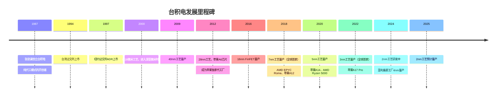

# TSMC深度分析：全球先进制程的唯一守门人

## 公司概况

### 基本信息

台湾积体电路制造股份有限公司（NYSE ADR：TSM，台湾证交所：2330）成立于1987年，总部位于台湾新竹科学园区。由张忠谋（Morris Chang）创立，现任CEO魏哲家（C.C. Wei）自2018年接任。

台积电是全球最重要的半导体公司之一，也是全球唯一能够大规模量产3nm及以下先进制程芯片的公司。NVIDIA、AMD、Apple、Qualcomm等全球顶尖芯片设计公司的产品几乎全部由台积电制造。台积电的技术路线图直接决定了全球半导体产业的发展节奏。

| 基本指标 | 数值（2023年） |
|---------|-------------|
| 营收 | 693亿美元 |
| 净利润 | 268亿美元 |
| 毛利率 | 54.4% |
| 净利率 | 38.7% |
| 资本开支 | 304亿美元 |
| 员工数量 | 约73,000人 |
| 市值 | ~5000亿美元（ADR） |
| 全球晶圆代工市占率 | ~57% |

### 发展历程

## 商业模式分析

### 纯代工模式：张忠谋的革命性创新

台积电的创立本身就是一次商业模式的革命。在1987年之前，半导体公司普遍采用IDM模式（自行设计和制造）。张忠谋创立了"纯代工"（Pure-Play Foundry）模式——台积电只做制造，不设计自有品牌芯片，不与客户竞争。

这一模式的革命性意义在于：
- **解放了芯片设计公司**：设计公司无需投资昂贵的晶圆厂，可以专注于设计创新
- **催生了Fabless生态**：NVIDIA、Qualcomm、AMD等Fabless公司的崛起，直接受益于台积电的代工服务
- **规模效应**：台积电服务众多客户，摊薄了巨额研发和资本开支，实现了规模经济

### 业务结构

台积电的营收按制程节点分布：

| 制程节点 | 2023年营收占比 | 代表客户/产品 |
|---------|-------------|------------|
| 3nm | 6% | 苹果A17 Pro |
| 5nm | 33% | 苹果A16、NVIDIA H100、AMD Ryzen 7000 |
| 7nm | 17% | AMD EPYC、苹果A13 |
| 16nm及以上 | 44% | 各类成熟制程产品 |

先进制程（7nm及以下）合计占营收约56%，是台积电最重要的收入来源，也是利润率最高的业务。

### 客户结构

台积电的客户高度集中于全球顶尖芯片设计公司：

| 客户 | 营收占比（估计） | 主要产品 |
|-----|-------------|---------|
| 苹果 | ~25% | A系列、M系列芯片 |
| NVIDIA | ~10% | H100/H200/B100 GPU |
| AMD | ~8% | EPYC、Ryzen、Instinct |
| Qualcomm | ~6% | 骁龙SoC |
| 联发科 | ~5% | 天玑SoC |
| 其他 | ~46% | 各类芯片 |

苹果是台积电最大的单一客户，约占营收25%，客户集中度较高是台积电的一个风险因素。

## 技术分析：先进制程的绝对领先

### 制程技术的核心竞争力

台积电的技术领先地位建立在三个核心支柱上：

**EUV光刻技术的率先应用**：台积电是全球最早大规模应用EUV（极紫外）光刻技术的公司，从7nm开始引入EUV，在5nm/3nm大规模使用。EUV光刻机由荷兰ASML独家供应，每台售价约1.5-2亿美元，台积电是ASML最大的客户之一。

**FinFET到GAAFET的技术演进**：
- 16nm/10nm：FinFET（鳍式场效应晶体管）
- 7nm/5nm/3nm：改进型FinFET
- 2nm（N2）：GAAFET（全环绕栅极），台积电称为"纳米片"（Nanosheet）技术

**先进封装技术**：台积电的CoWoS（Chip-on-Wafer-on-Substrate）和SoIC（System on Integrated Chips）先进封装技术是AI芯片的关键组件。NVIDIA H100/H200的HBM内存集成就依赖台积电的CoWoS技术。

### 主要制程节点详解

**5nm（N5/N5P）**：2020年量产，是台积电当前最成熟的先进制程之一。苹果A14/A15/A16、NVIDIA H100（SXM版本）、AMD Ryzen 7000均采用5nm工艺。相比7nm，晶体管密度提升约80%，功耗降低约30%。

**3nm（N3/N3E）**：2022年量产，全球首家量产3nm的公司。苹果A17 Pro是首款3nm芯片，NVIDIA B100/B200（Blackwell）也将采用台积电3nm工艺。相比5nm，晶体管密度提升约60%，功耗降低约35%。

**2nm（N2）**：预计2025年量产，采用GAAFET（纳米片）晶体管技术，是台积电下一代旗舰制程。相比3nm，性能提升约10-15%，功耗降低约25-30%。苹果A19（iPhone 17系列）和NVIDIA下一代GPU将是首批2nm产品。

**1.4nm（A14）**：台积电已宣布1.4nm制程的研发计划，预计2027-2028年量产，将继续保持台积电的技术领先地位。

### CoWoS先进封装：AI时代的关键瓶颈

CoWoS（Chip-on-Wafer-on-Substrate）是台积电的先进封装技术，将GPU芯片和HBM内存集成在同一基板上，实现极高的内存带宽。NVIDIA H100/H200的CoWoS封装使HBM3内存带宽达到3.35 TB/s，是传统GDDR6内存的约10倍。

AI芯片需求爆发导致CoWoS产能严重紧张，成为制约NVIDIA H100/H200出货量的关键瓶颈。台积电正在大幅扩张CoWoS产能，预计2024-2025年产能将翻倍，但仍难以完全满足需求。

## 地缘政治风险：台积电的阿喀琉斯之踵

### 台海风险的多维度分析

台积电最大的投资风险是地缘政治——台湾海峡局势的不确定性。台积电在台湾的晶圆厂占其全球产能的约90%，任何台海冲突都将对全球半导体供应链造成灾难性影响。

**风险量化**：
- 台积电在台湾的产能约占全球先进制程（7nm以下）产能的90%以上
- 若台积电停产，全球芯片供应将在数月内出现严重短缺
- 受影响的产品涵盖智能手机、PC、服务器、汽车、国防等几乎所有现代技术产品

**"硅盾"理论**：部分分析人士认为，台积电的不可替代性实际上是台湾的"战略保护"——任何破坏台积电的军事行动都将对全球经济造成巨大损害，包括对中国大陆的经济损害，这在一定程度上抑制了冲突的可能性。

**地缘政治折价**：台积电的P/E通常比同等盈利能力的美国公司低20-30%，这一折价反映了市场对台海风险的定价。

### 产能多元化：降低地缘政治风险

台积电正在积极推进产能多元化，在美国、日本、欧洲建设晶圆厂：

**美国亚利桑那工厂**：
- 第一期（4nm）：2024年量产，投资约120亿美元，获CHIPS Act约66亿美元补贴
- 第二期（3nm/2nm）：预计2026-2028年量产，投资约400亿美元
- 客户：苹果、NVIDIA、AMD、Qualcomm等

**日本熊本工厂（JASM）**：
- 第一期（28nm/22nm）：2024年2月开幕，与索尼、丰田合资
- 第二期（12nm/16nm）：预计2027年量产
- 日本政府补贴约4760亿日元（约32亿美元）

**德国德累斯顿工厂（ESMC）**：
- 制程：12nm/16nm
- 预计2027年量产
- 与英飞凌、博世、NXP合资，欧盟补贴约50亿欧元

**产能多元化的代价**：海外工厂的建设成本约为台湾同等工厂的2-3倍，运营成本也更高。这将对台积电的毛利率产生一定压力，但有助于降低地缘政治风险溢价。

### 出口管制的影响

美国出口管制限制台积电向中国大陆客户提供先进制程（14nm以下）代工服务。这对台积电的影响：
- 中国大陆客户约占台积电营收的10-12%（主要是成熟制程）
- 先进制程的中国客户（如华为海思）已基本失去
- 出口管制使台积电在中国市场的增长受限，但全球其他市场的强劲需求弥补了这一缺口

## 财务分析

### 营收增长分析

| 年份 | 总营收（亿美元） | 先进制程占比 | 同比增长 |
|-----|--------------|-----------|---------|
| 2019 | 357 | ~35% | +3% |
| 2020 | 474 | ~41% | +33% |
| 2021 | 569 | ~49% | +20% |
| 2022 | 759 | ~53% | +33% |
| 2023 | 693 | ~56% | -9% |
| 2024E | ~850 | ~60% | ~23% |

2023年营收下滑主要受消费电子需求疲软影响，2024年随着AI芯片需求爆发和消费电子复苏，营收预计强劲反弹。

### 盈利能力分析

| 指标 | 2021 | 2022 | 2023 |
|-----|------|------|------|
| 毛利率 | 51.6% | 59.6% | 54.4% |
| 营业利润率 | 40.9% | 49.5% | 42.6% |
| 净利率 | 37.9% | 45.5% | 38.7% |
| 资本开支（亿美元） | 300 | 363 | 304 |

台积电的毛利率在2022年达到历史高点（59.6%），2023年因产能利用率下降有所回落。随着AI芯片需求推动先进制程产能利用率回升，毛利率预计在2024-2025年恢复至55-60%水平。

### 资本开支的战略意义

台积电每年约300亿美元的资本开支是维持技术领先的必要投入，也是竞争对手难以追赶的关键壁垒。这一资本开支水平相当于三星半导体的约80%，远超Intel（约250亿美元）。

台积电的资本开支效率极高——相同的资本开支，台积电能够产生比竞争对手更高的营收和利润，反映了其在制程技术和运营效率上的领先优势。

## 竞争格局分析

### 晶圆代工市场：台积电的绝对主导

| 公司 | 全球市占率 | 先进制程（7nm以下）市占率 |
|-----|---------|---------------------|
| 台积电 | ~57% | ~90% |
| 三星代工 | ~13% | ~8% |
| 格芯 | ~7% | 0%（退出先进制程） |
| 联华电子 | ~6% | 0%（退出先进制程） |
| 中芯国际 | ~5% | ~2%（7nm受限） |
| Intel代工 | ~1% | ~0%（尚未获主要客户） |

在先进制程（7nm以下）领域，台积电的市占率超过90%，是名副其实的垄断者。三星代工是唯一的竞争对手，但在良率和客户信任度方面与台积电存在明显差距。

### 三星代工的挑战

三星代工（Samsung Foundry）是台积电最主要的竞争对手，但面临多重挑战：
- **良率问题**：三星4nm工艺的良率低于台积电，导致高通骁龙8 Gen 1（三星4nm）出现严重发热问题，高通随后将骁龙8 Gen 2转回台积电代工
- **客户信任**：三星既是代工厂又是芯片设计公司（Exynos），客户担心技术泄露
- **技术差距**：三星3nm（GAA）工艺虽然率先量产，但良率和性能仍落后于台积电3nm

### Intel代工的长期威胁

Intel Foundry Services（IFS）是台积电的潜在长期竞争对手，但目前尚未对台积电构成实质威胁。若Intel 18A制程成功，IFS可能在2026-2027年开始获得部分客户，但要真正挑战台积电的主导地位，需要至少5-10年的时间。

## 投资价值评估

### 估值分析

| 估值指标 | 台积电 | NVIDIA | 三星电子 | 行业平均 |
|---------|-------|-------|---------|---------|
| P/E（2024E） | ~22x | ~40x | ~15x | ~25x |
| EV/Sales（2024E） | ~8x | ~20x | ~2x | ~7x |
| P/B | ~6x | ~40x | ~1.5x | ~4x |
| 股息收益率 | ~1.5% | ~0.03% | ~2% | ~1% |

台积电的估值相对合理，考虑到其在先进制程的垄断地位和AI芯片需求的强劲增长，当前估值具有吸引力。地缘政治折价（约20-30%）是主要的估值压制因素。

### 看多论点

1. **AI芯片需求爆发**：NVIDIA H100/H200/B100、AMD MI300X等AI芯片全部由台积电代工，AI算力军备竞赛直接推动台积电先进制程需求
2. **先进制程的不可替代性**：5nm/3nm/2nm制程的唯一大规模量产者，客户无法替代
3. **CoWoS产能扩张**：先进封装产能扩张将进一步受益于AI芯片需求
4. **估值折价提供安全边际**：地缘政治折价使台积电估值低于应有水平，提供了一定的安全边际
5. **产能多元化降低风险**：美国、日本、欧洲工厂的建设逐步降低地缘政治风险溢价

### 看空论点

1. **台海地缘政治风险**：这是台积电最大的不可量化风险，任何局势升级都将对股价造成重大冲击
2. **资本开支压力**：海外工厂建设成本高，可能压制毛利率和自由现金流
3. **客户集中度**：苹果约占营收25%，苹果自研芯片的持续深化可能影响台积电的定价权
4. **竞争加剧**：三星代工和Intel代工的持续投入，长期可能侵蚀台积电的市场份额
5. **周期性风险**：消费电子需求的周期性波动影响成熟制程产能利用率

### 投资建议

台积电是全球半导体产业最重要的基础设施公司，其在先进制程的垄断地位使其成为AI时代不可或缺的投资标的。对于能够承受地缘政治风险的投资者，台积电ADR（TSM）是优质的长期持有标的。

**投资方式**：
- 直接购买台积电ADR（TSM）：最直接的方式，但需承受地缘政治风险
- 通过SOXX/SMH等半导体ETF间接持有：分散化，降低单一公司风险
- 台积电台湾股票（2330.TW）：适合能够在台湾证交所交易的投资者

## 常见问题

### Q1：台积电真的"不可替代"吗？

短期内（5年内）台积电在先进制程领域确实难以替代。三星代工在良率和客户信任度方面与台积电存在明显差距，Intel代工尚处于重建阶段。但长期来看（10年以上），随着美国、日本、欧洲的产能建设，以及三星和Intel的持续投入，台积电的垄断地位会有所松动，但仍将是先进制程的核心。

### Q2：台海冲突的概率如何评估？

这是最难量化的风险。大多数地缘政治分析师认为，未来5年内台海发生大规模军事冲突的概率约为5-15%，但这一估计存在极大不确定性。投资者需要根据自身的风险承受能力决定是否持有台积电，以及持仓比例。

### Q3：台积电的毛利率能否维持在50%以上？

台积电的长期毛利率目标是53%以上。AI芯片需求推动先进制程产能利用率提升，有助于维持高毛利率。但海外工厂（美国、日本、欧洲）的高成本将对毛利率产生一定压力。综合来看，台积电的毛利率预计在2024-2026年维持在53-58%区间。

### Q4：苹果是否会减少对台积电的依赖？

苹果是台积电最大的客户，但苹果不可能自建晶圆厂（成本过高，技术门槛极高）。苹果可能的策略是：在部分产品上使用三星代工（分散供应链风险），但核心产品（A系列、M系列）仍将继续使用台积电最先进制程。苹果对台积电的依赖是长期性的。

### Q5：台积电的美国工厂能否成功？

台积电亚利桑那工厂面临的挑战：建设成本约为台湾的2-3倍、熟练工人短缺、供应链生态不完善。台积电已将第一期（4nm）量产时间推迟至2024年，第二期（3nm/2nm）推迟至2026-2028年。美国工厂的成功对于台积电降低地缘政治风险溢价至关重要，但短期内对盈利能力有一定压力。

### Q6：如何看待台积电的股息政策？

台积电每年支付约1.5%的股息收益率，股息政策相对稳定。台积电的资本开支需求巨大，限制了股息提升的空间。但随着先进制程产能利用率提升和自由现金流改善，股息有望逐步提升。

## 先进制程技术路线图深度解析

### 从3nm到1.4nm：台积电的技术路线图

台积电的技术路线图是全球半导体产业发展的风向标，每一代新制程的量产都标志着整个行业的技术进步。

**N3（3nm）系列详解**：
- N3（2022年量产）：首款3nm工艺，苹果A17 Pro是首批产品，晶体管密度约167 MTr/mm²
- N3E（2023年量产）：改进版3nm，良率更高，功耗更低，NVIDIA B100/B200采用
- N3P（2024年量产）：进一步优化的3nm，性能提升约5%，功耗降低约5%
- N3X（2024年量产）：高性能版3nm，支持更高主频，适合CPU/GPU等高性能芯片

**N2（2nm）系列详解**：
- N2（2025年量产）：台积电首款GAAFET（纳米片）工艺，相比N3性能提升约10-15%，功耗降低约25-30%
- N2P（2026年量产）：改进版2nm，性能进一步提升
- N2X（2026年量产）：高性能版2nm，支持超高主频

**A14（1.4nm）**：
- 预计2027-2028年量产
- 采用第二代GAAFET技术，进一步提升晶体管密度
- 将继续保持台积电相对三星和Intel的技术领先

**技术路线图的战略意义**：台积电的技术路线图清晰且执行力强，这是其最重要的竞争优势之一。相比之下，Intel的制程路线图多次延迟，三星的良率问题持续困扰，台积电的执行可靠性是客户选择台积电的核心原因。

### CoWoS先进封装：AI时代的关键瓶颈

CoWoS（Chip-on-Wafer-on-Substrate）是台积电的旗舰先进封装技术，将GPU芯片和HBM内存集成在同一基板上，实现极高的内存带宽。

**CoWoS技术演进**：
- CoWoS-S（2012年）：首代CoWoS，用于Xilinx FPGA
- CoWoS-R（2019年）：引入RDL（再分布层），支持更大的封装尺寸
- CoWoS-L（2022年）：引入本地硅互联（LSI），支持更多HBM堆叠
- CoWoS-L（2024年升级版）：支持8个HBM3e堆叠，用于NVIDIA B200

**CoWoS的技术价值**：
- 内存带宽：通过将HBM内存与GPU集成在同一基板，实现3-8 TB/s的内存带宽（相比GDDR6的约1 TB/s，提升3-8倍）
- 延迟：HBM与GPU之间的距离极短，内存访问延迟大幅降低
- 功耗：相比GDDR6，HBM的每比特功耗更低，整体系统功耗更优

**CoWoS产能紧张的影响**：
- 2023-2024年，CoWoS产能严重不足，成为制约NVIDIA H100/H200出货量的关键瓶颈
- 台积电2023年CoWoS月产能约5,000-6,000片晶圆，2024年扩张至约10,000片
- 2025年目标：约20,000片/月，但仍可能无法完全满足需求
- 产能紧张使台积电在CoWoS定价上拥有极强的议价能力

**SoIC（System on Integrated Chips）**：
- 台积电的3D堆叠封装技术，将多个芯片垂直堆叠
- 相比CoWoS，SoIC实现更高的集成密度和更短的互联距离
- 主要应用：苹果M系列芯片（将CPU和内存3D堆叠）、未来的AI芯片

## 地缘政治风险的多维度分析

### 台海风险的量化框架

台积电的地缘政治风险是其估值最重要的折价因素，但这一风险极难量化。以下提供一个多维度的分析框架：

**风险概率评估**：
- 未来5年内台海发生大规模军事冲突：约5-15%（主流地缘政治分析师估计）
- 未来10年内：约10-25%
- 未来20年内：约20-40%

**冲突情景下的影响**：
- 最坏情景（台积电完全停产）：全球芯片供应在3-6个月内出现严重短缺，影响所有现代技术产品
- 中等情景（台积电部分停产）：先进制程芯片供应减少50-70%，持续1-2年
- 最好情景（台积电维持运营）：短期供应链中断，但快速恢复

**"硅盾"理论的局限性**：
- 支持"硅盾"的论点：台积电的不可替代性使任何破坏台积电的行动都将对全球经济造成巨大损害，包括对中国大陆的经济损害
- 反对"硅盾"的论点：地缘政治决策不完全基于经济理性，历史上有许多经济代价极高的军事冲突案例

**地缘政治折价的合理性**：
- 台积电的P/E通常比同等盈利能力的美国公司低20-30%
- 这一折价是否合理？若台海冲突概率为10%，且冲突导致台积电价值归零，则合理折价约为10%
- 当前约20-30%的折价意味着市场隐含的冲突概率约为20-30%，可能略有高估

### 产能多元化的进展与挑战

**美国亚利桑那工厂（TSMC Arizona）**：
- 第一期（4nm）：2024年量产，投资约120亿美元，获CHIPS Act约66亿美元补贴
- 第二期（3nm/2nm）：预计2026-2028年量产，投资约400亿美元，获额外补贴
- 挑战：建设成本约为台湾的2-3倍，熟练工人短缺，供应链生态不完善
- 进展：第一期已于2024年开始量产，苹果A16/A17芯片部分在亚利桑那生产

**日本熊本工厂（JASM）**：
- 第一期（28nm/22nm）：2024年2月开幕，与索尼、丰田合资，日本政府补贴约32亿美元
- 第二期（12nm/16nm）：预计2027年量产，日本政府追加补贴
- 战略意义：服务日本汽车和工业客户，降低对台湾的依赖

**德国德累斯顿工厂（ESMC）**：
- 制程：12nm/16nm
- 预计2027年量产
- 与英飞凌、博世、NXP合资，欧盟补贴约50亿欧元
- 战略意义：服务欧洲汽车和工业客户

**产能多元化的财务影响**：
- 海外工厂的建设成本约为台湾的2-3倍，运营成本也更高
- 预计海外工厂将使台积电整体毛利率降低约2-3个百分点（从约55%降至约52-53%）
- 但产能多元化有助于降低地缘政治风险溢价，可能使台积电的估值倍数提升5-10%

## 客户关系深度分析

### 苹果：最重要的战略客户

苹果约占台积电营收的25%，是台积电最重要的单一客户，两者之间的关系是半导体行业最重要的战略合作之一。

**合作历史**：
- 2012年：苹果A6芯片（28nm），台积电首次为苹果代工
- 2014年：苹果A8芯片（20nm），台积电独家代工
- 2016年：苹果A10芯片（16nm），台积电独家代工
- 2020年：苹果A14芯片（5nm），全球首款5nm芯片
- 2022年：苹果A16芯片（4nm），苹果M2芯片（5nm）
- 2023年：苹果A17 Pro芯片（3nm），全球首款3nm芯片
- 2025年：苹果A19芯片（2nm），预计全球首批2nm产品

**苹果对台积电的战略价值**：
- 苹果是台积电最先进制程的首批客户，帮助台积电验证新制程的商业可行性
- 苹果的大规模采购（每年数亿颗芯片）帮助台积电快速提升新制程的良率
- 苹果的高要求推动台积电持续提升技术水平

**苹果对台积电的依赖**：
- 苹果无法自建晶圆厂（成本过高，技术门槛极高）
- 苹果的A系列和M系列芯片是其最重要的竞争优势，必须使用最先进制程
- 台积电是唯一能够大规模量产最先进制程的公司

### NVIDIA：AI时代的新核心客户

随着AI需求爆发，NVIDIA已成为台积电最重要的增量客户之一：

**NVIDIA对台积电的采购规模**：
- 2022年：约50亿美元（主要是A100 GPU）
- 2023年：约100亿美元（H100 GPU爆发）
- 2024年：约200亿美元（H100/H200 + Blackwell B100/B200）
- 2025年预计：约300亿美元（Blackwell全面量产）

**CoWoS产能的战略意义**：
- NVIDIA H100/H200/B100/B200均需要台积电的CoWoS先进封装
- CoWoS产能是制约NVIDIA出货量的关键瓶颈
- 台积电正在大幅扩张CoWoS产能，主要受益者是NVIDIA

## 财务模型与估值框架

### 详细财务预测

| 年份 | 总收入（亿美元） | 先进制程占比 | 毛利率 | 净利率 | EPS（美元，ADR） |
|-----|--------------|-----------|-------|-------|----------------|
| 2022 | 759 | 53% | 59.6% | 45.5% | 6.50 |
| 2023 | 693 | 56% | 54.4% | 38.7% | 5.18 |
| 2024E | 850 | 60% | 55.0% | 40.0% | 6.50 |
| 2025E | 1050 | 65% | 56.0% | 41.0% | 8.20 |
| 2026E | 1250 | 68% | 55.0% | 40.0% | 9.50 |

### 情景分析

**牛市情景（概率30%）**：
- 假设：AI芯片需求持续超预期，CoWoS产能扩张顺利，2nm工艺良率快速提升
- 2026年收入：约1400亿美元
- 2026年EPS：约11美元
- 合理P/E：25倍（地缘政治折价缩小）
- 目标股价（ADR）：约275美元

**基准情景（概率50%）**：
- 假设：AI芯片需求稳健增长，产能多元化按计划推进，地缘政治折价维持
- 2026年收入：约1250亿美元
- 2026年EPS：约9.5美元
- 合理P/E：22倍
- 目标股价（ADR）：约209美元

**熊市情景（概率20%）**：
- 假设：台海局势升级，AI资本开支放缓，海外工厂成本超预期
- 2026年收入：约900亿美元
- 2026年EPS：约6美元
- 合理P/E：15倍（地缘政治折价扩大）
- 目标股价（ADR）：约90美元

### 台积电的竞争护城河量化

| 护城河维度 | 强度（1-10） | 持续时间 | 主要威胁 |
|---------|-----------|---------|---------|
| 先进制程技术领先 | 9 | 5-10年 | 三星、Intel追赶 |
| 客户关系（苹果、NVIDIA等） | 10 | 长期 | 客户自建晶圆厂（极低概率） |
| 规模经济 | 9 | 长期 | 竞争对手扩大规模 |
| 工程师人才积累 | 8 | 长期 | 人才流失（地缘政治） |
| CoWoS先进封装 | 9 | 3-5年 | 三星、Intel追赶 |
| 执行可靠性（良率、交付） | 10 | 长期 | 内部管理问题 |

## 延伸阅读

### 推荐书籍
- 《台积电为什么神》（林宏文）- 台积电商业模式深度解析
- 《芯片战争》（Chris Miller）- 半导体产业地缘政治权威著作
- 《张忠谋自传》- 台积电创始人的创业历程

### 研究报告
- 摩根士丹利台积电深度研究
- 高盛AI芯片供应链分析
- TrendForce晶圆代工市场报告

### 行业资讯
- 台积电官方技术论坛（IEDM、VLSI等）
- 集微网台积电专题报道
- Semiconductor Engineering台积电技术分析

## 参考文献

1. TSMC. *2023 Annual Report*. 2024.
2. TSMC. *Q4 2023 Earnings Call Transcript*. 2024.
3. TrendForce. *Global Foundry Market Share Q4 2023*. 2024.
4. IC Insights. *The McClean Report 2024: Foundry Market Analysis*. 2024.
5. Morgan Stanley. *TSMC: The AI Foundry*. 2024.
6. Goldman Sachs. *TSMC: Geopolitical Risk vs AI Opportunity*. 2024.
7. ASML. *2023 Annual Report: EUV Customer Analysis*. 2024.
8. Miller, Chris. *Chip War: The Fight for the World's Most Critical Technology*. Scribner, 2022.
9. Lin, Hung-wen. *Why TSMC Is Invincible*. CommonWealth Magazine, 2022.
10. U.S. Department of Commerce. *CHIPS Act: TSMC Arizona Award*. 2024.
11. SEMI. *World Fab Watch - Advanced Packaging Market Report*. 2024.
12. IEEE Electron Devices. *TSMC N2 Process Technology*. 2024.
13. SemiAnalysis. *TSMC CoWoS Capacity Analysis*. 2024.
14. Bernstein Research. *TSMC: The Indispensable Foundry*. 2024.
15. Wei, C.C. *TSMC Technology Symposium 2024 Keynote*. 2024.

---

**投资建议**：
台积电是AI时代最重要的半导体基础设施公司，先进制程的垄断地位和AI芯片需求爆发构成强大的增长逻辑。地缘政治折价提供了一定的安全边际。建议作为科技组合的核心持仓，通过ADR（TSM）参与。关注台海局势、CoWoS产能扩张进度和美国工厂建设进展。

**风险提示**：
本文所有分析仅供参考，不构成投资建议。台积电面临台海地缘政治风险、海外工厂高成本压力和客户集中度风险。投资者需充分了解相关风险，结合自身风险承受能力做出投资决策。

---

[← Broadcom深度分析](broadcom.html) | [返回半导体行业](index.html)
