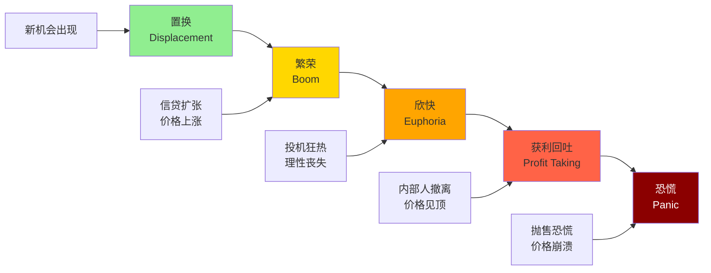
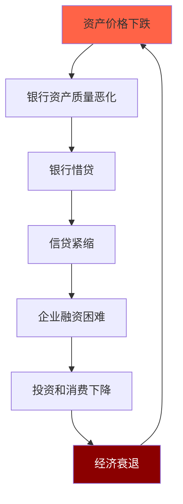

# 金融危机模式：历史的重复与变奏

## 概述

"历史不会重复，但会押韵。" 金融危机虽然每次的具体形式不同，但背后的驱动机制和演变模式却惊人相似。理解危机的共同模式，有助于识别风险、规避损失、把握机会。

**学习目标**：
1. 理解金融危机的共同特征和形成机制
2. 掌握泡沫形成和破裂的规律
3. 分析危机传导的路径和机制
4. 通过历史对比理解危机本质
5. 学会识别危机预警信号

## 金融危机的共同特征

### Kindleberger-Minsky模型

**五阶段模型**：



### 1. 置换阶段（Displacement）

**触发因素**：
- 技术创新（互联网、区块链）
- 政策变化（金融自由化、货币宽松）
- 新市场开放（新兴市场、新资产类别）
- 地缘政治变化

**特征**：
- 新机会出现
- 预期改变
- 资金开始流入
- 早期投资者获利

### 2. 繁荣阶段（Boom）

**驱动力**：
- 信贷快速扩张
- 资产价格上涨
- 正反馈循环
- 媒体推波助澜

**特征**：
- 经济增长加速
- 企业盈利改善
- 就业增加
- 消费者信心高涨

**正反馈机制**：
```
价格上涨 → 抵押品价值上升 → 信贷扩张 
→ 购买力增加 → 价格进一步上涨
```

### 3. 欣快阶段（Euphoria）

**心理特征**：
- "这次不一样"
- 理性丧失
- 全民参与
- 杠杆极限

**行为特征**：
- 投机盛行
- 新手入场
- 杠杆交易
- 金融创新加速

**警示信号**：
- 估值极端
- 信贷标准放松
- 新金融产品涌现
- 媒体狂热报道

### 4. 获利回吐阶段（Profit Taking）

**内部人行为**：
- 聪明钱撤离
- 大股东减持
- 机构降低仓位
- IPO加速

**市场特征**：
- 价格波动加大
- 成交量萎缩
- 利好不涨
- 流动性问题初现

### 5. 恐慌阶段（Panic）

**触发因素**：
- 政策收紧
- 负面事件
- 大型机构倒闭
- 流动性枯竭

**恐慌特征**：
- 价格暴跌
- 流动性危机
- 信用冻结
- 恶性循环

**负反馈机制**：
```
价格下跌 → 抵押品价值下降 → 追加保证金 
→ 被迫卖出 → 价格进一步下跌
```

## 泡沫的形成与破裂

### 泡沫的定义

**经济学定义**：
资产价格持续偏离基本面价值，且偏离程度不断扩大的现象。

**数学表达**：
```
泡沫 = 市场价格 - 基本面价值
```

### 泡沫形成的必要条件

1. **信贷扩张**：
   - 货币宽松
   - 金融创新
   - 杠杆可得

2. **新故事**：
   - 新技术
   - 新模式
   - 新市场

3. **正反馈**：
   - 价格上涨自我强化
   - 羊群效应
   - 动量交易

4. **监管缺失**：
   - 监管滞后
   - 监管套利
   - 影子银行

### 历史泡沫对比

**郁金香泡沫（1637）**：
- 荷兰黄金时代
- 郁金香价格暴涨
- 期货交易盛行
- 崩盘：价格跌99%

**南海泡沫（1720）**：
- 英国南海公司
- 股价涨10倍
- 全民炒股
- 崩盘：牛顿亏损

**1929年大崩盘**：
- 咆哮的二十年代
- 道指涨5倍
- 保证金交易10%
- 崩盘：跌89%

**日本泡沫（1989）**：
- 股市涨5倍
- 房价涨6倍
- "东京地价买下美国"
- 崩盘：失落三十年

**互联网泡沫（2000）**：
- 纳斯达克涨5倍
- 市梦率估值
- "眼球经济"
- 崩盘：跌78%

**次贷危机（2008）**：
- 房价涨2倍
- 次级贷款泛滥
- 金融创新（CDO）
- 崩盘：全球金融危机

**共同特征**：
- 新故事/新技术
- 信贷扩张
- 估值极端
- 全民参与
- 监管滞后

## 危机传导机制

### 国内传导

**金融系统传导**：


**实体经济传导**：
- 财富效应：资产价格下跌 → 消费下降
- 资产负债表效应：净资产缩水 → 投资下降
- 不确定性效应：预期恶化 → 延迟决策

### 国际传导

**贸易渠道**：
- 需求下降 → 出口减少
- 保护主义 → 贸易萎缩

**金融渠道**：
- 资本外逃
- 信贷紧缩
- 汇率贬值
- 外汇储备下降

**信心渠道**：
- 风险偏好下降
- 避险情绪上升
- 羊群效应
- 自我实现预期

### 传染效应

**区域传染**：
- 1997年亚洲金融危机
- 2010年欧债危机

**全球传染**：
- 2008年全球金融危机
- 2020年COVID-19危机

**传染机制**：
- 贸易联系
- 金融联系
- 信心联系
- 政策联系

## 危机预警指标

### 金融指标

**信贷指标**：
- 信贷/GDP缺口（BIS指标）
- 信贷增速 vs GDP增速
- 私人部门杠杆率
- 债务偿还负担

**资产价格指标**：
- 股市估值（CAPE, P/B）
- 房价/收入比
- 房价/租金比
- 资产价格/GDP

**流动性指标**：
- TED利差
- LIBOR-OIS利差
- 信用利差
- VIX指数

### 实体经济指标

**失衡指标**：
- 经常账户逆差/GDP
- 财政赤字/GDP
- 外债/外汇储备
- 短期外债/外汇储备

**过热指标**：
- 产能利用率
- 失业率
- 通胀率
- 工资增速

### 行为指标

**投机指标**：
- 新增开户数
- 杠杆交易量
- IPO数量和估值
- 散户参与度

**情绪指标**：
- 媒体情绪
- 搜索热度
- 社交媒体讨论
- 投资者调查

## 投资启示

### 危机前

**识别泡沫**：
- 监控预警指标
- 评估估值水平
- 观察市场行为
- 关注政策动向

**降低风险**：
- 逐步减仓
- 降低杠杆
- 增加现金
- 分散投资

### 危机中

**保持冷静**：
- 避免恐慌性抛售
- 保持流动性
- 等待机会
- 关注政策

**选择性投资**：
- 优质资产被错杀
- 关注基本面
- 分批建仓
- 长期视角

### 危机后

**把握机会**：
- 资产价格低估
- 政策支持
- 经济复苏
- 新周期开始

**吸取教训**：
- 总结经验
- 完善策略
- 提高认知
- 准备下一次

## 延伸阅读

1. Kindleberger, C. P., & Aliber, R. Z. (2011). *Manias, Panics, and Crashes: A History of Financial Crises*. Palgrave Macmillan.
2. Reinhart, C. M., & Rogoff, K. S. (2009). *This Time Is Different: Eight Centuries of Financial Folly*. Princeton University Press.
3. Minsky, H. P. (2008). *Stabilizing an Unstable Economy*. McGraw-Hill Education.
4. Shiller, R. J. (2015). *Irrational Exuberance* (3rd ed.). Princeton University Press.
5. Galbraith, J. K. (2009). *The Great Crash 1929*. Mariner Books.

## 参考文献

1. Kindleberger, C. P., & Aliber, R. Z. (2011). *Manias, Panics, and Crashes: A History of Financial Crises* (6th ed.). Palgrave Macmillan.
2. Reinhart, C. M., & Rogoff, K. S. (2009). *This Time Is Different: Eight Centuries of Financial Folly*. Princeton University Press.
3. Minsky, H. P. (2008). *Stabilizing an Unstable Economy*. McGraw-Hill Education.
4. Shiller, R. J. (2015). *Irrational Exuberance* (3rd ed.). Princeton University Press.
5. Galbraith, J. K. (2009). *The Great Crash 1929*. Mariner Books.
6. Bernanke, B. S. (2015). *The Courage to Act: A Memoir of a Crisis and Its Aftermath*. W. W. Norton & Company.
7. Gorton, G. B. (2012). *Misunderstanding Financial Crises: Why We Don't See Them Coming*. Oxford University Press.
8. Brunnermeier, M. K., & Oehmke, M. (2013). "Bubbles, Financial Crises, and Systemic Risk." In *Handbook of the Economics of Finance* (Vol. 2, pp. 1221-1288). Elsevier.
9. Borio, C., & Lowe, P. (2002). "Asset Prices, Financial and Monetary Stability: Exploring the Nexus." BIS Working Papers No. 114.
10. Schularick, M., & Taylor, A. M. (2012). "Credit Booms Gone Bust: Monetary Policy, Leverage Cycles, and Financial Crises, 1870-2008." *American Economic Review*, 102(2), 1029-1061.

---

**下一步学习**：
- [债务周期理论](debt-cycles.html)
- [经济机器运作原理](economic-machine.html)
- [宏观指标体系](macro-indicators.html)


## 深度分析

### 核心机制解析

理解本主题需要从多个维度进行系统性分析。以下从理论基础、实践应用和历史验证三个层面展开深度探讨。

**理论基础层面**：本主题的核心逻辑建立在经济学和金融学的基本原理之上。通过对基础理论的深入理解，投资者能够建立起稳固的分析框架，避免被市场短期噪音所干扰。

**实践应用层面**：理论必须与实践相结合才能产生价值。在实际投资决策中，需要将抽象的概念转化为具体的分析工具和决策标准。

**历史验证层面**：金融市场有着丰富的历史记录，通过研究历史案例，我们可以验证理论的有效性，并从中提炼出具有普遍意义的规律。

### 关键影响因素

影响本主题的关键因素可以从以下几个维度进行分析：

1. **宏观经济环境**：利率水平、通货膨胀率、经济增长速度等宏观变量对本主题有着深远影响。在不同的宏观经济周期中，相关指标的表现会呈现出显著差异。

2. **市场结构因素**：市场参与者的构成、信息传播机制、流动性状况等市场结构因素决定了价格发现的效率和准确性。

3. **政策监管环境**：政府政策、监管框架的变化会直接影响相关市场的运作规则和参与者行为。

4. **技术创新驱动**：技术进步不断改变着金融市场的运作方式，从算法交易到区块链技术，每一次技术革新都带来新的机遇和挑战。

5. **全球化与地缘政治**：在全球化背景下，各国市场之间的联动性日益增强，地缘政治风险的影响也越来越不可忽视。

### 量化分析框架

为了更精确地分析和评估，可以采用以下量化框架：

| 分析维度 | 关键指标 | 参考基准 | 分析方法 |
|---------|---------|---------|---------|
| 规模评估 | 绝对值与相对值 | 历史均值 | 趋势分析 |
| 质量评估 | 稳定性指标 | 行业对标 | 横向比较 |
| 风险评估 | 波动率指标 | 风险阈值 | 情景分析 |
| 价值评估 | 估值倍数 | 历史区间 | 回归分析 |

通过系统性地应用上述框架，投资者可以对目标进行全面、客观的评估，从而做出更加理性的投资决策。


## 高级分析与前沿研究

### 学术研究进展

近年来，学术界对本领域的研究取得了重要进展。以下是几个值得关注的研究方向：

**行为金融学视角**：传统金融理论假设市场参与者是完全理性的，但行为金融学的研究表明，认知偏差和情绪因素在投资决策中扮演着重要角色。诺贝尔经济学奖得主丹尼尔·卡尼曼（Daniel Kahneman）和理查德·塞勒（Richard Thaler）的研究为我们理解市场非理性行为提供了重要框架。

**因子投资研究**：尤金·法玛（Eugene Fama）和肯尼斯·弗伦奇（Kenneth French）的三因子模型，以及后续发展的五因子模型，为系统性地解释股票收益差异提供了理论基础。这些研究表明，市值、账面市值比、盈利能力和投资模式等因子能够解释大部分股票收益的横截面差异。

**市场微观结构研究**：对市场流动性、价格发现机制和交易成本的深入研究，帮助我们更好地理解市场的运作机制，并为优化交易策略提供指导。

### 实战案例深度解析

**案例一：长期价值创造的典范**

以沃伦·巴菲特（Warren Buffett）的伯克希尔·哈撒韦（Berkshire Hathaway）为例，其长达数十年的卓越投资业绩证明了价值投资理念的有效性。从1965年至今，伯克希尔的账面价值年均增长率约为19.8%，远超同期标普500指数的约10.2%年均回报。

巴菲特的成功秘诀在于：
- 专注于具有持久竞争优势的优质企业
- 以合理价格买入，而非追求最低价格
- 长期持有，让复利效应充分发挥
- 保持充足的安全边际，控制下行风险

**案例二：危机中的机遇识别**

2008年金融危机期间，大多数投资者恐慌性抛售，但少数具有前瞻性的投资者却在危机中发现了历史性的投资机会。约翰·保尔森（John Paulson）通过做空次级抵押贷款相关证券，在危机中获得了约150亿美元的利润，成为金融史上最成功的单笔交易之一。

这个案例告诉我们：
- 深入的基本面研究能够发现市场定价错误
- 逆向思维往往能够发现被市场忽视的机会
- 风险管理和仓位控制是成功的关键

### 跨市场比较分析

不同市场在结构、监管、投资者构成等方面存在显著差异，这些差异对投资策略的选择有重要影响：

**美国市场特征**：
- 机构投资者主导，市场效率较高
- 信息披露制度完善，分析师覆盖广泛
- 衍生品市场发达，对冲工具丰富
- 长期牛市历史，但也经历过多次重大调整

**中国市场特征**：
- 散户投资者比例较高，市场波动性较大
- 政策因素影响显著，需要密切关注监管动向
- 新兴行业发展迅速，成长投资机会丰富
- A股、港股、美股中概股形成多层次市场体系

**欧洲市场特征**：
- 价值股比例较高，估值相对保守
- 受地缘政治和欧元区政策影响较大
- 部分行业（如奢侈品、工业）具有全球竞争优势
- ESG投资理念推广较为领先


## 实用工具与操作指南

### 分析工具推荐

**数据获取工具**：
- **Bloomberg Terminal**：专业级金融数据平台，提供实时行情、历史数据、新闻资讯等全方位服务，是机构投资者的首选工具
- **Wind资讯（万得）**：中国最权威的金融数据平台，覆盖A股、债券、基金等全市场数据
- **FactSet**：提供全球股票、固定收益、另类投资等多资产类别的综合数据服务
- **免费替代方案**：Yahoo Finance、Google Finance、东方财富、同花顺等提供基础数据服务

**分析软件工具**：
- **Excel/Python**：用于财务模型构建、数据分析和可视化
- **Tableau/Power BI**：用于数据可视化和仪表板创建
- **R语言**：适合统计分析和量化研究

### 实操步骤指南

**第一步：信息收集**
1. 获取目标公司/资产的基本信息和历史数据
2. 收集行业报告和竞争对手数据
3. 整理宏观经济背景信息
4. 查阅相关学术研究和专业分析报告

**第二步：定量分析**
1. 建立财务模型，计算关键指标
2. 进行历史趋势分析
3. 与同行业公司进行横向比较
4. 构建估值模型，计算合理价值区间

**第三步：定性分析**
1. 评估竞争优势和护城河
2. 分析管理层质量和公司治理
3. 识别主要风险因素
4. 评估行业发展趋势

**第四步：综合判断**
1. 整合定量和定性分析结果
2. 进行情景分析（乐观/基准/悲观）
3. 确定投资论点和关键假设
4. 制定投资决策和风险管理方案

### 常见错误与规避方法

| 常见错误 | 产生原因 | 规避方法 |
|---------|---------|---------|
| 过度依赖历史数据 | 忽视结构性变化 | 结合前瞻性分析 |
| 锚定效应 | 过度依赖初始信息 | 定期重新评估假设 |
| 确认偏误 | 只寻找支持观点的证据 | 主动寻找反驳证据 |
| 过度自信 | 高估自身分析能力 | 保持谦逊，设置安全边际 |
| 忽视流动性风险 | 只关注收益不关注风险 | 全面评估风险因素 |


## 扩展参考资料

### 经典著作推荐

**基础理论类**：
1. 本杰明·格雷厄姆（Benjamin Graham）《聪明的投资者》（The Intelligent Investor, 1949）- 价值投资圣经，巴菲特称之为"有史以来最伟大的投资书籍"
2. 菲利普·费雪（Philip Fisher）《怎样选择成长股》（Common Stocks and Uncommon Profits, 1958）- 成长投资经典，强调定性分析的重要性
3. 彼得·林奇（Peter Lynch）《彼得·林奇的成功投资》（One Up on Wall Street, 1989）- 普通投资者如何发现十倍股
4. 霍华德·马克斯（Howard Marks）《投资最重要的事》（The Most Important Thing, 2011）- 橡树资本创始人的投资智慧

**宏观经济类**：
5. 瑞·达里奥（Ray Dalio）《原则》（Principles, 2017）- 桥水基金创始人的生活和工作原则
6. 约翰·梅纳德·凯恩斯（John Maynard Keynes）《就业、利息和货币通论》（The General Theory, 1936）- 现代宏观经济学奠基之作
7. 米尔顿·弗里德曼（Milton Friedman）《货币的祸害》（Money Mischief, 1992）- 货币主义经典著作

**量化投资类**：
8. 伊曼纽尔·德曼（Emanuel Derman）《宽客人生》（My Life as a Quant, 2004）- 量化金融先驱的回忆录
9. 马科维茨（Harry Markowitz）《组合选择》（Portfolio Selection, 1952）- 现代投资组合理论奠基论文

### 权威研究报告

- **美联储经济研究**：https://www.federalreserve.gov/econres.htm
- **国际货币基金组织（IMF）报告**：https://www.imf.org/en/Publications
- **世界银行研究**：https://www.worldbank.org/en/research
- **国际清算银行（BIS）季报**：https://www.bis.org/publ/qtrpdf/
- **中国人民银行货币政策报告**：http://www.pbc.gov.cn

### 在线学习资源

- **Coursera金融课程**：耶鲁大学Robert Shiller的《金融市场》课程
- **MIT OpenCourseWare**：麻省理工学院金融工程相关课程
- **CFA Institute**：特许金融分析师协会的专业学习资源
- **Investopedia**：金融术语和概念的权威解释网站
- **SSRN**：社会科学研究网络，提供大量金融学术论文


## 综合评估框架

### 多维度评估矩阵

在进行全面分析时，需要从多个维度构建系统性的评估框架。以下矩阵提供了一个结构化的分析方法：

**维度一：基本面分析**
- 财务健康状况：资产负债结构、现金流质量、盈利能力趋势
- 业务竞争力：市场份额、定价权、客户粘性
- 管理层质量：战略执行力、资本配置能力、诚信记录
- 行业地位：竞争格局、进入壁垒、替代威胁

**维度二：估值分析**
- 绝对估值：DCF模型、资产重置价值、清算价值
- 相对估值：P/E、P/B、EV/EBITDA与历史均值和同行比较
- 成长性调整：PEG比率、EV/Sales对高成长企业的适用性
- 股息收益率：对价值型投资者的吸引力

**维度三：风险评估**
- 系统性风险：宏观经济、利率、汇率、地缘政治
- 非系统性风险：行业监管、竞争加剧、技术颠覆
- 流动性风险：市场深度、持仓集中度
- 信用风险：债务水平、再融资能力

**维度四：催化剂分析**
- 短期催化剂：季报超预期、新产品发布、并购重组
- 中期催化剂：行业周期转折、政策红利释放
- 长期催化剂：技术革命、人口结构变化、全球化趋势

### 决策树框架

```
投资决策流程
├── 1. 初步筛选
│   ├── 行业吸引力评估
│   ├── 公司基本面初筛
│   └── 估值合理性初判
├── 2. 深度研究
│   ├── 财务报表深度分析
│   ├── 竞争优势评估
│   ├── 管理层访谈/调研
│   └── 行业专家咨询
├── 3. 估值建模
│   ├── 构建DCF模型
│   ├── 相对估值比较
│   └── 情景分析
├── 4. 风险评估
│   ├── 识别主要风险因素
│   ├── 量化风险影响
│   └── 制定风险应对方案
└── 5. 投资决策
    ├── 确定仓位大小
    ├── 设定买入价格区间
    └── 制定退出策略
```

### 投资组合构建原则

在将单个投资标的纳入组合时，需要考虑以下原则：

1. **分散化原则**：不同行业、地区、资产类别的合理分散，降低非系统性风险
2. **相关性管理**：选择低相关性资产，提高组合的风险调整后收益
3. **仓位管理**：根据确信度和风险水平动态调整仓位
4. **再平衡机制**：定期或在偏离目标配置时进行再平衡
5. **流动性管理**：保持适当的现金或高流动性资产比例

