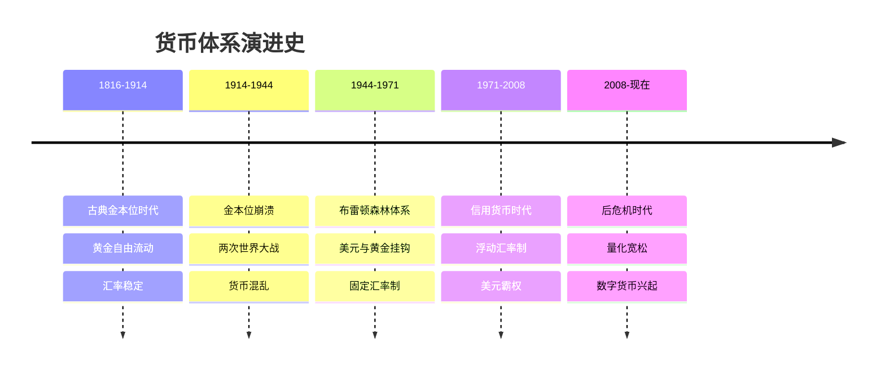

# 货币体系演进：从金本位到数字货币

## 概述

货币体系是现代经济的基础设施，其演变深刻影响着全球经济格局、国际贸易和投资环境。理解货币体系的历史演进，有助于把握当前国际金融体系的运作逻辑和未来发展趋势。

**学习目标**：
1. 理解不同货币体系的特征和运作机制
2. 掌握货币体系演变的历史脉络
3. 分析美元霸权的形成和影响
4. 展望数字货币时代的机遇和挑战
5. 理解货币体系对投资的影响


## 货币体系演进时间线



## 金本位时代（1816-1914）

### 古典金本位的特征

**核心机制**：
- 货币价值与黄金直接挂钩
- 黄金可自由兑换和流动
- 货币发行受黄金储备约束
- 汇率由黄金平价决定

**优势**：
1. **汇率稳定**：各国货币通过黄金建立固定比价
2. **价格稳定**：货币供应受黄金约束，通胀可控
3. **自动调节**：贸易失衡通过黄金流动自动纠正
4. **信用约束**：政府无法随意印钞

**劣势**：
1. **货币供应刚性**：无法应对经济波动
2. **通缩压力**：黄金产量增长慢于经济增长
3. **调整痛苦**：经济调整通过失业和工资下降实现
4. **黄金分布不均**：拥有黄金的国家占优势

### 金本位的运作机制

**价格-黄金流动机制**：
```
贸易顺差国 → 黄金流入 → 货币供应增加 → 价格上涨 
→ 出口竞争力下降 → 贸易平衡

贸易逆差国 → 黄金流出 → 货币供应减少 → 价格下跌 
→ 出口竞争力上升 → 贸易平衡
```

### 金本位的崩溃

**第一次世界大战（1914-1918）**：
- 各国暂停黄金兑换
- 大量印钞支持战争
- 通货膨胀严重
- 金本位名存实亡

**战间期混乱（1918-1939）**：
- 各国试图恢复金本位
- 英镑回归金本位失败（1925）
- 大萧条加速金本位瓦解
- 竞争性贬值（货币战争）

**教训**：
- 固定汇率制在危机时难以维持
- 货币政策需要灵活性
- 国际协调的重要性

## 布雷顿森林体系（1944-1971）

### 体系设计

**核心安排**：
1. **美元与黄金挂钩**：35美元/盎司
2. **其他货币与美元挂钩**：固定但可调整汇率
3. **IMF监督**：提供短期流动性支持
4. **世界银行**：提供长期发展贷款

**设计理念**：
- 吸取金本位教训
- 保持汇率稳定
- 允许政策灵活性
- 促进国际贸易

### 体系运作

**黄金双挂钩机制**：
```
黄金 ←→ 美元 ←→ 其他货币
```

**优势**：
- 汇率相对稳定
- 促进国际贸易
- 美国提供流动性
- 战后经济复苏

**内在矛盾（特里芬难题）**：
```
世界需要美元 → 美国必须逆差 → 美元信用下降 
→ 黄金储备不足 → 体系不可持续
```

### 体系崩溃

**压力积累（1960年代）**：
- 美国黄金储备下降
- 越战和社会福利支出
- 通胀上升
- 美元信心危机

**尼克松冲击（1971年8月15日）**：
- 美国单方面宣布美元与黄金脱钩
- 布雷顿森林体系崩溃
- 进入浮动汇率时代

**影响**：
- 黄金价格暴涨
- 汇率大幅波动
- 通胀加剧
- 货币体系重构


## 信用货币时代（1971-现在）

### 美元霸权的形成

**三大支柱**：

1. **石油美元体系**：
   - 1973年美国与沙特协议
   - 石油以美元计价和结算
   - 产油国美元收入购买美国国债
   - 形成美元-石油-美债循环

2. **美国金融市场深度**：
   - 全球最大最深的资本市场
   - 美债作为全球安全资产
   - 纽约作为国际金融中心
   - 美元资产的流动性优势

3. **美国军事和政治实力**：
   - 全球军事存在
   - 国际规则制定权
   - SWIFT系统控制
   - 金融制裁能力

### 美元霸权的特权

**铸币税收益**：
- 以低成本印钞换取实物商品
- 通过通胀稀释债务
- 估计每年收益数千亿美元

**政策自主权**：
- 不受国际收支约束
- 可以长期贸易逆差
- 货币政策影响全球
- 危机时可以印钞救助

**金融制裁能力**：
- 切断SWIFT通道
- 冻结美元资产
- 限制美元融资
- 次级制裁威胁

### 美元霸权的代价

**对美国**：
- 制造业空心化
- 贸易逆差持续
- 债务不断积累
- 收入不平等加剧

**对世界**：
- 美元政策外溢效应
- 新兴市场脆弱性
- 全球流动性波动
- 金融危机传染

## 数字货币时代

### 加密货币的兴起

**比特币（2009）**：
- 去中心化
- 总量固定（2100万枚）
- 区块链技术
- 挑战传统货币体系

**特征**：
- 点对点交易
- 匿名性
- 不可篡改
- 跨境便利

**局限**：
- 价格波动大
- 交易速度慢
- 能耗高
- 监管不确定

### 央行数字货币（CBDC）

**中国数字人民币**：
- 2020年开始试点
- 双层运营体系
- 可控匿名
- 智能合约

**其他国家探索**：
- 欧洲数字欧元
- 美国数字美元研究
- 日本数字日元
- 多国试点项目

**潜在影响**：
- 提高支付效率
- 增强货币政策传导
- 跨境支付便利化
- 挑战美元霸权

### 未来货币体系展望

**多元化趋势**：
- 美元地位相对下降
- 人民币国际化
- 欧元作用增强
- 数字货币崛起

**可能情景**：

1. **美元继续主导**：
   - 美国保持优势
   - 改革维持信心
   - 其他货币难以替代

2. **多极货币体系**：
   - 美元、欧元、人民币三足鼎立
   - 区域货币合作加强
   - SDR作用提升

3. **数字货币革命**：
   - 央行数字货币普及
   - 跨境支付革新
   - 传统体系重构

## 投资启示

### 货币体系变革的投资机会

**黄金**：
- 货币体系不稳定时的避险资产
- 美元信用下降时的对冲工具
- 长期保值功能

**外汇投资**：
- 关注货币体系变革
- 多元化货币配置
- 对冲汇率风险

**数字资产**：
- 区块链技术投资
- 数字货币基础设施
- 金融科技创新

### 风险管理

**汇率风险**：
- 浮动汇率制下波动加大
- 需要对冲策略
- 多币种资产配置

**政策风险**：
- 货币政策外溢效应
- 金融制裁风险
- 监管不确定性

## 延伸阅读

1. Eichengreen, B. (2011). *Exorbitant Privilege: The Rise and Fall of the Dollar*. Oxford University Press.
2. Prasad, E. (2014). *The Dollar Trap*. Princeton University Press.
3. Rickards, J. (2011). *Currency Wars*. Portfolio.
4. Mundell, R. A. (2000). "A Reconsideration of the Twentieth Century." *American Economic Review*.
5. Zhou, X. (2009). "Reform the International Monetary System." BIS Review.

## 参考文献

1. Eichengreen, B. (2011). *Exorbitant Privilege: The Rise and Fall of the Dollar and the Future of the International Monetary System*. Oxford University Press.
2. Prasad, E. (2014). *The Dollar Trap: How the U.S. Dollar Tightened Its Grip on Global Finance*. Princeton University Press.
3. Rickards, J. (2011). *Currency Wars: The Making of the Next Global Crisis*. Portfolio/Penguin.
4. Mundell, R. A. (2000). "A Reconsideration of the Twentieth Century." *American Economic Review*, 90(3), 327-340.
5. Zhou, X. (2009). "Reform the International Monetary System." BIS Review, 41, 2009.
6. Bordo, M. D., & Eichengreen, B. (2013). "Bretton Woods and the Great Inflation." In *The Great Inflation*. University of Chicago Press.
7. Triffin, R. (1960). *Gold and the Dollar Crisis*. Yale University Press.
8. International Monetary Fund. (2020). "Digital Money Across Borders: Macro-Financial Implications." IMF Policy Paper.
9. Bank for International Settlements. (2021). "CBDCs: An Opportunity for the Monetary System." BIS Annual Economic Report.
10. People's Bank of China. (2021). "Progress of Research & Development of E-CNY in China." Working Paper.

---

**下一步学习**：
- [地缘政治与金融](geopolitics-finance.html)
- [全球资本流动](global-capital-flows.html)
- [货币创造机制](../01-financial-cognition/money-creation.html)


## 深度分析

### 核心机制解析

理解本主题需要从多个维度进行系统性分析。以下从理论基础、实践应用和历史验证三个层面展开深度探讨。

**理论基础层面**：本主题的核心逻辑建立在经济学和金融学的基本原理之上。通过对基础理论的深入理解，投资者能够建立起稳固的分析框架，避免被市场短期噪音所干扰。

**实践应用层面**：理论必须与实践相结合才能产生价值。在实际投资决策中，需要将抽象的概念转化为具体的分析工具和决策标准。

**历史验证层面**：金融市场有着丰富的历史记录，通过研究历史案例，我们可以验证理论的有效性，并从中提炼出具有普遍意义的规律。

### 关键影响因素

影响本主题的关键因素可以从以下几个维度进行分析：

1. **宏观经济环境**：利率水平、通货膨胀率、经济增长速度等宏观变量对本主题有着深远影响。在不同的宏观经济周期中，相关指标的表现会呈现出显著差异。

2. **市场结构因素**：市场参与者的构成、信息传播机制、流动性状况等市场结构因素决定了价格发现的效率和准确性。

3. **政策监管环境**：政府政策、监管框架的变化会直接影响相关市场的运作规则和参与者行为。

4. **技术创新驱动**：技术进步不断改变着金融市场的运作方式，从算法交易到区块链技术，每一次技术革新都带来新的机遇和挑战。

5. **全球化与地缘政治**：在全球化背景下，各国市场之间的联动性日益增强，地缘政治风险的影响也越来越不可忽视。

### 量化分析框架

为了更精确地分析和评估，可以采用以下量化框架：

| 分析维度 | 关键指标 | 参考基准 | 分析方法 |
|---------|---------|---------|---------|
| 规模评估 | 绝对值与相对值 | 历史均值 | 趋势分析 |
| 质量评估 | 稳定性指标 | 行业对标 | 横向比较 |
| 风险评估 | 波动率指标 | 风险阈值 | 情景分析 |
| 价值评估 | 估值倍数 | 历史区间 | 回归分析 |

通过系统性地应用上述框架，投资者可以对目标进行全面、客观的评估，从而做出更加理性的投资决策。


## 高级分析与前沿研究

### 学术研究进展

近年来，学术界对本领域的研究取得了重要进展。以下是几个值得关注的研究方向：

**行为金融学视角**：传统金融理论假设市场参与者是完全理性的，但行为金融学的研究表明，认知偏差和情绪因素在投资决策中扮演着重要角色。诺贝尔经济学奖得主丹尼尔·卡尼曼（Daniel Kahneman）和理查德·塞勒（Richard Thaler）的研究为我们理解市场非理性行为提供了重要框架。

**因子投资研究**：尤金·法玛（Eugene Fama）和肯尼斯·弗伦奇（Kenneth French）的三因子模型，以及后续发展的五因子模型，为系统性地解释股票收益差异提供了理论基础。这些研究表明，市值、账面市值比、盈利能力和投资模式等因子能够解释大部分股票收益的横截面差异。

**市场微观结构研究**：对市场流动性、价格发现机制和交易成本的深入研究，帮助我们更好地理解市场的运作机制，并为优化交易策略提供指导。

### 实战案例深度解析

**案例一：长期价值创造的典范**

以沃伦·巴菲特（Warren Buffett）的伯克希尔·哈撒韦（Berkshire Hathaway）为例，其长达数十年的卓越投资业绩证明了价值投资理念的有效性。从1965年至今，伯克希尔的账面价值年均增长率约为19.8%，远超同期标普500指数的约10.2%年均回报。

巴菲特的成功秘诀在于：
- 专注于具有持久竞争优势的优质企业
- 以合理价格买入，而非追求最低价格
- 长期持有，让复利效应充分发挥
- 保持充足的安全边际，控制下行风险

**案例二：危机中的机遇识别**

2008年金融危机期间，大多数投资者恐慌性抛售，但少数具有前瞻性的投资者却在危机中发现了历史性的投资机会。约翰·保尔森（John Paulson）通过做空次级抵押贷款相关证券，在危机中获得了约150亿美元的利润，成为金融史上最成功的单笔交易之一。

这个案例告诉我们：
- 深入的基本面研究能够发现市场定价错误
- 逆向思维往往能够发现被市场忽视的机会
- 风险管理和仓位控制是成功的关键

### 跨市场比较分析

不同市场在结构、监管、投资者构成等方面存在显著差异，这些差异对投资策略的选择有重要影响：

**美国市场特征**：
- 机构投资者主导，市场效率较高
- 信息披露制度完善，分析师覆盖广泛
- 衍生品市场发达，对冲工具丰富
- 长期牛市历史，但也经历过多次重大调整

**中国市场特征**：
- 散户投资者比例较高，市场波动性较大
- 政策因素影响显著，需要密切关注监管动向
- 新兴行业发展迅速，成长投资机会丰富
- A股、港股、美股中概股形成多层次市场体系

**欧洲市场特征**：
- 价值股比例较高，估值相对保守
- 受地缘政治和欧元区政策影响较大
- 部分行业（如奢侈品、工业）具有全球竞争优势
- ESG投资理念推广较为领先


## 实用工具与操作指南

### 分析工具推荐

**数据获取工具**：
- **Bloomberg Terminal**：专业级金融数据平台，提供实时行情、历史数据、新闻资讯等全方位服务，是机构投资者的首选工具
- **Wind资讯（万得）**：中国最权威的金融数据平台，覆盖A股、债券、基金等全市场数据
- **FactSet**：提供全球股票、固定收益、另类投资等多资产类别的综合数据服务
- **免费替代方案**：Yahoo Finance、Google Finance、东方财富、同花顺等提供基础数据服务

**分析软件工具**：
- **Excel/Python**：用于财务模型构建、数据分析和可视化
- **Tableau/Power BI**：用于数据可视化和仪表板创建
- **R语言**：适合统计分析和量化研究

### 实操步骤指南

**第一步：信息收集**
1. 获取目标公司/资产的基本信息和历史数据
2. 收集行业报告和竞争对手数据
3. 整理宏观经济背景信息
4. 查阅相关学术研究和专业分析报告

**第二步：定量分析**
1. 建立财务模型，计算关键指标
2. 进行历史趋势分析
3. 与同行业公司进行横向比较
4. 构建估值模型，计算合理价值区间

**第三步：定性分析**
1. 评估竞争优势和护城河
2. 分析管理层质量和公司治理
3. 识别主要风险因素
4. 评估行业发展趋势

**第四步：综合判断**
1. 整合定量和定性分析结果
2. 进行情景分析（乐观/基准/悲观）
3. 确定投资论点和关键假设
4. 制定投资决策和风险管理方案

### 常见错误与规避方法

| 常见错误 | 产生原因 | 规避方法 |
|---------|---------|---------|
| 过度依赖历史数据 | 忽视结构性变化 | 结合前瞻性分析 |
| 锚定效应 | 过度依赖初始信息 | 定期重新评估假设 |
| 确认偏误 | 只寻找支持观点的证据 | 主动寻找反驳证据 |
| 过度自信 | 高估自身分析能力 | 保持谦逊，设置安全边际 |
| 忽视流动性风险 | 只关注收益不关注风险 | 全面评估风险因素 |


## 扩展参考资料

### 经典著作推荐

**基础理论类**：
1. 本杰明·格雷厄姆（Benjamin Graham）《聪明的投资者》（The Intelligent Investor, 1949）- 价值投资圣经，巴菲特称之为"有史以来最伟大的投资书籍"
2. 菲利普·费雪（Philip Fisher）《怎样选择成长股》（Common Stocks and Uncommon Profits, 1958）- 成长投资经典，强调定性分析的重要性
3. 彼得·林奇（Peter Lynch）《彼得·林奇的成功投资》（One Up on Wall Street, 1989）- 普通投资者如何发现十倍股
4. 霍华德·马克斯（Howard Marks）《投资最重要的事》（The Most Important Thing, 2011）- 橡树资本创始人的投资智慧

**宏观经济类**：
5. 瑞·达里奥（Ray Dalio）《原则》（Principles, 2017）- 桥水基金创始人的生活和工作原则
6. 约翰·梅纳德·凯恩斯（John Maynard Keynes）《就业、利息和货币通论》（The General Theory, 1936）- 现代宏观经济学奠基之作
7. 米尔顿·弗里德曼（Milton Friedman）《货币的祸害》（Money Mischief, 1992）- 货币主义经典著作

**量化投资类**：
8. 伊曼纽尔·德曼（Emanuel Derman）《宽客人生》（My Life as a Quant, 2004）- 量化金融先驱的回忆录
9. 马科维茨（Harry Markowitz）《组合选择》（Portfolio Selection, 1952）- 现代投资组合理论奠基论文

### 权威研究报告

- **美联储经济研究**：https://www.federalreserve.gov/econres.htm
- **国际货币基金组织（IMF）报告**：https://www.imf.org/en/Publications
- **世界银行研究**：https://www.worldbank.org/en/research
- **国际清算银行（BIS）季报**：https://www.bis.org/publ/qtrpdf/
- **中国人民银行货币政策报告**：http://www.pbc.gov.cn

### 在线学习资源

- **Coursera金融课程**：耶鲁大学Robert Shiller的《金融市场》课程
- **MIT OpenCourseWare**：麻省理工学院金融工程相关课程
- **CFA Institute**：特许金融分析师协会的专业学习资源
- **Investopedia**：金融术语和概念的权威解释网站
- **SSRN**：社会科学研究网络，提供大量金融学术论文


## 综合评估框架

### 多维度评估矩阵

在进行全面分析时，需要从多个维度构建系统性的评估框架。以下矩阵提供了一个结构化的分析方法：

**维度一：基本面分析**
- 财务健康状况：资产负债结构、现金流质量、盈利能力趋势
- 业务竞争力：市场份额、定价权、客户粘性
- 管理层质量：战略执行力、资本配置能力、诚信记录
- 行业地位：竞争格局、进入壁垒、替代威胁

**维度二：估值分析**
- 绝对估值：DCF模型、资产重置价值、清算价值
- 相对估值：P/E、P/B、EV/EBITDA与历史均值和同行比较
- 成长性调整：PEG比率、EV/Sales对高成长企业的适用性
- 股息收益率：对价值型投资者的吸引力

**维度三：风险评估**
- 系统性风险：宏观经济、利率、汇率、地缘政治
- 非系统性风险：行业监管、竞争加剧、技术颠覆
- 流动性风险：市场深度、持仓集中度
- 信用风险：债务水平、再融资能力

**维度四：催化剂分析**
- 短期催化剂：季报超预期、新产品发布、并购重组
- 中期催化剂：行业周期转折、政策红利释放
- 长期催化剂：技术革命、人口结构变化、全球化趋势

### 决策树框架

```
投资决策流程
├── 1. 初步筛选
│   ├── 行业吸引力评估
│   ├── 公司基本面初筛
│   └── 估值合理性初判
├── 2. 深度研究
│   ├── 财务报表深度分析
│   ├── 竞争优势评估
│   ├── 管理层访谈/调研
│   └── 行业专家咨询
├── 3. 估值建模
│   ├── 构建DCF模型
│   ├── 相对估值比较
│   └── 情景分析
├── 4. 风险评估
│   ├── 识别主要风险因素
│   ├── 量化风险影响
│   └── 制定风险应对方案
└── 5. 投资决策
    ├── 确定仓位大小
    ├── 设定买入价格区间
    └── 制定退出策略
```

### 投资组合构建原则

在将单个投资标的纳入组合时，需要考虑以下原则：

1. **分散化原则**：不同行业、地区、资产类别的合理分散，降低非系统性风险
2. **相关性管理**：选择低相关性资产，提高组合的风险调整后收益
3. **仓位管理**：根据确信度和风险水平动态调整仓位
4. **再平衡机制**：定期或在偏离目标配置时进行再平衡
5. **流动性管理**：保持适当的现金或高流动性资产比例

