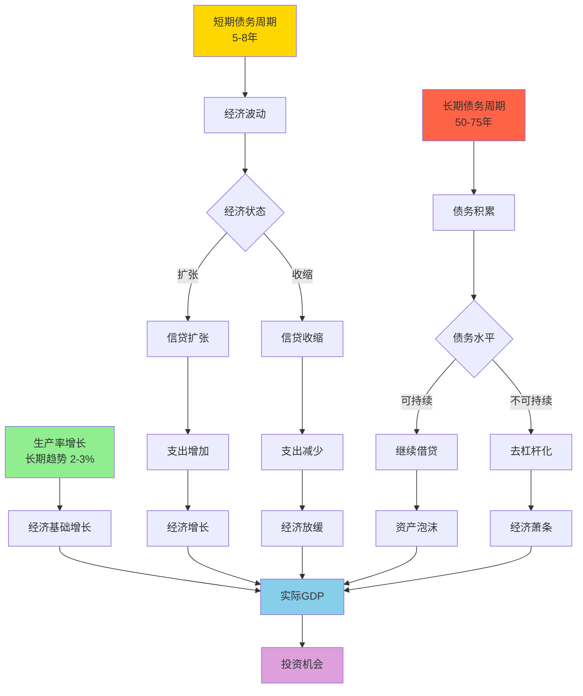

# 经济机器运作原理：达里奥的宏观框架

## 概述

Ray Dalio（瑞·达里奥）的"经济机器"模型是理解宏观经济运行最简洁而深刻的框架之一。这个模型将复杂的经济现象简化为三个核心驱动力的相互作用，为投资者提供了一个强大的分析工具。


**学习目标**：
1. 理解经济机器的三大驱动力及其相互作用
2. 掌握短期债务周期和长期债务周期的运行机制
3. 学会运用经济机器模型分析宏观经济形势
4. 理解经济周期对投资决策的启示
5. 建立系统化的宏观分析框架

**为什么重要**：
经济机器模型提供了一个简洁而强大的框架，帮助投资者理解经济波动的本质，预测经济周期的转折点，并据此调整投资策略。这个模型已被证明在多次经济危机中具有预测价值。

## 核心概念：经济机器的三大驱动力

### 1. 生产率增长（Productivity Growth）

**定义与本质**：
生产率增长是经济长期增长的基础，代表了经济体创造价值的能力提升。它源于：
- 技术创新和进步
- 教育水平提高
- 资本积累
- 制度改进
- 知识积累

**特征**：
- 长期趋势：年均增长率相对稳定（发达国家约2-3%）
- 平滑曲线：波动较小，呈现稳定上升趋势
- 不可逆性：技术进步和知识积累不会倒退
- 复利效应：长期累积产生巨大影响

**历史数据**：
- 工业革命以来：全球生产率年均增长约2%
- 美国1870-2020：生产率年均增长约2.2%
- 中国改革开放后：生产率年均增长约8-10%（追赶效应）


### 2. 短期债务周期（Short-Term Debt Cycle）

**定义与机制**：
短期债务周期，也称为商业周期，通常持续5-8年。它由信贷的扩张和收缩驱动，反映了经济的短期波动。

**周期阶段**：

1. **扩张期（Expansion）**：
   - 信贷宽松，借贷成本低
   - 消费和投资增加
   - 经济增长加速
   - 就业率上升
   - 资产价格上涨

2. **过热期（Overheating）**：
   - 经济增长超过潜在增速
   - 通胀压力上升
   - 央行开始收紧货币政策
   - 利率上升

3. **收缩期（Contraction）**：
   - 信贷收紧，借贷成本上升
   - 消费和投资减少
   - 经济增长放缓
   - 失业率上升
   - 资产价格下跌

4. **衰退期（Recession）**：
   - 经济负增长
   - 债务违约增加
   - 央行开始放松货币政策
   - 利率下降

**驱动机制**：
```
低利率 → 信贷扩张 → 支出增加 → 经济增长 → 通胀上升 
→ 央行加息 → 信贷收缩 → 支出减少 → 经济放缓 → 通胀下降 
→ 央行降息 → 循环重启
```


### 3. 长期债务周期（Long-Term Debt Cycle）

**定义与机制**：
长期债务周期通常持续50-75年，反映了债务相对于收入的长期积累和去杠杆化过程。这是理解重大经济危机的关键。

**周期阶段**：

1. **早期阶段（Early Stage）**：
   - 债务水平低
   - 债务增长快于收入增长
   - 信贷推动经济繁荣
   - 资产价格持续上涨
   - 持续时间：20-30年

2. **泡沫阶段（Bubble Stage）**：
   - 债务水平高
   - 债务增速超过收入增速
   - 资产价格泡沫形成
   - 投机行为盛行
   - 持续时间：5-10年

3. **顶部阶段（Top Stage）**：
   - 债务/收入比达到不可持续水平
   - 债务偿还负担沉重
   - 新增借贷困难
   - 资产价格见顶
   - 持续时间：1-3年

4. **萧条阶段（Depression Stage）**：
   - 债务违约增加
   - 信贷紧缩
   - 资产价格暴跌
   - 经济深度衰退
   - 持续时间：2-3年

5. **去杠杆化阶段（Deleveraging Stage）**：
   - 债务重组和违约
   - 财富再分配
   - 政策救助
   - 经济缓慢恢复
   - 持续时间：5-10年


## 三大驱动力的相互作用

### 经济机器运作流程图



### 叠加效应分析

**正常时期**：
```
实际GDP = 生产率增长 + 短期债务周期波动
```
- 经济围绕生产率趋势线上下波动
- 波动幅度：±3-5%
- 可通过货币政策调控

**泡沫时期**：
```
实际GDP = 生产率增长 + 短期债务周期波动 + 长期债务周期推动
```
- 经济增长显著超过生产率趋势
- 债务快速积累
- 资产价格泡沫形成
- 繁荣假象

**危机时期**：
```
实际GDP = 生产率增长 + 短期债务周期波动 - 长期债务周期拖累
```
- 经济增长显著低于生产率趋势
- 去杠杆化压力
- 资产价格暴跌
- 深度衰退


## 历史周期验证

### 案例1：1929-1945 大萧条周期

**背景**（1920年代）：
- 生产率快速增长（汽车、电力普及）
- 短期债务周期扩张
- 长期债务周期顶部（债务/GDP比历史新高）
- 股市泡沫（1929年市盈率达32倍）

**崩溃**（1929-1933）：
- 1929年10月股市崩盘
- 银行挤兑和倒闭（9000家银行倒闭）
- GDP下降30%
- 失业率达25%
- 通缩螺旋

**去杠杆化**（1933-1945）：
- 罗斯福新政
- 货币贬值（美元对黄金贬值40%）
- 债务重组
- 财政刺激
- 二战带来的需求

**启示**：
- 长期债务周期顶部的危险性
- 去杠杆化的痛苦和持久性
- 政策应对的重要性

### 案例2：2008 金融危机周期

**背景**（2000-2007）：
- 生产率稳定增长（互联网、全球化）
- 短期债务周期扩张
- 长期债务周期顶部（家庭债务/GDP达98%）
- 房地产泡沫（房价年均涨幅10%+）

**崩溃**（2008-2009）：
- 次贷危机爆发
- 雷曼兄弟破产
- 全球金融系统冻结
- GDP下降4.3%
- 失业率达10%

**去杠杆化**（2009-2015）：
- 量化宽松（QE1, QE2, QE3）
- 零利率政策
- 财政刺激
- 银行救助
- 债务重组

**恢复**（2015-2020）：
- 经济缓慢复苏
- 债务水平依然高企
- 资产价格新高
- 收入不平等加剧

**启示**：
- 房地产泡沫的系统性风险
- 金融创新的双刃剑（次贷证券化）
- 央行干预的有效性和副作用
- 去杠杆化的长期性


### 案例3：日本失落的三十年（1990-2020）

**背景**（1980年代）：
- 生产率高速增长（制造业强国）
- 资产价格泡沫（股市和房地产）
- 长期债务周期顶部
- 日经指数达38,915点（1989年12月）

**崩溃**（1990-1995）：
- 资产价格暴跌（股市跌80%，房价跌70%）
- 银行坏账激增
- 经济陷入停滞
- 通缩开始

**长期停滞**（1995-2020）：
- 零利率政策持续30年
- 多轮量化宽松
- 财政赤字持续扩大
- 经济增长接近零
- 人口老龄化加剧

**启示**：
- 资产泡沫破裂的长期影响
- 人口结构对经济的制约
- 政策应对的时机和力度
- 通缩陷阱的危险

### 案例4：中国经济周期（2008-2023）

**刺激期**（2008-2015）：
- 4万亿刺激计划
- 信贷快速扩张
- 房地产繁荣
- 债务快速积累

**调整期**（2016-2020）：
- 供给侧改革
- 去杠杆化
- 房地产调控
- 经济增速放缓

**新阶段**（2020-2023）：
- 疫情冲击
- 政策刺激
- 房地产危机
- 经济转型

**启示**：
- 新兴市场的特殊性
- 政府干预的作用
- 债务积累的风险
- 结构转型的必要性


## 对投资的启示

### 1. 识别经济周期位置

**短期债务周期判断**：
- **扩张早期**：买入周期性股票、大宗商品
- **扩张晚期**：减持周期性资产，增持防御性资产
- **收缩早期**：持有现金和债券
- **收缩晚期**：准备买入被低估的优质资产

**长期债务周期判断**：
- **早期阶段**：积极投资，杠杆合理
- **泡沫阶段**：保持警惕，逐步减仓
- **顶部阶段**：大幅减仓，持有现金
- **萧条阶段**：等待机会，分批买入
- **去杠杆化阶段**：选择性投资，关注政策

### 2. 资产配置策略

**基于经济机器的全天候组合**：

```
正常时期（生产率增长主导）：
- 股票：40%
- 长期债券：30%
- 大宗商品：15%
- 黄金：7.5%
- 现金：7.5%

泡沫时期（长期债务周期顶部）：
- 股票：20%
- 长期债券：20%
- 大宗商品：10%
- 黄金：20%
- 现金：30%

危机时期（去杠杆化）：
- 股票：10%
- 长期债券：40%
- 大宗商品：5%
- 黄金：15%
- 现金：30%

复苏时期（去杠杆化后期）：
- 股票：50%
- 长期债券：25%
- 大宗商品：15%
- 黄金：5%
- 现金：5%
```


### 3. 风险管理原则

**债务周期风险管理**：

1. **监控关键指标**：
   - 债务/GDP比率
   - 债务偿还负担（债务偿还/收入）
   - 信贷增速
   - 资产价格/收入比
   - 杠杆率

2. **预警信号**：
   - 债务增速持续超过GDP增速
   - 资产价格脱离基本面
   - 投机行为盛行
   - 信贷标准放松
   - 新金融产品大量出现

3. **应对策略**：
   - 逐步降低风险资产比例
   - 增加流动性储备
   - 分散投资地域和资产类别
   - 避免使用杠杆
   - 保持灵活性

### 4. 投资时机把握

**买入时机**：
- 短期债务周期底部 + 长期债务周期早期
- 去杠杆化后期，资产价格严重低估
- 政策转向宽松，信贷开始恢复
- 市场极度悲观，估值历史低位

**卖出时机**：
- 短期债务周期顶部 + 长期债务周期泡沫期
- 资产价格严重高估，投机盛行
- 政策开始收紧，信贷增速放缓
- 市场极度乐观，估值历史高位

**持有时机**：
- 经济稳定增长，债务水平可控
- 资产价格合理，基本面良好
- 政策环境稳定
- 市场情绪中性


## 深入理解：经济机器的数学模型

### 基本方程

**总支出方程**：
```
总支出 = 货币 + 信贷
```

**经济增长方程**：
```
经济增长率 = 生产率增长率 + 信贷增长率
```

**债务动态方程**：
```
债务/收入比变化 = (债务增长率 - 收入增长率) × 债务/收入比
```

**可持续性条件**：
```
债务增长率 ≤ 收入增长率
```
当债务增长率持续超过收入增长率时，债务/收入比将不断上升，最终达到不可持续水平。

### 临界点分析

**长期债务周期临界点**：

1. **债务/GDP比率**：
   - 安全区：< 100%
   - 警戒区：100-150%
   - 危险区：> 150%
   - 临界点：约200-250%（历史经验）

2. **债务偿还负担**：
   - 安全区：< 15%收入
   - 警戒区：15-25%收入
   - 危险区：> 25%收入
   - 临界点：约30-35%收入

3. **信贷增速**：
   - 正常：与GDP增速相当
   - 警戒：超过GDP增速5个百分点
   - 危险：超过GDP增速10个百分点以上

### 政策应对框架

**去杠杆化的四种方式**：

1. **紧缩（Austerity）**：
   - 减少支出
   - 效果：通缩性，痛苦
   - 权重：应该最小

2. **债务违约/重组（Debt Defaults/Restructuring）**：
   - 债务减记
   - 效果：通缩性，但清理债务
   - 权重：适度

3. **财富再分配（Wealth Redistribution）**：
   - 向富人征税
   - 效果：社会稳定，但可能抑制增长
   - 权重：适度

4. **货币化（Debt Monetization）**：
   - 央行印钞购买债务
   - 效果：通胀性，但刺激增长
   - 权重：应该最大（在不引发恶性通胀前提下）

**美丽去杠杆化（Beautiful Deleveraging）**：
```
平衡的去杠杆化 = 适度紧缩 + 适度违约 + 适度再分配 + 大量货币化
```
目标：实现名义GDP增长率 > 名义利率，同时控制通胀在可接受范围。


## 实战应用：如何使用经济机器模型

### 步骤1：评估当前位置

**数据收集**：
- GDP增长率（实际和名义）
- 债务/GDP比率（政府、企业、家庭）
- 信贷增长率
- 通胀率
- 利率水平
- 资产价格（股市、房地产）
- 失业率

**周期定位**：
- 短期债务周期：扩张/收缩？早期/晚期？
- 长期债务周期：早期/泡沫/顶部/萧条/去杠杆化？
- 生产率趋势：加速/稳定/放缓？

### 步骤2：预测未来路径

**情景分析**：

**情景A：正常周期**
- 假设：债务水平可控，政策正常
- 预期：经济围绕生产率趋势波动
- 投资策略：标准资产配置

**情景B：泡沫破裂**
- 假设：债务水平过高，泡沫破裂
- 预期：深度衰退，去杠杆化
- 投资策略：防御性配置，持有现金

**情景C：政策救助成功**
- 假设：及时有效的政策干预
- 预期：美丽去杠杆化，缓慢复苏
- 投资策略：选择性投资，关注政策受益行业

### 步骤3：调整投资组合

**动态再平衡**：
- 根据周期位置调整资产配置
- 根据风险偏好调整杠杆水平
- 根据估值水平调整仓位
- 保持足够的流动性储备

**行业轮动**：
- 扩张早期：金融、工业、材料
- 扩张晚期：能源、材料、工业
- 收缩早期：必需消费、医疗、公用事业
- 收缩晚期：科技、可选消费、金融


## 常见误区

### 误区1：忽视长期债务周期

**错误认知**：
"经济衰退后总会快速复苏"

**现实**：
- 短期债务周期的衰退通常1-2年恢复
- 长期债务周期的萧条可能持续10年以上
- 1929年大萧条持续了10年
- 日本失落的三十年
- 2008年危机后的缓慢复苏

**教训**：
必须区分短期周期和长期周期，在长期债务周期顶部要格外谨慎。

### 误区2：线性外推

**错误认知**：
"过去的趋势会继续"

**现实**：
- 经济增长不是线性的
- 债务积累有临界点
- 泡沫总会破裂
- 均值回归是铁律

**教训**：
要理解周期的非线性特征，识别拐点信号。

### 误区3：忽视政策影响

**错误认知**：
"市场会自我调节"

**现实**：
- 央行政策深刻影响经济周期
- 财政政策可以改变周期路径
- 政策应对决定去杠杆化的方式
- 2008年后的量化宽松改变了周期

**教训**：
必须密切关注政策动向，理解政策传导机制。

### 误区4：过度依赖单一指标

**错误认知**：
"只看GDP增长率就够了"

**现实**：
- 需要综合多个指标
- 债务水平同样重要
- 资产价格反映预期
- 信贷增速是领先指标

**教训**：
建立完整的指标体系，多维度分析。


## 延伸阅读

### 核心著作

1. **Ray Dalio - "Principles for Navigating Big Debt Crises"**
   - 达里奥关于债务危机的权威著作
   - 详细分析48个历史债务危机案例
   - 提供完整的政策应对框架

2. **Ray Dalio - "Principles: Life and Work"**
   - 包含经济机器模型的完整阐述
   - 达里奥的投资哲学和方法论

3. **Hyman Minsky - "Stabilizing an Unstable Economy"**
   - 金融不稳定假说
   - 债务周期的理论基础

4. **Carmen Reinhart & Kenneth Rogoff - "This Time Is Different"**
   - 800年金融危机史
   - 债务危机的共同特征

5. **Richard Koo - "The Holy Grail of Macroeconomics"**
   - 资产负债表衰退理论
   - 日本经验的深刻分析

### 视频资源

1. **"How The Economic Machine Works" by Ray Dalio**
   - 30分钟动画视频
   - 经济机器模型的最佳入门
   - YouTube上有中文字幕版本

2. **Bridgewater Associates研究报告**
   - 定期发布宏观经济分析
   - 应用经济机器模型的实例

### 数据资源

1. **国际清算银行（BIS）**
   - 全球债务数据库
   - 信贷缺口指标

2. **国际货币基金组织（IMF）**
   - 全球经济展望
   - 财政监测报告

3. **美联储经济数据（FRED）**
   - 美国经济时间序列数据
   - 免费API接口

4. **世界银行数据库**
   - 全球发展指标
   - 长期历史数据


## 参考文献

1. Dalio, R. (2018). *Principles for Navigating Big Debt Crises*. Bridgewater Associates.

2. Dalio, R. (2017). *Principles: Life and Work*. Simon & Schuster.

3. Minsky, H. P. (2008). *Stabilizing an Unstable Economy*. McGraw-Hill Education.

4. Reinhart, C. M., & Rogoff, K. S. (2009). *This Time Is Different: Eight Centuries of Financial Folly*. Princeton University Press.

5. Koo, R. C. (2008). *The Holy Grail of Macroeconomics: Lessons from Japan's Great Recession*. John Wiley & Sons.

6. Bernanke, B. S. (2015). *The Courage to Act: A Memoir of a Crisis and Its Aftermath*. W. W. Norton & Company.

7. Kindleberger, C. P., & Aliber, R. Z. (2011). *Manias, Panics, and Crashes: A History of Financial Crises*. Palgrave Macmillan.

8. Fisher, I. (1933). "The Debt-Deflation Theory of Great Depressions." *Econometrica*, 1(4), 337-357.

9. Schularick, M., & Taylor, A. M. (2012). "Credit Booms Gone Bust: Monetary Policy, Leverage Cycles, and Financial Crises, 1870-2008." *American Economic Review*, 102(2), 1029-1061.

10. Jordà, Ò., Schularick, M., & Taylor, A. M. (2013). "When Credit Bites Back." *Journal of Money, Credit and Banking*, 45(s2), 3-28.

11. Bank for International Settlements. (2020). *Annual Economic Report 2020*. BIS.

12. International Monetary Fund. (2021). *Global Financial Stability Report*. IMF.

13. Bridgewater Associates. (2020). "The Changing World Order." Research Report.

14. Federal Reserve Bank of New York. (2019). "Household Debt and Credit Report." FRBNY.

15. Borio, C. (2014). "The Financial Cycle and Macroeconomics: What Have We Learnt?" *Journal of Banking & Finance*, 45, 182-198.

---

**下一步学习**：
- [债务周期理论](debt-cycles.html) - 深入理解长期债务周期
- [达里奥投资原则](../04-investment-system/macro-investing/dalio-principles.html) - 学习如何应用经济机器模型
- [宏观投资策略](../04-investment-system/macro-investing/top-down-approach.html) - 自上而下的投资方法

**相关主题**：
- [经济周期理论](../02-economic-foundation/economic-cycles/cycle-overview.html)
- [货币政策传导](../02-economic-foundation/monetary-policy/policy-transmission.html)
- [金融危机模式](crisis-patterns.html)


## 深度分析

### 核心机制解析

理解本主题需要从多个维度进行系统性分析。以下从理论基础、实践应用和历史验证三个层面展开深度探讨。

**理论基础层面**：本主题的核心逻辑建立在经济学和金融学的基本原理之上。通过对基础理论的深入理解，投资者能够建立起稳固的分析框架，避免被市场短期噪音所干扰。

**实践应用层面**：理论必须与实践相结合才能产生价值。在实际投资决策中，需要将抽象的概念转化为具体的分析工具和决策标准。

**历史验证层面**：金融市场有着丰富的历史记录，通过研究历史案例，我们可以验证理论的有效性，并从中提炼出具有普遍意义的规律。

### 关键影响因素

影响本主题的关键因素可以从以下几个维度进行分析：

1. **宏观经济环境**：利率水平、通货膨胀率、经济增长速度等宏观变量对本主题有着深远影响。在不同的宏观经济周期中，相关指标的表现会呈现出显著差异。

2. **市场结构因素**：市场参与者的构成、信息传播机制、流动性状况等市场结构因素决定了价格发现的效率和准确性。

3. **政策监管环境**：政府政策、监管框架的变化会直接影响相关市场的运作规则和参与者行为。

4. **技术创新驱动**：技术进步不断改变着金融市场的运作方式，从算法交易到区块链技术，每一次技术革新都带来新的机遇和挑战。

5. **全球化与地缘政治**：在全球化背景下，各国市场之间的联动性日益增强，地缘政治风险的影响也越来越不可忽视。

### 量化分析框架

为了更精确地分析和评估，可以采用以下量化框架：

| 分析维度 | 关键指标 | 参考基准 | 分析方法 |
|---------|---------|---------|---------|
| 规模评估 | 绝对值与相对值 | 历史均值 | 趋势分析 |
| 质量评估 | 稳定性指标 | 行业对标 | 横向比较 |
| 风险评估 | 波动率指标 | 风险阈值 | 情景分析 |
| 价值评估 | 估值倍数 | 历史区间 | 回归分析 |

通过系统性地应用上述框架，投资者可以对目标进行全面、客观的评估，从而做出更加理性的投资决策。

