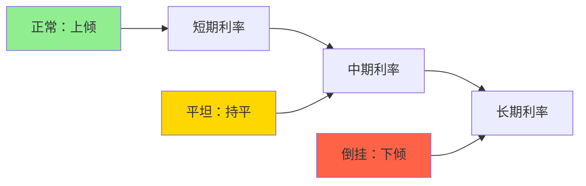

# 宏观指标体系：经济的仪表盘

## 概述

宏观经济指标是理解经济运行状态、预测经济走向、制定投资策略的基础工具。构建完整的指标监测体系，就像为经济装上仪表盘，帮助投资者及时把握经济脉搏。

**学习目标**：
1. 掌握核心宏观经济指标的含义和计算方法
2. 理解不同指标之间的关系和相互作用
3. 学会解读指标数据并判断经济状态
4. 建立系统的指标监测框架
5. 将指标分析应用于投资决策


## 指标分类框架

### 按时间特性分类

**领先指标（Leading Indicators）**：
- 提前反映经济走向
- 预测未来3-6个月
- 用于预警和布局

**同步指标（Coincident Indicators）**：
- 同步反映当前状态
- 确认经济周期位置
- 用于验证判断

**滞后指标（Lagging Indicators）**：
- 滞后确认经济变化
- 验证周期转折
- 用于事后分析

### 按经济维度分类

**增长指标**：
- GDP及其组成部分
- 工业生产
- 零售销售
- 固定资产投资

**就业指标**：
- 失业率
- 新增就业
- 劳动参与率
- 工资增长

**通胀指标**：
- CPI
- PPI
- PCE
- GDP平减指数

**货币金融指标**：
- 利率
- 货币供应
- 信贷增长
- 汇率

**外部平衡指标**：
- 贸易差额
- 经常账户
- 外汇储备
- 资本流动

## 核心指标详解

### 1. GDP（国内生产总值）

**定义**：
一定时期内一国境内生产的所有最终产品和服务的市场价值总和。

**计算方法**：

**支出法**：
```
GDP = C + I + G + (X - M)
C = 消费
I = 投资
G = 政府支出
X = 出口
M = 进口
```

**收入法**：
```
GDP = 工资 + 利润 + 利息 + 租金 + 折旧 + 间接税
```

**关键概念**：
- 实际GDP vs 名义GDP
- GDP增长率
- 人均GDP
- GDP平减指数

**解读要点**：
- 增速：>3%强劲，2-3%温和，<2%疲弱（发达国家）
- 组成：消费、投资、出口的贡献
- 质量：是否可持续，是否依赖债务

### 2. CPI（消费者价格指数）

**定义**：
衡量一篮子消费品和服务价格变化的指标。

**计算**：
```
CPI = (当期一篮子商品价格 / 基期一篮子商品价格) × 100
```

**组成**（美国）**：
- 食品和饮料：14%
- 住房：42%
- 服装：3%
- 交通：17%
- 医疗：9%
- 娱乐：6%
- 教育：3%
- 其他：6%

**核心CPI**：
剔除食品和能源的CPI，更能反映潜在通胀趋势。

**解读要点**：
- 2%：央行目标
- >3%：通胀压力，可能加息
- <1%：通缩风险，可能降息
- 核心CPI更重要

### 3. 失业率

**定义**：
失业人口占劳动力人口的比例。

**计算**：
```
失业率 = (失业人数 / 劳动力人数) × 100%
```

**类型**：
- U3：官方失业率
- U6：包括未充分就业和边缘劳动力

**自然失业率**：
经济充分就业时的失业率，美国约4-5%。

**解读要点**：
- <4%：劳动力市场紧张
- 4-6%：正常范围
- >6%：劳动力市场疲弱
- 关注趋势而非绝对值

### 4. PMI（采购经理人指数）

**定义**：
通过对采购经理的调查，反映制造业或服务业的景气程度。

**组成**：
- 新订单（30%）
- 生产（25%）
- 就业（20%）
- 供应商交货时间（15%）
- 库存（10%）

**解读**：
- >50：扩张
- =50：持平
- <50：收缩
- >55：强劲扩张
- <45：深度收缩

**优势**：
- 及时性强（月初发布）
- 领先指标
- 全球可比

### 5. 利率

**关键利率**：

**政策利率**：
- 联邦基金利率（美国）
- 存款准备金利率（中国）
- 再融资利率（欧洲）

**市场利率**：
- 国债收益率
- LIBOR/SOFR
- 企业债收益率
- 抵押贷款利率

**收益率曲线**：


**倒挂的意义**：
- 历史上每次衰退前都出现倒挂
- 提前6-18个月预警
- 但也有误报

### 6. 货币供应

**层次**：

**M0（基础货币）**：
流通中的现金

**M1（狭义货币）**：
M0 + 活期存款

**M2（广义货币）**：
M1 + 定期存款 + 储蓄存款

**M3（更广义货币）**：
M2 + 其他金融资产

**解读**：
- M2增速 > GDP增速 + CPI：货币宽松
- M2增速 < GDP增速 + CPI：货币紧缩
- 关注M2/GDP比率


## 指标组合应用

### 经济周期判断矩阵

| 阶段 | GDP | 失业率 | 通胀 | 利率 | PMI | 股市 |
|------|-----|--------|------|------|-----|------|
| 复苏早期 | ↑ | ↓ | 低 | 低 | >50 | ↑↑ |
| 复苏晚期 | ↑↑ | ↓↓ | ↑ | ↑ | >55 | ↑ |
| 过热 | ↑ | 低 | ↑↑ | ↑↑ | >55 | 波动 |
| 滞胀 | ↓ | ↑ | ↑↑ | ↑↑ | <50 | ↓ |
| 衰退早期 | ↓ | ↑ | ↓ | ↑ | <50 | ↓↓ |
| 衰退晚期 | ↓↓ | ↑↑ | ↓↓ | ↓ | <45 | ↓ |
| 复苏准备 | ↓ | 高 | 低 | ↓↓ | 接近50 | ↑ |

### 宏观仪表盘设计

**增长仪表盘**：
```
GDP增长率：     [====    ] 2.5%
工业生产：      [======  ] 3.2%
零售销售：      [=====   ] 2.8%
固定资产投资：  [===     ] 1.5%
```

**通胀仪表盘**：
```
CPI：          [======  ] 3.0%
核心CPI：      [=====   ] 2.5%
PPI：          [=======] 4.0%
工资增长：     [====    ] 2.2%
```

**就业仪表盘**：
```
失业率：       [===     ] 4.2%
新增就业：     [======  ] 250K
劳动参与率：   [====    ] 63.5%
职位空缺：     [=======] 10M
```

**货币金融仪表盘**：
```
政策利率：     [=====   ] 2.5%
10年期国债：   [======  ] 3.0%
信贷增速：     [====    ] 8%
M2增速：       [=====   ] 9%
```

### 领先指标综合指数

**美国领先指标（LEI）组成**：
1. 平均每周工时
2. 初次申请失业救济人数
3. 制造业新订单（消费品）
4. 供应商交货时间
5. 制造业新订单（资本品）
6. 建筑许可
7. 标普500指数
8. 领先信贷指数
9. 利率利差（10年期-联邦基金利率）
10. 消费者预期指数

**解读**：
- 连续3个月下降：衰退预警
- 连续3个月上升：复苏信号
- 提前6-9个月预测转折点

## 数据来源和工具

### 官方数据源

**美国**：
- 美联储（FRED数据库）
- 劳工统计局（BLS）
- 商务部经济分析局（BEA）
- 供应管理协会（ISM）

**中国**：
- 国家统计局
- 中国人民银行
- 海关总署
- 财政部

**国际组织**：
- 国际货币基金组织（IMF）
- 世界银行
- 经合组织（OECD）
- 国际清算银行（BIS）

### 分析工具

**数据平台**：
- Bloomberg Terminal
- Wind资讯
- Trading Economics
- CEIC

**可视化工具**：
- Tableau
- Power BI
- Python (Matplotlib, Plotly)
- Excel

**监测工具**：
- 经济日历
- 数据提醒
- 自动化报告
- 仪表盘

## 投资应用

### 资产配置策略

**复苏期**：
- 股票：70%（周期股、金融）
- 债券：20%
- 大宗商品：10%

**扩张期**：
- 股票：60%（科技、消费）
- 债券：25%
- 大宗商品：15%

**过热期**：
- 股票：40%（能源、材料）
- 债券：30%
- 大宗商品：20%
- 现金：10%

**衰退期**：
- 股票：20%（防御股）
- 债券：50%
- 现金：30%

### 交易信号

**买入信号**：
- PMI从<50回升至>50
- 失业率见顶回落
- 收益率曲线从倒挂恢复
- 领先指标连续3月上升

**卖出信号**：
- PMI从>50跌至<50
- 失业率见底回升
- 收益率曲线倒挂
- 领先指标连续3月下降

### 风险监控

**预警指标**：
- 信贷/GDP缺口 > 10%
- 收益率曲线倒挂
- VIX > 30
- 高收益债利差 > 500bp

**行动建议**：
- 1个预警：提高警惕
- 2个预警：降低风险
- 3个预警：大幅减仓
- 4个预警：防御配置

## 延伸阅读

1. Bernanke, B. S., & Boivin, J. (2003). "Monetary Policy in a Data-Rich Environment." *Journal of Monetary Economics*, 50(3), 525-546.
2. Stock, J. H., & Watson, M. W. (2003). "Forecasting Output and Inflation: The Role of Asset Prices." *Journal of Economic Literature*, 41(3), 788-829.
3. Estrella, A., & Mishkin, F. S. (1998). "Predicting U.S. Recessions: Financial Variables as Leading Indicators." *Review of Economics and Statistics*, 80(1), 45-61.
4. Conference Board. (2021). "Business Cycle Indicators Handbook." The Conference Board.
5. Federal Reserve Bank of St. Louis. "FRED Economic Data." https://fred.stlouisfed.org/

## 参考文献

1. Bernanke, B. S., & Boivin, J. (2003). "Monetary Policy in a Data-Rich Environment." *Journal of Monetary Economics*, 50(3), 525-546.
2. Stock, J. H., & Watson, M. W. (2003). "Forecasting Output and Inflation: The Role of Asset Prices." *Journal of Economic Literature*, 41(3), 788-829.
3. Estrella, A., & Mishkin, F. S. (1998). "Predicting U.S. Recessions: Financial Variables as Leading Indicators." *Review of Economics and Statistics*, 80(1), 45-61.
4. Conference Board. (2021). *Business Cycle Indicators Handbook*. The Conference Board.
5. Federal Reserve Bank of St. Louis. "FRED Economic Data." https://fred.stlouisfed.org/
6. Bureau of Labor Statistics. "Economic News Release." https://www.bls.gov/
7. Bureau of Economic Analysis. "National Economic Accounts." https://www.bea.gov/
8. Institute for Supply Management. "ISM Report On Business." https://www.ismworld.org/
9. National Bureau of Economic Research. "Business Cycle Dating." https://www.nber.org/
10. Organization for Economic Cooperation and Development. "OECD Economic Outlook." https://www.oecd.org/

---

**下一步学习**：
- [投资时钟应用](investment-clock.html)
- [经济周期理论](../02-economic-foundation/economic-cycles/cycle-overview.html)
- [领先指标详解](../02-economic-foundation/economic-indicators/leading-indicators.html)


## 深度分析

### 核心机制解析

理解本主题需要从多个维度进行系统性分析。以下从理论基础、实践应用和历史验证三个层面展开深度探讨。

**理论基础层面**：本主题的核心逻辑建立在经济学和金融学的基本原理之上。通过对基础理论的深入理解，投资者能够建立起稳固的分析框架，避免被市场短期噪音所干扰。

**实践应用层面**：理论必须与实践相结合才能产生价值。在实际投资决策中，需要将抽象的概念转化为具体的分析工具和决策标准。

**历史验证层面**：金融市场有着丰富的历史记录，通过研究历史案例，我们可以验证理论的有效性，并从中提炼出具有普遍意义的规律。

### 关键影响因素

影响本主题的关键因素可以从以下几个维度进行分析：

1. **宏观经济环境**：利率水平、通货膨胀率、经济增长速度等宏观变量对本主题有着深远影响。在不同的宏观经济周期中，相关指标的表现会呈现出显著差异。

2. **市场结构因素**：市场参与者的构成、信息传播机制、流动性状况等市场结构因素决定了价格发现的效率和准确性。

3. **政策监管环境**：政府政策、监管框架的变化会直接影响相关市场的运作规则和参与者行为。

4. **技术创新驱动**：技术进步不断改变着金融市场的运作方式，从算法交易到区块链技术，每一次技术革新都带来新的机遇和挑战。

5. **全球化与地缘政治**：在全球化背景下，各国市场之间的联动性日益增强，地缘政治风险的影响也越来越不可忽视。

### 量化分析框架

为了更精确地分析和评估，可以采用以下量化框架：

| 分析维度 | 关键指标 | 参考基准 | 分析方法 |
|---------|---------|---------|---------|
| 规模评估 | 绝对值与相对值 | 历史均值 | 趋势分析 |
| 质量评估 | 稳定性指标 | 行业对标 | 横向比较 |
| 风险评估 | 波动率指标 | 风险阈值 | 情景分析 |
| 价值评估 | 估值倍数 | 历史区间 | 回归分析 |

通过系统性地应用上述框架，投资者可以对目标进行全面、客观的评估，从而做出更加理性的投资决策。


## 高级分析与前沿研究

### 学术研究进展

近年来，学术界对本领域的研究取得了重要进展。以下是几个值得关注的研究方向：

**行为金融学视角**：传统金融理论假设市场参与者是完全理性的，但行为金融学的研究表明，认知偏差和情绪因素在投资决策中扮演着重要角色。诺贝尔经济学奖得主丹尼尔·卡尼曼（Daniel Kahneman）和理查德·塞勒（Richard Thaler）的研究为我们理解市场非理性行为提供了重要框架。

**因子投资研究**：尤金·法玛（Eugene Fama）和肯尼斯·弗伦奇（Kenneth French）的三因子模型，以及后续发展的五因子模型，为系统性地解释股票收益差异提供了理论基础。这些研究表明，市值、账面市值比、盈利能力和投资模式等因子能够解释大部分股票收益的横截面差异。

**市场微观结构研究**：对市场流动性、价格发现机制和交易成本的深入研究，帮助我们更好地理解市场的运作机制，并为优化交易策略提供指导。

### 实战案例深度解析

**案例一：长期价值创造的典范**

以沃伦·巴菲特（Warren Buffett）的伯克希尔·哈撒韦（Berkshire Hathaway）为例，其长达数十年的卓越投资业绩证明了价值投资理念的有效性。从1965年至今，伯克希尔的账面价值年均增长率约为19.8%，远超同期标普500指数的约10.2%年均回报。

巴菲特的成功秘诀在于：
- 专注于具有持久竞争优势的优质企业
- 以合理价格买入，而非追求最低价格
- 长期持有，让复利效应充分发挥
- 保持充足的安全边际，控制下行风险

**案例二：危机中的机遇识别**

2008年金融危机期间，大多数投资者恐慌性抛售，但少数具有前瞻性的投资者却在危机中发现了历史性的投资机会。约翰·保尔森（John Paulson）通过做空次级抵押贷款相关证券，在危机中获得了约150亿美元的利润，成为金融史上最成功的单笔交易之一。

这个案例告诉我们：
- 深入的基本面研究能够发现市场定价错误
- 逆向思维往往能够发现被市场忽视的机会
- 风险管理和仓位控制是成功的关键

### 跨市场比较分析

不同市场在结构、监管、投资者构成等方面存在显著差异，这些差异对投资策略的选择有重要影响：

**美国市场特征**：
- 机构投资者主导，市场效率较高
- 信息披露制度完善，分析师覆盖广泛
- 衍生品市场发达，对冲工具丰富
- 长期牛市历史，但也经历过多次重大调整

**中国市场特征**：
- 散户投资者比例较高，市场波动性较大
- 政策因素影响显著，需要密切关注监管动向
- 新兴行业发展迅速，成长投资机会丰富
- A股、港股、美股中概股形成多层次市场体系

**欧洲市场特征**：
- 价值股比例较高，估值相对保守
- 受地缘政治和欧元区政策影响较大
- 部分行业（如奢侈品、工业）具有全球竞争优势
- ESG投资理念推广较为领先

