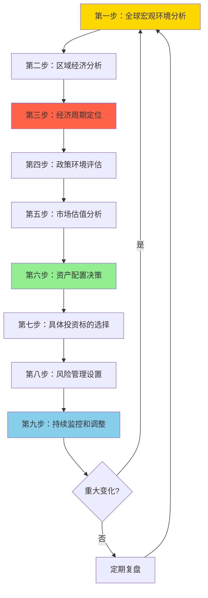

# 宏观研究流程：系统化的自上而下分析方法

## 概述

宏观研究是自上而下投资方法的核心，它要求投资者从全球经济格局出发，逐步聚焦到具体的投资机会。
一个系统化的宏观研究流程能够帮助投资者建立完整的分析框架，避免遗漏关键因素，提高投资决策的质量。

**学习目标**：
1. 掌握完整的宏观研究流程和方法论
2. 学会收集和分析关键宏观数据
3. 建立从宏观到微观的投资逻辑链条
4. 理解如何将宏观分析转化为投资决策
5. 掌握宏观研究的工具和资源

**为什么重要**：
专业的宏观研究流程是成功进行宏观投资的基础。它帮助投资者系统地理解经济环境，识别重大趋势变化，
并在正确的时机做出正确的投资决策。顶级宏观投资者如索罗斯、达里奥都有自己严谨的研究流程。

## 宏观研究流程总览

### 完整研究流程图



### 研究频率建议

**日常监控**（每日）：
- 重要经济数据发布
- 央行政策声明
- 重大地缘政治事件
- 市场价格变动

**深度研究**（每周）：
- 经济数据综合分析
- 政策动向评估
- 市场情绪变化
- 投资组合调整

**全面复盘**（每月/每季度）：
- 完整宏观研究流程
- 投资假设验证
- 策略有效性评估
- 重大调整决策


## 第一步：全球宏观环境分析

### 1.1 全球经济增长评估

**关键问题**：
- 全球经济处于什么增长阶段？
- 主要经济体的增长动力是什么？
- 是否存在系统性风险？

**数据收集**：
- 全球GDP增长率（IMF、世界银行预测）
- 主要经济体GDP增长率（美国、欧元区、中国、日本）
- 全球贸易增长率
- 全球制造业PMI
- 全球服务业PMI

**分析框架**：
```
全球经济增长 = 发达经济体增长 × 权重 + 新兴市场增长 × 权重

关注点：
- 增长是同步还是分化？
- 增长是加速还是放缓？
- 增长的可持续性如何？
```

**案例：2023年全球经济评估**
- 美国：增长韧性超预期（2.5%），消费强劲
- 欧元区：增长疲软（0.5%），能源危机影响
- 中国：复苏不及预期（5.2%），房地产拖累
- 结论：全球增长分化，美国一枝独秀

### 1.2 全球通胀环境

**关键问题**：
- 通胀处于什么水平和趋势？
- 通胀的驱动因素是什么？
- 央行如何应对？

**数据收集**：
- 主要经济体CPI和核心CPI
- PPI（生产者价格指数）
- 工资增长率
- 大宗商品价格（原油、金属、农产品）
- 通胀预期（市场隐含、调查数据）

**分析框架**：
```
通胀类型判断：
- 需求拉动型：经济过热，需求超过供给
- 成本推动型：供应链问题，能源价格上涨
- 货币型：货币超发，信贷扩张

政策含义：
- 高通胀 → 紧缩政策 → 利率上升 → 资产价格压力
- 低通胀/通缩 → 宽松政策 → 利率下降 → 资产价格支撑
```


### 1.3 全球流动性状况

**关键问题**：
- 全球流动性是宽松还是紧缩？
- 主要央行的政策立场如何？
- 资金流向哪里？

**数据收集**：
- 主要央行资产负债表规模
- 全球M2增速
- 美元流动性指标（LIBOR-OIS利差、TED利差）
- 跨境资本流动
- 外汇储备变化

**分析框架**：
```
流动性评分 = 央行政策立场 + 信贷增速 + 资金成本

宽松环境（+2到+3）：
- 央行扩表，利率下降
- 信贷快速增长
- 资金成本低
→ 利好风险资产

紧缩环境（-2到-3）：
- 央行缩表，利率上升
- 信贷收缩
- 资金成本高
→ 利空风险资产
```

### 1.4 地缘政治风险

**关键问题**：
- 存在哪些重大地缘政治风险？
- 这些风险如何影响经济和市场？
- 风险的演变方向如何？

**关注领域**：
- 大国关系（美中、美俄、美欧）
- 区域冲突（中东、东欧、东亚）
- 贸易摩擦和制裁
- 能源安全
- 技术竞争

**影响评估**：
```
地缘政治风险 → 经济影响 → 市场影响

示例：
俄乌冲突 → 能源价格飙升 → 欧洲经济衰退 → 欧洲股市下跌
美中科技脱钩 → 供应链重组 → 成本上升 → 科技股估值压力
```

## 第二步：区域经济分析

### 2.1 美国经济分析

**核心指标**：
- GDP增长率和组成（消费、投资、政府支出、净出口）
- 就业数据（非农就业、失业率、工资增长）
- 通胀数据（CPI、PCE）
- 消费者信心和支出
- 房地产市场
- 企业盈利

**分析重点**：
- 消费者健康度（储蓄率、债务负担、收入增长）
- 劳动力市场紧张度
- 通胀压力和预期
- 美联储政策路径

**数据来源**：
- 美国经济分析局（BEA）
- 美国劳工统计局（BLS）
- 美联储经济数据（FRED）
- 美联储会议纪要和声明


### 2.2 中国经济分析

**核心指标**：
- GDP增长率和三驾马车（消费、投资、出口）
- 工业增加值和PMI
- 固定资产投资（基建、房地产、制造业）
- 社会消费品零售总额
- 进出口数据
- 信贷和社融数据

**分析重点**：
- 房地产市场健康度
- 地方政府债务风险
- 消费复苏力度
- 政策支持力度
- 结构转型进展

**数据来源**：
- 国家统计局
- 中国人民银行
- 财政部
- 商务部

### 2.3 欧洲经济分析

**核心指标**：
- 欧元区GDP增长率
- 各成员国经济表现
- 通胀数据（HICP）
- 失业率
- 制造业和服务业PMI
- 银行贷款增速

**分析重点**：
- 能源依赖和价格影响
- 财政整合进展
- 银行系统健康度
- 欧央行政策空间

### 2.4 其他重要经济体

**日本**：
- 通缩风险
- 日本央行超宽松政策
- 日元汇率

**新兴市场**：
- 增长动力
- 外债风险
- 货币稳定性
- 资本流动

## 第三步：经济周期定位

### 3.1 短期债务周期判断

**判断标准**：
```
扩张早期：
- GDP增速回升
- 失业率下降
- 通胀温和
- 利率低位
- 信贷开始增长

扩张晚期：
- GDP增速高位
- 失业率低位
- 通胀上升
- 利率上升
- 信贷快速增长

收缩早期：
- GDP增速放缓
- 失业率开始上升
- 通胀见顶
- 利率高位
- 信贷增速放缓

收缩晚期：
- GDP负增长
- 失业率高位
- 通胀下降
- 利率开始下降
- 信贷收缩
```

**周期定位工具**：
- 美林时钟
- 领先指标综合指数
- 收益率曲线形态
- 信贷脉冲指标


### 3.2 长期债务周期判断

**判断标准**：
```
早期阶段（债务/GDP < 100%）：
- 债务水平低
- 信贷增长健康
- 资产价格合理
- 金融稳定

泡沫阶段（债务/GDP 100-200%）：
- 债务快速积累
- 信贷增速超过GDP增速
- 资产价格泡沫
- 投机行为增加

顶部阶段（债务/GDP > 200%）：
- 债务负担沉重
- 新增借贷困难
- 资产价格见顶
- 系统性风险上升

去杠杆化阶段：
- 债务违约增加
- 信贷紧缩
- 资产价格暴跌
- 经济深度衰退
```

**关键指标**：
- 总债务/GDP比率（政府+企业+家庭）
- 债务偿还负担/收入
- 信贷缺口（BIS指标）
- 资产价格/收入比

### 3.3 生产率趋势评估

**评估维度**：
- 技术创新速度
- 人力资本积累
- 资本深化程度
- 全要素生产率增长

**长期趋势**：
- 发达国家：2-3%
- 新兴市场：4-8%（追赶效应）
- 技术突破期：可能更高

## 第四步：政策环境评估

### 4.1 货币政策分析

**美联储政策评估**：

**政策立场判断**：
```
鸽派（宽松）：
- 利率低于中性利率
- 资产负债表扩张
- 前瞻指引偏宽松
- 对通胀容忍度高

鹰派（紧缩）：
- 利率高于中性利率
- 资产负债表收缩
- 前瞻指引偏紧缩
- 对通胀容忍度低
```

**政策路径预测**：
- 分析FOMC会议纪要
- 关注点阵图
- 跟踪美联储官员讲话
- 评估经济数据对政策的影响

**其他主要央行**：
- 欧央行：关注通胀目标和财政协调
- 中国人民银行：关注信贷投放和汇率稳定
- 日本央行：关注收益率曲线控制
- 英国央行：关注通胀和增长平衡


### 4.2 财政政策分析

**评估维度**：
- 财政赤字规模和趋势
- 政府债务/GDP比率
- 财政刺激计划
- 税收政策变化
- 基础设施投资

**可持续性评估**：
```
财政可持续性 = 债务增长率 vs GDP增长率

可持续：债务增长率 ≤ GDP增长率
不可持续：债务增长率 > GDP增长率

关注点：
- 利息支付/财政收入比率
- 债务到期结构
- 融资成本变化
```

### 4.3 监管政策分析

**关注领域**：
- 金融监管（资本要求、流动性规则）
- 行业监管（反垄断、数据隐私）
- 环境政策（碳中和、ESG）
- 贸易政策（关税、配额）

**影响评估**：
- 对特定行业的影响
- 对企业盈利的影响
- 对市场估值的影响

## 第五步：市场估值分析

### 5.1 股票市场估值

**估值指标**：
- 市盈率（P/E）：当前 vs 历史均值
- 市净率（P/B）
- 股息收益率
- 风险溢价（股票收益率 - 无风险利率）
- 席勒周期调整市盈率（CAPE）

**估值判断**：
```
低估：P/E < 历史均值 - 1个标准差
合理：P/E 在历史均值 ± 1个标准差
高估：P/E > 历史均值 + 1个标准差
严重高估：P/E > 历史均值 + 2个标准差
```

**案例：2023年美股估值**
- 标普500 P/E：约19倍
- 历史均值：约16倍
- 结论：略微高估，但考虑到低利率环境，估值可接受

### 5.2 债券市场估值

**关键指标**：
- 国债收益率水平和曲线形态
- 信用利差（企业债 - 国债）
- 实际收益率（名义收益率 - 通胀预期）
- 期限溢价

**收益率曲线分析**：
```
正常曲线（向上倾斜）：
- 长期利率 > 短期利率
- 经济正常增长
- 无衰退信号

平坦曲线：
- 长期利率 ≈ 短期利率
- 经济增长放缓
- 可能进入衰退

倒挂曲线（向下倾斜）：
- 长期利率 < 短期利率
- 衰退预警信号
- 历史上准确率高
```


### 5.3 外汇市场分析

**汇率决定因素**：
- 利率差异
- 经济增长差异
- 通胀差异
- 经常账户余额
- 资本流动
- 政治稳定性

**分析框架**：
```
购买力平价（PPP）：
长期汇率 = 两国物价水平比

利率平价（IRP）：
预期汇率变化 = 利率差异

实际有效汇率（REER）：
考虑通胀调整的贸易加权汇率
```

### 5.4 大宗商品市场

**供需分析**：
- 全球需求（经济增长、工业生产）
- 供给状况（产能、库存、地缘政治）
- 库存水平
- 季节性因素

**关键商品**：
- 原油：全球经济晴雨表
- 铜：工业金属，经济领先指标
- 黄金：避险资产，通胀对冲
- 农产品：天气、需求影响

## 第六步：资产配置决策

### 6.1 战略资产配置

**基于经济周期的配置**：

```
扩张早期（复苏）：
- 股票：60%（周期性、金融）
- 债券：30%（企业债）
- 大宗商品：5%
- 现金：5%

扩张晚期（过热）：
- 股票：40%（能源、材料）
- 债券：20%（短期债）
- 大宗商品：30%（原油、金属）
- 现金：10%

收缩早期（滞胀）：
- 股票：30%（防御性）
- 债券：30%（通胀保护债券）
- 大宗商品：20%（黄金）
- 现金：20%

收缩晚期（衰退）：
- 股票：20%（必需消费、医疗）
- 债券：60%（长期国债）
- 大宗商品：5%
- 现金：15%
```

### 6.2 战术资产配置

**基于估值的调整**：
```
如果股票高估 + 债券合理：
- 减持股票10-20%
- 增持债券10-20%

如果股票低估 + 债券高估：
- 增持股票10-20%
- 减持债券10-20%
```

**基于风险的调整**：
```
风险上升时：
- 降低风险资产比例
- 增加防御性资产
- 提高现金比例
- 考虑对冲策略

风险下降时：
- 提高风险资产比例
- 减少防御性资产
- 降低现金比例
```


## 第七步：具体投资标的选择

### 7.1 行业选择

**基于宏观环境的行业轮动**：

**经济复苏期**：
- 金融：利率上升，信贷扩张
- 工业：资本支出增加
- 可选消费：消费信心恢复
- 科技：创新投资增加

**经济过热期**：
- 能源：需求旺盛，价格上涨
- 材料：工业需求强劲
- 工业：产能利用率高

**经济滞胀期**：
- 必需消费：需求稳定
- 医疗保健：防御性
- 公用事业：稳定现金流

**经济衰退期**：
- 必需消费：刚性需求
- 医疗保健：非周期性
- 公用事业：稳定股息

### 7.2 地域选择

**评估标准**：
- 经济增长前景
- 估值水平
- 政策环境
- 货币稳定性
- 市场流动性

**配置策略**：
```
发达市场 vs 新兴市场：
- 全球增长强劲 + 美元走弱 → 增持新兴市场
- 全球增长放缓 + 美元走强 → 增持发达市场

区域配置：
- 美国：科技创新、消费强劲
- 欧洲：估值便宜、周期性
- 中国：增长潜力、政策支持
- 日本：企业改革、估值合理
```

### 7.3 个股选择

**宏观视角的选股标准**：
- 受益于宏观趋势
- 业务模式与经济周期匹配
- 财务健康，能够应对周期波动
- 估值合理
- 管理层优秀

**案例：2023年选股逻辑**
- 宏观环境：通胀回落，利率见顶
- 受益行业：科技（AI革命）、医疗（人口老龄化）
- 具体标的：NVIDIA（AI芯片）、礼来（减肥药）

## 第八步：风险管理设置

### 8.1 仓位管理

**基于宏观风险的仓位调整**：
```
低风险环境（风险评分 1-3）：
- 股票仓位：70-90%
- 债券仓位：10-20%
- 现金仓位：0-10%

中等风险环境（风险评分 4-6）：
- 股票仓位：50-70%
- 债券仓位：20-30%
- 现金仓位：10-20%

高风险环境（风险评分 7-10）：
- 股票仓位：20-40%
- 债券仓位：30-40%
- 现金仓位：20-40%
```

**风险评分体系**：
```
经济风险（0-3分）：
- 衰退概率
- 债务水平
- 金融稳定性

政策风险（0-3分）：
- 政策不确定性
- 政策转向可能性
- 政策有效性

估值风险（0-2分）：
- 市场估值水平
- 泡沫程度

地缘政治风险（0-2分）：
- 冲突风险
- 制裁风险
```


### 8.2 对冲策略

**常用对冲工具**：
- 看跌期权：保护下行风险
- 国债：负相关资产
- 黄金：避险资产
- 波动率产品（VIX）：尾部风险对冲
- 外汇对冲：汇率风险管理

**对冲时机**：
```
需要对冲的情况：
- 宏观风险显著上升
- 市场估值过高
- 政策不确定性增加
- 地缘政治紧张
- 持有集中头寸

对冲成本考虑：
- 期权费用
- 机会成本
- 对冲效果
```

### 8.3 止损和止盈

**宏观投资的止损原则**：
```
基本面止损：
- 宏观假设被证伪
- 政策环境重大变化
- 经济数据持续恶化

技术止损：
- 跌破关键支撑位
- 损失达到预设比例（如-10%）

时间止损：
- 投资逻辑未在预期时间内兑现
- 持有期超过预设时间
```

**止盈策略**：
```
目标止盈：
- 达到预期收益目标
- 估值达到合理水平

动态止盈：
- 移动止损保护利润
- 分批止盈锁定收益

情景止盈：
- 宏观环境发生预期变化
- 投资逻辑完全兑现
```

## 第九步：持续监控和调整

### 9.1 日常监控清单

**每日必看**：
- 重要经济数据发布
- 央行官员讲话
- 重大新闻事件
- 市场价格变动
- 持仓盈亏

**每周必做**：
- 经济数据综合分析
- 政策动向评估
- 市场情绪变化
- 投资组合表现
- 风险指标检查

**每月必做**：
- 完整宏观研究更新
- 投资假设验证
- 组合再平衡
- 风险敞口评估

### 9.2 触发调整的信号

**经济信号**：
- GDP增速超预期变化（±1%）
- 通胀超预期变化（±0.5%）
- 就业数据重大变化
- 信贷增速显著变化

**政策信号**：
- 央行政策立场转变
- 重大财政政策出台
- 监管政策重大调整

**市场信号**：
- 估值水平极端变化
- 市场情绪极端变化
- 流动性显著变化
- 波动率大幅上升

**地缘政治信号**：
- 重大冲突爆发
- 制裁措施出台
- 贸易协议变化


### 9.3 调整决策框架

**调整类型**：

**战术调整**（小幅调整，±5-10%）：
- 触发条件：单一指标变化
- 调整频率：每月1-2次
- 调整幅度：小
- 示例：估值略微偏离，微调仓位

**战略调整**（中等调整，±10-20%）：
- 触发条件：多个指标变化
- 调整频率：每季度1次
- 调整幅度：中等
- 示例：经济周期转换，调整行业配置

**重大调整**（大幅调整，±20-50%）：
- 触发条件：宏观环境根本变化
- 调整频率：每年0-2次
- 调整幅度：大
- 示例：金融危机爆发，大幅减仓

## 实战案例：2022-2023年宏观研究流程

### 案例背景（2022年初）

**第一步：全球宏观环境**
- 全球经济：疫情后复苏
- 通胀：40年新高（美国CPI 7%+）
- 流动性：央行开始收紧
- 地缘政治：俄乌冲突爆发

**第二步：区域经济**
- 美国：增长强劲，通胀高企
- 欧洲：能源危机，增长放缓
- 中国：疫情反复，房地产风险

**第三步：周期定位**
- 短期周期：扩张晚期/过热
- 长期周期：债务水平高
- 生产率：稳定增长

**第四步：政策环境**
- 美联储：激进加息（0% → 5%）
- 欧央行：开始加息
- 中国人民银行：保持宽松

**第五步：市场估值**
- 美股：高估（P/E 21倍）
- 债券：收益率快速上升
- 美元：走强

**第六步：资产配置决策**
```
初始配置（2022年1月）：
- 股票：40%（减持）
- 债券：30%（短久期）
- 大宗商品：20%（能源）
- 现金：10%

理由：
- 通胀高企，利率上升
- 股票估值过高
- 能源受益于供应紧张
- 保持防御性
```

**第七步：具体标的**
- 能源股：埃克森美孚、雪佛龙
- 防御股：强生、宝洁
- 避开：高估值科技股

**第八步：风险管理**
- 风险评分：7/10（高风险）
- 对冲：买入看跌期权
- 止损：-15%

**第九步：持续监控**
- 每月更新通胀和利率数据
- 跟踪美联储政策
- 监控经济衰退信号


### 调整过程（2022年中-2023年）

**2022年6月调整**：
- 触发信号：收益率曲线倒挂，衰退信号
- 调整：增持长期国债至40%，减持股票至30%

**2022年10月调整**：
- 触发信号：通胀见顶，美联储放缓加息
- 调整：开始增持优质科技股

**2023年3月调整**：
- 触发信号：银行危机（硅谷银行倒闭）
- 调整：减持金融股，增持现金

**2023年下半年调整**：
- 触发信号：AI革命，经济韧性超预期
- 调整：增持AI相关科技股

**结果**：
- 2022年：-8%（标普500 -18%）
- 2023年：+18%（标普500 +24%）
- 两年累计：+8.6%（标普500 +1.7%）

## 常见误区

### 误区1：过度依赖单一指标

**错误做法**：
只看GDP增长率或只看通胀率

**正确做法**：
建立完整的指标体系，综合分析

**教训**：
宏观经济是复杂系统，需要多维度分析

### 误区2：忽视政策影响

**错误做法**：
认为市场会自我调节，忽视央行干预

**正确做法**：
密切跟踪政策动向，理解政策传导机制

**教训**：
2008年后，央行政策对市场影响巨大

### 误区3：机械应用周期理论

**错误做法**：
认为周期会精确重复，机械套用历史规律

**正确做法**：
理解周期原理，但要考虑当前环境的特殊性

**教训**：
每个周期都有独特之处，需要灵活应对

### 误区4：预测过于精确

**错误做法**：
试图精确预测GDP增长率到小数点后两位

**正确做法**：
关注方向和趋势，而非精确数字

**教训**：
宏观预测本质上是概率判断，不是精确科学

## 研究工具和资源

### 数据来源

**宏观经济数据**：
- FRED（美联储经济数据）：https://fred.stlouisfed.org
- IMF数据库：https://www.imf.org/en/Data
- 世界银行数据：https://data.worldbank.org
- OECD数据：https://data.oecd.org
- 各国统计局官网

**金融市场数据**：
- Bloomberg Terminal（专业版，付费）
- Reuters Eikon（专业版，付费）
- Yahoo Finance（免费）
- Investing.com（免费）
- TradingView（部分免费）

**研究报告**：
- 投资银行研究报告（高盛、摩根士丹利、摩根大通）
- 对冲基金信件（桥水、索罗斯基金）
- 央行研究报告
- 国际组织报告（IMF、世界银行、BIS）


### 分析工具

**电子表格工具**：
- Excel/Google Sheets：数据分析和建模
- Python（pandas, numpy）：高级数据分析
- R：统计分析

**可视化工具**：
- Tableau：数据可视化
- Power BI：商业智能
- Python（matplotlib, seaborn）：自定义图表

**研究管理**：
- Evernote/Notion：研究笔记
- Zotero：文献管理
- Trello/Asana：研究任务管理

### 学习资源

**在线课程**：
- Coursera：宏观经济学课程
- edX：金融市场课程
- CFA协会：投资分析课程

**播客和视频**：
- Macro Voices
- Real Vision
- Bloomberg Markets
- CNBC

**社交媒体**：
- Twitter：关注经济学家和投资者
- LinkedIn：行业专家文章
- Seeking Alpha：投资分析

## 延伸阅读

### 核心著作

1. **Ray Dalio - "Principles for Navigating Big Debt Crises"**
   - 宏观研究的实战指南
   - 48个债务危机案例分析

2. **George Soros - "The Alchemy of Finance"**
   - 反身性理论
   - 宏观交易实战

3. **Howard Marks - "Mastering the Market Cycle"**
   - 周期识别和应对
   - 投资时机把握

4. **Jim Rogers - "Investment Biker"**
   - 全球宏观投资游记
   - 实地调研的重要性

5. **Mohamed El-Erian - "The Only Game in Town"**
   - 后危机时代的宏观环境
   - 央行政策的影响

### 研究报告

1. **Bridgewater Associates - Daily Observations**
   - 达里奥团队的宏观分析
   - 经济机器模型应用

2. **Goldman Sachs - Global Economics Weekly**
   - 全球经济展望
   - 政策分析

3. **JPMorgan - Global Data Watch**
   - 经济数据追踪
   - 市场影响分析

4. **BIS - Quarterly Review**
   - 国际清算银行季度报告
   - 全球金融稳定分析

## 参考文献

1. Dalio, R. (2018). *Principles for Navigating Big Debt Crises*. Bridgewater Associates.

2. Soros, G. (2003). *The Alchemy of Finance*. John Wiley & Sons.

3. Marks, H. (2018). *Mastering the Market Cycle*. Houghton Mifflin Harcourt.

4. El-Erian, M. A. (2016). *The Only Game in Town*. Random House.

5. Reinhart, C. M., & Rogoff, K. S. (2009). *This Time Is Different*. Princeton University Press.

6. Kindleberger, C. P., & Aliber, R. Z. (2011). *Manias, Panics, and Crashes*. Palgrave Macmillan.

7. Minsky, H. P. (2008). *Stabilizing an Unstable Economy*. McGraw-Hill Education.

8. Shiller, R. J. (2015). *Irrational Exuberance* (3rd ed.). Princeton University Press.

9. Taleb, N. N. (2007). *The Black Swan*. Random House.

10. Kahneman, D. (2011). *Thinking, Fast and Slow*. Farrar, Straus and Giroux.

---

**下一步学习**：
- [情景分析方法](scenario-analysis.html) - 学习如何进行情景分析
- [宏观交易策略](macro-trading-strategies.html) - 将研究转化为交易策略
- [自上而下投资方法](../04-investment-system/macro-investing/top-down-approach.html) - 宏观投资方法论

**相关主题**：
- [经济机器运作原理](economic-machine.html)
- [债务周期理论](debt-cycles.html)
- [宏观指标体系](macro-indicators.html)
