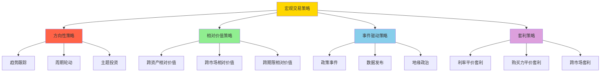
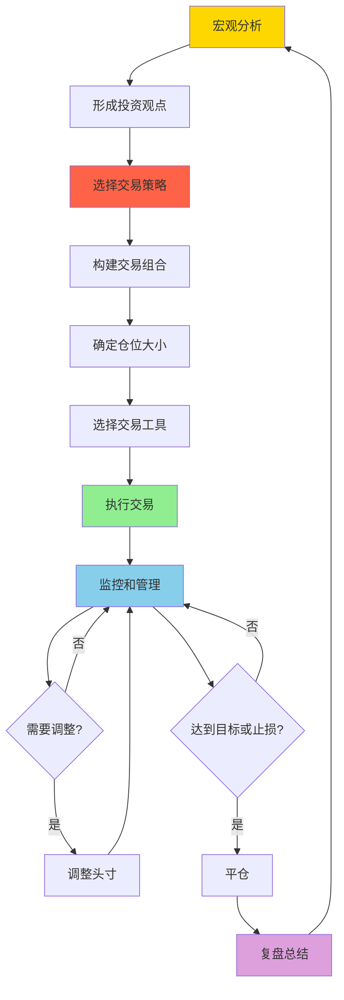

# 宏观交易策略：从分析到执行的完整框架

## 概述

宏观交易策略是将宏观经济分析转化为具体投资行动的桥梁。它要求投资者不仅要有深刻的宏观洞察，
还要有精确的执行能力和严格的风险管理。这是索罗斯、达里奥等顶级宏观投资者成功的关键。


**学习目标**：
1. 理解宏观交易策略的核心原理和类型
2. 掌握从宏观分析到交易执行的完整流程
3. 学会构建和管理宏观交易组合
4. 理解不同市场环境下的策略选择
5. 掌握宏观交易的风险管理技巧

**为什么重要**：
宏观交易是最具挑战性但也最有潜力的投资方式之一。成功的宏观交易者能够：
- 在重大经济转折点获取超额收益
- 通过多资产配置分散风险
- 利用全球市场的不平衡获利
- 在各种市场环境下保持盈利能力

## 宏观交易策略类型

### 策略分类框架



### 1. 方向性策略

**定义**：
基于对宏观经济趋势的判断，做多或做空特定资产类别。

**核心逻辑**：
```
宏观判断 → 资产价格方向 → 建立头寸

示例：
判断：经济衰退即将到来
推论：股票下跌，国债上涨
行动：做空股票，做多长期国债
```

**子策略**：

**趋势跟踪**：
- 识别并跟随主要趋势
- 使用技术指标确认趋势
- 趋势延续时持有，反转时退出
- 适用：趋势明确的市场环境

**周期轮动**：
- 根据经济周期阶段轮动资产
- 使用美林时钟等框架
- 提前布局下一阶段
- 适用：周期转换期

**主题投资**：
- 识别长期结构性趋势
- 布局受益行业和公司
- 长期持有
- 适用：确定性高的长期趋势

### 2. 相对价值策略

**定义**：
识别相关资产之间的价格失衡，通过做多低估资产、做空高估资产获利。

**核心逻辑**：
```
识别失衡 → 建立对冲头寸 → 等待收敛

示例：
观察：美股估值过高，欧股估值偏低
判断：估值将收敛
行动：做多欧股，做空美股
```

**子策略**：

**跨资产相对价值**：
- 股票 vs 债券
- 股票 vs 大宗商品
- 债券 vs 黄金
- 基于估值和周期判断

**跨市场相对价值**：
- 美国 vs 欧洲
- 发达市场 vs 新兴市场
- 中国 vs 其他亚洲
- 基于增长和估值差异

**跨期限相对价值**：
- 短期债券 vs 长期债券
- 收益率曲线交易
- 基于利率预期


### 3. 事件驱动策略

**定义**：
围绕特定宏观事件建立头寸，利用事件前后的价格波动获利。

**核心逻辑**：
```
识别事件 → 预测影响 → 提前布局 → 事件后调整

示例：
事件：美联储议息会议
预期：加息50个基点
行动：提前做空长期债券
结果：会后根据实际情况调整
```

**关键事件类型**：

**央行政策会议**：
- FOMC会议
- 欧央行会议
- 中国人民银行政策
- 交易：利率产品、汇率、股票

**重要数据发布**：
- 非农就业报告
- CPI数据
- GDP数据
- 交易：短期波动，快进快出

**地缘政治事件**：
- 选举
- 冲突
- 制裁
- 交易：避险资产、相关市场

### 4. 套利策略

**定义**：
利用不同市场或工具之间的定价偏差，通过同时买卖获取无风险或低风险收益。

**核心逻辑**：
```
发现偏差 → 建立对冲头寸 → 等待收敛 → 平仓获利

示例：
观察：美元兑欧元即期汇率 vs 远期汇率偏离利率平价
行动：套利交易
风险：极低（理论上无风险）
```

**子策略**：

**利率平价套利**：
```
理论：
远期汇率 = 即期汇率 × (1 + 本国利率) / (1 + 外国利率)

偏离时：
- 借入低利率货币
- 兑换为高利率货币
- 投资高利率资产
- 同时锁定远期汇率
```

**购买力平价套利**：
- 长期汇率偏离购买力平价
- 做多低估货币，做空高估货币
- 需要长期持有

**跨市场套利**：
- 同一资产在不同市场的价格差异
- 例如：A股 vs H股
- 买入便宜市场，卖出昂贵市场

## 宏观交易执行流程

### 完整流程图



### 第一步：形成投资观点

**投资观点模板**：
```markdown
## 投资观点

### 核心判断
[一句话总结核心观点]

### 宏观背景
- 经济增长：
- 通胀环境：
- 政策立场：
- 市场估值：

### 关键驱动因素
1. 因素1：[描述和影响]
2. 因素2：[描述和影响]
3. 因素3：[描述和影响]

### 投资逻辑
[从宏观到资产价格的传导路径]

### 时间框架
- 短期（1-3个月）：
- 中期（3-12个月）：
- 长期（1年以上）：

### 信心水平
- 高/中/低
- 理由：

### 风险因素
1. 风险1：[描述和应对]
2. 风险2：[描述和应对]
```

**示例：2024年初投资观点**
```
核心判断：
美国经济软着陆，通胀回落，美联储开始降息

宏观背景：
- 经济增长：放缓但不衰退，GDP增长1.5-2%
- 通胀环境：CPI从4%降至2.5%
- 政策立场：美联储转向宽松，降息2-3次
- 市场估值：股票略高估，债券合理

关键驱动因素：
1. 通胀持续回落：能源价格稳定，供应链恢复
2. 劳动力市场软化：失业率小幅上升至4.5%
3. 美联储政策转向：完成加息，开始降息

投资逻辑：
通胀回落 → 美联储降息 → 利率下降 → 债券上涨 + 股票估值修复

时间框架：
- 短期：观望，等待确认信号
- 中期：逐步增持利率敏感资产
- 长期：看好股票市场

信心水平：中等
理由：软着陆难度大，存在衰退风险

风险因素：
1. 通胀反弹：能源价格上涨，工资螺旋
2. 经济衰退：消费突然崩溃
3. 地缘政治：中东冲突升级
```


### 第二步：选择交易策略

**策略选择矩阵**：

```
信心水平 × 时间框架 → 策略类型

高信心 + 短期 → 方向性策略（集中押注）
高信心 + 长期 → 主题投资（长期持有）
中等信心 + 短期 → 事件驱动（灵活调整）
中等信心 + 长期 → 相对价值（对冲风险）
低信心 + 任何 → 套利策略（低风险）
```

**基于宏观环境的策略选择**：

```
经济复苏期：
- 首选：方向性策略（做多股票）
- 次选：周期轮动（金融、工业）
- 避免：防御性策略

经济过热期：
- 首选：相对价值（股票 vs 债券）
- 次选：大宗商品方向性
- 避免：长久期债券

经济滞胀期：
- 首选：大宗商品方向性
- 次选：跨资产相对价值
- 避免：股票方向性

经济衰退期：
- 首选：方向性策略（做多国债）
- 次选：防御性行业轮动
- 避免：周期性股票
```

### 第三步：构建交易组合

**组合构建原则**：

**1. 分散化**
```
资产类别分散：
- 股票：40%
- 债券：30%
- 大宗商品：15%
- 外汇：10%
- 其他：5%

地域分散：
- 美国：50%
- 欧洲：20%
- 亚洲：20%
- 新兴市场：10%

策略分散：
- 方向性：60%
- 相对价值：30%
- 套利：10%
```

**2. 相关性管理**
```
目标：
- 组合内部相关性 < 0.5
- 避免高度相关的头寸

方法：
- 计算历史相关性
- 压力测试
- 情景分析

示例：
避免同时持有：
- 做多美股 + 做多欧股（高相关）
- 做空美元 + 做多新兴市场（高相关）
```

**3. 风险平衡**
```
风险贡献平衡：
- 每个头寸的风险贡献相近
- 避免单一头寸主导风险

计算：
风险贡献 = 头寸规模 × 波动率 × 相关性

目标：
- 单一头寸风险贡献 < 20%
- 单一策略风险贡献 < 40%
```

### 第四步：确定仓位大小

**凯利公式应用**：
```
最优仓位 = (胜率 × 盈亏比 - 败率) / 盈亏比

示例：
胜率：60%
盈亏比：2:1（平均盈利/平均亏损）
败率：40%

最优仓位 = (0.6 × 2 - 0.4) / 2
         = 0.8 / 2
         = 40%

实际仓位 = 最优仓位 × 保守系数（0.5）
         = 40% × 0.5
         = 20%
```

**基于波动率的仓位调整**：
```
目标波动率法：

仓位 = 目标波动率 / 资产波动率

示例：
目标组合波动率：10%
股票波动率：20%
债券波动率：5%

股票仓位 = 10% / 20% = 50%
债券仓位 = 10% / 5% = 200%（需要杠杆）

调整后：
股票：40%
债券：60%
```

**基于信心水平的仓位**：
```
高信心（80%+）：
- 单一头寸：15-25%
- 相关头寸合计：40-50%

中等信心（60-80%）：
- 单一头寸：10-15%
- 相关头寸合计：25-35%

低信心（<60%）：
- 单一头寸：5-10%
- 相关头寸合计：15-20%
```


### 第五步：选择交易工具

**工具选择框架**：

**股票市场**：
```
现货股票：
- 优势：简单直接，无到期日
- 劣势：资金占用大，无杠杆
- 适用：长期持有，高信心

ETF：
- 优势：分散化，流动性好
- 劣势：跟踪误差
- 适用：行业/市场配置

股指期货：
- 优势：杠杆，双向交易
- 劣势：到期日，保证金要求
- 适用：短期方向性交易

期权：
- 优势：非线性收益，有限风险
- 劣势：时间价值衰减，复杂
- 适用：对冲，杠杆，波动率交易
```

**债券市场**：
```
国债现货：
- 优势：安全，流动性好
- 劣势：收益率低
- 适用：避险，长期持有

国债期货：
- 优势：杠杆，流动性极好
- 劣势：到期日
- 适用：利率方向性交易

利率互换：
- 优势：定制化，无本金交换
- 劣势：对手方风险
- 适用：利率风险管理

债券期权：
- 优势：波动率交易
- 劣势：复杂，流动性一般
- 适用：高级策略
```

**外汇市场**：
```
即期外汇：
- 优势：流动性极好，24小时交易
- 劣势：需要杠杆
- 适用：短期交易

远期外汇：
- 优势：锁定汇率
- 劣势：对手方风险
- 适用：对冲，套利

外汇期货：
- 优势：标准化，交易所保证
- 劣势：合约规模固定
- 适用：投机，对冲

外汇期权：
- 优势：非线性收益
- 劣势：成本高
- 适用：波动率交易，保护
```

**大宗商品**：
```
商品期货：
- 优势：杠杆，流动性好
- 劣势：展期成本
- 适用：方向性交易

商品ETF：
- 优势：简单，无展期操作
- 劣势：跟踪误差，管理费
- 适用：长期配置

商品期权：
- 优势：非线性收益
- 劣势：流动性一般
- 适用：波动率交易
```

### 第六步：执行交易

**执行原则**：

**1. 分批建仓**
```
避免一次性建仓：
- 降低时机风险
- 获得更好的平均价格
- 保持灵活性

分批方案：
第一批：30%（试探性）
第二批：30%（确认趋势）
第三批：40%（趋势确立）

时间间隔：
- 短期交易：1-3天
- 中期交易：1-2周
- 长期交易：1-2月
```

**2. 选择合适时机**
```
避免的时机：
- 重要数据发布前
- 市场流动性差时
- 波动率极高时

最佳时机：
- 市场情绪稳定
- 流动性充足
- 技术面配合
```

**3. 控制交易成本**
```
成本类型：
- 买卖价差
- 佣金
- 滑点
- 市场冲击

降低成本：
- 使用限价单
- 避免市价单
- 分散执行
- 选择流动性好的工具
```

**4. 记录交易**
```
交易日志内容：
- 日期时间
- 交易品种
- 买卖方向
- 数量价格
- 交易理由
- 预期目标
- 止损位置
- 实际结果
- 经验教训
```


### 第七步：监控和管理

**日常监控清单**：

**市场监控**：
```
每日必看：
- 主要指数表现
- 关键商品价格
- 汇率变动
- 债券收益率
- 波动率指数（VIX）

每周必看：
- 经济数据发布
- 央行官员讲话
- 地缘政治事件
- 企业财报
```

**头寸监控**：
```
实时监控：
- 盈亏状况
- 保证金水平
- 风险敞口
- 相关性变化

定期评估：
- 投资逻辑是否成立
- 预期是否兑现
- 风险是否可控
- 是否需要调整
```

**风险监控**：
```
关键指标：
- 组合VaR（风险价值）
- 最大回撤
- 夏普比率
- 相关性矩阵

预警信号：
- 单日损失超过2%
- 单周损失超过5%
- 单月损失超过10%
- 相关性突然上升
```

**调整决策框架**：

**加仓条件**：
```
1. 投资逻辑得到验证
2. 价格回调提供更好入场点
3. 新信息增强信心
4. 风险可控

加仓方式：
- 金字塔加仓（盈利时）
- 倒金字塔加仓（亏损时，谨慎）
```

**减仓条件**：
```
1. 投资逻辑被证伪
2. 达到目标价位
3. 风险显著上升
4. 发现更好机会

减仓方式：
- 分批减仓
- 保留核心头寸
- 设置移动止损
```

**平仓条件**：
```
止盈：
- 达到目标收益（如+20%）
- 投资逻辑完全兑现
- 风险收益比不再有吸引力

止损：
- 达到止损位（如-10%）
- 投资逻辑被证伪
- 出现更大风险

时间止损：
- 预期时间内未兑现
- 机会成本过高
```

## 经典宏观交易案例

### 案例1：索罗斯狙击英镑（1992年）

**背景**：
- 英国加入欧洲汇率机制（ERM）
- 承诺维持英镑兑德国马克汇率
- 英国经济疲软，德国经济强劲
- 英国利率高，但不足以支撑汇率

**分析**：
```
宏观判断：
- 英国经济无法承受高利率
- 英镑汇率被高估
- 英国政府无法长期维持汇率

投资逻辑：
英国经济疲软 → 需要降息 → 无法维持汇率 → 英镑贬值

风险评估：
- 上行风险：有限（汇率有上限）
- 下行风险：巨大（汇率可能大幅贬值）
- 风险收益比：极佳
```

**执行**：
```
策略：
- 大规模做空英镑
- 规模：100亿美元

工具：
- 远期外汇合约
- 外汇期权

时机：
- 1992年9月，英国政府压力最大时

结果：
- 英国退出ERM
- 英镑贬值15%
- 索罗斯获利10亿美元
```

**经验教训**：
1. 识别不可持续的政策
2. 风险收益比极佳时大胆押注
3. 理解政策制定者的约束
4. 时机选择至关重要


### 案例2：保尔森做空次贷（2007-2008）

**背景**：
- 美国房地产泡沫
- 次级贷款大量发放
- 复杂的证券化产品（CDO）
- 市场普遍乐观

**分析**：
```
宏观判断：
- 房价不可持续
- 次贷违约率将飙升
- CDO将大幅贬值

投资逻辑：
房价见顶 → 次贷违约 → CDO暴跌 → 金融危机

数据支持：
- 房价收入比历史新高
- 次贷占比快速上升
- 贷款标准持续放松
```

**执行**：
```
策略：
- 购买CDS（信用违约互换）
- 做空次贷相关CDO

工具：
- CDS合约
- 看跌期权

规模：
- 多个基金，总计数十亿美元

时机：
- 2006-2007年逐步建仓
- 2008年危机爆发时获利

结果：
- 基金回报：150%+
- 个人获利：40亿美元
```

**经验教训**：
1. 识别系统性泡沫
2. 深入研究复杂产品
3. 耐心等待逻辑兑现
4. 承受短期账面亏损
5. 风险管理至关重要

### 案例3：达里奥的全天候策略（长期）

**背景**：
- 经济环境不断变化
- 单一策略难以持续
- 需要全天候表现的组合

**分析**：
```
核心理念：
- 经济有四种状态：
  1. 增长高于预期 + 通胀高于预期
  2. 增长高于预期 + 通胀低于预期
  3. 增长低于预期 + 通胀高于预期
  4. 增长低于预期 + 通胀低于预期

- 每种状态下不同资产表现不同
- 构建在所有状态下都能表现的组合
```

**执行**：
```
资产配置：
- 股票：30%
- 长期债券：40%
- 中期债券：15%
- 大宗商品：7.5%
- 黄金：7.5%

配置原理：
- 风险平价而非资本平价
- 每类资产贡献相同风险
- 定期再平衡

结果：
- 长期年化回报：7-10%
- 波动率：10-12%
- 夏普比率：0.6-0.8
- 最大回撤：<20%
```

**经验教训**：
1. 分散化是唯一免费的午餐
2. 风险平衡比资本平衡更重要
3. 长期坚持纪律
4. 定期再平衡

## 风险管理技巧

### 1. 仓位管理

**金字塔原则**：
```
盈利时加仓：
初始：20%
第一次盈利5%后：+15%（总35%）
第二次盈利10%后：+10%（总45%）

理由：
- 验证判断正确
- 降低平均成本
- 控制风险
```

**止损设置**：
```
固定止损：
- 单笔交易：-5%
- 单日：-2%
- 单周：-5%
- 单月：-10%

动态止损：
- 移动止损：跟随价格上移
- 时间止损：超过预期时间未兑现
- 波动率止损：根据波动率调整
```

### 2. 对冲策略

**尾部风险对冲**：
```
工具：
- 看跌期权
- VIX期货
- 黄金

成本：
- 年化1-2%

时机：
- 市场平静时买入
- 危机时获利

效果：
- 限制最大损失
- 保持心理稳定
```

**相关性对冲**：
```
方法：
- 持有负相关资产
- 股票 + 国债
- 风险资产 + 避险资产

比例：
- 根据风险承受能力
- 动态调整

效果：
- 降低组合波动
- 平滑收益曲线
```


### 3. 流动性管理

**流动性储备**：
```
最低现金比例：
- 正常时期：5-10%
- 波动时期：15-20%
- 危机时期：30-40%

目的：
- 应对保证金追缴
- 把握新机会
- 心理安全垫
```

**流动性分级**：
```
高流动性（1天内变现）：
- 现金
- 国债
- 主要股指ETF

中等流动性（1周内变现）：
- 大盘股票
- 投资级债券
- 主要外汇

低流动性（1月以上）：
- 小盘股票
- 高收益债券
- 新兴市场
- 另类投资

配置原则：
- 高流动性：>50%
- 中等流动性：30-40%
- 低流动性：<20%
```

### 4. 心理管理

**情绪控制**：
```
避免的心理陷阱：
- 过度自信
- 损失厌恶
- 锚定效应
- 确认偏差
- 羊群效应

应对方法：
- 严格遵守纪律
- 记录交易日志
- 定期复盘
- 寻求反馈
- 保持谦逊
```

**压力管理**：
```
减压技巧：
- 设置合理预期
- 接受不确定性
- 分散投资
- 保持现金储备
- 定期休息

危机应对：
- 提前制定预案
- 避免恐慌决策
- 保持冷静
- 寻求支持
```

## 常见误区

### 误区1：过度交易

**错误做法**：
频繁调整头寸，追逐短期波动

**正确做法**：
基于宏观判断，中长期持有

**教训**：
- 交易成本侵蚀收益
- 噪音交易损害判断
- 宏观趋势需要时间兑现

### 误区2：忽视风险管理

**错误做法**：
全仓押注单一观点

**正确做法**：
分散投资，设置止损

**教训**：
- 一次重大损失可能毁掉多年收益
- 风险管理是长期生存的关键

### 误区3：事后诸葛亮

**错误做法**：
根据结果评判决策

**正确做法**：
根据决策时的信息和逻辑评判

**教训**：
- 好的决策可能有坏的结果
- 坏的决策可能有好的结果
- 关注过程而非结果

### 误区4：线性外推

**错误做法**：
假设趋势会永远持续

**正确做法**：
识别拐点，及时调整

**教训**：
- 趋势总会反转
- 均值回归是铁律
- 保持灵活性

## 实用工具

### 交易计划模板

```markdown
## 宏观交易计划

### 基本信息
- 日期：
- 交易员：
- 策略类型：

### 宏观观点
- 核心判断：
- 关键驱动因素：
- 时间框架：
- 信心水平：

### 交易设置
- 交易品种：
- 方向：做多/做空
- 入场价格：
- 目标价格：
- 止损价格：
- 仓位大小：
- 风险收益比：

### 风险管理
- 最大损失：
- 对冲措施：
- 调整条件：

### 监控指标
- 关键数据：
- 技术指标：
- 市场情绪：

### 退出策略
- 止盈条件：
- 止损条件：
- 时间止损：

### 备注
- 特殊考虑：
- 相关交易：
```

### 交易日志模板

```markdown
## 交易日志

### 交易信息
- 日期：
- 品种：
- 方向：
- 数量：
- 入场价：
- 出场价：
- 盈亏：
- 盈亏比例：

### 交易理由
- 宏观背景：
- 技术面：
- 催化剂：

### 执行情况
- 是否按计划执行：
- 偏离原因：
- 情绪状态：

### 结果分析
- 预期是否兑现：
- 意外因素：
- 做对的地方：
- 做错的地方：

### 经验教训
- 关键学习点：
- 改进措施：
- 下次注意事项：
```


## 延伸阅读

### 核心著作

1. **George Soros - "The Alchemy of Finance"**
   - 反身性理论
   - 宏观交易实战案例
   - 投资哲学

2. **Ray Dalio - "Principles"**
   - 系统化决策方法
   - 全天候策略
   - 风险管理

3. **Stanley Druckenmiller - 访谈和演讲**
   - 宏观交易大师
   - 与索罗斯合作经历
   - 交易哲学

4. **Paul Tudor Jones - 纪录片和访谈**
   - 宏观交易传奇
   - 风险管理第一
   - 市场心理学

5. **Sebastian Mallaby - "More Money Than God"**
   - 对冲基金历史
   - 宏观交易策略演变
   - 经典案例分析

### 研究报告

1. **Bridgewater Associates - Daily Observations**
   - 达里奥团队的宏观分析
   - 投资策略思考

2. **Tudor Investment Corporation - 研究报告**
   - 保罗·都铎·琼斯的宏观视角

3. **Soros Fund Management - 投资者信件**
   - 索罗斯的投资思考

### 学术研究

1. **Fung, W., & Hsieh, D. A. (2001). "The Risk in Hedge Fund Strategies"**
   - 对冲基金策略风险分析

2. **Ang, A., Gorovyy, S., & van Inwegen, G. B. (2011). "Hedge Fund Leverage"**
   - 杠杆使用研究

3. **Asness, C., Moskowitz, T., & Pedersen, L. H. (2013). "Value and Momentum Everywhere"**
   - 跨资产策略研究

## 参考文献

1. Soros, G. (2003). *The Alchemy of Finance*. John Wiley & Sons.

2. Dalio, R. (2017). *Principles: Life and Work*. Simon & Schuster.

3. Mallaby, S. (2010). *More Money Than God: Hedge Funds and the Making of a New Elite*. Penguin Press.

4. Schwager, J. D. (2012). *Hedge Fund Market Wizards*. John Wiley & Sons.

5. Covel, M. W. (2009). *Trend Following: Learn to Make Millions in Up or Down Markets*. FT Press.

6. Taleb, N. N. (2007). *The Black Swan*. Random House.

7. Marks, H. (2011). *The Most Important Thing*. Columbia University Press.

8. Fung, W., & Hsieh, D. A. (2001). "The Risk in Hedge Fund Strategies: Theory and Evidence from Trend Followers." *Review of Financial Studies*, 14(2), 313-341.

9. Ang, A., Gorovyy, S., & van Inwegen, G. B. (2011). "Hedge Fund Leverage." *Journal of Financial Economics*, 102(1), 102-126.

10. Asness, C., Moskowitz, T., & Pedersen, L. H. (2013). "Value and Momentum Everywhere." *Journal of Finance*, 68(3), 929-985.

11. Jegadeesh, N., & Titman, S. (1993). "Returns to Buying Winners and Selling Losers." *Journal of Finance*, 48(1), 65-91.

12. Carhart, M. M. (1997). "On Persistence in Mutual Fund Performance." *Journal of Finance*, 52(1), 57-82.

13. Fama, E. F., & French, K. R. (2012). "Size, Value, and Momentum in International Stock Returns." *Journal of Financial Economics*, 105(3), 457-472.

14. Moskowitz, T. J., Ooi, Y. H., & Pedersen, L. H. (2012). "Time Series Momentum." *Journal of Financial Economics*, 104(2), 228-250.

15. Brunnermeier, M. K., & Pedersen, L. H. (2009). "Market Liquidity and Funding Liquidity." *Review of Financial Studies*, 22(6), 2201-2238.

---

**下一步学习**：
- [宏观研究流程](macro-research-process.html) - 系统化的宏观研究方法
- [情景分析方法](scenario-analysis.html) - 应对不确定性的工具
- [全球宏观策略](../04-investment-system/macro-investing/global-macro-strategies.html) - 宏观投资方法论

**相关主题**：
- [经济机器运作原理](economic-machine.html)
- [债务周期理论](debt-cycles.html)
- [风险管理](../04-investment-system/risk-management/risk-types.html)
- [索罗斯反身性理论](../04-investment-system/macro-investing/soros-reflexivity.html)
- [达里奥投资原则](../04-investment-system/macro-investing/dalio-principles.html)
