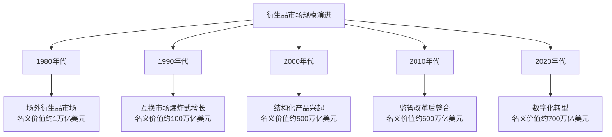

# 衍生品市场发展史：从农产品对冲到金融工程

## 概述

衍生品（Derivatives）是金融市场中最复杂、最具争议的工具之一。它们既是企业管理风险的有效手段，也是引发金融危机的潜在炸弹。从古代美索不达米亚的粮食远期合约，到现代华尔街的信用违约互换（CDS），衍生品市场经历了数千年的演进，如今已成为一个名义价值超过600万亿美元的庞大市场。

理解衍生品的历史，不仅是理解金融创新的过程，更是理解人类如何在不确定性中寻求确定性的努力——以及这种努力有时如何走向失控。

**学习目标**：
- 理解衍生品从古代到现代的完整演进脉络
- 掌握期货、期权、互换等主要衍生品的历史起源
- 认识重大衍生品危机的成因和教训
- 理解金融工程学的发展对衍生品市场的影响
- 建立对衍生品"双刃剑"特性的辩证认识

## 第一阶段：古代起源（公元前-1600s）

### 最早的远期合约

**美索不达米亚的粮食合约**：

衍生品的历史可以追溯到公元前1750年左右的古巴比伦。《汉谟拉比法典》中记载了关于未来交付商品的合约条款，这被认为是人类历史上最早的远期合约记录。

这些早期合约的特征：
- 约定未来某一时间以固定价格交付粮食或其他商品
- 帮助农民锁定销售价格，规避丰收年价格暴跌的风险
- 帮助商人锁定采购成本，规避歉收年价格暴涨的风险

**古希腊的期权雏形**：

古希腊哲学家泰勒斯（Thales of Miletus，约公元前624-546年）被记载为使用了类似期权的工具。据亚里士多德《政治学》记载，泰勒斯通过天文观测预测来年橄榄将大丰收，于是在冬季以低价预付定金，锁定了来年橄榄榨油机的使用权。丰收年到来时，他将使用权高价转租，获得了丰厚利润。

这一故事展示了期权的核心特征：
- 支付少量权利金（定金）
- 获得未来以约定价格购买或使用某物的权利
- 如果预测错误，损失仅限于权利金

### 日本大阪的米期货

**堂岛米市场（1730年）**：

世界上第一个有组织的期货交易所诞生于日本大阪。1730年，德川幕府正式批准了堂岛米市场（Dojima Rice Market）的期货交易，这是人类历史上第一个标准化期货合约交易所。

堂岛米市场的创新：
- **标准化合约**：统一了合约规格（数量、质量、交割地点）
- **保证金制度**：要求交易双方缴纳保证金，降低违约风险
- **清算机制**：建立了集中清算制度
- **价格发现**：通过公开竞价形成透明价格

这些制度创新为现代期货市场奠定了基础，比芝加哥期货交易所早了约120年。

## 第二阶段：现代期货市场的建立（1800s-1900s）

### 芝加哥期货交易所的诞生

**农业经济的需求**：

19世纪中叶，芝加哥成为美国中西部农产品的集散中心。每年秋收后，大量粮食涌入市场，价格暴跌；春季粮食短缺时，价格又暴涨。这种剧烈的价格波动给农民和粮食商人都带来了巨大风险。

**1848年：CBOT 成立**：

1848年，芝加哥期货交易所（Chicago Board of Trade，CBOT）成立，最初主要进行现货交易。1865年，CBOT 推出了标准化的玉米和小麦期货合约，这是现代期货市场的真正起点。

CBOT 的制度创新：
- **标准化合约**：统一规格，便于交易和流通
- **保证金制度**：控制信用风险
- **每日结算**：每日盯市，防止损失积累
- **实物交割**：合约到期可进行实物交割

**1874年：芝加哥商品交易所**：

1874年，芝加哥商品交易所（Chicago Produce Exchange，后改名为 CME）成立，专注于黄油、鸡蛋等农产品期货。1919年，CME 正式成立，逐步扩展到更多商品品种。

### 金融期货的诞生

**布雷顿森林体系的崩溃**：

1971年，尼克松总统宣布美元与黄金脱钩，布雷顿森林固定汇率体系崩溃。此后，主要货币汇率开始自由浮动，汇率风险成为企业面临的重大挑战。

**1972年：货币期货**：

1972年，CME 推出了世界上第一批货币期货合约，包括英镑、加拿大元、德国马克等。这标志着期货市场从商品领域扩展到金融领域，开启了金融衍生品时代。

**1975年：利率期货**：

1975年，CBOT 推出了第一个利率期货合约（基于政府国家抵押贷款协会证券）。1977年，30年期美国国债期货推出，成为全球交易量最大的利率期货之一。

**1982年：股指期货**：

1982年，堪萨斯城期货交易所推出了第一个股指期货合约（基于价值线综合指数）。同年，CME 推出了 S&P 500 指数期货，这一合约至今仍是全球最重要的股指期货之一。

## 第三阶段：期权市场的现代化（1970s-1990s）

### Black-Scholes 模型：金融工程的里程碑

**期权定价的难题**：

在1973年之前，期权交易虽然存在，但缺乏科学的定价方法。期权价格主要依赖经验和直觉，市场效率低下，流动性差。

**1973年：Black-Scholes 模型**：

1973年，费希尔·布莱克（Fischer Black）和迈伦·斯科尔斯（Myron Scholes）发表了划时代的论文《期权和公司负债的定价》，提出了著名的 Black-Scholes 期权定价模型。同年，罗伯特·默顿（Robert Merton）独立发展了类似的模型。

Black-Scholes 模型的核心假设：
- 股票价格遵循几何布朗运动
- 无风险利率和波动率恒定
- 市场无摩擦（无交易成本、无税收）
- 可以连续交易

模型的意义：
- 提供了期权的理论定价公式
- 引入了"隐含波动率"概念
- 推动了期权市场的爆炸式增长
- 开创了金融工程学这一新学科

斯科尔斯和默顿因此获得1997年诺贝尔经济学奖（布莱克于1995年去世，未能获奖）。

**1973年：CBOE 成立**：

与 Black-Scholes 模型发表同年，芝加哥期权交易所（CBOE）成立，这是世界上第一个标准化期权交易所。CBOE 的成立将期权交易从场外市场（OTC）引入有组织的交易所，大幅提升了市场透明度和流动性。

### 互换市场的兴起

**利率互换的诞生**：

1981年，世界银行与 IBM 公司完成了第一笔现代意义上的货币互换交易，由所罗门兄弟公司（Salomon Brothers）担任中间人。这笔交易标志着互换市场的正式诞生。

互换（Swap）的基本原理：
- 两方约定在未来一系列时间点交换现金流
- 利率互换：固定利率与浮动利率的交换
- 货币互换：不同货币现金流的交换
- 信用违约互换（CDS）：信用风险的转移

**互换市场的爆炸式增长**：

1980年代，互换市场从无到有，迅速成长为全球最大的衍生品市场之一。国际互换与衍生品协会（ISDA）于1985年成立，制定了标准化的互换合约文本，大幅降低了交易成本。

## 第四阶段：金融工程与结构化产品（1990s-2007）

### 结构化产品的兴起

**资产证券化**：

1970年代，美国政府支持机构（房利美、房地美）开始将抵押贷款打包成证券出售，这是资产证券化的起点。1980年代，私人机构开始发行抵押贷款支持证券（MBS）和资产支持证券（ABS）。

资产证券化的逻辑：
- 将流动性差的资产（如贷款）转化为可交易证券
- 通过分层（Tranching）满足不同风险偏好的投资者
- 将信用风险从银行转移到资本市场
- 理论上提高了金融体系的效率

**CDO 的诞生**：

1987年，德崇证券（Drexel Burnham Lambert）创造了第一个担保债务凭证（CDO，Collateralized Debt Obligation）。CDO 将多种债务工具打包，按风险等级分层出售，理论上可以将低评级资产转化为高评级证券。

**信用违约互换（CDS）**：

1994年，摩根大通的布莱斯·马斯特斯（Blythe Masters）团队创造了信用违约互换（CDS）。CDS 允许债权人将信用风险转移给第三方，类似于信用保险。

CDS 的设计初衷是帮助银行管理信用风险，但它很快演变为投机工具，允许投资者在不持有债券的情况下对其信用状况进行押注。

### 衍生品市场的规模扩张

## 第五阶段：危机与反思（2007-至今）

### 2008年金融危机：衍生品的黑暗时刻

**次贷危机的根源**：

2000年代初，美国房地产市场繁荣，银行大量发放次级抵押贷款（Subprime Mortgage）。这些贷款被打包成 MBS，再进一步打包成 CDO，通过复杂的结构化产品分散到全球投资者手中。

问题的核心：
- **模型风险**：评级机构使用的风险模型严重低估了相关性风险
- **道德风险**：贷款发放者不承担风险，缺乏审慎动机
- **透明度缺失**：复杂的结构化产品难以评估真实风险
- **杠杆过高**：金融机构通过衍生品大幅提高杠杆率

**AIG 的崩溃**：

美国国际集团（AIG）通过其金融产品部门出售了大量 CDS，为价值约5000亿美元的 CDO 提供信用保护。当房价下跌、CDO 价值暴跌时，AIG 面临天文数字的赔付义务，最终需要美国政府1820亿美元的救助才得以避免破产。

AIG 的案例揭示了 CDS 市场的系统性风险：
- 风险集中在少数大型机构
- 缺乏集中清算，对手方风险难以评估
- 监管缺失，场外衍生品市场几乎不受监管

**雷曼兄弟的倒闭**：

2008年9月15日，雷曼兄弟申请破产，成为美国历史上最大的破产案。雷曼持有大量与房地产相关的衍生品头寸，其倒闭引发了全球金融市场的连锁反应，充分暴露了衍生品市场的系统性风险。

### 监管改革：多德-弗兰克法案

**2010年改革**：

2008年金融危机后，美国国会于2010年通过了《多德-弗兰克华尔街改革和消费者保护法》（Dodd-Frank Act），对衍生品市场进行了全面改革：

- **集中清算要求**：标准化场外衍生品必须通过中央对手方（CCP）清算
- **交易报告要求**：所有衍生品交易必须向交易数据库报告
- **保证金要求**：非集中清算的衍生品交易需缴纳更高保证金
- **沃尔克规则**：限制银行自营交易，防止利益冲突

**全球协调改革**：

G20 国家在2009年匹兹堡峰会上达成共识，推动全球衍生品市场改革：
- 标准化合约通过交易所或电子平台交易
- 集中清算降低对手方风险
- 提高透明度，加强监管

### 近年发展趋势

**加密货币衍生品**：

2017年，芝加哥商品交易所（CME）和芝加哥期权交易所（CBOE）相继推出比特币期货，标志着加密货币衍生品进入主流金融市场。此后，以太坊期货、比特币期权等产品相继推出。

**ESG 衍生品**：

随着可持续投资的兴起，碳排放权期货、绿色债券衍生品等 ESG 相关衍生品快速发展，为企业管理气候风险提供了新工具。

**人工智能与衍生品定价**：

机器学习和人工智能技术开始应用于衍生品定价和风险管理，挑战了传统的 Black-Scholes 框架，特别是在处理非线性风险和极端事件方面展现出优势。

## 衍生品的双刃剑效应

### 正面价值

衍生品在现代经济中发挥着不可替代的作用：

1. **风险管理**：企业可以对冲汇率、利率、商品价格风险
2. **价格发现**：期货市场提供了对未来价格的预期信息
3. **流动性提供**：做市商通过衍生品管理风险，提供市场流动性
4. **资本效率**：衍生品允许以较少资本获得较大风险敞口

### 潜在风险

同时，衍生品也带来了独特的风险：

1. **杠杆风险**：小额保证金控制大额头寸，损失可能超过本金
2. **对手方风险**：场外衍生品面临交易对手违约风险
3. **流动性风险**：市场压力下，衍生品流动性可能急剧下降
4. **模型风险**：定价模型的假设可能在极端情况下失效
5. **系统性风险**：衍生品的相互关联可能放大金融危机

## 历史教训与投资启示

### 核心教训

1. **复杂性不等于安全性**：越复杂的产品往往越难以评估真实风险
2. **相关性在危机中趋向1**：分散化在极端情况下可能失效
3. **监管滞后于创新**：金融创新往往超前于监管，留下监管真空
4. **激励机制至关重要**：风险承担者与风险后果承担者的分离是危机根源

### 对投资者的建议

1. **理解工具再使用**：在使用衍生品前，必须充分理解其风险特征
2. **对冲而非投机**：衍生品最适合用于对冲已有风险，而非纯粹投机
3. **警惕过度杠杆**：高杠杆可能带来高回报，但也可能导致全部损失
4. **关注对手方风险**：场外衍生品需要评估交易对手的信用状况

## 延伸阅读

- 《说谎者的扑克牌》- 迈克尔·刘易斯（华尔街衍生品文化）
- 《大空头》- 迈克尔·刘易斯（CDS 与次贷危机）
- 《当天才失败》- 罗杰·洛温斯坦（LTCM 的崩溃）
- 《黑天鹅》- 纳西姆·塔勒布（极端事件与风险管理）
- 《期权、期货及其他衍生品》- 约翰·赫尔（衍生品教材经典）

## 参考文献

1. Hull, J. C. (2021). *Options, Futures, and Other Derivatives* (11th ed.). Pearson.
2. Black, F., & Scholes, M. (1973). The Pricing of Options and Corporate Liabilities. *Journal of Political Economy*, 81(3), 637-654.
3. Lewis, M. (2010). *The Big Short: Inside the Doomsday Machine*. W. W. Norton & Company.
4. Lowenstein, R. (2000). *When Genius Failed: The Rise and Fall of Long-Term Capital Management*. Random House.
5. Taleb, N. N. (2007). *The Black Swan: The Impact of the Highly Improbable*. Random House.
6. Das, S. (2010). *Traders, Guns & Money: Knowns and Unknowns in the Dazzling World of Derivatives*. FT Press.
7. Gorton, G. B. (2010). *Slapped by the Invisible Hand: The Panic of 2007*. Oxford University Press.
8. Financial Crisis Inquiry Commission. (2011). *The Financial Crisis Inquiry Report*. U.S. Government Printing Office.
9. BIS. (2023). *OTC Derivatives Statistics at End-June 2023*. Bank for International Settlements.
10. Merton, R. C. (1973). Theory of Rational Option Pricing. *Bell Journal of Economics and Management Science*, 4(1), 141-183.
