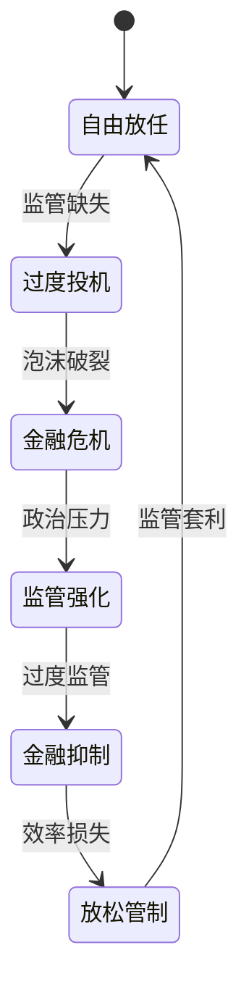

# 金融监管演进史：从自由放任到审慎监管

## 概述

金融监管的历史是一部危机与改革的循环史。每一次重大金融危机都暴露了监管的不足，推动了新一轮监管改革；而过度监管又可能抑制金融创新，引发放松管制的呼声。这种钟摆式的摆动贯穿了现代金融监管的整个历史。

从19世纪的自由放任主义，到1930年代大萧条后的严格管制，再到1980年代的金融自由化浪潮，再到2008年金融危机后的全面监管重建，金融监管的演进折射出人类对金融市场本质认识的不断深化。

**学习目标**：
- 理解金融监管从无到有的历史演进脉络
- 掌握各主要监管框架的核心内容和历史背景
- 认识危机与监管改革之间的因果关系
- 理解不同监管哲学（自由放任 vs 审慎监管）的利弊
- 建立对当代监管框架的历史视角

## 第一阶段：自由放任时代（1800s-1929）

### 19世纪的监管真空

**自由放任主义的盛行**：

19世纪，亚当·斯密的"看不见的手"理论主导了经济思想。主流观点认为，市场能够自我调节，政府干预只会扭曲市场效率。金融市场基本处于自我监管状态，政府干预极为有限。

这一时期的典型特征：
- 银行可以自由发行货币（自由银行时代）
- 证券发行几乎不受监管
- 内幕交易和市场操纵合法
- 投资者保护几乎为零

**早期监管尝试**：

尽管自由放任主义盛行，一些早期监管尝试还是出现了：

- **1720年英国《泡沫法案》**：南海泡沫后，英国禁止未经授权的股份公司，但这更多是保护既有垄断利益，而非保护投资者
- **1863年美国《国家银行法》**：建立了国家银行体系，要求银行持有政府债券作为准备金
- **1864年美国《货币监理署》**：成立货币监理署（OCC），监管国家特许银行

**1907年银行恐慌**：

1907年，美国爆发了严重的银行恐慌。铜矿投机失败引发连锁反应，多家银行和信托公司面临挤兑。最终，金融家 J.P. 摩根组织私人救助，才避免了更大规模的崩溃。

这次危机暴露了缺乏中央银行的严重问题，直接推动了美联储的建立。

### 美联储的诞生（1913）

**《联邦储备法》**：

1913年，美国国会通过《联邦储备法》，建立了联邦储备系统（Federal Reserve System）。美联储的设立是美国金融监管史上的里程碑：

- 作为"最后贷款人"，在银行危机时提供流动性
- 统一货币政策，稳定货币供应
- 监管成员银行
- 管理支付清算系统

然而，美联储的建立并未解决证券市场的监管真空问题，1920年代的投机狂潮在几乎没有监管的环境下野蛮生长。

## 第二阶段：大萧条与监管重建（1929-1970s）

### 1929年大崩盘的监管教训

**崩盘前的监管缺失**：

1929年大崩盘前，美国证券市场存在严重的监管漏洞：

- **保证金交易无限制**：投资者可以用10%的保证金购买股票，杠杆率高达10倍
- **内幕交易合法**：公司内部人员可以利用非公开信息交易
- **市场操纵普遍**："股票池"（Stock Pool）操纵价格是公开的秘密
- **信息披露缺失**：公司无需向投资者披露财务信息
- **银行混业经营**：商业银行可以从事证券承销和自营交易

**罗斯福新政的监管革命**：

1933-1934年，富兰克林·罗斯福总统推行新政，对金融体系进行了根本性改革：

**1933年《证券法》（Securities Act of 1933）**：
- 要求证券发行必须向投资者披露充分信息
- 建立了注册制度，发行人必须向政府登记
- 禁止证券发行中的欺诈行为
- 确立了"买者有保护"（Caveat Emptor 的反面）原则

**1934年《证券交易法》（Securities Exchange Act of 1934）**：
- 成立证券交易委员会（SEC），专门监管证券市场
- 要求上市公司定期披露财务信息
- 禁止内幕交易和市场操纵
- 监管证券经纪商和交易所

**1933年《格拉斯-斯蒂格尔法》（Glass-Steagall Act）**：
- 将商业银行与投资银行业务强制分离
- 禁止商业银行承销证券
- 建立联邦存款保险公司（FDIC），保护储户
- 对银行存款利率设置上限（Q条例）

这些改革构建了美国金融监管的基本框架，影响延续了数十年。

### 战后监管体系的完善

**1940年《投资公司法》和《投资顾问法》**：

1940年，美国进一步完善了对投资公司（共同基金）和投资顾问的监管：
- 要求投资公司向 SEC 注册
- 规定投资公司的治理结构和信息披露要求
- 对投资顾问实施注册和监管

**国际监管协调的早期尝试**：

二战后，布雷顿森林体系建立了国际货币基金组织（IMF）和世界银行，开始了国际金融监管协调的早期尝试。然而，这一时期的国际监管协调主要集中在汇率稳定，而非金融市场监管。

## 第三阶段：金融自由化浪潮（1970s-2000s）

### 放松管制的思潮

**理论基础**：

1970年代，有效市场假说（EMH）和理性预期理论的兴起为放松管制提供了理论依据。主流经济学家认为：
- 市场能够有效处理信息，监管干预只会降低效率
- 金融创新有助于风险分散，提高经济效率
- 过度监管阻碍了金融市场的发展

**里根-撒切尔时代的自由化**：

1980年代，美国里根政府和英国撒切尔政府掀起了金融自由化浪潮：

- **1980年《存款机构放松管制和货币控制法》**：逐步取消存款利率上限
- **1982年《加恩-圣日耳曼存款机构法》**：扩大储蓄机构的业务范围
- **1986年英国"大爆炸"改革**：伦敦金融城全面放松管制，允许外资机构进入

**1999年《金融服务现代化法》**：

1999年，美国通过《格雷姆-里奇-比利雷法》（Gramm-Leach-Bliley Act），正式废除了《格拉斯-斯蒂格尔法》中关于商业银行与投资银行分业经营的规定，允许金融控股公司同时从事银行、证券和保险业务。

这一改革被认为是2008年金融危机的重要制度根源之一。

### 衍生品监管的缺失

**1994年《商品期货现代化法》**：

2000年，美国通过《商品期货现代化法》（Commodity Futures Modernization Act），明确将场外衍生品（包括信用违约互换）排除在 CFTC 和 SEC 的监管范围之外。

这一决定的背景：
- 格林斯潘等人认为衍生品市场能够自我监管
- 金融机构游说反对监管
- 担心过度监管会将业务转移到海外

事后证明，这是一个灾难性的决定，为2008年金融危机埋下了祸根。

### 安然事件与萨班斯-奥克斯利法案

**安然丑闻（2001）**：

2001年，美国能源巨头安然公司（Enron）爆发会计丑闻，通过复杂的表外实体隐藏债务，虚报利润，最终破产。安然丑闻暴露了公司治理和审计监管的严重缺陷。

**2002年《萨班斯-奥克斯利法案》**：

安然丑闻后，美国国会迅速通过了《萨班斯-奥克斯利法案》（Sarbanes-Oxley Act），大幅加强了对上市公司的监管：

- **CEO/CFO 认证**：要求高管对财务报告的准确性承担个人责任
- **内部控制报告**：要求公司评估并报告内部控制的有效性
- **审计委员会独立性**：要求审计委员会完全由独立董事组成
- **审计师独立性**：限制审计师向客户提供非审计服务
- **公众公司会计监督委员会（PCAOB）**：成立独立机构监管审计行业

## 第四阶段：2008年危机与全面监管重建

### 危机暴露的监管漏洞

**系统性监管失败**：

2008年金融危机是自大萧条以来最严重的金融危机，暴露了监管体系的全面失败：

```mermaid
graph TD
    A[监管失败的根源] --> B[机构监管碎片化]
    A --> C[影子银行无监管]
    A --> D[衍生品市场不透明]
    A --> E[顺周期监管规则]
    A --> F[系统重要性机构缺乏监管]
    
    B --> B1[银行、证券、保险<br/>分属不同监管机构]
    C --> C1[货币市场基金、<br/>结构化投资工具等<br/>游离于监管之外]
    D --> D1[场外衍生品<br/>无集中清算<br/>无透明度要求]
    E --> E1[资本要求在繁荣期<br/>降低，危机期提高<br/>放大了周期波动]
    F --> F1[雷曼、AIG等<br/>"大而不倒"机构<br/>缺乏特殊监管]
```

### 多德-弗兰克法案（2010）

**美国的全面改革**：

2010年，美国通过了《多德-弗兰克华尔街改革和消费者保护法》（Dodd-Frank Act），这是自1930年代以来最全面的金融监管改革：

**系统性风险监管**：
- 成立金融稳定监督委员会（FSOC），协调各监管机构
- 识别和监管"系统重要性金融机构"（SIFI）
- 建立有序清算机制，解决"大而不倒"问题

**银行监管强化**：
- 提高资本和流动性要求
- 沃尔克规则：限制银行自营交易
- 压力测试：定期评估银行在极端情景下的抗风险能力

**衍生品市场改革**：
- 标准化场外衍生品必须通过中央对手方清算
- 要求向交易数据库报告所有衍生品交易
- 提高非集中清算衍生品的保证金要求

**消费者保护**：
- 成立消费者金融保护局（CFPB）
- 加强对抵押贷款、信用卡等消费金融产品的监管

### 巴塞尔协议的演进

**巴塞尔 I（1988）**：

1988年，巴塞尔银行监管委员会发布了第一个国际银行资本协议（巴塞尔 I），要求银行持有相当于风险加权资产8%的资本。这是国际银行监管协调的重要里程碑。

**巴塞尔 II（2004）**：

2004年，巴塞尔 II 发布，引入了更精细的风险权重计算方法，允许银行使用内部模型评估风险。然而，批评者认为巴塞尔 II 过于依赖银行自身的风险模型，且具有顺周期性。

**巴塞尔 III（2010-2019）**：

2008年金融危机后，巴塞尔委员会推出了巴塞尔 III，大幅提高了资本和流动性要求：

- **资本要求**：提高核心一级资本（CET1）要求至4.5%，加上2.5%的资本留存缓冲
- **杠杆率要求**：引入不基于风险权重的杠杆率上限（3%）
- **流动性要求**：引入流动性覆盖率（LCR）和净稳定资金比率（NSFR）
- **系统重要性银行附加资本**：全球系统重要性银行（G-SIB）需持有额外资本

## 第五阶段：当代监管挑战（2010s-至今）

### 金融科技的监管挑战

**监管套利与创新**：

金融科技（FinTech）的兴起给传统监管框架带来了新挑战：

- **P2P 借贷**：游离于传统银行监管之外，引发了中国 P2P 爆雷潮
- **加密货币**：比特币等加密货币挑战了传统货币监管框架
- **稳定币**：Facebook 的 Libra（后改名 Diem）计划引发全球监管机构警惕
- **DeFi**：去中心化金融（DeFi）几乎完全游离于现有监管框架之外

**监管沙盒**：

为平衡创新与监管，英国金融行为监管局（FCA）于2016年率先推出"监管沙盒"（Regulatory Sandbox）制度，允许金融科技公司在受控环境中测试创新产品，同时享受一定的监管豁免。这一模式被全球多个国家和地区效仿。

### 气候风险与 ESG 监管

**气候风险纳入金融监管**：

近年来，气候变化风险开始被纳入金融监管框架：

- **气候压力测试**：欧洲央行、英格兰银行等开始对银行进行气候压力测试
- **气候信息披露**：SEC、欧盟等监管机构要求上市公司披露气候相关风险
- **绿色分类标准**：欧盟推出可持续金融分类法（EU Taxonomy），界定"绿色"投资标准
- **央行绿色资产购买**：部分央行开始将气候因素纳入资产购买决策

### 中国金融监管的演进

**从分业监管到统一监管**：

中国金融监管体系经历了从分业监管到统一监管的重大转变：

- **1992-2018年**：银监会、证监会、保监会分别监管银行、证券、保险
- **2018年**：银监会与保监会合并为银保监会，强化统一监管
- **2023年**：成立国家金融监督管理总局，进一步整合监管职能

**重大监管事件**：

- **2015年股灾**：A股市场暴跌，监管机构采取多项干预措施，引发争议
- **2017年金融去杠杆**：整治影子银行、互联网金融乱象
- **2020-2021年科技监管**：对阿里巴巴、腾讯等科技巨头的金融业务实施严格监管
- **P2P 清零**：全面清退 P2P 网贷平台，保护投资者利益

## 监管演进的规律与启示

### 危机-改革的循环



### 监管的核心矛盾

金融监管始终面临几个核心矛盾：

1. **效率 vs 稳定**：严格监管提高稳定性，但可能抑制创新和效率
2. **国内 vs 国际**：单一国家的严格监管可能导致业务外流
3. **规则 vs 原则**：详细规则易于执行但可能被规避；原则导向灵活但执行困难
4. **事前 vs 事后**：预防性监管成本高，但危机后的救助成本更高

### 对投资者的启示

1. **监管环境是投资的重要背景**：了解所在市场的监管框架，有助于评估投资风险
2. **监管变化创造投资机会**：监管收紧往往打压相关行业股价，但也可能创造长期价值
3. **监管套利的风险**：利用监管漏洞的商业模式面临监管收紧的风险
4. **合规是长期竞争优势**：在监管日趋严格的环境下，合规能力是企业的核心竞争力

## 延伸阅读

- 《大而不倒》- 安德鲁·罗斯·索尔金（2008年金融危机与政府救助）
- 《监管资本主义的兴起》- 约翰·布雷斯韦特（监管理论）
- 《金融的本质》- 本·伯南克（美联储与金融危机）
- 《这次不同》- 卡门·莱因哈特、肯尼斯·罗格夫（金融危机历史）
- 《格林斯潘的非理性繁荣》- 塞巴斯蒂安·马拉比（美联储与金融自由化）

## 参考文献

1. Bernanke, B. S. (2015). *The Courage to Act: A Memoir of a Crisis and Its Aftermath*. W. W. Norton & Company.
2. Reinhart, C. M., & Rogoff, K. S. (2009). *This Time Is Different: Eight Centuries of Financial Folly*. Princeton University Press.
3. Sorkin, A. R. (2009). *Too Big to Fail: The Inside Story of How Wall Street and Washington Fought to Save the Financial System*. Viking.
4. Stiglitz, J. E. (2010). *Freefall: America, Free Markets, and the Sinking of the World Economy*. W. W. Norton & Company.
5. Basel Committee on Banking Supervision. (2017). *Basel III: Finalising Post-Crisis Reforms*. Bank for International Settlements.
6. Financial Stability Board. (2023). *Global Monitoring Report on Non-Bank Financial Intermediation*. FSB.
7. Admati, A., & Hellwig, M. (2013). *The Bankers' New Clothes: What's Wrong with Banking and What to Do about It*. Princeton University Press.
8. Zingales, L. (2012). *A Capitalism for the People: Recapturing the Lost Genius of American Prosperity*. Basic Books.
9. 中国人民银行金融稳定局. (2023). 《中国金融稳定报告》. 中国金融出版社.
10. 吴晓灵. (2018). 《中国金融监管改革》. 中国金融出版社.
