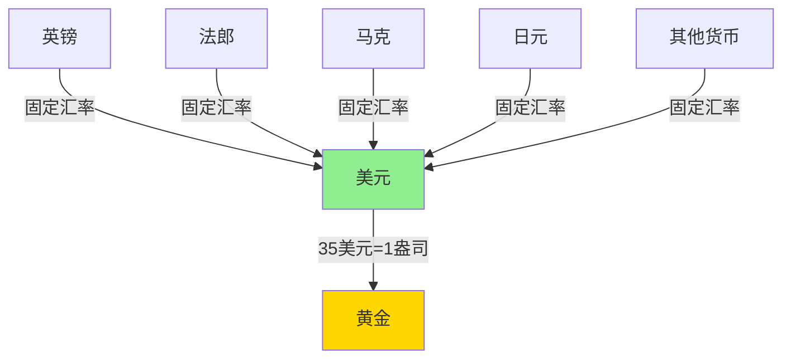

# 布雷顿森林体系

## 概述

布雷顿森林体系（Bretton Woods System）是二战后建立的国际货币体系，从 1944 年建立到 1971 年崩溃，主导了战后 27 年的全球金融秩序。这一体系确立了美元的霸权地位，创建了国际货币基金组织（IMF）和世界银行，深刻影响了现代国际金融格局。理解布雷顿森林体系，是理解当今美元体系和全球金融秩序的关键。

## 体系的诞生

### 历史背景

**二战后的世界**：
- 欧洲经济满目疮痍
- 美国经济实力空前强大
- 黄金储备高度集中于美国
- 需要重建国际货币秩序

**战前教训**：
- 1930 年代竞争性贬值
- 贸易保护主义盛行
- 国际合作机制缺失
- 经济民族主义导致战争

### 1944 年布雷顿森林会议

**会议背景**：
- 1944 年 7 月，44 个国家代表
- 美国新罕布什尔州布雷顿森林
- 讨论战后国际货币安排

**两大方案博弈**：

**凯恩斯方案（英国）**：
- 创建国际清算联盟
- 发行超主权货币"Bancor"
- 各国货币与 Bancor 挂钩
- 更加平等的国际体系

**怀特方案（美国）**：
- 美元与黄金挂钩
- 其他货币与美元挂钩
- 美国主导的体系
- 美元成为国际储备货币

**最终结果**：
- 美国方案获胜（实力决定话语权）
- 美元霸权体系确立
- 凯恩斯的理想主义败给现实主义

## 体系的核心机制

### 双挂钩制度

**第一层挂钩**：美元与黄金
- 1 盎司黄金 = 35 美元（官方价格）
- 美国承诺按此价格兑换黄金
- 仅对外国中央银行和政府

**第二层挂钩**：各国货币与美元
- 各国货币与美元保持固定汇率
- 汇率波动限制在 ±1% 以内
- 超出范围需央行干预

### 主要特征

**1. 可调整的固定汇率**：
- 基本汇率固定
- 出现"根本性失衡"可调整
- 调整需 IMF 批准

**2. 资本管制**：
- 允许各国实施资本管制
- 鼓励贸易自由化
- 限制投机性资本流动

**3. 国际机构**：
- 国际货币基金组织（IMF）
- 国际复兴开发银行（世界银行）
- 提供流动性支持和发展援助

## 国际机构的角色

### 国际货币基金组织（IMF）

**主要职能**：
- 监督汇率政策
- 提供短期流动性支持
- 促进国际货币合作
- 维护汇率稳定

**运作机制**：
- 成员国缴纳份额（Quota）
- 份额决定投票权和借款额度
- 美国拥有最大份额和否决权

**特别提款权（SDR）**：
- 1969 年创设
- 补充国际储备
- 由一篮子货币组成
- 但作用有限

### 世界银行

**主要职能**：
- 提供长期发展贷款
- 支持战后重建
- 促进发展中国家发展

**初期重点**：
- 欧洲战后重建
- 后转向发展中国家
- 基础设施建设
- 减贫项目

## 体系的运作

### 黄金时代（1950-1960s）

**经济繁荣**：
- 战后重建快速推进
- 国际贸易迅速增长
- 经济增长率创历史新高
- 汇率稳定促进投资

**数据表现**：
- 1950-1973 年全球 GDP 年均增长 5%
- 国际贸易年均增长 8%
- 发达国家失业率低
- 通胀率温和

**马歇尔计划**：
- 美国援助欧洲重建
- 1948-1952 年投入 130 亿美元
- 促进美元流向欧洲
- 缓解美元短缺

### 特里芬难题（Triffin Dilemma）

**核心矛盾**：

经济学家罗伯特·特里芬 1960 年提出的根本性矛盾：

**两难选择**：
- **选择 A**：增加美元供应 → 满足国际需求 → 美国逆差 → 美元信用下降
- **选择 B**：维持美元信用 → 减少美元供应 → 国际流动性不足 → 制约经济增长

**历史验证**：
- 美国选择了增加美元供应
- 贸易逆差持续扩大
- 黄金储备不断流失
- 最终导致体系崩溃

### 黄金流失危机

**美国黄金储备变化**：

| 年份 | 黄金储备（吨） | 美元负债（亿美元） | 覆盖率 |
|------|--------------|------------------|--------|
| 1950 | 20,279 | 82 | 247% |
| 1960 | 15,821 | 210 | 75% |
| 1965 | 13,806 | 293 | 47% |
| 1970 | 9,838 | 476 | 21% |
| 1971 | 8,584 | 610 | 14% |

**危机加剧**：
- 1960 年伦敦黄金市场恐慌
- 1968 年黄金双价制（官方价 vs 市场价）
- 各国纷纷兑换黄金
- 美国黄金储备告急

## 体系的崩溃

### 压力累积

**经济因素**：
- 美国通胀率上升
- 越战支出激增
- "大炮加黄油"政策
- 财政赤字扩大

**国际因素**：
- 欧洲和日本经济复苏
- 德国和日本出口竞争力增强
- 美国贸易逆差扩大
- 美元高估

**投机压力**：
- 市场预期美元贬值
- 投机者抛售美元
- 各国央行兑换黄金
- 黄金储备加速流失

### 1971 年尼克松冲击

**历史性时刻**：
- 1971 年 8 月 15 日
- 尼克松总统电视讲话
- 宣布暂停美元兑换黄金
- "暂停"实际上是永久性的

**新经济政策**：
- 关闭黄金窗口
- 征收 10% 进口附加税
- 实施工资价格管制
- 单方面改变国际规则

**全球震荡**：
- 各国货币纷纷浮动
- 黄金价格飙升
- 国际金融市场动荡
- 布雷顿森林体系名存实亡

### 史密森协定（1971.12）

**最后的努力**：
- 十国集团达成协议
- 美元贬值 7.89%（黄金价格升至 38 美元/盎司）
- 汇率波动幅度扩大到 ±2.25%
- 试图维持固定汇率

**短命协定**：
- 1973 年再次崩溃
- 主要货币转向浮动汇率
- 布雷顿森林体系正式终结
- 进入牙买加体系时代

## 体系的历史意义

### 积极贡献

**1. 战后经济复苏**：
- 提供稳定的货币环境
- 促进国际贸易增长
- 支持欧洲和日本重建
- 创造战后黄金时代

**2. 国际合作机制**：
- 建立 IMF 和世界银行
- 创造多边合作框架
- 这些机构延续至今
- 成为全球经济治理基础

**3. 美元国际化**：
- 确立美元储备货币地位
- 美元成为国际贸易计价货币
- 美元霸权延续至今
- 美国获得巨大铸币税收益

**4. 汇率稳定**：
- 固定但可调整的汇率
- 减少汇率波动风险
- 促进长期投资
- 有利于经济规划

### 深层问题

**1. 不对称性**：
- 美国享有特权地位
- 其他国家承担调整成本
- 美国可以输出通胀
- 国际货币体系不公平

**2. 内在矛盾**：
- 特里芬难题无解
- 固定汇率与资本流动不兼容
- 国家主权与国际规则冲突
- 体系崩溃不可避免

**3. 霸权依赖**：
- 体系依赖美国实力
- 美国实力相对下降
- 体系失去支撑
- 霸权稳定论的验证

## 对现代金融的影响

### 美元霸权的延续

**布雷顿森林体系崩溃后**：
- 美元与黄金脱钩
- 但美元霸权地位未变
- 转向石油美元体系
- 美元仍是主要储备货币

**美元霸权的基础**：
- 美国经济实力
- 深度金融市场
- 军事力量支撑
- 网络效应和惯性

### 浮动汇率时代

**新的汇率制度**：
- 主要货币自由浮动
- 汇率由市场决定
- 各国货币政策独立性增强
- 但汇率波动加剧

**多样化选择**：
- 自由浮动（美元、欧元、日元）
- 管理浮动（人民币）
- 固定汇率（港币）
- 货币联盟（欧元区）

### 国际金融体系演变

**IMF 角色转变**：
- 从监督固定汇率到监督浮动汇率
- 从提供流动性到危机救助
- 从发达国家到发展中国家
- 从货币问题到结构改革

**新的挑战**：
- 全球失衡问题
- 货币战争风险
- 金融危机频发
- 国际协调困难

## 投资启示

### 1. 理解货币体系演变

**核心认知**：
- 货币体系不是永恒的
- 体系变迁影响资产价格
- 理解体系内在矛盾
- 为未来变化做准备

**历史规律**：
- 霸权货币终将衰落
- 新的体系会出现
- 黄金在转型期受益
- 多元化配置降低风险

### 2. 美元资产配置

**美元的特殊地位**：
- 仍是主要储备货币
- 美元资产流动性最好
- 危机时期避险属性
- 但长期贬值压力

**配置策略**：
- 保持一定美元资产
- 关注美国财政状况
- 监控美元信用风险
- 分散货币风险

### 3. 黄金的战略价值

**布雷顿森林崩溃后黄金表现**：
- 1971 年：35 美元/盎司
- 1980 年：850 美元/盎司（峰值）
- 2011 年：1,900 美元/盎司
- 2020 年：2,000 美元/盎司

**配置逻辑**：
- 货币体系转型期黄金受益
- 对冲美元贬值风险
- 央行持续增持黄金
- 长期保值功能

### 4. 关注货币体系风险

**当前风险点**：
- 美国债务高企
- 美元信用受质疑
- 去美元化趋势
- 数字货币挑战

**应对策略**：
- 多元化货币配置
- 关注新兴储备货币
- 配置实物资产
- 保持灵活性

### 5. 汇率风险管理

**浮动汇率时代**：
- 汇率波动加剧
- 影响跨境投资收益
- 需要对冲汇率风险
- 或利用汇率波动

**实践方法**：
- 分散投资多个货币区
- 使用外汇衍生品对冲
- 关注汇率趋势
- 择时调整配置

## 延伸阅读

### 经典著作

1. **《布雷顿森林货币战》** - 本·斯泰尔
   - 布雷顿森林会议详细历史
   - 凯恩斯与怀特的博弈
   - 权威历史著作

2. **《嚣张的特权》** - 巴里·艾肯格林
   - 美元霸权的历史和未来
   - 国际货币体系演变
   - 深刻的学术分析

3. **《货币战争》** - 詹姆斯·里卡兹
   - 货币体系的地缘政治
   - 未来货币体系展望
   - 投资策略建议

### 学术论文

1. **"The Bretton Woods System: A Historical Overview"** - Michael Bordo
   - 布雷顿森林体系全面回顾
   - 学术权威文献

2. **"The Triffin Dilemma Revisited"** - 多位学者
   - 特里芬难题的现代意义
   - 对当前美元体系的启示

### 历史文献

- IMF 官方历史档案
- 布雷顿森林会议记录
- 尼克松讲话录音和文稿
- 各国央行历史资料

## 关键要点总结

1. **布雷顿森林体系**是二战后建立的国际货币体系，确立了美元霸权地位

2. **双挂钩机制**：美元与黄金挂钩，其他货币与美元挂钩，形成固定汇率体系

3. **特里芬难题**揭示了体系的内在矛盾：美元供应与美元信用不可兼得

4. **1971 年尼克松冲击**关闭黄金窗口，布雷顿森林体系崩溃

5. **历史意义**：促进战后经济繁荣，建立国际合作机制，确立美元霸权

6. **现代影响**：美元霸权延续，浮动汇率成为主流，国际金融体系持续演变

7. **投资启示**：理解货币体系演变，关注美元信用风险，配置黄金对冲，管理汇率风险

---

**下一步学习**：[信用货币时代](credit-money-era.html) - 了解 1971 年后的货币体系演变

[← 返回货币历史](index.html)

