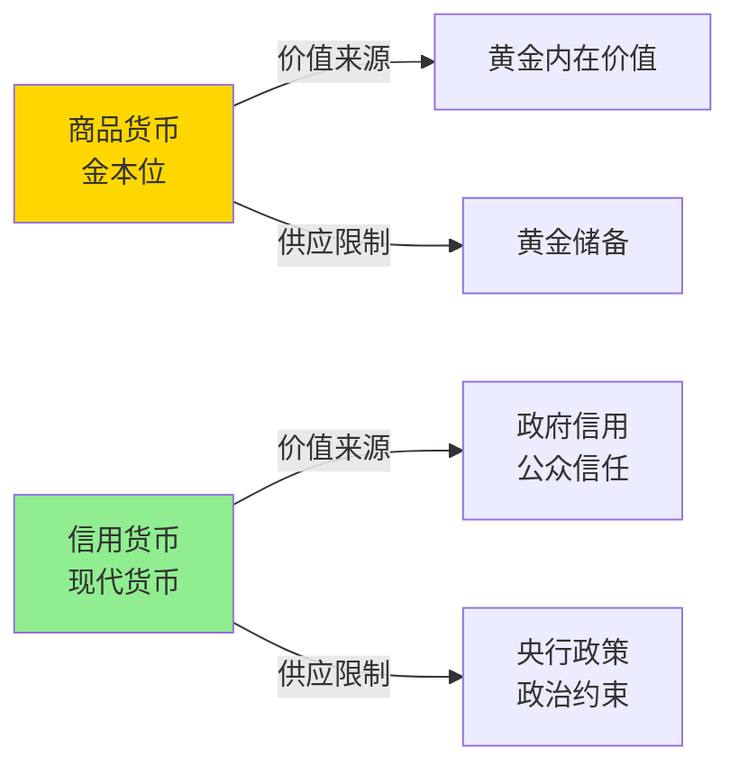
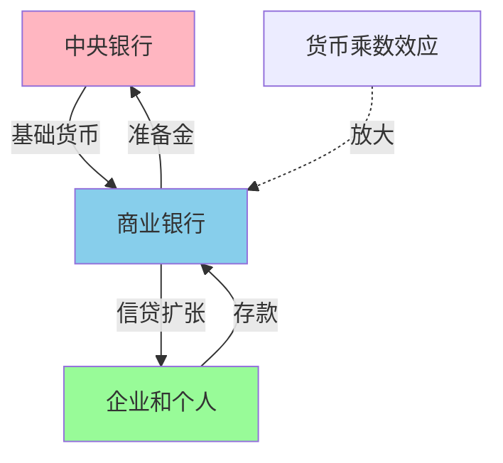
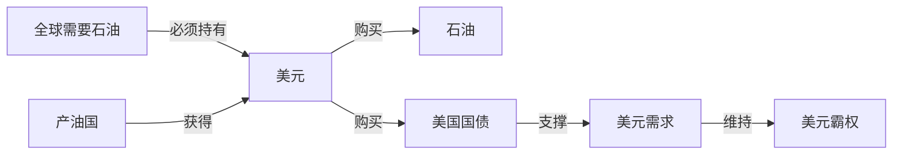

# 信用货币时代

## 概述

1971 年布雷顿森林体系崩溃后，人类进入了纯信用货币时代（Fiat Money Era）。货币不再与黄金或任何实物资产挂钩，其价值完全建立在政府信用和公众信任之上。这一转变带来了货币政策的巨大灵活性，但也引发了通货膨胀、债务膨胀和金融危机等新问题。理解信用货币时代的运作机制和深层逻辑，是现代投资者的必修课。

## 信用货币的本质

### 什么是信用货币

**定义**：
信用货币（Fiat Money）是由政府法令宣布为法定货币，不与任何实物资产挂钩，其价值完全依赖于政府信用和公众信任的货币。

**核心特征**：
- 无内在价值（纸币本身价值极低）
- 不可兑换实物（不能兑换黄金或白银）
- 法定强制流通（法律规定必须接受）
- 供应量由央行决定（理论上可无限发行）

### 信用货币 vs 商品货币



**对比分析**：

| 维度 | 商品货币（金本位） | 信用货币 |
|------|------------------|---------|
| 价值基础 | 黄金内在价值 | 政府信用 |
| 供应限制 | 黄金储备 | 央行决策 |
| 发行成本 | 高（需黄金储备） | 低（印刷成本） |
| 政策灵活性 | 低（受黄金约束） | 高（自主决定） |
| 通胀风险 | 低（供应受限） | 高（可能滥发） |
| 应对危机 | 能力有限 | 灵活调控 |

### 货币创造机制

**现代货币创造的三个层次**：



**第一层：中央银行创造基础货币**
- 印刷纸币
- 购买国债（量化宽松）
- 向商业银行贷款
- 外汇储备增加

**第二层：商业银行创造存款货币**
- 部分准备金制度
- 贷款创造存款
- 货币乘数效应
- M2 远大于 M0

**第三层：影子银行创造准货币**
- 货币市场基金
- 资产证券化
- 回购市场
- 进一步放大货币供应

**货币乘数公式**：
```
货币乘数 = 1 / 准备金率

示例：
准备金率 = 10%
货币乘数 = 1 / 0.1 = 10

央行投放 1 亿基础货币
→ 银行体系最终创造 10 亿货币供应
```

## 信用货币时代的演进

### 第一阶段：混乱调整期（1971-1982）

**特征**：
- 从固定汇率到浮动汇率
- 石油危机冲击
- 滞胀（高通胀 + 低增长）
- 货币政策摸索

**重大事件**：

**1973 年第一次石油危机**：
- 石油价格从 3 美元/桶涨到 12 美元/桶
- 输入性通胀
- 经济衰退
- 失业率上升

**1979 年第二次石油危机**：
- 石油价格涨到 40 美元/桶
- 美国通胀率超过 13%
- 经济陷入滞胀
- 传统政策失效

**沃尔克冲击（1979-1982）**：
- 保罗·沃尔克出任美联储主席
- 大幅提高利率（最高达 20%）
- 以经济衰退为代价遏制通胀
- 重建美联储信誉

**成果**：
- 通胀率从 13% 降至 3%
- 美元信用恢复
- 为后续繁荣奠定基础
- 但代价是严重衰退

### 第二阶段：大缓和时期（1982-2007）

**特征**：
- 经济稳定增长
- 通胀率温和
- 金融创新繁荣
- 全球化加速

**经济表现**：
- GDP 稳定增长（年均 3%）
- 通胀率控制在 2-3%
- 失业率下降
- 资产价格上涨

**货币政策框架**：
- 通胀目标制（Inflation Targeting）
- 独立的中央银行
- 前瞻性指引
- 泰勒规则

**金融创新**：
- 资产证券化
- 衍生品市场爆发
- 影子银行崛起
- 金融工程发展

**全球化红利**：
- 中国加入 WTO（2001）
- 全球供应链整合
- 制造业成本下降
- 抑制通胀压力

**隐藏的风险**：
- 债务快速积累
- 资产泡沫膨胀
- 金融监管放松
- 收入不平等加剧

### 第三阶段：金融危机与非常规政策（2008-2020）

**2008 年全球金融危机**：

**危机爆发**：
- 次贷危机引发
- 雷曼兄弟破产（2008.9.15）
- 金融系统濒临崩溃
- 全球经济衰退

**政策应对**：

**1. 量化宽松（QE）**：


**美联储 QE 规模**：
- QE1（2008-2010）：1.7 万亿美元
- QE2（2010-2011）：6,000 亿美元
- QE3（2012-2014）：1.6 万亿美元
- 总计：约 4 万亿美元

**2. 零利率政策（ZIRP）**：
- 联邦基金利率降至 0-0.25%
- 持续 7 年（2008-2015）
- 鼓励借贷和投资
- 压低储蓄收益

**3. 前瞻性指引**：
- 承诺长期低利率
- 影响市场预期
- 降低长期利率
- 支持经济复苏

**4. 财政刺激**：
- 大规模政府支出
- 减税措施
- 失业救济
- 基础设施投资

**效果与争议**：

**积极效果**：
- 避免了大萧条重演
- 金融系统稳定
- 经济逐步复苏
- 失业率下降

**负面影响**：
- 资产价格泡沫
- 贫富差距扩大
- 债务水平飙升
- 金融风险积累

**欧债危机（2010-2012）**：
- 希腊主权债务危机
- 欧元区面临解体风险
- 欧洲央行推出 OMT
- 德拉吉"不惜一切代价"

### 第四阶段：疫情冲击与极端宽松（2020-2021）

**COVID-19 疫情冲击**：

**经济停摆**：
- 2020 年 Q2 美国 GDP 暴跌 31.4%
- 失业率飙升至 14.7%
- 全球供应链中断
- 需求骤降

**史无前例的政策应对**：

**货币政策**：
- 利率降至零
- 无限量 QE
- 购买公司债
- 直接向企业贷款

**财政政策**：
- 美国：5.3 万亿美元刺激
- 直接发钱给居民
- 企业纾困
- 失业补助

**货币供应爆炸**：
- 2020 年美国 M2 增长 25%
- 创历史最高增速
- 全球央行同步放水
- 流动性泛滥

**后果**：
- 经济快速反弹
- 资产价格暴涨
- 通胀压力累积
- 为后续加息埋下伏笔

### 第五阶段：通胀回归与政策转向（2021-至今）

**通胀飙升**：
- 2021 年通胀率突破 5%
- 2022 年达到 9.1%（40 年新高）
- 供应链瓶颈
- 需求过热
- 能源价格上涨

**政策急转弯**：

**激进加息**：
- 2022-2023 年加息 11 次
- 利率从 0% 升至 5.5%
- 加息速度创 40 年最快
- 抑制通胀

**缩表（QT）**：
- 缩减资产负债表
- 回收流动性
- 推高长期利率
- 收紧金融条件

**效果**：
- 通胀率回落至 3-4%
- 经济韧性超预期
- 劳动力市场强劲
- 软着陆希望增加

## 信用货币时代的核心问题

### 1. 通货膨胀倾向

**长期通胀趋势**：

```
金本位时期（1870-1913）：
年均通胀率 ≈ 0%

信用货币时期（1971-2023）：
年均通胀率 ≈ 4%

购买力变化：
1971 年的 1 美元 = 2023 年的 7.5 美元
购买力损失 87%
```

**通胀的原因**：
- 货币供应无硬约束
- 政府有通胀激励（减轻债务负担）
- 央行独立性不足
- 政治压力（就业优先）

**通胀的影响**：
- 储蓄贬值
- 债务人受益
- 收入分配扭曲
- 社会不稳定

### 2. 债务膨胀

**全球债务水平**：

| 年份 | 全球债务/GDP | 美国政府债务/GDP |
|------|-------------|----------------|
| 1971 | 100% | 35% |
| 2000 | 200% | 55% |
| 2008 | 280% | 65% |
| 2023 | 350% | 120% |

**债务膨胀的逻辑**：


**债务陷阱**：
- 债务增长快于 GDP
- 利息负担加重
- 需要更多债务偿还旧债
- 最终依赖货币化

### 3. 金融危机频发

**信用货币时代的主要危机**：

- 1987 年股灾
- 1997 年亚洲金融危机
- 2000 年互联网泡沫
- 2008 年全球金融危机
- 2010 年欧债危机
- 2020 年疫情冲击

**危机频率**：
- 金本位时期：约 20 年一次
- 信用货币时期：约 7-10 年一次

**原因分析**：
- 货币政策过度宽松
- 资产泡沫易形成
- 金融杠杆过高
- 道德风险（央行兜底）

### 4. 贫富差距扩大

**财富不平等加剧**：

**美国基尼系数**：
- 1970 年：0.39
- 2023 年：0.49

**顶层 1% 财富占比**：
- 1970 年：23%
- 2023 年：35%

**原因**：
- 资产价格膨胀（富人持有更多资产）
- 工资增长停滞
- 金融化加剧
- 货币政策偏向资产持有者

## 石油美元体系

### 从黄金到石油

**1971 年后的挑战**：
- 美元与黄金脱钩
- 美元信用基础削弱
- 需要新的支撑

**石油美元的诞生**：

**1974 年美沙协议**：
- 沙特石油只用美元计价
- 沙特购买美国国债
- 美国提供军事保护
- 其他 OPEC 国家跟随

**机制**：


### 石油美元的影响

**对美国的好处**：
- 维持美元需求
- 可以持续贸易逆差
- 低成本融资
- 铸币税收益

**对全球的影响**：
- 美元成为必需品
- 各国积累美元储备
- 美国货币政策外溢
- 新兴市场脆弱性

**去美元化趋势**：
- 中国推动人民币石油结算
- 俄罗斯减少美元使用
- 欧元挑战美元
- 数字货币兴起

## 现代货币理论（MMT）

### 核心观点

**主要主张**：
- 拥有货币主权的国家不会破产
- 政府可以印钞偿还本币债务
- 财政赤字不是问题
- 通胀是唯一约束

**政策含义**：
- 大规模财政支出
- 充分就业优先
- 不必担心赤字
- 用税收控制通胀

### 争议与批评

**支持者**：
- 日本实践（高债务但未崩溃）
- 2020 年疫情应对
- 解决失业问题
- 基础设施投资

**批评者**：
- 忽视通胀风险
- 可能导致恶性通胀
- 削弱财政纪律
- 历史教训（委内瑞拉、津巴布韦）

**现实检验**：
- 2020-2021 年大规模刺激
- 2022 年通胀飙升
- MMT 理论受质疑
- 但辩论仍在继续

## 投资启示

### 1. 理解通胀是常态

**核心认知**：
- 信用货币时代通胀不可避免
- 现金长期贬值
- 必须投资才能保值增值
- 选择抗通胀资产

**应对策略**：
- 持有股权资产（股票、房地产）
- 配置实物资产（黄金、大宗商品）
- 避免长期持有现金
- 关注实际收益率

### 2. 关注货币政策周期

**政策周期对资产价格的影响**：

| 阶段 | 货币政策 | 股票 | 债券 | 黄金 | 现金 |
|------|---------|------|------|------|------|
| 宽松期 | 降息、QE | ↑↑ | ↑ | ↑ | ↓ |
| 收紧期 | 加息、QT | ↓ | ↓↓ | ↑ | ↑ |
| 危机期 | 极度宽松 | ↓→↑ | ↑ | ↑↑ | ↑ |

**实践方法**：
- 跟踪央行政策信号
- 理解政策传导机制
- 提前调整资产配置
- 顺应政策周期

### 3. 债务周期视角

**长期债务周期**（达里奥框架）：
- 债务扩张期：加杠杆，资产上涨
- 债务顶峰期：杠杆率过高，风险累积
- 去杠杆期：债务收缩，资产下跌
- 新周期开始：货币宽松，重新加杠杆

**投资策略**：
- 识别周期位置
- 扩张期：增加风险资产
- 顶峰期：降低杠杆，增加防御
- 去杠杆期：持有现金和黄金
- 新周期：重新配置风险资产

### 4. 美元周期与新兴市场

**美元周期**：
- 美元走强：新兴市场承压
- 美元走弱：新兴市场受益

**投资时机**：
- 美元强势期：避开新兴市场
- 美元弱势期：增配新兴市场
- 关注美联储政策
- 监控资本流动

### 5. 黄金的战略配置

**黄金在信用货币时代的表现**：
- 1971 年：35 美元/盎司
- 2023 年：2,000 美元/盎司
- 年化收益率：约 8%
- 跑赢通胀

**配置理由**：
- 对冲货币贬值
- 对冲地缘政治风险
- 央行持续增持
- 负相关性（与股票）

**建议配置**：
- 投资组合的 5-10%
- 长期持有
- 不追涨杀跌
- 作为保险而非投机

### 6. 警惕货币幻觉

**货币幻觉**：
- 名义收益 vs 实际收益
- 忽视通胀影响
- 高估投资回报

**示例**：
```
名义收益：10%
通胀率：4%
实际收益：6%

名义收益：5%
通胀率：6%
实际收益：-1%（实际亏损）
```

**正确做法**：
- 关注实际收益率
- 扣除通胀后的回报
- 比较不同资产的实际收益
- 长期视角

## 未来展望

### 当前挑战

**1. 高债务困境**：
- 全球债务/GDP 超过 350%
- 利息负担加重
- 财政空间受限
- 债务可持续性存疑

**2. 通胀与增长的平衡**：
- 控制通胀需要紧缩
- 紧缩可能导致衰退
- 政策两难
- 软着陆难度大

**3. 货币体系变革**：
- 美元霸权受挑战
- 数字货币兴起
- 去美元化趋势
- 多极化货币体系

### 可能的演变路径

**路径 1：维持现状**
- 美元继续主导
- 温和通胀持续
- 债务缓慢增长
- 周期性危机

**路径 2：货币重置**
- 债务危机爆发
- 货币体系重构
- 可能回归某种锚定
- 剧烈调整

**路径 3：数字货币时代**
- 央行数字货币普及
- 私人数字货币共存
- 货币体系数字化
- 新的监管框架

**路径 4：多极化体系**
- 美元、欧元、人民币并存
- 区域货币联盟
- 特别提款权扩大使用
- 更加平衡的体系

## 延伸阅读

### 经典著作

1. **《债务和魔鬼》** - 阿代尔·特纳
   - 金融危机与债务问题
   - 货币政策的局限
   - 深刻的政策分析

2. **《货币的终结》** - 本杰明·科恩
   - 货币体系的未来
   - 数字货币的挑战
   - 地缘政治视角

3. **《大债危机》** - 瑞·达里奥
   - 债务周期理论
   - 历史案例研究
   - 投资应对策略

### 学术论文

1. **"The Future of Money"** - IMF
   - 货币体系演变
   - 数字货币影响
   - 政策建议

2. **"Inflation Targeting in the Post-Crisis Era"** - 多位学者
   - 货币政策框架反思
   - 新的挑战
   - 政策创新

### 实时资源

- 美联储官网：政策声明和数据
- 国际清算银行（BIS）：全球货币研究
- 各国央行网站：政策动态
- 金融时报、华尔街日报：市场分析

## 关键要点总结

1. **信用货币**完全依赖政府信用，不与任何实物资产挂钩，供应量由央行决定

2. **货币创造**通过央行、商业银行、影子银行三个层次，货币乘数效应放大基础货币

3. **历史演进**：混乱调整期 → 大缓和 → 金融危机 → 疫情冲击 → 通胀回归

4. **核心问题**：通胀倾向、债务膨胀、金融危机频发、贫富差距扩大

5. **石油美元体系**维持了美元霸权，但面临去美元化挑战

6. **投资启示**：理解通胀常态，关注货币政策周期，配置抗通胀资产，警惕货币幻觉

7. **未来展望**：高债务困境、货币体系变革、数字货币兴起、多极化趋势

---

**下一步学习**：[数字货币](digital-currency.html) - 探索货币的未来形态

[← 返回货币历史](index.html)

