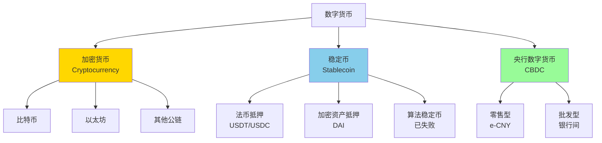
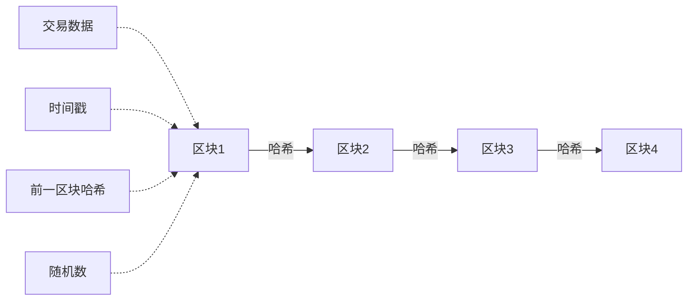

# 数字货币

## 概述

数字货币代表着货币形态的又一次革命性变革。从比特币的诞生到央行数字货币（CBDC）的探索，数字货币正在重塑货币体系、支付系统和金融基础设施。理解数字货币的技术基础、经济逻辑和投资价值，是现代投资者必须掌握的前沿知识。本文将系统梳理数字货币的发展历程、核心机制、投资机会与风险。

## 数字货币的分类

### 三大类型

### 1. 加密货币（Cryptocurrency）

**定义**：
基于区块链技术的去中心化数字货币，不受任何中央机构控制。

**核心特征**：
- 去中心化（无中央发行机构）
- 加密技术保障安全
- 供应量预设（如比特币 2100 万枚）
- 点对点交易
- 全球流通

**主要代表**：
- 比特币（BTC）：数字黄金
- 以太坊（ETH）：智能合约平台
- 其他公链：Solana、Cardano、Polkadot 等

### 2. 稳定币（Stablecoin）

**定义**：
价值锚定法币或其他资产的数字货币，旨在保持价格稳定。

**类型**：

**法币抵押型**：
- USDT（Tether）：最大稳定币，1 USDT = 1 美元
- USDC（USD Coin）：合规性更强
- BUSD（Binance USD）：币安发行

**加密资产抵押型**：
- DAI：以太坊生态，超额抵押
- 去中心化，透明度高

**算法稳定币**：
- UST（Terra）：2022 年崩盘
- 算法调节供需
- 已被证明不可持续

### 3. 央行数字货币（CBDC）

**定义**：
由中央银行发行的数字形式法定货币，是法币的数字化版本。

**类型**：

**零售型 CBDC**：
- 面向公众
- 替代现金
- 中国数字人民币（e-CNY）
- 欧洲数字欧元（计划中）

**批发型 CBDC**：
- 银行间结算
- 提高效率
- 降低成本
- 多国试点

## 比特币：数字黄金

### 诞生与理念

**2008 年白皮书**：
- 作者：中本聪（Satoshi Nakamoto）
- 标题：《比特币：一种点对点的电子现金系统》
- 背景：2008 年金融危机，对传统金融体系的不信任

**核心理念**：
- 去中心化：无需信任中央机构
- 有限供应：总量 2100 万枚
- 抗审查：无法被冻结或没收
- 透明性：所有交易公开可查

### 技术基础

**区块链技术**：

**关键机制**：

**1. 工作量证明（PoW）**：
- 矿工竞争解决数学难题
- 第一个解决者获得记账权
- 获得比特币奖励
- 能源消耗大

**2. 去中心化网络**：
- 全球数万个节点
- 每个节点保存完整账本
- 共识机制保证一致性
- 极难篡改

**3. 供应机制**：
- 每 10 分钟产生一个区块
- 初始奖励 50 BTC
- 每 21 万个区块减半（约 4 年）
- 2024 年减半至 3.125 BTC
- 2140 年达到 2100 万枚上限

### 比特币的价值逻辑

**数字黄金论**：

| 特性 | 黄金 | 比特币 |
|------|------|--------|
| 稀缺性 | 有限（地壳储量） | 2100 万枚上限 |
| 可分割性 | 可分割但不便 | 可分至 1 亿分之一 |
| 便携性 | 重，不便携 | 数字化，极易携带 |
| 可验证性 | 需要检测 | 密码学保证 |
| 耐久性 | 不腐蚀 | 永久存在 |
| 可替代性 | 同质 | 完全同质 |
| 历史 | 数千年 | 仅 15 年 |

**价值来源**：
- 稀缺性（供应上限）
- 去中心化（抗审查）
- 网络效应（用户增长）
- 机构采用（合法性增强）
- 对冲通胀（类似黄金）

### 价格历史

**关键里程碑**：

| 时间 | 价格 | 事件 |
|------|------|------|
| 2009.1 | $0 | 创世区块 |
| 2010.5 | $0.003 | 首次交易（1 万 BTC 买披萨） |
| 2013.11 | $1,000 | 首次突破千元 |
| 2017.12 | $19,783 | 第一次牛市顶峰 |
| 2018.12 | $3,200 | 熊市底部 |
| 2021.11 | $69,000 | 历史最高点 |
| 2022.11 | $15,500 | 熊市底部 |
| 2024.3 | $73,000 | 新高（ETF 推动） |

**周期规律**：
- 4 年减半周期
- 减半后 12-18 个月牛市
- 随后熊市 1-2 年
- 每轮高点和低点都在抬升

### 机构采用

**里程碑事件**：

**2020-2021 年机构入场**：
- MicroStrategy：购买 15 万枚 BTC
- Tesla：购买 4.3 万枚 BTC（后部分出售）
- Square（Block）：持续购买
- 灰度比特币信托（GBTC）：60 万枚 BTC

**2024 年现货 ETF 获批**：
- 美国 SEC 批准比特币现货 ETF
- BlackRock、Fidelity 等巨头入场
- 首月流入超 100 亿美元
- 合法性和可及性大幅提升

**国家层面**：
- 萨尔瓦多：2021 年将比特币定为法定货币
- 中非共和国：短暂采用后放弃
- 其他国家探索中

### 投资视角

**看涨观点**：
- 供应固定，需求增长
- 对冲法币贬值
- 机构采用加速
- 全球化资产
- 年轻一代认可

**看跌观点**：
- 无内在价值
- 波动性极大
- 监管风险
- 技术风险
- 能源消耗问题

**配置建议**：
- 高风险高收益资产
- 投资组合的 1-5%
- 长期持有（至少跨越一个周期）
- 不要杠杆
- 冷钱包存储

## 以太坊：可编程货币

### 智能合约平台

**2015 年上线**：
- 创始人：Vitalik Buterin
- 不仅是货币，更是平台
- 支持智能合约
- 去中心化应用（DApp）

**核心创新**：
- 图灵完备的编程语言
- 自动执行的合约
- 无需中介的应用
- 开发者生态

### 以太坊 2.0 升级

**从 PoW 到 PoS**：

**2022 年 9 月"合并"**：
- 工作量证明 → 权益证明
- 能源消耗降低 99.95%
- 通胀率大幅下降
- 更加环保和可持续

**经济模型变化**：
- EIP-1559：销毁机制
- 每笔交易销毁部分 ETH
- 供应可能转为通缩
- "超声波货币"叙事

### DeFi 生态

**去中心化金融**：
- 去中心化交易所（Uniswap、Curve）
- 借贷协议（Aave、Compound）
- 稳定币（DAI）
- 衍生品（dYdX）

**总锁仓价值（TVL）**：
- 高峰期超过 1,800 亿美元
- 以太坊占主导地位
- 提供传统金融的替代方案

### NFT 与元宇宙

**非同质化代币（NFT）**：
- 数字艺术品
- 游戏道具
- 虚拟土地
- 身份凭证

**2021 年 NFT 热潮**：
- Bored Ape Yacht Club
- CryptoPunks
- 交易量数百亿美元
- 2022 年后降温

### 投资视角

**价值主张**：
- 去中心化应用平台
- DeFi 基础设施
- 通缩经济模型
- 开发者生态最强

**风险**：
- 竞争激烈（Solana、Cardano）
- 扩展性挑战
- 监管不确定性
- 技术复杂性

**配置建议**：
- 比比特币风险更高
- 投资组合的 0.5-3%
- 关注技术发展
- 理解生态价值

## 央行数字货币（CBDC）

### 中国数字人民币（e-CNY）

**全球领先**：
- 2020 年开始试点
- 覆盖 26 个城市
- 累计交易超 1 万亿元
- 2024 年北京冬奥会应用

**设计特点**：
- 双层运营（央行-商业银行）
- 可控匿名（小额匿名，大额可追溯）
- 离线支付（双离线技术）
- 智能合约（可编程）

**应用场景**：
- 零售支付
- 政府补贴发放
- 跨境支付（mBridge 项目）
- 供应链金融

### 其他国家进展

**巴哈马 Sand Dollar**：
- 2020 年全球首个 CBDC
- 覆盖全国
- 促进金融普惠

**欧洲数字欧元**：
- 研究阶段
- 预计 2025-2026 年推出
- 应对私人数字货币挑战

**美国数字美元**：
- 研究缓慢
- 政治阻力大
- 担心隐私问题
- 但压力增大

### CBDC 的影响

**对货币政策**：
- 更精准的政策传导
- 可能实施负利率
- 直接向公众投放货币
- 增强政策有效性

**对金融体系**：
- 商业银行脱媒风险
- 支付格局重塑
- 金融基础设施升级
- 跨境支付效率提升

**对隐私**：
- 政府可追踪所有交易
- 隐私保护挑战
- 需要平衡监管与隐私
- 社会接受度问题

## 投资机会与风险

### 直接投资加密货币

**投资方式**：

**1. 现货购买**：
- 交易所购买（Coinbase、Binance）
- 自己保管（冷钱包）
- 完全拥有
- 需要技术知识

**2. ETF 投资**：
- 比特币现货 ETF（IBIT、FBTC）
- 传统券商账户
- 无需保管
- 更加便捷

**3. 信托产品**：
- 灰度比特币信托（GBTC）
- 溢价/折价波动
- 流动性较好

**4. 期货合约**：
- CME 比特币期货
- 高杠杆
- 高风险
- 专业投资者

### 间接投资

**加密货币相关股票**：

**矿业公司**：
- Marathon Digital（MARA）
- Riot Platforms（RIOT）
- 与比特币价格高度相关
- 杠杆效应

**交易所**：
- Coinbase（COIN）
- 交易量驱动
- 监管风险

**持币公司**：
- MicroStrategy（MSTR）
- 比特币敞口
- 杠杆持有

**区块链技术公司**：
- Block（SQ）
- PayPal（PYPL）
- 多元化业务

### 风险管理

**主要风险**：

**1. 价格波动**：
- 年化波动率 80%+
- 单日波动可达 20%
- 心理承受力要求高

**2. 监管风险**：
- 各国政策不确定
- 可能禁止或严格限制
- 税收政策变化

**3. 技术风险**：
- 交易所被黑
- 私钥丢失
- 智能合约漏洞
- 量子计算威胁

**4. 市场风险**：
- 流动性风险
- 操纵风险
- 欺诈项目
- 庞氏骗局

**风险控制**：
- 严格控制仓位（1-5%）
- 分散投资（不只比特币）
- 使用冷钱包
- 长期持有
- 不使用杠杆
- 持续学习

### 投资策略

**策略 1：定投策略**
- 每月固定金额购买
- 平滑价格波动
- 降低择时风险
- 适合长期投资者

**策略 2：周期策略**
- 熊市底部买入
- 牛市顶部卖出
- 需要判断周期
- 难度较大

**策略 3：核心-卫星策略**
- 核心：比特币（70%）
- 卫星：以太坊和其他（30%）
- 平衡风险和收益

**策略 4：再平衡策略**
- 设定目标配置（如 5%）
- 定期再平衡
- 自动高抛低吸
- 纪律性强

## 未来展望

### 技术演进

**扩展性解决方案**：
- Layer 2（Lightning Network、Arbitrum）
- 分片技术
- 跨链桥
- 提高交易速度和降低成本

**隐私增强**：
- 零知识证明
- 隐私币（Monero、Zcash）
- 隐私保护技术
- 平衡透明与隐私

**互操作性**：
- 跨链协议
- 多链生态
- 资产跨链
- 统一用户体验

### 监管框架

**全球监管趋势**：
- 从禁止到监管
- 反洗钱（AML）要求
- 投资者保护
- 税收合规

**主要国家立场**：

| 国家 | 立场 | 政策 |
|------|------|------|
| 美国 | 监管但允许 | SEC 监管，ETF 获批 |
| 欧盟 | 积极监管 | MiCA 法规 |
| 中国 | 严格限制 | 禁止交易，推 CBDC |
| 日本 | 开放监管 | 合法化，牌照制 |
| 新加坡 | 友好监管 | 创新沙盒 |

### 应用场景扩展

**支付领域**：
- 跨境汇款（更快更便宜）
- 小额支付（闪电网络）
- 商家接受度提升
- 与传统支付共存

**金融服务**：
- DeFi 成熟化
- 代币化资产（房地产、股票）
- 去中心化身份
- 链上信用

**Web3 时代**：
- 去中心化互联网
- 用户拥有数据
- 创作者经济
- 新的商业模式

### 货币体系变革

**多元化货币体系**：
- 法币（美元、欧元、人民币）
- CBDC（数字法币）
- 加密货币（比特币、以太坊）
- 稳定币（USDT、USDC）
- 共存与竞争

**可能的未来**：

**情景 1：共存**
- 各类货币各司其职
- 法币主导日常支付
- 加密货币作为资产
- CBDC 提升效率

**情景 2：加密货币主流化**
- 比特币成为全球储备资产
- 以太坊成为金融基础设施
- 法币地位下降
- 去中心化金融繁荣

**情景 3：CBDC 主导**
- 各国 CBDC 普及
- 私人加密货币受限
- 政府掌控货币体系
- 隐私担忧加剧

**情景 4：新的平衡**
- 超主权数字货币出现
- 多极化货币体系
- 技术与监管平衡
- 更加公平的秩序

## 投资者行动指南

### 入门步骤

**1. 学习基础知识**（1-2 个月）
- 阅读比特币白皮书
- 理解区块链技术
- 了解主要项目
- 关注行业动态

**2. 小额试水**（投入 1-5% 资金）
- 注册交易所
- 购买少量比特币
- 体验转账和存储
- 熟悉操作流程

**3. 深入研究**（持续学习）
- 研究投资标的
- 理解价值逻辑
- 跟踪技术发展
- 参与社区讨论

**4. 建立策略**
- 确定投资目标
- 设定仓位上限
- 选择投资方式
- 制定纪律

### 必备工具

**交易所**：
- Coinbase（合规性强）
- Binance（品种丰富）
- Kraken（老牌交易所）

**钱包**：
- 热钱包：MetaMask、Trust Wallet
- 冷钱包：Ledger、Trezor

**信息平台**：
- CoinMarketCap（价格数据）
- CoinGecko（市场信息）
- Glassnode（链上数据）
- Messari（研究报告）

**社区**：
- Twitter（行业动态）
- Reddit（讨论社区）
- Discord（项目社区）
- Telegram（中文社区）

### 避坑指南

**常见陷阱**：

**1. FOMO（错失恐惧）**
- 追涨杀跌
- 盲目跟风
- 情绪化决策
- 应对：坚持策略，定投

**2. 诈骗项目**
- 庞氏骗局
- 假币空投
- 钓鱼网站
- 应对：谨慎投资，验证真伪

**3. 过度交易**
- 频繁买卖
- 高额手续费
- 税务复杂
- 应对：长期持有

**4. 安全问题**
- 交易所被黑
- 私钥泄露
- 钱包丢失
- 应对：冷钱包存储，备份私钥

## 延伸阅读

### 经典著作

1. **《比特币标准》** - Saifedean Ammous
   - 比特币的经济学分析
   - 货币历史视角
   - 奥地利学派观点

2. **《精通比特币》** - Andreas Antonopoulos
   - 技术深度解析
   - 开发者必读
   - 权威技术书籍

3. **《加密资产》** - Chris Burniske & Jack Tatar
   - 投资框架
   - 估值方法
   - 资产配置

### 在线资源

**学习平台**：
- Coinbase Learn（入门教程）
- Binance Academy（全面知识）
- MIT 区块链课程（学术视角）

**数据平台**：
- Glassnode（链上数据）
- CryptoQuant（市场指标）
- Dune Analytics（链上分析）

**新闻媒体**：
- CoinDesk（行业新闻）
- The Block（深度报道）
- Decrypt（通俗解读）

### 播客与视频

- **Unchained**（Laura Shin）
- **What Bitcoin Did**（Peter McCormack）
- **Bankless**（DeFi 焦点）
- **币圈十年**（中文播客）

## 关键要点总结

1. **数字货币分三类**：加密货币（去中心化）、稳定币（价格稳定）、CBDC（央行发行）

2. **比特币**是数字黄金，供应上限 2100 万枚，4 年减半周期，机构采用加速

3. **以太坊**是可编程平台，支持 DeFi 和 NFT，已转向 PoS，经济模型改善

4. **央行数字货币**正在全球推进，中国数字人民币领先，将重塑支付和货币体系

5. **投资方式**：现货、ETF、相关股票，建议配置 1-5%，长期持有，严控风险

6. **主要风险**：价格波动、监管不确定、技术风险、安全问题，需要谨慎管理

7. **未来展望**：技术持续演进，监管逐步完善，应用场景扩展，多元化货币体系

---

**恭喜完成货币历史模块学习！** 从金本位到数字货币，你已经系统了解了货币体系的演变。

[← 返回货币历史](index.html) | [→ 返回金融历史](../index.html)

