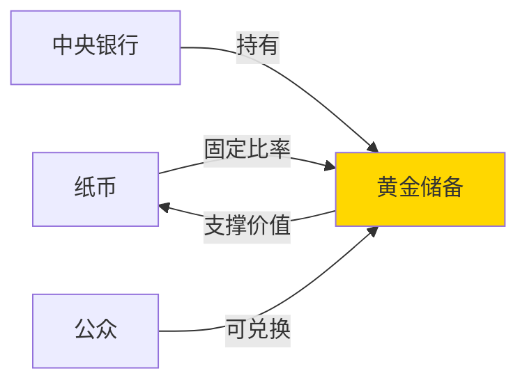

# 金本位时代

## 概述

金本位（Gold Standard）是人类历史上最重要的货币制度之一，在 19 世纪末至 20 世纪初主导了全球货币体系。在这一制度下，货币价值直接与黄金挂钩，各国货币可以按固定比率兑换黄金。理解金本位的运作机制、优势与局限，对于认识现代货币体系的演变至关重要。

## 金本位的核心机制

### 基本原理

金本位制度的核心是**货币与黄金的固定兑换关系**：



**关键特征**：
- 货币发行量受黄金储备限制
- 货币可以自由兑换成黄金
- 黄金可以自由跨国流动
- 汇率由各国货币含金量决定

### 自动调节机制

金本位具有独特的**国际收支自动平衡机制**（Price-Specie Flow Mechanism）：

**贸易顺差国**：
1. 出口增加 → 黄金流入
2. 货币供应增加 → 物价上涨
3. 出口竞争力下降 → 贸易平衡

**贸易逆差国**：
1. 进口增加 → 黄金流出
2. 货币供应减少 → 物价下降
3. 出口竞争力上升 → 贸易平衡

这种机制理论上能够自动纠正国际收支失衡，无需政府干预。

## 历史演进

### 古典金本位时期（1870-1914）

这是金本位的黄金时代，主要特征：

**时代背景**：
- 英国率先实施（1821 年）
- 1870 年代后主要国家陆续采用
- 全球贸易快速扩张
- 资本自由流动

**主要国家的金本位**：

| 国家 | 实施时间 | 含金量标准 |
|------|---------|-----------|
| 英国 | 1821 | 1 英镑 = 7.32 克纯金 |
| 美国 | 1879 | 1 美元 = 1.50 克纯金 |
| 德国 | 1871 | 1 马克 = 0.36 克纯金 |
| 法国 | 1878 | 1 法郎 = 0.29 克纯金 |
| 日本 | 1897 | 1 日元 = 0.75 克纯金 |

**经济表现**：
- 物价长期稳定
- 汇率波动极小
- 国际贸易繁荣
- 资本流动顺畅
- 经济增长稳健

### 一战期间的中断（1914-1918）

战争导致金本位体系崩溃：

**中断原因**：
- 战争支出激增，黄金储备不足
- 各国停止黄金兑换
- 实施外汇管制
- 大量印钞导致通货膨胀

**经济后果**：
- 货币大幅贬值
- 恶性通货膨胀（德国魏玛共和国）
- 国际贸易萎缩
- 金融秩序混乱

### 金汇兑本位时期（1925-1931）

战后各国试图恢复金本位：

**新制度特点**：
- 英国 1925 年恢复金本位（丘吉尔决策）
- 采用金汇兑本位（Gold Exchange Standard）
- 只有中央银行可兑换黄金
- 公众不能直接兑换

**致命缺陷**：
- 英镑高估（恢复战前平价）
- 英国出口竞争力下降
- 黄金储备不足
- 经济增长乏力

**最终崩溃**：
- 1929 年大萧条爆发
- 1931 年英国放弃金本位
- 其他国家相继放弃
- 金本位时代终结

## 金本位的优势

### 1. 货币稳定性

**长期物价稳定**：
- 货币发行受黄金储备约束
- 通货膨胀得到有效控制
- 购买力长期保持稳定

**数据支持**：
- 1870-1913 年英国物价年均变化 < 1%
- 同期美国物价基本持平
- 远低于信用货币时代的通胀率

### 2. 汇率稳定

**固定汇率体系**：
- 汇率由含金量决定
- 波动范围极小（黄金输送点内）
- 降低国际贸易风险

**计算示例**：
```
英镑含金量：7.32 克
美元含金量：1.50 克
理论汇率：1 英镑 = 4.88 美元
实际汇率波动：4.86 - 4.90 美元
```

### 3. 财政纪律

**硬约束机制**：
- 政府不能随意印钞
- 财政赤字受到限制
- 防止货币滥发

**历史教训**：
- 金本位时期财政相对稳健
- 信用货币时代政府债务激增
- 货币纪律的重要性

### 4. 国际贸易繁荣

**促进全球化**：
- 汇率稳定降低交易成本
- 资本自由流动
- 国际分工深化
- 贸易量快速增长

**黄金时代**：
- 1870-1913 年全球贸易增长 3 倍
- 资本输出规模空前
- 第一次全球化浪潮

## 金本位的局限

### 1. 货币供应刚性

**核心矛盾**：
- 黄金产量增长缓慢（年均 2-3%）
- 经济增长需要货币供应增长
- 货币供应不足制约经济发展

**通缩压力**：
- 1873-1896 年"大萧条"
- 物价持续下跌
- 债务人负担加重
- 经济增长放缓

### 2. 应对危机能力弱

**缺乏灵活性**：
- 经济衰退时无法增加货币供应
- 不能充当最后贷款人
- 金融危机容易扩散

**历史案例**：
- 1929-1933 年大萧条
- 坚持金本位的国家衰退更严重
- 放弃金本位的国家恢复更快

### 3. 分配不公平

**黄金分布不均**：
- 产金国占据优势
- 非产金国受制约
- 加剧国际不平等

**殖民体系**：
- 宗主国控制黄金流动
- 殖民地货币依附
- 强化经济剥削

### 4. 政策自主性丧失

**国内政策受限**：
- 必须维持黄金储备
- 不能独立制定货币政策
- 经济政策服从金本位

**社会成本**：
- 经济衰退时失业率上升
- 工资下降引发社会动荡
- 政治压力增大

## 金本位的终结

### 大萧条的冲击

**1929-1933 年危机**：
- 股市崩盘引发银行挤兑
- 黄金大量流出
- 货币供应急剧收缩
- 经济陷入螺旋式下降

**各国应对**：
- 1931 年英国放弃金本位
- 1933 年美国停止黄金兑换
- 1936 年法国最后放弃
- 金本位体系瓦解

### 凯恩斯的批判

**理论突破**：
- 批判金本位的刚性
- 主张政府干预经济
- 强调充分就业目标
- 货币政策应服务于经济增长

**名言**：
> "金本位已经成为野蛮的遗迹。"
> —— 约翰·梅纳德·凯恩斯

### 历史意义

**金本位的遗产**：
- 证明了货币纪律的重要性
- 揭示了固定汇率的局限
- 为现代货币理论提供经验
- 影响至今的货币政策辩论

## 现代视角的反思

### 金本位 vs 信用货币

**对比分析**：

| 维度 | 金本位 | 信用货币 |
|------|--------|---------|
| 货币发行 | 受黄金储备限制 | 中央银行自主决定 |
| 物价稳定 | 长期稳定 | 持续温和通胀 |
| 应对危机 | 能力有限 | 灵活调控 |
| 政策自主 | 受约束 | 独立性强 |
| 财政纪律 | 硬约束 | 软约束 |

### 新金本位论争

**支持者观点**：
- 信用货币导致通货膨胀
- 政府滥发货币
- 需要恢复货币纪律
- 黄金是真正的货币

**反对者观点**：
- 金本位过于僵化
- 无法应对现代经济需求
- 黄金供应不足
- 会导致严重通缩

**现实选择**：
- 没有国家恢复金本位
- 但黄金仍是重要储备资产
- 央行持有大量黄金储备
- 黄金作为避险资产

## 投资启示

### 1. 理解货币本质

**核心认知**：
- 货币是信用体系
- 黄金不是唯一货币形式
- 货币价值来自信任
- 制度设计至关重要

### 2. 关注货币政策

**政策影响**：
- 货币供应影响资产价格
- 利率政策影响投资决策
- 汇率波动影响国际投资
- 通胀预期影响资产配置

### 3. 黄金的投资价值

**配置逻辑**：
- 对冲通胀风险
- 分散投资组合
- 危机时期避险
- 长期保值功能

**配置建议**：
- 黄金占投资组合 5-10%
- 通过 ETF 或实物持有
- 不作为主要投资标的
- 关注美元和实际利率

### 4. 历史周期视角

**长期思维**：
- 货币体系会演变
- 没有永恒的制度
- 理解历史规律
- 为未来变化做准备

## 延伸阅读

### 经典著作

1. **《货币的非国家化》** - 哈耶克
   - 自由货币竞争理论
   - 对金本位的现代思考

2. **《黄金、法币与历史》** - 刘易斯
   - 金本位历史详解
   - 货币制度演变

3. **《货币战争》系列** - 宋鸿兵
   - 通俗历史叙述
   - 货币阴谋论视角（需批判阅读）

### 学术论文

1. **"The Gold Standard and the Great Depression"** - Barry Eichengreen
   - 金本位与大萧条关系
   - 实证研究

2. **"Golden Fetters"** - Barry Eichengreen
   - 金本位的政治经济学
   - 权威学术著作

### 在线资源

- 美联储历史网站：金本位时期资料
- 国际货币基金组织：货币制度研究
- 世界黄金协会：黄金市场数据

## 关键要点总结

1. **金本位是货币与黄金挂钩的制度**，提供了货币稳定性和财政纪律

2. **古典金本位时期（1870-1914）**是其黄金时代，促进了国际贸易和经济增长

3. **金本位的优势**包括物价稳定、汇率稳定、财政纪律和贸易繁荣

4. **金本位的局限**在于货币供应刚性、应对危机能力弱、政策自主性丧失

5. **大萧条导致金本位终结**，各国转向更灵活的货币制度

6. **现代视角**：金本位不会恢复，但其经验对理解货币政策仍有价值

7. **投资启示**：理解货币本质，关注货币政策，合理配置黄金资产

---

**下一步学习**：[布雷顿森林体系](bretton-woods.html) - 了解二战后建立的国际货币新秩序

[← 返回货币历史](index.html)

