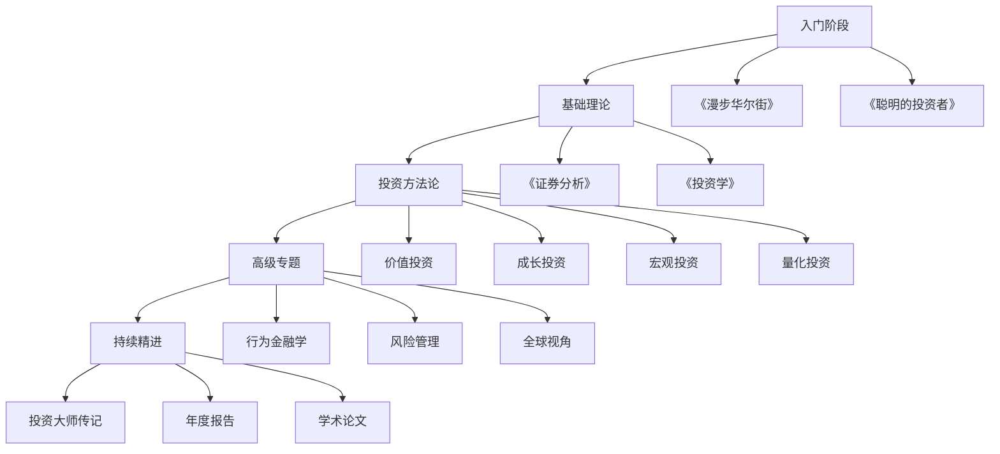

# 投资必读书单：系统化金融学习路径

## 概述

阅读经典投资著作是建立投资知识体系最有效的方法之一。本书单精选了100+本投资领域的经典著作，按照主题分类，并提供阅读顺序建议，帮助投资者从入门到精通，系统化地构建金融投资知识。

**学习目标**：
1. 了解投资领域的经典著作和核心思想
2. 根据自己的投资风格选择合适的书籍
3. 建立系统化的阅读计划
4. 从大师的智慧中汲取投资理念
5. 避免重复阅读相似内容，提高学习效率

**为什么重要**：
- 站在巨人的肩膀上：学习顶级投资者的思想和方法
- 系统化学习：按照逻辑顺序构建知识体系
- 避免弯路：从他人的成功和失败中学习
- 建立投资哲学：形成自己的投资理念和方法论

## 阅读路径图

## 一、价值投资经典（必读）

### 1.1 入门级

#### 《聪明的投资者》（The Intelligent Investor）
- **作者**：本杰明·格雷厄姆（Benjamin Graham）
- **出版年份**：1949年（多次修订）
- **难度**：★★☆☆☆
- **推荐指数**：★★★★★

**核心观点**：
- 投资与投机的区别
- 安全边际原则
- 市场先生的寓言
- 防御型投资者 vs 进取型投资者
- 价值投资的基本原则

**推荐理由**：
这是价值投资的圣经，巴菲特称其为"有史以来最伟大的投资著作"。格雷厄姆用通俗易懂的语言阐述了价值投资的核心理念，特别是"安全边际"和"市场先生"两个概念，对投资者建立正确的投资心态至关重要。

**适合人群**：所有投资者，特别是初学者

**阅读建议**：
- 重点阅读第8章（投资者与市场波动）和第20章（安全边际）
- 配合巴菲特的注释版本阅读
- 建议每年重读一次

**关键引用**：
> "投资的艺术有一个特点不为大众所知。门外汉只需些许努力与能力，便可以取得令人尊敬（即使并不可观）的结果；但是如果想在这个基础上更进一步，则需要更多的实践和智慧。"

---

#### 《巴菲特致股东的信》（Berkshire Hathaway Letters to Shareholders）
- **作者**：沃伦·巴菲特（Warren Buffett）
- **时间跨度**：1977年至今
- **难度**：★★★☆☆
- **推荐指数**：★★★★★

**核心观点**：
- 长期价值投资理念
- 企业内在价值评估
- 管理层质量的重要性
- 护城河概念
- 复利的力量

**推荐理由**：
这是巴菲特投资智慧的精华集合。每年的股东信都是投资者的必读材料，巴菲特用简洁幽默的语言分享他的投资理念、决策过程和对市场的看法。这些信件记录了伯克希尔·哈撒韦50多年的投资历程，是学习价值投资最好的实战教材。

**适合人群**：所有投资者

**阅读建议**：
- 按年份顺序阅读，了解巴菲特思想的演进
- 重点关注1977、1984、1987、1996、2008年的信件
- 结合伯克希尔的投资案例理解
- 建议每年重读经典篇章

**关键引用**：
> "我们的投资方式很简单：当别人贪婪时恐惧，当别人恐惧时贪婪。"

---

#### 《彼得·林奇的成功投资》（One Up On Wall Street）
- **作者**：彼得·林奇（Peter Lynch）
- **出版年份**：1989年
- **难度**：★★☆☆☆
- **推荐指数**：★★★★★

**核心观点**：
- 投资你了解的公司
- 六种股票分类法
- 10倍股（Ten-bagger）的特征
- 业余投资者的优势
- 实地调研的重要性

**推荐理由**：
彼得·林奇用轻松幽默的笔触分享了他管理麦哲伦基金13年间的投资经验。他强调普通投资者可以利用日常生活中的观察发现投资机会，这种"自下而上"的选股方法对个人投资者特别有启发。

**适合人群**：个人投资者、成长股投资者

**阅读建议**：
- 重点学习六种股票分类和选股标准
- 配合《战胜华尔街》一起阅读
- 关注林奇的实际案例分析

**关键引用**：
> "业余投资者的优势在于，他们可以在日常生活中发现专业投资者看不到的投资机会。"

---

### 1.2 进阶级

#### 《证券分析》（Security Analysis）
- **作者**：本杰明·格雷厄姆、大卫·多德（Benjamin Graham & David Dodd）
- **出版年份**：1934年（多次修订）
- **难度**：★★★★☆
- **推荐指数**：★★★★★

**核心观点**：
- 内在价值的计算方法
- 财务报表深度分析
- 债券和优先股分析
- 普通股估值方法
- 安全边际的量化应用

**推荐理由**：
这是价值投资的理论基石，比《聪明的投资者》更加系统和深入。格雷厄姆在书中详细阐述了如何通过财务分析确定证券的内在价值，以及如何在价格低于价值时买入。虽然部分内容已经过时，但核心原则依然适用。

**适合人群**：有一定基础的投资者、专业分析师

**阅读建议**：
- 建议先读《聪明的投资者》再读本书
- 重点阅读第六版（2008年）
- 可以跳过过时的技术细节，专注核心原则
- 配合现代案例理解

**关键引用**：
> "投资操作是基于深入分析，承诺本金安全并获得满意回报的操作。不符合这些要求的操作就是投机。"

---

#### 《怎样选择成长股》（Common Stocks and Uncommon Profits）
- **作者**：菲利普·费雪（Philip Fisher）
- **出版年份**：1958年
- **难度**：★★★☆☆
- **推荐指数**：★★★★★

**核心观点**：
- 15个选股要点
- Scuttlebutt调研方法（闲聊法）
- 长期持有优质成长股
- 管理层质量评估
- 何时卖出股票

**推荐理由**：
费雪是成长股投资的先驱，他的投资方法深刻影响了巴菲特。书中提出的15个选股要点和Scuttlebutt调研方法，至今仍是评估成长型公司的重要工具。费雪强调深入了解公司业务和管理层，而不是简单看财务数字。

**适合人群**：成长股投资者、长期投资者

**阅读建议**：
- 重点学习15个选股要点
- 理解如何评估管理层质量
- 学习实地调研的方法
- 配合现代科技公司案例理解

**关键引用**：
> "买入真正优秀的成长股，时机几乎不重要。"

---

#### 《巴菲特的护城河》（The Little Book That Builds Wealth）
- **作者**：帕特·多尔西（Pat Dorsey）
- **出版年份**：2008年
- **难度**：★★★☆☆
- **推荐指数**：★★★★☆

**核心观点**：
- 经济护城河的四种类型
- 无形资产（品牌、专利）
- 转换成本
- 网络效应
- 成本优势
- 如何识别和评估护城河

**推荐理由**：
多尔西系统化地阐述了巴菲特"护城河"概念，提供了识别和评估企业竞争优势的实用框架。这本书填补了价值投资理论中关于竞争优势分析的空白，对于理解为什么有些公司能够长期保持高回报率至关重要。

**适合人群**：价值投资者、企业分析师

**阅读建议**：
- 结合具体公司案例理解四种护城河
- 学习如何量化护城河的宽度
- 关注护城河的持久性分析

---

### 1.3 大师级

#### 《穷查理宝典》（Poor Charlie's Almanack）
- **作者**：查理·芒格（Charlie Munger）
- **出版年份**：2005年
- **难度**：★★★★☆
- **推荐指数**：★★★★★

**核心观点**：
- 多元思维模型
- 逆向思维
- 心理学在投资中的应用
- 能力圈原则
- 理性决策框架

**推荐理由**：
芒格的智慧超越了投资本身，他强调跨学科学习和多元思维模型的重要性。书中收录了芒格多年来的演讲和思想精华，对于建立正确的思维方式和决策框架极有帮助。芒格的"格栅理论"和心理学洞察对投资者避免认知偏差特别有价值。

**适合人群**：所有投资者、追求智慧的人

**阅读建议**：
- 多次阅读，每次都会有新收获
- 重点学习多元思维模型
- 理解心理学偏误对投资的影响
- 建立自己的思维模型清单

**关键引用**：
> "如果我知道我会死在哪里，我就永远不去那个地方。"（逆向思维）

---

## 二、宏观投资与经济学

### 2.1 宏观经济基础

#### 《经济学原理》（Principles of Economics）
- **作者**：格里高利·曼昆（N. Gregory Mankiw）
- **出版年份**：1998年（多次修订）
- **难度**：★★★☆☆
- **推荐指数**：★★★★☆

**核心观点**：
- 微观经济学基础
- 宏观经济学框架
- 供需理论
- 货币政策和财政政策
- 国际贸易

**推荐理由**：
这是最受欢迎的经济学教科书之一，用通俗易懂的语言解释了经济学的基本原理。对于理解宏观经济环境、政策影响和市场机制非常有帮助。

**适合人群**：所有投资者

**阅读建议**：
- 可以选择性阅读与投资相关的章节
- 重点关注宏观经济部分
- 配合实际经济数据理解

---

#### 《债务危机》（Principles for Navigating Big Debt Crises）
- **作者**：瑞·达里奥（Ray Dalio）
- **出版年份**：2018年
- **难度**：★★★★☆
- **推荐指数**：★★★★★

**核心观点**：
- 债务周期的三个阶段
- 去杠杆化过程
- 48个历史债务危机案例分析
- 政策应对框架
- 投资者如何应对债务危机

**推荐理由**：
达里奥基于桥水基金几十年的研究，系统阐述了债务危机的形成、发展和解决过程。书中详细分析了1930年代大萧条、2008年金融危机等重大事件，为理解宏观经济周期提供了实用框架。

**适合人群**：宏观投资者、风险管理者

**阅读建议**：
- 先读理论框架部分
- 选择感兴趣的历史案例深入研究
- 结合当前经济环境思考

**关键引用**：
> "如果你理解了债务周期，你就能理解经济机器的运作。"

---

#### 《金融炼金术》（The Alchemy of Finance）
- **作者**：乔治·索罗斯（George Soros）
- **出版年份**：1987年
- **难度**：★★★★★
- **推荐指数**：★★★★☆

**核心观点**：
- 反身性理论
- 市场参与者的偏见
- 繁荣-萧条循环
- 宏观交易策略
- 实时投资日记

**推荐理由**：
索罗斯的反身性理论挑战了有效市场假说，认为市场参与者的认知会影响市场，而市场又会反过来影响参与者的认知。这本书对理解市场泡沫和崩盘特别有价值。

**适合人群**：宏观投资者、对冲基金经理

**阅读建议**：
- 理论部分较难，需要反复阅读
- 重点理解反身性概念
- 结合历史泡沫案例理解

---

### 2.2 货币与金融史

#### 《货币战争》系列（Currency Wars）
- **作者**：詹姆斯·里卡兹（James Rickards）
- **出版年份**：2011年
- **难度**：★★★☆☆
- **推荐指数**：★★★☆☆

**核心观点**：
- 货币体系演变
- 金本位 vs 信用货币
- 货币战争的历史和现状
- 美元霸权
- 未来货币体系展望

**推荐理由**：
从历史角度分析货币体系的演变和国际货币竞争，帮助理解当前全球金融格局和货币政策的深层逻辑。

**适合人群**：宏观投资者、对货币体系感兴趣的投资者

---

#### 《这次不一样：八百年金融危机史》（This Time Is Different）
- **作者**：卡门·莱因哈特、肯尼斯·罗格夫（Carmen Reinhart & Kenneth Rogoff）
- **出版年份**：2009年
- **难度**：★★★★☆
- **推荐指数**：★★★★☆

**核心观点**：
- 800年金融危机的共同特征
- 债务违约的历史模式
- "这次不一样"的危险心态
- 金融危机的预警信号
- 危机后的经济恢复

**推荐理由**：
两位经济学家通过大量历史数据分析，揭示了金融危机的共同规律。书名"这次不一样"讽刺了人们在泡沫时期的盲目乐观。对于理解危机模式和风险管理非常有价值。

**适合人群**：宏观投资者、风险管理者

---

## 三、量化投资与金融工程

### 3.1 量化投资基础

#### 《主动投资组合管理》（Active Portfolio Management）
- **作者**：理查德·格林诺德、罗纳德·卡恩（Richard Grinold & Ronald Kahn）
- **出版年份**：1999年
- **难度**：★★★★★
- **推荐指数**：★★★★☆

**核心观点**：
- 信息比率（Information Ratio）
- 基本法则（Fundamental Law）
- Alpha和Beta分离
- 组合优化
- 风险模型

**推荐理由**：
这是量化投资的经典教材，系统阐述了主动投资管理的理论框架。书中的基本法则（IR = IC × √BR）揭示了投资业绩的来源，对于理解量化投资策略非常重要。

**适合人群**：量化投资者、基金经理

**阅读建议**：
- 需要一定的数学和统计学基础
- 重点理解信息比率和基本法则
- 配合实际案例理解

---

#### 《打败市场的小书》（The Little Book That Beats the Market）
- **作者**：乔尔·格林布拉特（Joel Greenblatt）
- **出版年份**：2005年
- **难度**：★★☆☆☆
- **推荐指数**：★★★★☆

**核心观点**：
- 神奇公式（Magic Formula）
- 高资本回报率 + 低估值
- 量化价值投资
- 简单有效的选股策略
- 长期回测结果

**推荐理由**：
格林布拉特提出的"神奇公式"将价值投资量化为简单的选股规则：选择高ROE和低P/E的股票。虽然简单，但长期回测显示效果显著。这本书证明了量化方法可以很简单但有效。

**适合人群**：量化投资初学者、价值投资者

**阅读建议**：
- 理解神奇公式的逻辑
- 学习如何回测策略
- 注意策略的局限性

---

#### 《量化价值投资》（Quantitative Value）
- **作者**：韦斯利·格雷、托比亚斯·卡莱尔（Wesley Gray & Tobias Carlisle）
- **出版年份**：2012年
- **难度**：★★★★☆
- **推荐指数**：★★★★☆

**核心观点**：
- 量化筛选方法
- 财务质量评分
- 价值陷阱识别
- 组合构建
- 回测验证

**推荐理由**：
将价值投资理念与量化方法结合，提供了系统化的选股和组合管理框架。书中详细介绍了如何识别和避免价值陷阱，如何构建稳健的量化价值组合。

**适合人群**：量化投资者、价值投资者

---

### 3.2 因子投资

#### 《因子投资：方法与实践》（Factor Investing）
- **作者**：安德鲁·安格（Andrew Ang）
- **出版年份**：2014年
- **难度**：★★★★☆
- **推荐指数**：★★★★☆

**核心观点**：
- 因子投资框架
- 价值、规模、动量、质量因子
- 因子组合构建
- 风险管理
- 因子投资的实践应用

**推荐理由**：
系统介绍了因子投资的理论和实践，是理解Smart Beta和因子投资策略的重要参考书。

**适合人群**：量化投资者、机构投资者

---

## 四、行为金融学

#### 《思考，快与慢》（Thinking, Fast and Slow）
- **作者**：丹尼尔·卡尼曼（Daniel Kahneman）
- **出版年份**：2011年
- **难度**：★★★☆☆
- **推荐指数**：★★★★★

**核心观点**：
- 系统1和系统2思维
- 认知偏误
- 前景理论
- 锚定效应
- 过度自信

**推荐理由**：
诺贝尔经济学奖得主卡尼曼总结了几十年的行为经济学研究成果。书中揭示的认知偏误对投资决策有深刻影响，帮助投资者认识和克服心理陷阱。

**适合人群**：所有投资者

**阅读建议**：
- 重点关注与投资相关的认知偏误
- 反思自己的决策过程
- 建立决策检查清单

**关键引用**：
> "我们对自己的信念和偏好的信心通常是不合理的。"

---

#### 《非理性繁荣》（Irrational Exuberance）
- **作者**：罗伯特·席勒（Robert Shiller）
- **出版年份**：2000年（多次修订）
- **难度**：★★★☆☆
- **推荐指数**：★★★★☆

**核心观点**：
- 市场泡沫的心理学
- 羊群效应
- 媒体的影响
- CAPE比率（周期调整市盈率）
- 泡沫的识别和预防

**推荐理由**：
席勒在2000年互联网泡沫顶峰时出版此书，准确预测了市场崩盘。书中分析了泡沫形成的心理和社会因素，对于识别市场过热非常有价值。

**适合人群**：所有投资者

---

#### 《助推》（Nudge）
- **作者**：理查德·塞勒、卡斯·桑斯坦（Richard Thaler & Cass Sunstein）
- **出版年份**：2008年
- **难度**：★★☆☆☆
- **推荐指数**：★★★★☆

**核心观点**：
- 选择架构
- 默认选项的力量
- 行为经济学应用
- 如何做出更好的决策
- 自我控制策略

**推荐理由**：
塞勒（2017年诺贝尔经济学奖得主）展示了如何利用行为经济学原理改善决策。对于投资者来说，理解这些原理可以帮助设计更好的投资流程和决策机制。

**适合人群**：所有投资者

---

## 五、投资大师传记与实战

### 5.1 投资大师传记

#### 《滚雪球：沃伦·巴菲特和他的财富人生》（The Snowball）
- **作者**：艾丽斯·施罗德（Alice Schroeder）
- **出版年份**：2008年
- **难度**：★★☆☆☆
- **推荐指数**：★★★★★

**核心观点**：
- 巴菲特的成长历程
- 投资理念的形成
- 重要投资决策
- 个人生活与投资哲学
- 伯克希尔的发展历程

**推荐理由**：
这是巴菲特唯一授权的传记，详细记录了他从童年到成为世界首富的完整历程。通过了解巴菲特的人生经历，可以更深刻地理解他的投资理念和决策过程。

**适合人群**：所有投资者

**阅读建议**：
- 关注巴菲特投资理念的演变
- 学习他如何应对市场波动
- 理解长期主义的力量

---

#### 《对冲基金风云录》（More Money Than God）
- **作者**：塞巴斯蒂安·马拉比（Sebastian Mallaby）
- **出版年份**：2010年
- **难度**：★★★☆☆
- **推荐指数**：★★★★☆

**核心观点**：
- 对冲基金的历史
- 顶级对冲基金经理的故事
- 不同的投资策略
- 对冲基金对市场的影响
- 2008年金融危机中的表现

**推荐理由**：
通过讲述索罗斯、琼斯、西蒙斯等传奇对冲基金经理的故事，展现了不同的投资风格和策略。对于理解对冲基金行业和高级投资策略非常有帮助。

**适合人群**：对冲基金投资者、专业投资者

---

### 5.2 投资实战

#### 《股市真规则》（The Five Rules for Successful Stock Investing）
- **作者**：帕特·多尔西（Pat Dorsey）
- **出版年份**：2004年
- **难度**：★★★☆☆
- **推荐指数**：★★★★☆

**核心观点**：
- 五条选股规则
- 行业分析框架
- 财务报表分析
- 估值方法
- 组合管理

**推荐理由**：
晨星公司前股票研究总监多尔西提供了系统化的选股框架，特别强调了行业分析和竞争优势评估。书中包含大量实际案例，实用性强。

**适合人群**：个人投资者、股票分析师

---

#### 《投资最重要的事》（The Most Important Thing）
- **作者**：霍华德·马克斯（Howard Marks）
- **出版年份**：2011年
- **难度**：★★★☆☆
- **推荐指数**：★★★★★

**核心观点**：
- 第二层思维
- 风险控制
- 市场周期
- 逆向投资
- 耐心和纪律

**推荐理由**：
橡树资本创始人马克斯总结了他40多年的投资智慧。书中强调了风险控制、逆向思维和市场周期的重要性。马克斯的投资备忘录被巴菲特称赞为"必读"。

**适合人群**：所有投资者

**关键引用**：
> "投资不是关于买好的，而是关于买得好。"

---

## 六、中国市场专题

#### 《价值：我对投资的思考》
- **作者**：张磊
- **出版年份**：2020年
- **难度**：★★★☆☆
- **推荐指数**：★★★★☆

**核心观点**：
- 长期价值投资
- 研究驱动
- 赋能企业
- 中国市场机会
- 高瓴资本的投资理念

**推荐理由**：
高瓴资本创始人张磊分享了他在中国市场20年的投资经验和思考。书中详细阐述了如何在中国市场进行价值投资，如何识别和投资优秀企业。

**适合人群**：中国市场投资者

---

#### 《投资中最简单的事》
- **作者**：邱国鹭
- **出版年份**：2014年
- **难度**：★★☆☆☆
- **推荐指数**：★★★★☆

**核心观点**：
- 便宜才是硬道理
- 定价权是核心竞争力
- 行业比较和公司分析
- A股市场特点
- 投资中的常识

**推荐理由**：
高毅资产董事长邱国鹭用通俗易懂的语言分享了价值投资在A股市场的应用。书中强调回归投资常识，避免复杂化。

**适合人群**：A股投资者

---

## 七、风险管理与投资心理

#### 《黑天鹅》（The Black Swan）
- **作者**：纳西姆·塔勒布（Nassim Taleb）
- **出版年份**：2007年
- **难度**：★★★★☆
- **推荐指数**：★★★★☆

**核心观点**：
- 黑天鹅事件
- 极端事件的影响
- 反脆弱性
- 不确定性管理
- 尾部风险

**推荐理由**：
塔勒布挑战了传统的风险管理理论，强调极端事件（黑天鹅）的重要性。对于理解市场风险和构建稳健的投资组合非常有价值。

**适合人群**：风险管理者、所有投资者

---

#### 《反脆弱》（Antifragile）
- **作者**：纳西姆·塔勒布（Nassim Taleb）
- **出版年份**：2012年
- **难度**：★★★★☆
- **推荐指数**：★★★★☆

**核心观点**：
- 反脆弱性概念
- 从波动中获益
- 杠铃策略
- 选择权思维
- 如何在不确定性中生存

**推荐理由**：
塔勒布提出了"反脆弱"概念，即不仅能抵御冲击，还能从冲击中获益。这种思维方式对于投资组合构建和风险管理有重要启发。

**适合人群**：所有投资者

---

## 八、阅读顺序建议

### 初学者路径（6-12个月）

**第一阶段：建立基础（1-2个月）**
1. 《漫步华尔街》- 了解市场基础
2. 《聪明的投资者》- 建立投资理念
3. 《彼得·林奇的成功投资》- 学习选股方法

**第二阶段：深化理解（2-3个月）**
4. 《巴菲特致股东的信》- 学习大师智慧
5. 《怎样选择成长股》- 理解成长投资
6. 《思考，快与慢》- 认识认知偏误

**第三阶段：实战应用（3-4个月）**
7. 《股市真规则》- 系统选股框架
8. 《投资最重要的事》- 风险控制
9. 《巴菲特的护城河》- 竞争优势分析

**第四阶段：拓展视野（3-4个月）**
10. 《穷查理宝典》- 多元思维
11. 《债务危机》- 宏观理解
12. 《黑天鹅》- 风险意识

### 进阶投资者路径（12-24个月）

**价值投资深化**：
1. 《证券分析》
2. 《量化价值投资》
3. 《投资中最简单的事》

**宏观投资**：
1. 《经济学原理》
2. 《金融炼金术》
3. 《这次不一样》

**量化投资**：
1. 《打败市场的小书》
2. 《主动投资组合管理》
3. 《因子投资》

**行为金融**：
1. 《非理性繁荣》
2. 《助推》
3. 《反脆弱》

### 专业投资者路径（持续学习）

**理论深化**：
- 学术论文
- 最新研究成果
- 专业期刊

**实战提升**：
- 年度报告
- 投资备忘录
- 案例研究

**视野拓展**：
- 跨学科学习
- 历史研究
- 哲学思考

## 九、阅读建议

### 1. 如何高效阅读投资书籍

**主动阅读**：
- 带着问题阅读
- 做笔记和批注
- 总结核心观点
- 思考如何应用

**重复阅读**：
- 经典著作值得多次阅读
- 每次阅读都有新收获
- 随着经验增长理解加深

**实践结合**：
- 边读边实践
- 用实际案例验证
- 建立自己的投资框架

### 2. 建立阅读计划

**设定目标**：
- 每月1-2本
- 每年12-24本
- 持续积累

**分类阅读**：
- 理论与实践结合
- 不同风格平衡
- 新书与经典结合

**记录总结**：
- 建立读书笔记
- 提炼核心观点
- 形成知识体系

### 3. 避免阅读陷阱

**不要贪多**：
- 质量重于数量
- 深度理解重于广度
- 经典重于畅销

**不要盲从**：
- 批判性思考
- 结合自己情况
- 形成独立判断

**不要停留在理论**：
- 必须实践应用
- 验证和调整
- 形成自己的方法

## 十、补充资源

### 在线书单

**Goodreads投资书单**：
- 用户评分和评论
- 相关推荐
- 阅读进度跟踪

**亚马逊投资类畅销榜**：
- 最新出版
- 读者评价
- 购买便捷

### 读书社群

**雪球读书会**：
- 投资者社区
- 读书分享
- 讨论交流

**豆瓣读书**：
- 书评和讨论
- 读书笔记
- 相关推荐

### 书籍获取

**实体书**：
- 当当、京东
- 亚马逊
- 实体书店

**电子书**：
- Kindle
- 微信读书
- 多看阅读

**英文原版**：
- Amazon
- Book Depository
- 图书馆

## 延伸阅读

### 推荐课程
- [投资课程推荐](courses.html) - 系统化学习路径
- [在线学习平台](websites.html) - 优质学习资源

### 持续学习
- [播客推荐](podcasts.html) - 碎片时间学习
- [投资社区](communities.html) - 交流和讨论

### 实践工具
- [数据源](../tools/financial-data-sources.html) - 获取投资数据
- [分析工具](../tools/screening-tools.html) - 应用投资理念

## 参考文献

1. Graham, B. (1949). *The Intelligent Investor*. Harper & Brothers.

2. Buffett, W. (1977-2023). *Berkshire Hathaway Letters to Shareholders*.

3. Lynch, P. (1989). *One Up On Wall Street*. Simon & Schuster.

4. Fisher, P. A. (1958). *Common Stocks and Uncommon Profits*. Harper & Brothers.

5. Munger, C. (2005). *Poor Charlie's Almanack*. Walsworth Publishing Company.

6. Dalio, R. (2018). *Principles for Navigating Big Debt Crises*. Bridgewater Associates.

7. Kahneman, D. (2011). *Thinking, Fast and Slow*. Farrar, Straus and Giroux.

8. Marks, H. (2011). *The Most Important Thing*. Columbia University Press.

9. Taleb, N. N. (2007). *The Black Swan*. Random House.

10. Greenblatt, J. (2005). *The Little Book That Beats the Market*. John Wiley & Sons.

---

**最后更新**：2024年1月

**版本说明**：本书单会定期更新，添加新出版的优质投资著作，并根据读者反馈调整推荐。

**贡献建议**：如果您有好的投资书籍推荐，欢迎通过社区反馈。
