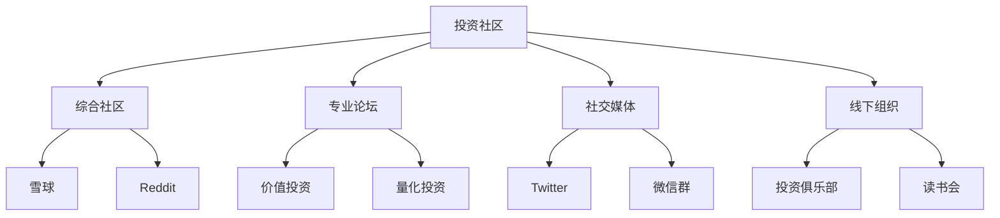

# 投资社区推荐：交流学习与成长平台

## 概述

投资是一个需要持续学习和交流的领域。加入优质的投资者社区，可以与志同道合的投资者交流心得，学习他人的投资经验，获得不同的投资视角，避免闭门造车。本文精选了国内外优质的投资社区和论坛，帮助投资者建立投资者网络，加速成长。

**学习目标**：
1. 了解主流投资者社区和论坛
2. 学会如何有效参与社区交流
3. 建立自己的投资者网络
4. 从社区中获取有价值的信息
5. 避免社区交流的常见陷阱

**为什么重要**：
- 多元视角：接触不同的投资理念和方法
- 经验分享：学习他人的成功和失败经验
- 思维碰撞：通过讨论深化理解
- 人脉网络：建立投资者关系网
- 持续学习：保持学习动力和热情

## 社区类型分类图

## 一、国际投资社区

### 1.1 Reddit投资板块

#### r/investing
- **平台**：Reddit
- **网址**：reddit.com/r/investing
- **成员数**：2M+
- **语言**：英文
- **费用**：免费
- **推荐指数**：★★★★☆

**社区特点**：
- 综合投资讨论
- 新手友好
- 活跃度高
- 内容多元

**主要话题**：
- 投资策略讨论
- 市场分析
- 个股讨论
- 投资组合建议
- 新手问答

**推荐理由**：
r/investing是Reddit上最大的投资社区之一，讨论内容涵盖股票、债券、基金等各类投资。社区氛围友好，适合初学者提问和学习。

**适合人群**：
- 投资初学者
- 美股投资者
- 希望了解多元观点的投资者

**参与建议**：
- 先阅读社区规则
- 多看精华帖
- 理性参与讨论
- 独立思考，不盲从

---

#### r/ValueInvesting
- **平台**：Reddit
- **网址**：reddit.com/r/ValueInvesting
- **成员数**：200K+
- **语言**：英文
- **费用**：免费
- **推荐指数**：★★★★★

**社区特点**：
- 专注价值投资
- 深度分析
- 质量较高
- 学习氛围浓

**主要话题**：
- 价值投资理念
- 公司深度分析
- 估值方法讨论
- 投资大师学习
- 财务报表分析

**推荐理由**：
r/ValueInvesting专注于价值投资，社区成员质量较高，讨论深度好。经常有高质量的公司分析和投资理念讨论。

**适合人群**：
- 价值投资者
- 希望深入学习价值投资的投资者
- 长期投资者

**参与建议**：
- 分享自己的分析
- 学习他人的研究方法
- 参与估值讨论
- 关注精华帖

---

#### r/SecurityAnalysis
- **平台**：Reddit
- **网址**：reddit.com/r/SecurityAnalysis
- **成员数**：100K+
- **语言**：英文
- **费用**：免费
- **推荐指数**：★★★★★

**社区特点**：
- 专业性强
- 深度分析
- 学术氛围
- 质量控制严格

**主要话题**：
- 证券分析方法
- 公司研究报告
- 投资理论讨论
- 学术论文分享
- 投资案例分析

**推荐理由**：
r/SecurityAnalysis是Reddit上最专业的投资社区，讨论质量极高。社区严格控制内容质量，适合专业投资者和深度研究者。

**适合人群**：
- 专业投资者
- 证券分析师
- 希望深入研究的投资者

**参与建议**：
- 阅读社区规则
- 分享高质量内容
- 参与深度讨论
- 学习专业分析方法

---

### 1.2 专业投资论坛

#### Bogleheads Forum
- **网址**：www.bogleheads.org/forum
- **成员数**：100K+
- **语言**：英文
- **费用**：免费
- **推荐指数**：★★★★★

**社区特点**：
- 指数投资为主
- 长期投资理念
- 理性讨论
- 新手友好

**主要话题**：
- 指数基金投资
- 资产配置
- 退休规划
- 税务优化
- 投资哲学

**推荐理由**：
Bogleheads是以指数基金之父John Bogle命名的社区，专注于低成本指数投资和长期资产配置。社区氛围理性，适合长期投资者。

**适合人群**：
- 指数投资者
- 长期投资者
- 退休规划者
- 被动投资者

**参与建议**：
- 学习指数投资理念
- 参与资产配置讨论
- 分享投资经验
- 帮助新手

---

#### Value Investors Club
- **网址**：www.valueinvestorsclub.com
- **成员数**：邀请制
- **语言**：英文
- **费用**：免费（需邀请）
- **推荐指数**：★★★★★

**社区特点**：
- 邀请制，门槛高
- 高质量投资理念
- 深度公司分析
- 专业投资者聚集

**主要内容**：
- 投资理念（Investment Ideas）
- 公司深度分析
- 估值模型
- 投资论点
- 风险分析

**推荐理由**：
Value Investors Club是最高质量的价值投资社区之一，采用邀请制。成员需要提交高质量的投资分析才能加入。社区内容质量极高。

**适合人群**：
- 专业价值投资者
- 有深度研究能力的投资者

**加入方式**：
- 提交2篇高质量投资分析
- 通过社区审核
- 或由现有成员邀请

---

### 1.3 社交媒体平台

#### Twitter (X) - FinTwit
- **平台**：Twitter/X
- **语言**：英文
- **费用**：免费
- **推荐指数**：★★★★☆

**社区特点**：
- 实时信息
- 投资者互动
- 观点多元
- 信息量大

**推荐关注**：
- @ReformedBroker (Josh Brown)
- @howardlindzon (Howard Lindzon)
- @charliebilello (Charlie Bilello)
- @michaelbatnick (Michael Batnick)
- @awealthofcs (Ben Carlson)

**推荐理由**：
FinTwit（Financial Twitter）是投资者在Twitter上的社区，可以实时获取市场观点和分析。很多知名投资者和分析师活跃在Twitter上。

**适合人群**：
- 所有投资者
- 希望获取实时信息的投资者
- 喜欢社交媒体的投资者

**使用建议**：
- 关注优质账号
- 建立投资者列表
- 理性看待观点
- 避免情绪化

---

## 二、中文投资社区

### 2.1 综合投资社区

#### 雪球
- **网址**：xueqiu.com
- **用户数**：5000万+
- **语言**：中文
- **费用**：免费
- **推荐指数**：★★★★★

**社区特点**：
- 中国最大投资者社区
- 内容丰富多元
- 大V云集
- 功能完善

**主要功能**：
- 投资者交流
- 组合跟踪
- 实时行情
- 研究报告
- 直播分享

**知名大V**：
- 方三文（雪球创始人）
- 东邪（价值投资）
- 梁宏（宏观分析）
- 持有封基（低风险投资）
- 唐朝（价值投资）

**推荐理由**：
雪球是中国最大的投资者社区，聚集了大量优秀投资者。可以学习大V的投资思路，跟踪他们的投资组合，参与讨论交流。

**适合人群**：
- A股投资者
- 港股投资者
- 美股投资者
- 所有中文投资者

**参与建议**：
- 关注优质大V
- 学习投资思路
- 理性讨论
- 独立思考

---

#### 集思录
- **网址**：www.jisilu.cn
- **用户数**：100万+
- **语言**：中文
- **费用**：免费
- **推荐指数**：★★★★☆

**社区特点**：
- 专注低风险投资
- 数据工具强大
- 套利机会分享
- 理性讨论

**主要话题**：
- 可转债投资
- 分级基金
- 套利策略
- 固定收益
- 低风险投资

**推荐理由**：
集思录专注于低风险投资策略，提供可转债、分级基金等数据和分析工具。社区氛围理性，适合稳健投资者。

**适合人群**：
- 低风险投资者
- 可转债投资者
- 套利投资者
- 稳健投资者

---

#### 淘股吧
- **网址**：www.taoguba.com.cn
- **用户数**：1000万+
- **语言**：中文
- **费用**：免费
- **推荐指数**：★★★☆☆

**社区特点**：
- 短线交易为主
- 活跃度极高
- 信息及时
- 投机氛围浓

**主要话题**：
- 短线交易
- 题材炒作
- 个股讨论
- 盘面分析
- 资金流向

**推荐理由**：
淘股吧是中国最活跃的短线交易社区，信息及时，适合短线交易者。但投机氛围浓，需要理性对待。

**适合人群**：
- 短线交易者
- 题材投资者
- 需要及时信息的投资者

**注意事项**：
- 信息真假难辨
- 投机氛围浓
- 需要独立判断
- 控制风险

---

### 2.2 专业投资论坛

#### 价值中国网
- **网址**：www.chinavalue.net
- **用户数**：50万+
- **语言**：中文
- **费用**：免费
- **推荐指数**：★★★☆☆

**社区特点**：
- 价值投资为主
- 深度文章
- 学术氛围
- 质量较高

**主要内容**：
- 价值投资理念
- 公司分析
- 投资哲学
- 经济分析
- 书籍推荐

**推荐理由**：
价值中国网专注于价值投资和深度思考，有很多高质量的投资文章和讨论。适合价值投资者学习交流。

**适合人群**：
- 价值投资者
- 长期投资者
- 希望深度学习的投资者

---

### 2.3 社交媒体和即时通讯

#### 微信投资群
- **平台**：微信
- **语言**：中文
- **费用**：免费
- **推荐指数**：★★★☆☆

**群组类型**：
- 价值投资群
- 量化投资群
- 行业研究群
- 读书会群
- 地域投资群

**推荐理由**：
微信群是中国投资者最常用的交流方式，可以实时讨论，建立深度联系。但需要选择优质群组。

**适合人群**：
- 所有投资者
- 希望深度交流的投资者

**参与建议**：
- 选择优质群组
- 积极参与讨论
- 分享有价值的内容
- 尊重他人观点
- 避免广告和推荐股票

**如何找到优质群**：
- 通过投资书籍作者
- 通过投资课程
- 通过投资社区
- 朋友推荐

---

#### 知乎 - 投资话题
- **网址**：www.zhihu.com
- **用户数**：亿级
- **语言**：中文
- **费用**：免费
- **推荐指数**：★★★★☆

**社区特点**：
- 问答形式
- 内容质量高
- 专业人士多
- 深度讨论

**主要话题**：
- 投资理念
- 公司分析
- 投资策略
- 金融知识
- 投资书籍

**知名答主**：
- 唐朝
- 持有封基
- 银行螺丝钉
- 望京博格

**推荐理由**：
知乎聚集了大量投资者和金融从业者，有很多高质量的投资问答和文章。适合学习和深度讨论。

**适合人群**：
- 所有投资者
- 希望深度学习的投资者
- 喜欢问答形式的学习者

---

## 三、线下投资组织

### 3.1 投资俱乐部

#### 价值投资俱乐部
- **类型**：线下组织
- **城市**：北京、上海、深圳等
- **费用**：会员制
- **推荐指数**：★★★★☆

**组织特点**：
- 定期线下聚会
- 投资理念分享
- 公司调研
- 投资者交流

**主要活动**：
- 月度投资分享会
- 季度公司调研
- 年度投资总结
- 投资书籍读书会

**推荐理由**：
线下投资俱乐部提供面对面交流的机会，可以建立深度的投资者关系，共同学习成长。

**适合人群**：
- 价值投资者
- 希望线下交流的投资者
- 所在城市有俱乐部的投资者

**如何加入**：
- 通过投资社区了解
- 朋友推荐
- 参加公开活动
- 申请加入

---

### 3.2 投资读书会

#### 巴菲特股东大会朝圣团
- **类型**：年度活动
- **地点**：美国奥马哈
- **费用**：自费
- **推荐指数**：★★★★★

**活动特点**：
- 参加巴菲特股东大会
- 与全球价值投资者交流
- 参观伯克希尔公司
- 奥马哈投资者聚会

**推荐理由**：
参加巴菲特股东大会是价值投资者的朝圣之旅，可以现场聆听巴菲特和芒格的智慧，与全球投资者交流。

**适合人群**：
- 价值投资者
- 巴菲特追随者
- 希望拓展国际视野的投资者

---

## 四、社区参与建议

### 1. 如何选择社区

**根据投资风格**：
- 价值投资：r/ValueInvesting, 价值中国网
- 指数投资：Bogleheads
- 短线交易：淘股吧
- 低风险投资：集思录

**根据市场**：
- 美股：Reddit投资板块, FinTwit
- A股：雪球, 集思录, 淘股吧
- 港股：雪球

**根据水平**：
- 初学者：r/investing, 雪球
- 中级：r/ValueInvesting, 知乎
- 高级：r/SecurityAnalysis, Value Investors Club

### 2. 有效参与社区

**积极贡献**：
- 分享有价值的内容
- 帮助新手解答问题
- 参与深度讨论
- 提供建设性意见

**理性交流**：
- 尊重不同观点
- 避免情绪化
- 理性讨论
- 独立思考

**持续学习**：
- 关注优质内容
- 学习他人经验
- 反思自己的投资
- 不断提升

### 3. 避免社区陷阱

**信息过载**：
- 选择性关注
- 避免被信息淹没
- 保持独立思考
- 定期断网

**羊群效应**：
- 不盲从他人
- 独立分析判断
- 建立自己的投资体系
- 避免追涨杀跌

**虚假信息**：
- 验证信息来源
- 多方求证
- 警惕推荐股票
- 避免上当受骗

**时间管理**：
- 控制社区时间
- 避免过度沉迷
- 平衡学习和实践
- 保持生活平衡

### 4. 建立投资者网络

**线上网络**：
- 关注优质投资者
- 参与深度讨论
- 建立联系
- 互相学习

**线下网络**：
- 参加投资活动
- 加入投资俱乐部
- 参加读书会
- 建立深度关系

**长期维护**：
- 定期交流
- 分享经验
- 互相帮助
- 共同成长

## 五、社区资源清单

### 必加社区（核心）

**国际**：
1. r/investing - 综合讨论
2. r/ValueInvesting - 价值投资
3. Bogleheads - 指数投资

**中国**：
1. 雪球 - 综合社区
2. 集思录 - 低风险投资
3. 知乎 - 深度学习

### 专业社区（进阶）

**国际**：
1. r/SecurityAnalysis - 专业分析
2. Value Investors Club - 高端社区
3. FinTwit - 实时交流

**中国**：
1. 价值中国网 - 价值投资
2. 微信投资群 - 深度交流

### 线下组织（可选）

1. 本地投资俱乐部
2. 投资读书会
3. 巴菲特股东大会

## 延伸阅读

### 相关资源
- [投资书籍](books.html) - 深度学习材料
- [在线课程](courses.html) - 系统化学习
- [播客推荐](podcasts.html) - 音频学习
- [学习网站](websites.html) - 在线资源

### 实践应用
- [投资工具](../tools/screening-tools.html) - 应用所学知识
- [数据源](../tools/financial-data-sources.html) - 获取实战数据

## 参考文献

1. Reddit. (2024). *r/investing Community Guidelines*.

2. Bogleheads. (2024). *Bogleheads Forum - Investment Philosophy*.

3. 雪球. (2024). *雪球社区规则和指南*.

4. Value Investors Club. (2024). *VIC Membership Guidelines*.

5. 集思录. (2024). *集思录社区介绍*.

---

**最后更新**：2024年1月

**版本说明**：社区推荐会定期更新，添加新的优质社区，删除不活跃或质量下降的社区。

**参与建议**：选择2-3个核心社区长期参与，积极贡献，理性交流，建立投资者网络，共同学习成长。记住：社区是学习工具，不是投资决策依据。始终保持独立思考，建立自己的投资体系。
