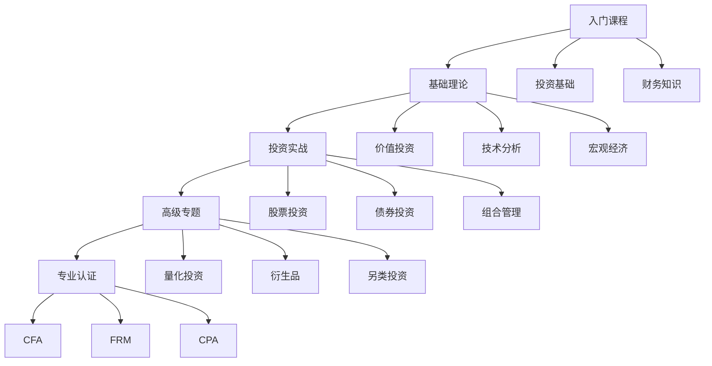

# 投资课程推荐：系统化在线学习路径

## 概述

在线课程提供了系统化、结构化的学习方式，通过视频讲解、案例分析和实践练习，帮助投资者快速建立知识体系。本文精选了国内外优质的投资课程，涵盖从入门到高级的完整学习路径。

**学习目标**：
1. 了解主流在线学习平台和优质课程
2. 根据自己的水平选择合适的课程
3. 建立系统化的学习计划
4. 通过课程学习快速提升投资能力
5. 获得权威机构的认证和证书

**为什么重要**：
- 系统化学习：课程提供结构化的知识体系
- 高效学习：视频讲解比阅读更直观
- 实践导向：案例分析和练习帮助应用
- 权威认证：部分课程提供专业证书

## 课程学习路径图

## 一、国际顶级课程平台

### 1.1 Coursera

#### 《投资管理专项课程》（Investment Management Specialization）
- **提供机构**：日内瓦大学（University of Geneva）
- **讲师**：Michel Habib等
- **难度**：★★★☆☆
- **时长**：约4个月（每周5-7小时）
- **费用**：$49/月订阅或$399专项课程证书
- **语言**：英文（有中文字幕）

**课程内容**：
1. 投资组合理论基础
2. 资产定价模型
3. 风险管理
4. 行为金融学
5. 投资组合构建实践

**推荐理由**：
这是Coursera上最受欢迎的投资课程之一，由顶尖商学院教授授课，理论与实践结合，适合有一定基础的学习者系统化提升。

**适合人群**：
- 有基础金融知识的投资者
- 希望系统学习投资理论的学习者
- 准备CFA考试的考生

**学习建议**：
- 完成所有作业和测验
- 参与论坛讨论
- 实践课程中的投资策略
- 获取专项课程证书

---

#### 《金融市场》（Financial Markets）
- **提供机构**：耶鲁大学（Yale University）
- **讲师**：罗伯特·席勒（Robert Shiller，诺贝尔经济学奖得主）
- **难度**：★★☆☆☆
- **时长**：约7周（每周10-15小时）
- **费用**：免费旁听，$79证书
- **语言**：英文（有中文字幕）

**课程内容**：
1. 金融市场的功能和结构
2. 行为金融学
3. 债券和股票市场
4. 衍生品市场
5. 金融危机和监管
6. 金融创新

**推荐理由**：
由诺贝尔奖得主席勒教授亲自授课，深入浅出地讲解金融市场的运作机制。课程强调行为金融学视角，对理解市场心理和泡沫形成非常有帮助。

**适合人群**：
- 投资初学者
- 对金融市场感兴趣的学习者
- 希望了解行为金融学的投资者

**学习建议**：
- 这是入门级课程，适合作为第一门投资课程
- 重点关注行为金融学部分
- 结合历史金融事件理解

---

### 1.2 edX

#### 《公司金融》（Corporate Finance）
- **提供机构**：哥伦比亚大学（Columbia University）
- **难度**：★★★★☆
- **时长**：约12周（每周8-10小时）
- **费用**：免费旁听，$149证书
- **语言**：英文

**课程内容**：
1. 财务报表分析
2. 现金流折现（DCF）
3. 资本预算
4. 资本结构
5. 股利政策
6. 公司估值

**推荐理由**：
哥伦比亚商学院的经典课程，深入讲解公司金融理论和估值方法。对于理解企业价值和投资决策非常重要。

**适合人群**：
- 价值投资者
- 股票分析师
- 希望深入理解企业估值的投资者

---

#### 《量化方法在金融中的应用》（Quantitative Methods in Finance）
- **提供机构**：麻省理工学院（MIT）
- **难度**：★★★★★
- **时长**：约16周
- **费用**：免费旁听，$199证书
- **语言**：英文

**课程内容**：
1. 概率论和统计学
2. 时间序列分析
3. 期权定价
4. 风险管理
5. 投资组合优化
6. 算法交易

**推荐理由**：
MIT的高级课程，适合有数学和编程基础的学习者。课程深入讲解量化金融的理论和实践，是量化投资的必修课。

**适合人群**：
- 量化投资者
- 金融工程师
- 有数学和编程背景的投资者

---

### 1.3 Udemy

#### 《价值投资：从格雷厄姆到巴菲特》（Value Investing: From Graham to Buffett）
- **讲师**：Sven Carlin
- **难度**：★★☆☆☆
- **时长**：约10小时
- **费用**：$19.99-$99.99（经常打折）
- **语言**：英文

**课程内容**：
1. 价值投资基础
2. 财务报表分析
3. 估值方法
4. 安全边际
5. 投资组合管理
6. 实际案例分析

**推荐理由**：
实用性强，讲师用大量实际案例讲解价值投资方法。适合想快速入门价值投资的学习者。

**适合人群**：
- 价值投资初学者
- 个人投资者
- 希望学习实战技巧的投资者

---

#### 《Python金融分析与算法交易》（Python for Financial Analysis and Algorithmic Trading）
- **讲师**：Jose Portilla
- **难度**：★★★☆☆
- **时长**：约16小时
- **费用**：$19.99-$99.99
- **语言**：英文

**课程内容**：
1. Python基础
2. Pandas数据分析
3. 金融数据获取
4. 技术指标计算
5. 回测框架
6. 算法交易策略

**推荐理由**：
适合想学习量化投资和编程的投资者。课程从零开始教授Python，并应用于金融分析和交易策略开发。

**适合人群**：
- 量化投资初学者
- 希望学习编程的投资者
- 技术背景的投资者

---

## 二、中文课程平台

### 2.1 中国大学MOOC

#### 《投资学》
- **提供机构**：北京大学
- **讲师**：刘力教授
- **难度**：★★★☆☆
- **时长**：约12周
- **费用**：免费
- **语言**：中文

**课程内容**：
1. 投资学基础
2. 证券市场
3. 投资组合理论
4. 资本资产定价模型
5. 有效市场假说
6. 行为金融学

**推荐理由**：
北大光华管理学院的经典课程，系统讲解投资学理论。适合中国投资者，结合A股市场特点。

**适合人群**：
- 投资学初学者
- 准备考研的学生
- 希望系统学习投资理论的投资者

---

#### 《公司金融》
- **提供机构**：清华大学
- **讲师**：朱武祥教授
- **难度**：★★★★☆
- **时长**：约16周
- **费用**：免费
- **语言**：中文

**课程内容**：
1. 财务报表分析
2. 企业估值
3. 资本结构
4. 并购重组
5. 公司治理
6. 案例分析

**推荐理由**：
清华经管学院的精品课程，深入讲解公司金融理论和实践。大量中国企业案例，实用性强。

**适合人群**：
- 价值投资者
- 企业分析师
- MBA学生

---

### 2.2 得到App

#### 《香帅的北大金融学课》
- **讲师**：香帅（唐涯）
- **难度**：★★☆☆☆
- **时长**：约200讲
- **费用**：¥199
- **语言**：中文

**课程内容**：
1. 金融思维
2. 资产配置
3. 投资工具
4. 风险管理
5. 金融科技
6. 宏观经济

**推荐理由**：
北大光华教授香帅用通俗易懂的语言讲解金融知识，特别适合非金融背景的学习者。课程结合中国实际，实用性强。

**适合人群**：
- 金融小白
- 希望建立金融思维的学习者
- 个人投资者

---

#### 《薛兆丰的经济学课》
- **讲师**：薛兆丰
- **难度**：★★☆☆☆
- **时长**：约250讲
- **费用**：¥199
- **语言**：中文

**课程内容**：
1. 经济学思维
2. 供需理论
3. 价格机制
4. 市场效率
5. 政府干预
6. 经济政策

**推荐理由**：
虽然不是专门的投资课程，但经济学思维对投资决策非常重要。薛兆丰用生动的案例讲解经济学原理。

**适合人群**：
- 所有投资者
- 希望建立经济学思维的学习者

---

### 2.3 雪球学院

#### 《价值投资实战课》
- **讲师**：多位雪球大V
- **难度**：★★★☆☆
- **时长**：约30讲
- **费用**：¥299-¥999
- **语言**：中文

**课程内容**：
1. 价值投资理念
2. 财务报表分析
3. 行业分析
4. 公司研究
5. 估值方法
6. 投资组合管理

**推荐理由**：
由雪球平台上的知名投资者授课，分享实战经验。课程结合A股市场特点，实用性强。

**适合人群**：
- A股投资者
- 价值投资实践者
- 希望学习实战经验的投资者

---

## 三、专业认证课程

### 3.1 CFA（特许金融分析师）

#### CFA Level I
- **提供机构**：CFA Institute
- **难度**：★★★★☆
- **时长**：约300小时学习
- **费用**：$1,450（首次注册）+ $900（考试费）
- **语言**：英文

**考试内容**：
1. 道德与职业标准（15%）
2. 定量方法（8-12%）
3. 经济学（8-12%）
4. 财务报表分析（13-17%）
5. 公司金融（8-12%）
6. 权益投资（10-12%）
7. 固定收益（10-12%）
8. 衍生品（5-8%）
9. 另类投资（5-8%）
10. 投资组合管理（5-8%）

**推荐理由**：
CFA是全球最权威的投资专业认证，Level I涵盖投资分析的基础知识。虽然难度大，但系统性强，对建立完整的投资知识体系非常有帮助。

**适合人群**：
- 专业投资者
- 金融从业者
- 希望系统学习投资知识的学习者

**学习建议**：
- 至少提前6个月开始准备
- 使用官方教材或Kaplan Schweser备考资料
- 参加模拟考试
- 加入学习小组

---

### 3.2 FRM（金融风险管理师）

#### FRM Part I
- **提供机构**：GARP（全球风险管理专业人士协会）
- **难度**：★★★★☆
- **时长**：约240小时学习
- **费用**：$550（注册费）+ $825（考试费）
- **语言**：英文

**考试内容**：
1. 风险管理基础（20%）
2. 定量分析（20%）
3. 金融市场与产品（30%）
4. 估值与风险模型（30%）

**推荐理由**：
FRM专注于风险管理，对于理解投资风险和构建稳健的投资组合非常有价值。

**适合人群**：
- 风险管理者
- 机构投资者
- 希望深入理解风险的投资者

---

## 四、免费优质资源

### 4.1 Khan Academy

#### 《金融与资本市场》（Finance and Capital Markets）
- **难度**：★★☆☆☆
- **时长**：自定进度
- **费用**：完全免费
- **语言**：英文（有中文字幕）

**课程内容**：
1. 利息和债务
2. 住房市场
3. 通货膨胀
4. 税收
5. 股票和债券
6. 期权和衍生品
7. 货币政策
8. 金融危机

**推荐理由**：
Khan Academy的课程以短视频形式呈现，每个视频10-15分钟，非常适合碎片化学习。完全免费且质量高。

**适合人群**：
- 所有投资者
- 希望利用碎片时间学习的学习者

---

### 4.2 MIT OpenCourseWare

#### 《金融理论》（Finance Theory）
- **提供机构**：麻省理工学院
- **讲师**：Andrew Lo
- **难度**：★★★★★
- **费用**：完全免费
- **语言**：英文

**课程内容**：
1. 现值和套利
2. 固定收益证券
3. 权益估值
4. 期权定价
5. 资本资产定价模型
6. 有效市场假说

**推荐理由**：
MIT的开放课程，提供完整的课程视频、讲义和作业。虽然难度大，但质量极高，完全免费。

**适合人群**：
- 有数学基础的学习者
- 希望深入学习金融理论的投资者

---

## 五、课程选择建议

### 初学者（0-1年经验）

**推荐课程组合**：
1. 耶鲁大学《金融市场》（Coursera）- 建立基础
2. Khan Academy《金融与资本市场》- 补充知识
3. 香帅《北大金融学课》（得到）- 中文理解

**学习时间**：3-6个月
**预算**：$0-$500

---

### 中级投资者（1-3年经验）

**推荐课程组合**：
1. 日内瓦大学《投资管理专项课程》（Coursera）
2. 哥伦比亚大学《公司金融》（edX）
3. 雪球学院《价值投资实战课》

**学习时间**：6-12个月
**预算**：$500-$1,000

---

### 高级投资者（3年以上经验）

**推荐课程组合**：
1. MIT《量化方法在金融中的应用》（edX）
2. CFA Level I 备考
3. Python金融分析课程（Udemy）

**学习时间**：12-24个月
**预算**：$2,000-$5,000

---

## 六、学习建议

### 1. 制定学习计划

**设定目标**：
- 明确学习目的（入门/提升/认证）
- 设定时间表
- 分配学习时间

**选择课程**：
- 根据水平选择
- 理论与实践结合
- 循序渐进

**跟踪进度**：
- 记录学习进度
- 完成作业和测验
- 定期复习

### 2. 提高学习效率

**主动学习**：
- 做笔记
- 提问和讨论
- 实践应用

**利用资源**：
- 参与论坛讨论
- 加入学习小组
- 寻求导师指导

**持续实践**：
- 边学边做
- 模拟投资
- 实盘验证

### 3. 获取证书

**证书价值**：
- 学习动力
- 知识验证
- 职业发展

**如何获取**：
- 完成所有课程
- 通过测验和考试
- 提交项目作业

## 延伸阅读

### 相关资源
- [投资书籍推荐](books.html) - 深度学习材料
- [学习网站](websites.html) - 在线学习平台
- [播客推荐](podcasts.html) - 碎片时间学习

### 实践应用
- [投资工具](../tools/screening-tools.html) - 应用所学知识
- [数据源](../tools/financial-data-sources.html) - 获取实战数据

## 参考文献

1. CFA Institute. (2024). *CFA Program Curriculum*.

2. GARP. (2024). *FRM Exam Study Guide*.

3. Coursera. (2024). *Investment Management Specialization Course Materials*.

4. edX. (2024). *Corporate Finance Course Materials*.

5. Khan Academy. (2024). *Finance and Capital Markets*.

---

**最后更新**：2024年1月

**版本说明**：课程信息会定期更新，包括新增课程、价格变动和平台变化。

**学习建议**：选择适合自己水平的课程，坚持学习，理论与实践结合，持续提升投资能力。
