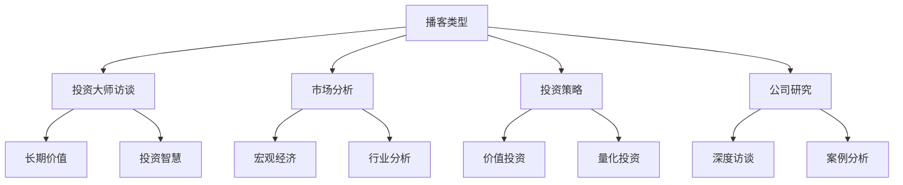

# 投资播客推荐：碎片时间高效学习

## 概述

播客是利用碎片时间学习投资知识的最佳方式之一。通过收听投资大师的访谈、市场分析和投资策略讨论，可以在通勤、运动或做家务时持续提升投资认知。本文精选了国内外优质的投资播客节目，帮助投资者建立持续学习的习惯。

**学习目标**：
1. 了解优质投资播客节目和主播
2. 根据兴趣选择合适的播客
3. 建立播客收听习惯
4. 利用碎片时间持续学习
5. 获取最新市场洞察和投资观点

**为什么重要**：
- 碎片时间利用：通勤、运动时也能学习
- 及时性强：获取最新市场观点和分析
- 多元视角：听到不同投资者的观点
- 轻松学习：音频形式更轻松易懂

## 播客收听路径图

## 一、英文播客（国际视野）

### 1.1 投资大师访谈类

#### The Investor's Podcast Network - We Study Billionaires
- **主播**：Preston Pysh, Stig Brodersen
- **更新频率**：每周2-3期
- **单集时长**：60-90分钟
- **难度**：★★★☆☆
- **推荐指数**：★★★★★

**节目特点**：
- 深度访谈顶级投资者
- 系统讲解投资经典著作
- 巴菲特股东大会解读
- 价值投资为主

**经典系列**：
- 巴菲特系列：逐章解读《聪明的投资者》
- 投资大师访谈：Ray Dalio, Howard Marks等
- 年度股东大会回顾

**推荐理由**：
这是最受欢迎的价值投资播客之一，主播深入研究巴菲特和其他投资大师的思想，并邀请知名投资者分享经验。特别适合价值投资者。

**适合人群**：
- 价值投资者
- 巴菲特追随者
- 希望学习投资大师智慧的投资者

**收听建议**：
- 从巴菲特系列开始
- 选择感兴趣的嘉宾访谈
- 配合阅读相关书籍

**订阅平台**：
- Apple Podcasts
- Spotify
- Google Podcasts
- 官网：theinvestorspodcast.com

---

#### Masters in Business (Bloomberg)
- **主播**：Barry Ritholtz
- **更新频率**：每周1期
- **单集时长**：60-90分钟
- **难度**：★★★★☆
- **推荐指数**：★★★★★

**节目特点**：
- 访谈金融界顶尖人物
- 涵盖投资、经济、市场各个方面
- 深度对话，信息量大
- 嘉宾阵容强大

**经典嘉宾**：
- Ray Dalio（桥水基金创始人）
- Howard Marks（橡树资本创始人）
- Michael Burry（《大空头》主角）
- Cathie Wood（ARK Invest创始人）

**推荐理由**：
Bloomberg的王牌播客节目，主播Barry Ritholtz是资深投资者和作家，访谈深度和广度都很出色。每期都能学到大量投资智慧和市场洞察。

**适合人群**：
- 所有投资者
- 希望了解顶级投资者思维的学习者
- 对宏观经济感兴趣的投资者

**收听建议**：
- 选择感兴趣的嘉宾
- 重点听投资理念和决策过程
- 记录关键观点

---

#### The Tim Ferriss Show
- **主播**：Tim Ferriss
- **更新频率**：每周2期
- **单集时长**：90-180分钟
- **难度**：★★★☆☆
- **推荐指数**：★★★★☆

**节目特点**：
- 访谈各领域顶尖人物
- 深入探讨成功方法论
- 投资、创业、生活方式
- 长时间深度对话

**投资相关嘉宾**：
- Ray Dalio
- Naval Ravikant
- Tony Robbins
- Marc Andreessen

**推荐理由**：
虽然不是专门的投资播客，但Tim Ferriss访谈的很多嘉宾都是成功的投资者和企业家。节目深入探讨思维方式、决策过程和成功原则，对投资者很有启发。

**适合人群**：
- 所有投资者
- 创业者
- 希望学习成功人士思维方式的学习者

---

### 1.2 市场分析类

#### The Meb Faber Show
- **主播**：Meb Faber
- **更新频率**：每周1期
- **单集时长**：60-90分钟
- **难度**：★★★★☆
- **推荐指数**：★★★★☆

**节目特点**：
- 量化投资和资产配置
- 访谈基金经理和投资专家
- 数据驱动的投资分析
- 全球市场视角

**主要话题**：
- 因子投资
- 资产配置策略
- 量化投资方法
- 全球市场机会

**推荐理由**：
Meb Faber是知名的量化投资专家和作家，节目专注于数据驱动的投资策略和全球资产配置。适合对量化投资和系统化投资感兴趣的投资者。

**适合人群**：
- 量化投资者
- 资产配置者
- 对数据分析感兴趣的投资者

---

#### Animal Spirits
- **主播**：Michael Batnick, Ben Carlson
- **更新频率**：每周1期
- **单集时长**：30-45分钟
- **难度**：★★☆☆☆
- **推荐指数**：★★★★☆

**节目特点**：
- 轻松讨论市场和投资
- 行为金融学视角
- 时长适中，易于收听
- 实用投资建议

**主要话题**：
- 市场热点讨论
- 投资心理
- 个人理财
- 投资策略

**推荐理由**：
两位主播用轻松幽默的方式讨论投资和市场，强调行为金融学和常识投资。节目时长适中，非常适合碎片时间收听。

**适合人群**：
- 个人投资者
- 希望轻松学习的投资者
- 对行为金融学感兴趣的学习者

---

### 1.3 价值投资专题

#### Value: After Hours
- **主播**：Tobias Carlisle, Bill Brewster, Jake Taylor
- **更新频率**：每周1期
- **单集时长**：60-90分钟
- **难度**：★★★☆☆
- **推荐指数**：★★★★☆

**节目特点**：
- 深度价值投资讨论
- 公司分析和投资案例
- 价值投资理论和实践
- 三位主播不同视角

**主要话题**：
- 价值股筛选
- 公司深度分析
- 估值方法
- 投资组合管理

**推荐理由**：
三位主播都是资深价值投资者，节目深入讨论价值投资的理论和实践。特别适合想深入学习价值投资的投资者。

**适合人群**：
- 价值投资者
- 股票分析师
- 希望深入学习价值投资的投资者

---

## 二、中文播客（本土视角）

### 2.1 投资理念类

#### 《投资人说》
- **平台**：喜马拉雅、小宇宙
- **主播**：多位知名投资人
- **更新频率**：不定期
- **单集时长**：30-60分钟
- **难度**：★★★☆☆
- **推荐指数**：★★★★☆

**节目特点**：
- 访谈国内知名投资人
- 分享投资理念和实战经验
- 中国市场视角
- 案例丰富

**经典嘉宾**：
- 张磊（高瓴资本）
- 邱国鹭（高毅资产）
- 但斌（东方港湾）
- 林园（林园投资）

**推荐理由**：
访谈国内顶级投资人，分享他们在中国市场的投资经验和理念。对于理解A股市场和中国企业非常有帮助。

**适合人群**：
- A股投资者
- 希望了解国内投资大师的投资者
- 对中国市场感兴趣的投资者

---

#### 《贝望录》
- **平台**：小宇宙、喜马拉雅
- **主播**：贝望
- **更新频率**：每周1-2期
- **单集时长**：40-60分钟
- **难度**：★★★☆☆
- **推荐指数**：★★★★☆

**节目特点**：
- 深度访谈投资人和企业家
- 探讨投资哲学和商业逻辑
- 长期主义视角
- 思考深度

**主要话题**：
- 投资理念
- 企业分析
- 商业模式
- 长期价值

**推荐理由**：
主播贝望深入访谈投资人和企业家，探讨长期价值投资的理念和实践。节目质量高，思考深度好。

**适合人群**：
- 价值投资者
- 长期投资者
- 对商业和投资哲学感兴趣的学习者

---

### 2.2 市场分析类

#### 《财经郎眼》
- **平台**：喜马拉雅、各大视频平台
- **主播**：郎咸平等
- **更新频率**：每周1期
- **单集时长**：60-90分钟
- **难度**：★★☆☆☆
- **推荐指数**：★★★☆☆

**节目特点**：
- 财经热点分析
- 宏观经济讨论
- 通俗易懂
- 观点鲜明

**主要话题**：
- 宏观经济
- 产业分析
- 政策解读
- 市场热点

**推荐理由**：
老牌财经节目，用通俗易懂的方式讨论财经热点和宏观经济。适合了解宏观环境和政策影响。

**适合人群**：
- 所有投资者
- 对宏观经济感兴趣的学习者
- 希望了解财经热点的投资者

---

#### 《雪球访谈》
- **平台**：雪球App、喜马拉雅
- **主播**：雪球团队
- **更新频率**：每周2-3期
- **单集时长**：30-60分钟
- **难度**：★★★☆☆
- **推荐指数**：★★★★☆

**节目特点**：
- 访谈雪球大V和投资人
- 分享投资策略和选股思路
- 实战性强
- 互动性好

**主要话题**：
- 投资策略
- 选股方法
- 行业分析
- 市场观点

**推荐理由**：
雪球平台的官方播客，访谈平台上的知名投资者，分享实战经验和投资思路。对A股投资者很有参考价值。

**适合人群**：
- A股投资者
- 雪球用户
- 希望学习实战经验的投资者

---

### 2.3 知识科普类

#### 《得到·香帅的金融课》
- **平台**：得到App
- **主播**：香帅（唐涯）
- **更新频率**：已完结
- **单集时长**：10-20分钟
- **难度**：★★☆☆☆
- **推荐指数**：★★★★★

**节目特点**：
- 系统讲解金融知识
- 通俗易懂
- 案例丰富
- 实用性强

**主要内容**：
- 金融思维
- 投资工具
- 资产配置
- 风险管理

**推荐理由**：
北大光华教授香帅用通俗易懂的语言系统讲解金融知识，特别适合金融小白建立金融思维。

**适合人群**：
- 金融初学者
- 希望建立金融思维的学习者
- 所有投资者

---

## 三、播客收听建议

### 1. 建立收听习惯

**固定时间**：
- 通勤时间：上下班路上
- 运动时间：跑步、健身时
- 家务时间：做饭、打扫时
- 休息时间：午休、睡前

**每日目标**：
- 至少30分钟
- 1-2期节目
- 持续积累

**记录笔记**：
- 关键观点
- 投资启发
- 待研究的公司或行业

### 2. 选择合适的播客

**根据水平**：
- 初学者：选择科普类、轻松类
- 中级：选择分析类、策略类
- 高级：选择深度访谈、专业讨论

**根据兴趣**：
- 价值投资：价值投资专题播客
- 宏观投资：市场分析类播客
- 量化投资：量化策略类播客

**根据市场**：
- A股投资者：中文播客为主
- 美股投资者：英文播客为主
- 全球投资者：中英文结合

### 3. 提高收听效率

**倍速播放**：
- 1.5x-2x速度
- 节省时间
- 提高效率

**选择性收听**：
- 看节目简介
- 选择感兴趣的话题
- 跳过不相关内容

**重复收听**：
- 经典节目多听几遍
- 加深理解
- 内化知识

### 4. 播客订阅平台

**国际平台**：
- Apple Podcasts
- Spotify
- Google Podcasts
- Overcast

**国内平台**：
- 小宇宙
- 喜马拉雅
- 得到
- 雪球

## 四、推荐收听清单

### 每周必听（5-7小时）

**周一**：
- Masters in Business（了解市场观点）
- 雪球访谈（A股市场分析）

**周三**：
- We Study Billionaires（价值投资学习）
- 贝望录（深度思考）

**周五**：
- Animal Spirits（轻松讨论）
- 投资人说（国内视角）

**周末**：
- The Meb Faber Show（量化投资）
- Value: After Hours（价值投资深度）

### 主题学习

**价值投资**：
1. We Study Billionaires
2. Value: After Hours
3. 投资人说

**宏观经济**：
1. Masters in Business
2. 财经郎眼
3. The Meb Faber Show

**投资心理**：
1. Animal Spirits
2. The Tim Ferriss Show
3. 香帅的金融课

## 延伸阅读

### 相关资源
- [投资书籍](books.html) - 深度学习材料
- [在线课程](courses.html) - 系统化学习
- [学习网站](websites.html) - 补充资源

### 社区交流
- [投资社区](communities.html) - 讨论和分享
- 播客听众群 - 交流心得

## 参考文献

1. The Investor's Podcast Network. (2024). *We Study Billionaires Podcast Archive*.

2. Bloomberg. (2024). *Masters in Business Podcast Archive*.

3. Ritholtz, B. (2024). *The Big Picture Blog and Podcast*.

4. Faber, M. (2024). *The Meb Faber Show Archive*.

5. 雪球. (2024). *雪球访谈节目列表*.

---

**最后更新**：2024年1月

**版本说明**：播客推荐会定期更新，添加新的优质节目，删除停更或质量下降的节目。

**收听建议**：选择2-3个核心播客长期跟踪，配合其他播客补充学习，建立持续学习的习惯。
