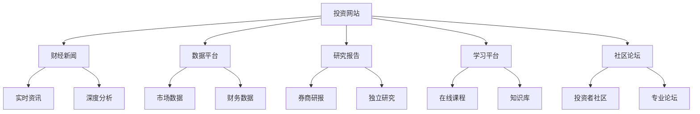

# 投资学习网站：优质在线资源导航

## 概述

互联网提供了丰富的投资学习资源，从财经新闻、市场数据到深度研究报告，应有尽有。本文精选了国内外优质的投资学习网站和在线平台，帮助投资者快速找到所需资源，建立高效的信息获取渠道。

**学习目标**：
1. 了解主流投资学习网站和平台
2. 掌握高效的信息获取方法
3. 建立个性化的资源收藏夹
4. 学会筛选和验证信息质量
5. 构建完整的信息获取体系

**为什么重要**：
- 信息获取：及时获取市场信息和研究报告
- 知识学习：系统学习投资知识和技能
- 数据分析：获取财务数据和市场数据
- 社区交流：与其他投资者交流学习

## 网站资源分类图

## 一、综合财经资讯平台

### 1.1 国际平台

#### Bloomberg
- **网址**：www.bloomberg.com
- **类型**：综合财经资讯
- **语言**：英文
- **费用**：部分免费，专业版订阅 $39/月
- **推荐指数**：★★★★★

**核心功能**：
- 实时市场数据和新闻
- 深度分析文章
- 市场评论和观点
- 视频和播客内容
- Bloomberg Terminal（专业版）

**特色内容**：
- Markets：全球市场实时数据
- Opinion：知名分析师观点
- Businessweek：商业周刊
- Podcasts：Masters in Business等

**推荐理由**：
Bloomberg是全球最权威的财经资讯平台之一，提供高质量的新闻、分析和数据。虽然部分内容需要订阅，但免费内容也非常丰富。

**适合人群**：
- 所有投资者
- 专业投资者
- 对全球市场感兴趣的投资者

**使用建议**：
- 每日浏览Markets板块了解市场动态
- 关注Opinion板块的分析文章
- 订阅感兴趣的Newsletter
- 收听Podcasts节目

---

#### Financial Times (FT)
- **网址**：www.ft.com
- **类型**：综合财经新闻
- **语言**：英文
- **费用**：订阅 $75/月
- **推荐指数**：★★★★★

**核心功能**：
- 全球财经新闻
- 深度分析报道
- 市场数据和图表
- 专栏作家观点
- Lex专栏（公司分析）

**特色内容**：
- Lex Column：简洁有力的公司分析
- Big Read：深度长文
- FT Alphaville：市场评论博客
- Markets Data：市场数据中心

**推荐理由**：
FT以深度报道和高质量分析著称，特别是Lex专栏的公司分析简洁精准。虽然需要订阅，但内容质量极高。

**适合人群**：
- 专业投资者
- 价值投资者
- 对深度分析感兴趣的投资者

---

#### The Wall Street Journal (WSJ)
- **网址**：www.wsj.com
- **类型**：综合财经新闻
- **语言**：英文
- **费用**：订阅 $39/月
- **推荐指数**：★★★★★

**核心功能**：
- 美国和全球财经新闻
- 市场分析和评论
- 公司报道
- 个人理财建议
- 市场数据

**特色内容**：
- Heard on the Street：市场评论
- MoneyBeat：市场博客
- CFO Journal：公司财务
- Personal Finance：个人理财

**推荐理由**：
WSJ是美国最权威的财经报纸，报道及时准确，分析深入。特别适合关注美国市场的投资者。

**适合人群**：
- 美股投资者
- 关注美国经济的投资者
- 所有投资者

---

#### Reuters
- **网址**：www.reuters.com
- **类型**：综合新闻和财经
- **语言**：英文
- **费用**：免费
- **推荐指数**：★★★★☆

**核心功能**：
- 实时新闻
- 市场数据
- 公司新闻
- 宏观经济报道
- 图片和视频

**推荐理由**：
路透社提供及时准确的新闻报道，完全免费。虽然深度分析不如FT和WSJ，但新闻时效性强。

**适合人群**：
- 所有投资者
- 需要及时新闻的投资者

---

### 1.2 中文平台

#### 财新网
- **网址**：www.caixin.com
- **类型**：综合财经资讯
- **语言**：中文
- **费用**：部分免费，会员 ¥198/年
- **推荐指数**：★★★★★

**核心功能**：
- 深度财经报道
- 宏观经济分析
- 公司调查报道
- 市场评论
- 数据库

**特色内容**：
- 封面报道：深度调查
- 宏观：经济政策分析
- 金融：金融市场报道
- 公司：企业深度报道

**推荐理由**：
财新是中国最专业的财经媒体之一，以深度调查报道和独立观点著称。对于理解中国经济和市场非常有价值。

**适合人群**：
- A股投资者
- 关注中国经济的投资者
- 希望深入了解中国市场的投资者

---

#### 雪球
- **网址**：xueqiu.com
- **类型**：投资者社区和资讯
- **语言**：中文
- **费用**：免费
- **推荐指数**：★★★★★

**核心功能**：
- 投资者社区
- 实时行情
- 投资组合跟踪
- 研究报告
- 投资者交流

**特色内容**：
- 雪球大V：知名投资者分享
- 组合：跟踪投资组合
- 研报：券商研究报告
- 直播：投资者直播分享

**推荐理由**：
雪球是中国最大的投资者社区，聚集了大量优秀投资者。可以学习他人的投资思路，跟踪投资组合，获取研究报告。

**适合人群**：
- A股投资者
- 港股投资者
- 希望与其他投资者交流的投资者

---

#### 东方财富网
- **网址**：www.eastmoney.com
- **类型**：综合财经门户
- **语言**：中文
- **费用**：免费
- **推荐指数**：★★★★☆

**核心功能**：
- 实时行情
- 财经新闻
- 数据中心
- 研究报告
- 股吧论坛

**特色内容**：
- 数据中心：全面的市场数据
- 研报中心：券商研究报告
- 股吧：个股讨论区
- 资金流向：资金流向分析

**推荐理由**：
东方财富网提供全面的A股市场数据和资讯，完全免费。数据中心功能强大，是A股投资者的必备工具。

**适合人群**：
- A股投资者
- 需要市场数据的投资者

---

## 二、投资研究和分析平台

### 2.1 国际平台

#### Seeking Alpha
- **网址**：seekingalpha.com
- **类型**：投资研究和分析
- **语言**：英文
- **费用**：部分免费，Premium $239/年
- **推荐指数**：★★★★★

**核心功能**：
- 投资者撰写的分析文章
- 公司财报分析
- 股票评级和目标价
- 投资组合跟踪
- 财报电话会议记录

**特色内容**：
- Analysis：深度分析文章
- Earnings：财报分析
- Transcripts：电话会议记录
- Portfolio：投资组合工具

**推荐理由**：
Seeking Alpha汇集了大量独立投资者和分析师的研究文章，观点多元，分析深入。特别是财报电话会议记录非常有价值。

**适合人群**：
- 美股投资者
- 价值投资者
- 希望看到多元观点的投资者

**使用建议**：
- 阅读不同观点的分析文章
- 关注财报季的分析
- 阅读电话会议记录
- 使用投资组合跟踪功能

---

#### Morningstar
- **网址**：www.morningstar.com
- **类型**：投资研究和评级
- **语言**：英文
- **费用**：部分免费，Premium $249/年
- **推荐指数**：★★★★★

**核心功能**：
- 股票和基金评级
- 公司分析报告
- 投资组合工具
- 市场数据
- 教育资源

**特色内容**：
- Star Rating：晨星评级
- Fair Value：公平价值估算
- Economic Moat：经济护城河评级
- Portfolio X-Ray：投资组合分析

**推荐理由**：
Morningstar是全球最权威的投资研究机构之一，其股票评级和经济护城河分析对价值投资者非常有参考价值。

**适合人群**：
- 价值投资者
- 基金投资者
- 长期投资者

---

#### GuruFocus
- **网址**：www.gurufocus.com
- **类型**：价值投资研究
- **语言**：英文
- **费用**：部分免费，Premium $399/年
- **推荐指数**：★★★★☆

**核心功能**：
- 价值投资筛选工具
- 大师投资组合跟踪
- 公司财务分析
- 估值工具
- 投资理念学习

**特色内容**：
- Guru Portfolios：跟踪投资大师持仓
- Stock Screener：价值股筛选
- DCF Calculator：DCF估值工具
- Financial Strength：财务健康评分

**推荐理由**：
GuruFocus专注于价值投资，提供强大的筛选和分析工具。可以跟踪巴菲特等投资大师的持仓变化。

**适合人群**：
- 价值投资者
- 希望跟踪投资大师的投资者
- 需要估值工具的投资者

---

### 2.2 中文平台

#### 理杏仁
- **网址**：www.lixinger.com
- **类型**：A股数据和分析
- **语言**：中文
- **费用**：部分免费，会员 ¥299/年
- **推荐指数**：★★★★★

**核心功能**：
- A股财务数据
- 估值分析
- 财务指标筛选
- 行业对比
- 投资组合管理

**特色内容**：
- 财务数据：10年以上历史数据
- 估值分析：多种估值方法
- 指标筛选：自定义筛选条件
- 行业对比：同行业公司对比

**推荐理由**：
理杏仁提供全面的A股财务数据和分析工具，界面简洁，数据准确。是A股价值投资者的必备工具。

**适合人群**：
- A股价值投资者
- 需要财务数据的投资者
- 量化投资者

---

#### 萝卜投研
- **网址**：robo.datayes.com
- **类型**：智能投研平台
- **语言**：中文
- **费用**：部分免费，专业版 ¥999/年
- **推荐指数**：★★★★☆

**核心功能**：
- AI智能问答
- 研究报告搜索
- 财务数据分析
- 行业研究
- 公司对比

**特色内容**：
- 智能问答：AI回答投资问题
- 研报库：海量券商研报
- 数据分析：可视化数据分析
- 行业图谱：行业关系图

**推荐理由**：
萝卜投研利用AI技术提供智能投研服务，可以快速获取研究报告和数据分析。对于提高研究效率很有帮助。

**适合人群**：
- A股投资者
- 需要研究报告的投资者
- 希望提高研究效率的投资者

---

## 三、数据和工具平台

### 3.1 市场数据

#### Yahoo Finance
- **网址**：finance.yahoo.com
- **类型**：市场数据和新闻
- **语言**：英文
- **费用**：免费
- **推荐指数**：★★★★★

**核心功能**：
- 实时行情
- 历史数据下载
- 财务报表
- 新闻和分析
- 投资组合跟踪

**推荐理由**：
Yahoo Finance提供全面的市场数据，完全免费，可以下载历史数据。是个人投资者获取数据的首选平台。

**适合人群**：
- 所有投资者
- 需要历史数据的投资者
- 量化投资者

---

#### TradingView
- **网址**：www.tradingview.com
- **类型**：图表和技术分析
- **语言**：英文/中文
- **费用**：部分免费，Pro $14.95/月
- **推荐指数**：★★★★★

**核心功能**：
- 专业图表工具
- 技术指标
- 社区分享
- 实时数据
- 回测功能

**推荐理由**：
TradingView提供最强大的在线图表工具，支持各种技术指标和自定义脚本。界面美观，功能强大。

**适合人群**：
- 技术分析者
- 量化投资者
- 所有投资者

---

### 3.2 财务数据

#### SEC EDGAR
- **网址**：www.sec.gov/edgar
- **类型**：美国上市公司文件
- **语言**：英文
- **费用**：免费
- **推荐指数**：★★★★★

**核心功能**：
- 公司财报（10-K, 10-Q）
- 股东信
- 内部交易记录
- 重大事件披露
- 历史文件查询

**推荐理由**：
SEC EDGAR是美国上市公司信息披露的官方平台，所有文件都可以免费查询下载。是研究美股公司的第一手资料来源。

**适合人群**：
- 美股投资者
- 价值投资者
- 深度研究者

---

#### 巨潮资讯网
- **网址**：www.cninfo.com.cn
- **类型**：A股信息披露
- **语言**：中文
- **费用**：免费
- **推荐指数**：★★★★★

**核心功能**：
- 上市公司公告
- 定期报告
- 临时公告
- 监管文件
- 历史公告查询

**推荐理由**：
巨潮资讯网是A股上市公司信息披露的官方平台，所有公告都可以免费查询下载。是研究A股公司的必备工具。

**适合人群**：
- A股投资者
- 需要公司公告的投资者

---

## 四、学习和教育平台

### 4.1 投资教育

#### Investopedia
- **网址**：www.investopedia.com
- **类型**：投资教育和词典
- **语言**：英文
- **费用**：免费
- **推荐指数**：★★★★★

**核心功能**：
- 金融术语词典
- 投资教程
- 市场分析
- 模拟交易
- 考试准备（CFA, Series 7等）

**特色内容**：
- Dictionary：金融术语解释
- Academy：系统化课程
- Simulator：模拟交易
- Exam Prep：考试准备

**推荐理由**：
Investopedia是最全面的投资教育网站，提供详细的术语解释和系统化的学习内容。完全免费，是投资学习的必备资源。

**适合人群**：
- 投资初学者
- 所有投资者
- 准备金融考试的学习者

---

#### Khan Academy - Finance
- **网址**：www.khanacademy.org/economics-finance-domain
- **类型**：免费在线教育
- **语言**：英文（有中文字幕）
- **费用**：完全免费
- **推荐指数**：★★★★★

**核心功能**：
- 视频课程
- 练习题
- 进度跟踪
- 系统化学习路径

**课程内容**：
- 金融基础
- 股票和债券
- 期权和衍生品
- 货币政策
- 金融危机

**推荐理由**：
Khan Academy提供高质量的免费教育视频，用简单易懂的方式讲解复杂的金融概念。非常适合初学者。

**适合人群**：
- 投资初学者
- 希望系统学习的投资者

---

### 4.2 中文学习平台

#### 知乎 - 投资话题
- **网址**：www.zhihu.com
- **类型**：问答社区
- **语言**：中文
- **费用**：免费
- **推荐指数**：★★★★☆

**核心功能**：
- 投资问答
- 专栏文章
- 圆桌讨论
- 知识付费课程

**推荐理由**：
知乎聚集了大量投资者和金融从业者，可以找到很多高质量的投资问答和文章。适合学习和交流。

**适合人群**：
- 所有投资者
- 希望交流学习的投资者

---

#### 集思录
- **网址**：www.jisilu.cn
- **类型**：低风险投资社区
- **语言**：中文
- **费用**：免费
- **推荐指数**：★★★★☆

**核心功能**：
- 可转债数据
- 分级基金数据
- 套利机会
- 投资者交流

**推荐理由**：
集思录专注于低风险投资策略，提供可转债、分级基金等数据和分析。对于稳健投资者很有价值。

**适合人群**：
- 低风险投资者
- 可转债投资者
- 套利投资者

---

## 五、使用建议

### 1. 建立信息获取体系

**每日必看**：
- Bloomberg/Reuters：全球市场动态
- 雪球/东方财富：A股市场信息
- Yahoo Finance：持仓股票行情

**每周必看**：
- Seeking Alpha：深度分析文章
- 财新网：中国经济深度报道
- Morningstar：投资研究报告

**定期查看**：
- SEC EDGAR/巨潮资讯：公司公告
- 理杏仁：财务数据分析
- GuruFocus：大师持仓变化

### 2. 信息筛选和验证

**多源验证**：
- 重要信息查看多个来源
- 对比不同观点
- 验证数据准确性

**关注权威**：
- 优先选择权威平台
- 关注专业分析师
- 警惕虚假信息

**独立思考**：
- 不盲从他人观点
- 建立自己的判断
- 验证投资逻辑

### 3. 高效使用工具

**收藏夹管理**：
- 按类别整理网站
- 常用网站快速访问
- 定期更新清理

**RSS订阅**：
- 订阅重要网站更新
- 使用RSS阅读器
- 高效获取信息

**浏览器插件**：
- 广告屏蔽
- 翻译工具
- 数据抓取

### 4. 付费订阅建议

**值得订阅**：
- Financial Times：深度分析
- Morningstar Premium：投资研究
- 理杏仁会员：A股数据

**可选订阅**：
- Seeking Alpha Premium：更多功能
- GuruFocus Premium：高级工具
- 财新会员：深度报道

**免费替代**：
- 大部分需求可用免费资源满足
- 先用免费版本
- 确认需要后再订阅

## 六、网站导航清单

### 必备网站（每日使用）

**全球市场**：
1. Bloomberg - 综合资讯
2. Yahoo Finance - 市场数据
3. TradingView - 图表分析

**中国市场**：
1. 雪球 - 投资者社区
2. 东方财富 - 市场数据
3. 理杏仁 - 财务分析

### 深度研究（每周使用）

**国际**：
1. Seeking Alpha - 投资分析
2. Morningstar - 投资研究
3. GuruFocus - 价值投资

**中国**：
1. 财新网 - 深度报道
2. 萝卜投研 - 智能投研
3. 集思录 - 低风险投资

### 学习资源（持续学习）

**教育平台**：
1. Investopedia - 投资教育
2. Khan Academy - 免费课程
3. 知乎 - 问答社区

**数据来源**：
1. SEC EDGAR - 美股公告
2. 巨潮资讯 - A股公告
3. 各公司官网 - 投资者关系

## 延伸阅读

### 相关资源
- [投资书籍](books.html) - 深度学习材料
- [在线课程](courses.html) - 系统化学习
- [播客推荐](podcasts.html) - 音频学习

### 工具平台
- [数据源](../tools/financial-data-sources.html) - 专业数据平台
- [分析工具](../tools/screening-tools.html) - 投资分析工具

### 社区交流
- [投资社区](communities.html) - 投资者交流平台

## 参考文献

1. Bloomberg. (2024). *Bloomberg.com - Business, Financial & Economic News*.

2. Financial Times. (2024). *FT.com - Financial Times*.

3. Morningstar. (2024). *Morningstar - Independent Investment Research*.

4. Investopedia. (2024). *Investopedia - Financial Education*.

5. 雪球. (2024). *雪球 - 聪明的投资者都在这里*.

---

**最后更新**：2024年1月

**版本说明**：网站推荐会定期更新，添加新的优质平台，删除失效或质量下降的网站。

**使用建议**：建立个性化的网站收藏夹，根据自己的投资风格和需求选择合适的平台，建立高效的信息获取体系。
