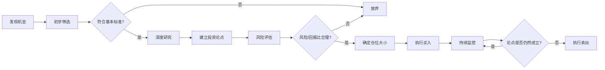
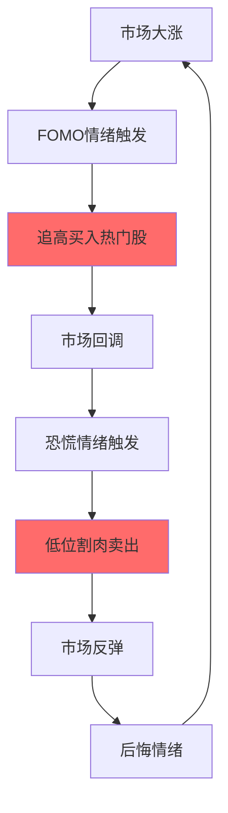

# 投资纪律：系统化决策的行为准则

## 概述

投资纪律是将正确的投资理念转化为持续盈利行为的桥梁。许多投资者懂得"低买高卖"的道理，却在实践中做出相反的行为；知道"不要把鸡蛋放在一个篮子里"，却在热门股票面前集中押注。知道和做到之间的鸿沟，正是投资纪律要填补的。

查理·芒格说："我没有什么特别聪明的地方，只是比别人更少做蠢事。"这句话揭示了投资纪律的本质——不是追求完美，而是系统性地避免错误。

**学习目标**：
- 理解投资纪律的核心要素和重要性
- 掌握建立个人投资流程的方法
- 学会制定和执行投资规则
- 培养长期坚守纪律的心理能力

## 为什么投资纪律如此重要

### 市场的本质与纪律的价值

金融市场是一个由数百万参与者组成的复杂系统，短期价格由情绪驱动，长期价格由基本面决定。在这个系统中，纪律是少数能够持续获得超额收益的来源之一。

**纪律的三大价值**：

1. **过滤噪音**：市场每天产生海量信息，大多数是噪音。纪律帮助投资者专注于真正重要的信号。

2. **克服情绪**：人类大脑在面对金融决策时会产生系统性偏差。纪律提供了一套在情绪稳定时制定的规则，在情绪波动时执行。

3. **复利积累**：长期坚守纪律的投资者，即使每年只比市场多赚2-3个百分点，经过20-30年的复利积累，也会产生巨大的财富差距。

### 缺乏纪律的代价

晨星公司的研究显示，由于投资者在错误的时间买入和卖出，实际获得的"投资者回报"比基金本身的"投资回报"平均低1-2个百分点。这个差距完全来自于缺乏纪律的行为。

**典型的无纪律行为链**：

市场大涨 → FOMO情绪触发 → 追高买入热门股 → 市场回调 → 恐慌情绪触发 → 低位割肉卖出 → 市场反弹 → 后悔情绪 → 循环重复

这个循环是大多数散户投资者的真实写照，也是为什么大多数人在牛市中也难以赚钱的原因。

## 投资纪律的核心要素

### 1. 明确的投资目标

纪律的起点是清晰的目标。没有目标的投资者，就像没有目的地的航船，很容易被市场的风浪吹偏方向。

**投资目标的四个维度**：

| 维度 | 问题 | 示例 |
|------|------|------|
| 收益目标 | 我期望的年化回报是多少？ | 年化10-12% |
| 时间维度 | 我的投资期限是多长？ | 10年以上 |
| 风险承受 | 我能接受的最大回撤是多少？ | 最大30% |
| 流动性需求 | 我何时需要用到这笔钱？ | 退休前不动用 |

**重要原则**：目标一旦设定，不应因为市场短期表现而轻易改变。如果市场下跌30%，你的10年投资目标并没有改变，改变的只是实现目标的路径。

### 2. 系统化的投资流程

纪律的核心是流程，而非结果。一个好的投资流程，即使在某次决策中产生了亏损，也是正确的——因为它在长期内会产生正期望值。

**标准投资决策流程**：



**每个环节的纪律要求**：

- **初步筛选**：建立明确的筛选标准（如：ROE > 15%，负债率 < 50%），不符合标准的直接排除
- **深度研究**：规定最低研究时间（如：至少阅读3年年报），不做功课不买入
- **仓位管理**：根据确信度和风险水平确定仓位，不因为"感觉好"而超配
- **持续监控**：定期（如每季度）重新评估投资论点，而非每天盯盘

### 3. 明确的买入标准

"什么时候买"是投资中最难的问题之一。没有明确标准的投资者，往往在市场热情高涨时买入（价格最贵），在市场低迷时不敢买入（价格最便宜）。

**建立买入标准的框架**：

**定量标准**（客观可测量）：
- 估值指标：PE < 20，PB < 3，EV/EBITDA < 15
- 财务质量：ROE > 15%，自由现金流为正，负债率 < 50%
- 成长性：收入增速 > 10%，利润增速 > 15%

**定性标准**（主观判断）：
- 是否有可持续的竞争优势（护城河）？
- 管理层是否诚信且有能力？
- 商业模式是否简单易懂？
- 行业长期前景是否良好？

**安全边际**：
- 相对于内在价值，要求至少20-30%的折扣
- 不确定性越高，要求的安全边际越大

### 4. 明确的卖出标准

许多投资者有买入标准，却没有卖出标准。这导致他们在该卖出时犹豫不决，在不该卖出时冲动操作。

**卖出的三种情况**：

**情况1：投资论点失效**
- 公司基本面发生根本性恶化
- 竞争优势被侵蚀
- 管理层出现诚信问题
- 行业发生颠覆性变化

**情况2：估值严重高估**
- 股价远超内在价值（如超过50%）
- 市场情绪极度乐观，估值泡沫明显
- 有更好的投资机会需要资金

**情况3：仓位管理需要**
- 单一持仓超过预设上限
- 需要再平衡资产配置
- 流动性需求

**不应该卖出的情况**：
- 仅仅因为股价下跌（如果基本面没有变化）
- 因为市场整体下跌而恐慌
- 因为短期业绩不达预期（需要区分短期波动和长期趋势）

### 5. 仓位管理纪律

仓位管理是风险控制的核心，也是最容易被忽视的纪律之一。

**实用仓位框架**：

| 确信度 | 建议仓位 | 适用情况 |
|--------|----------|----------|
| 极高（核心持仓） | 10-15% | 深度研究，高确信度，长期持有 |
| 高（重要持仓） | 5-10% | 充分研究，较高确信度 |
| 中（普通持仓） | 2-5% | 一般研究，中等确信度 |
| 低（试探性持仓） | 1-2% | 初步研究，持续跟踪 |

**分批建仓的纪律**：
- 不要一次性建满仓位
- 分3-5次建仓，每次间隔一定时间或价格区间
- 如果股价下跌且基本面没有变化，可以加仓（降低成本）

## 建立个人投资规则手册

投资规则手册（Investment Policy Statement, IPS）是投资者在情绪稳定时为自己制定的行为准则。它的价值在于：当市场剧烈波动、情绪高度紧张时，有一套预先制定的规则可以遵循，而不是临时做决策。

**规则手册核心内容示例**：

```
投资目标：长期年化回报10-12%，投资期限10年以上，最大可接受回撤30%

资产配置：股票70%（A股40%，港股/美股30%），债券/现金20%，其他10%
再平衡触发条件：偏离目标配置超过5%

选股硬性条件：ROE连续3年>12%，自由现金流为正，负债率<60%，有可识别竞争优势

买入规则：单次买入不超过目标仓位的1/3，买入前完成研究清单，买入价低于内在价值80%

卖出规则：投资论点失效时立即卖出，单一持仓超过15%时减仓至10%

禁止行为：不使用杠杆，不追涨停板，不在没有研究的情况下买入
```

**规则的执行与更新**：
- 每次做重大决策前，先查阅规则手册
- 如果想要违反规则，必须写下理由并等待24小时
- 每年年底系统性回顾和更新规则，不在市场剧烈波动时修改

## 培养执行力的实用方法

### 预提交策略

预提交是指在情绪稳定时，提前做出承诺，限制未来情绪化行为的空间。

**实用预提交策略**：

1. **自动定投**：设置每月固定金额自动买入指数基金，无论市场涨跌都不干预
2. **止损单**：提前设置止损价格，当股价触及时自动执行，避免临时犹豫
3. **冷静期规则**：规定任何超过总资产5%的交易，必须等待48小时后才能执行
4. **告知他人**：将自己的投资计划告知信任的朋友，利用社会承诺效应增强执行力

### 建立问责机制

独自投资很容易自我欺骗。建立问责机制可以显著提高纪律执行率。

**方法**：
- 加入投资学习小组，定期分享和讨论投资决策
- 找一位投资伙伴，互相监督是否遵守投资规则
- 定期向自己"汇报"：写月度投资总结，诚实评估是否遵守了纪律

### 减少决策疲劳

每天做太多决策会消耗意志力，导致后续决策质量下降。

**减少决策疲劳的方法**：
- 减少持仓数量（集中持有10-20只股票，而非分散持有50只）
- 降低交易频率（每月最多做几次决策，而非每天操作）
- 建立标准化流程，减少每次决策需要思考的内容

## 不同投资风格的纪律要求

### 价值投资的纪律

价值投资的核心纪律是**耐心等待**和**逆向思维**。

**关键纪律**：
- 在市场恐慌时保持冷静，甚至加仓
- 在市场狂热时保持克制，甚至减仓
- 接受长期持有期间的账面亏损
- 不因为短期股价表现而怀疑长期投资论点

**巴菲特的纪律案例**：1999年互联网泡沫期间，巴菲特因为不买科技股而被媒体嘲笑"过时"。他坚守价值投资纪律，没有追逐泡沫。2000年泡沫破裂后，他的投资组合相对大盘大幅跑赢。

### 成长投资的纪律

成长投资的核心纪律是**持续跟踪**和**及时止损**。

**关键纪律**：
- 定期检查成长驱动因素是否仍然成立
- 当成长逻辑失效时，果断卖出，不恋战
- 不因为短期业绩波动而过度反应
- 区分"成长放缓"和"成长终止"

### 指数投资的纪律

指数投资的核心纪律是**坚持定投**和**不择时**。

**关键纪律**：
- 无论市场涨跌，坚持每月定投
- 不试图预测市场顶部和底部
- 定期再平衡，而非追涨杀跌
- 忽视短期市场噪音，专注长期趋势

## 常见纪律失守的场景与应对

### 场景1：热门股票大涨，你没有持有

**情绪**：后悔、FOMO、想要追涨

**纪律应对**：
- 回顾自己的选股标准，这只股票是否符合？
- 如果不符合，接受"错过"是正常的
- 如果符合，按照标准流程研究，而非追涨

### 场景2：持有的股票大跌

**情绪**：恐慌、想要止损

**纪律应对**：
- 重新评估投资论点：基本面是否发生变化？
- 如果基本面没有变化，下跌是买入机会
- 如果基本面恶化，按照卖出规则执行

### 场景3：市场整体大跌

**情绪**：恐惧、想要清仓

**纪律应对**：
- 回顾投资目标：你的10年目标改变了吗？
- 历史数据：每次市场大跌后都出现了反弹
- 如果有现金储备，这是加仓的机会

### 场景4：连续亏损，怀疑自己的方法

**情绪**：沮丧、想要改变策略

**纪律应对**：
- 区分"方法错误"和"短期运气不好"
- 回顾过去的决策：是否遵守了自己的规则？
- 如果遵守了规则但仍然亏损，需要更长时间验证
- 如果没有遵守规则，问题不在方法，在执行

## 实战应用

**建立你的投资规则手册**：
1. 花一个周末，认真思考并写下你的投资目标、标准和规则
2. 让规则具体可操作，避免模糊表述
3. 将规则手册存放在容易查阅的地方

**每次交易前的检查清单**：
- [ ] 这次交易符合我的投资目标吗？
- [ ] 我是否完成了必要的研究？
- [ ] 这次交易符合我的买入/卖出标准吗？
- [ ] 仓位大小是否合理？
- [ ] 我是在基于分析还是情绪做决策？

**月度纪律回顾**：
- 本月做了哪些交易？
- 每次交易是否遵守了规则？
- 有哪些违规行为？原因是什么？
- 下个月如何改进？

## 常见误区

**误区1：纪律意味着僵化**
好的投资纪律是有弹性的框架，而非死板的规则。当基本面发生根本性变化时，应该更新规则，而非盲目坚守。

**误区2：纪律只适合长期投资**
无论是短期交易还是长期投资，都需要纪律。短期交易者更需要严格的止损纪律和仓位管理。

**误区3：有了纪律就不会亏损**
纪律不能保证每次决策都正确，但能保证你的决策过程是理性的，长期期望值是正的。

## 延伸阅读

- 《聪明的投资者》- 本杰明·格雷厄姆（价值投资纪律的经典）
- 《投资最重要的事》- 霍华德·马克斯（风险控制与投资纪律）
- 《原则》- 瑞·达里奥（系统化决策框架）
- 《巴菲特致股东的信》- 沃伦·巴菲特（长期投资纪律的实践）
- 《习惯的力量》- 查尔斯·杜希格（如何建立和维持好习惯）

## 参考文献

1. Graham, B. (1949). *The Intelligent Investor*. Harper & Brothers.
2. Marks, H. (2011). *The Most Important Thing*. Columbia University Press.
3. Dalio, R. (2017). *Principles: Life and Work*. Simon & Schuster.
4. Buffett, W. (1977-2023). *Berkshire Hathaway Annual Letters to Shareholders*.
5. Duhigg, C. (2012). *The Power of Habit*. Random House.
6. Ariely, D. (2008). *Predictably Irrational*. HarperCollins.
7. Thaler, R. H. (2015). *Misbehaving: The Making of Behavioral Economics*. W. W. Norton.
8. Morningstar. (2023). *Mind the Gap: A Global Study of How Fund Investors Earn Less Than They Should*.
9. Kahneman, D. (2011). *Thinking, Fast and Slow*. Farrar, Straus and Giroux.
10. Ellis, C. D. (1975). The Loser's Game. *Financial Analysts Journal*, 31(4), 19-26.
author: "知识库团队"
created_at: "2024-01-01"
updated_at: "2024-01-01"
version: "1.0"
language: "zh-CN"

# 状态
status: "published"
is_featured: false
---

# 投资纪律：系统化决策的行为准则

## 概述

投资纪律是将正确的投资理念转化为持续盈利行为的桥梁。许多投资者懂得"低买高卖"的道理，却在实践中做出相反的门股票面前集中押注。知道和做到之间的鸿沟，正是投资纪律要填补的。

质——不是追求完美，而是系统性地避免错误。

**学习目标**：
- 理解投资纪律的核心要素
- 掌握建立个人投资流程的方法
- 学会制定和执行投资规则
- 培养长期坚守纪律的心理能力

## 为什么投资纪律如此重要

### 市场的本质与纪律的价值

金融市场是一个由数百万参中，纪律是少数能够持续获得超额收益的来源之一。

**纪律的三大价值**：

1. **过滤噪音**：市场每律帮助投资者专注于真正重要的信号。

2. **克服情绪**供了一套在情绪稳定时制定的规则，在情绪波动时执行。

产生巨大的财富差距。

### 缺乏纪律的代价

**数据证明**：晨自于缺乏纪律的行为。

**典型的无纪律行为链**：


这个循环是大多数散户投资者的真实写照，也是为什么人在牛市中也难以赚钱的原因。

## 投资纪律的核心要素

### 1. 明确的投资目标

纪律的起点是清晰的目标。没

**投资目标的四个维度**：

| 维度 | 问题 | 示例 |
|------|--------|
% |
| 时间维度 | 0年以上 |
| 风险承受 | 我能接受的最大回撤是多少？ | 最大30% |
| 流动性需用到这笔钱？ | 退休前不动用 |

**重要原则，改变的只是实现目标的路径。

### 2. 系

纪律的核心是流程，而非结果。一个好的投资流程，即使在某次决策中产生了亏损，也是正确的——因为它在长期内会产生正期望值。

**标准投资决策流程**：

```mermaid
graph LR
    A[发现机会] --> B筛选]
    B --> C{符合基本标准?}
    C -->|否| D[放弃]
    C -->|是| E[深度研究]
    E --> F[建立投资论点]

    G --> H{风险/回报比合理?}
    H -->|否| D
    H -->|是| I[确定仓位大小]
    I --> J[执行买入]
    J --> K[持续监控]
    K --> L{论点是否仍然成立?}
    L -->|是| K
    L -->|否| M[执行卖出]
```

**每个环节的纪律要求**：

- **初步筛选**：建立明确的筛选标准（如：ROE > 15%，负债率 < 50%），不符合标准的直接排除
- **深度研究**：规定最低研究时间（如：至少阅读3年年报），不做功课不买入
- **仓位管理**：根据确信度和风险水平确定仓位，不因为"感觉好"而超配
- **持续监控**：定期（如每季度）重新评估投资论点，而非每天盯盘

### 3. 明确的买入标准

"什么时候买"是投资中最难的问题之一。没有明确标准的投资者，往往在市场热情高涨时买入（价格最贵），在市场低迷时不敢买入（价格最便宜）。

**建立买入标准的框架**：

**定量标准**（客观可测量）：
- 估值指标：PE < 20，PB < 3，EV/EBITDA < 15
- 财务质量：ROE > 15%，自由现金流为正，负债率 < 50%
- 成长性：收入增速 > 10%，利润增速 > 15%

**定性标准**（主观判断）：
- 是否有可持续的竞争优势（护城河）？
- 管理层是否诚信且有能力？
商业模式是否简单易懂？
- 行业长期前景是否良好？

**安全边际**：
- 相对于内在价值，要求至少20-30%的折扣
- 不确定性越高，要求的安全边际越大

### 4. 明确的卖出标准

许多投资者有买入标准，却没有卖出标准。这导致他们在该卖出时犹豫不决，在不该卖出时冲动操作。

**卖出的三种情况**：

**情况1：投资论点失效**
- 公司基本面发生根本性恶化
- 竞争优势被侵蚀
- 管理层出现诚信问题
- 行业发生颠覆性变化

**情况2：估值严重高估**
- 股价远超内在价值（如超过50%）
- 市场情绪极度乐观，估值泡沫明显
- 有更好的投资机会需要资金

**情况3：仓位管理需要**
- 单一持仓超过预设上限
- 需要再平衡资产配置
- 流动性需求

**不应该卖出的情况**：
- 仅仅因为股价下跌（如果基本面没有变化）
- 因为市场整体下跌而恐慌
- 因为短期业绩不达预期（需要区分短期波动和长期趋势）

### 5. 仓位管理纪律

仓位管理是风险控制的核心，也是最容易被忽视的纪律之一。

**仓位管理的基本原则**：

```
单一股票最大仓位 = f(确信度, 流动性, 相关性)
```

**实用仓位框架**：

| 确信度 | 建议仓位 | 适用情况 |
|--------|----------|----------|
| 极高（核心持仓） | 10-15% | 深度研究，高确信度，长期持有 |
| 高（重要持仓） | 5-10% | 充分研究，较高确信度 |
| 中（普通持仓） | 2-5% | 一般研究，中等确信度 |
| 低（试探性持仓） | 1-2% | 初步研究，持续跟踪 |

**分批建仓的纪律**：
- 不要一次性建满仓位
- 分3-5次建仓，每次间隔一定时间或价格区间
- 如果股价下跌且基本面没有变化，可以加仓（降低成本）

## 建立个人投资规则手册

### 什么是投资规则手册

投资规则手册：当市场剧烈波动、情绪高度紧张时，有一套预先制定的规则可以遵循，而不是临时做决策。

**规则手册的核心内容**：

```markdown
# 我的投资规则手册

## 投资目标
- 长期年化回报目标：10-12%
- 投资期限：10年以上
- 最大可接受回撤：30%

## 资产配置
- 股票：70%（其中A股40%，港股/美股30%）
- 债券/现金：20%
- 其他：10%
- 再平衡触发离目标配置超过5%

## 选股标准
### 必须满足（硬性条件）
- ROE连续3年 > 12%
- 自由现金流为正
- 负债率 < 60%
- 有可识别的竞争优势

### 优先考虑（加分项）
- 管理层持股比例高
- 行业龙头地位
- 历史分红记录良好

## 买入规则
- 单次买入不超过目标仓位的1/3
- 买入前必须完成研究清单
- 买入价格必须低于内在价值估算的80%

## 卖出规则
- 投资论点失效时，无论盈亏立即卖出
- 单一持仓超过15%时，减仓至10%
- 估值超过内在价值150%时，考虑减仓

## 禁止行为
- 不使用杠杆
- 不追涨停板
- 不在没有研究的情况下买入
- 不因为市场下跌而恐慌性卖出
```

### 规则的执行与更新

**执行纪律**：
- 将规则手册打印出来，放在显眼位置
- 每次做重大决策前，先查阅规则手册
- 如果想要违反规则，必须写下理由并等待24小时

**更新规则**：
- 每年年底系统性回顾和更新规则
- 不在市场剧烈波动时修改规则
- 更新规则需要有充分的理由，而非情绪驱动

## 培养执行力的实用方法

### 预提交策略（Pre-commitment）

预提交是指在情绪稳定时，提前做出承诺，限制未来情绪化行为的空间。

**实用预提交策略**：

1. **自动定投**：设置每月固定金额自动买入指数基金，无论市场涨跌都不干预
2. **止损单**：提前设置止损价格，当股价触及时自动执行，避免临时犹豫
3. **冷静期必须等待48小时后才能执行
4. **告知他人**：将自己的投资计划告知信任的朋友，利用社会承诺效应增强执行力

### 建立问责机制

独自投资很容易自我欺机制可以显著提高纪律执行率。

**方法**：
- 加入投资学习小组，定期
- 找一位投资伙伴，互相监督是否遵守投资规则
- 定期向自己"汇报"：写月度投资总结，诚实评估是否遵守了纪律

### 减少决策疲劳

每天做太多决策会消耗意志力，导致后续决策质量下降。

**减少决策疲劳的方法**：
- 减少持仓数量（集中持有10-20只股票，而非分散持有50只）
- 降低交易频率（每月最多做几次决策，而非每天操作）
- 建立标准化流程，减少每次决策需要思考的内容

的纪律要求

### 价值投资的纪律

价值投资的核是**耐心等待**和**逆向思维**。

**关键纪律**：
- 在市场恐慌时保持冷静，甚至加仓
- 在市场狂热时克制，甚至减仓
- 接受长期持有期间的账面亏损
- 不因为短期股价表现而怀疑长期投资论点

**巴菲特的纪律案，巴菲特因为不买科技股而被媒体嘲笑"过时"。他坚守价值投资纪律，没有追逐泡沫。2000年泡沫破裂后，他的投资组合相对大盘大幅跑赢。

### 成长投资的纪律

成长投资的核心纪律是**持续跟踪**和**及时止损**。

**关键纪律**：
- 定期检查成长驱动因素是否仍然成立
- 当成长逻辑失效时，果断卖出，不恋战
- 不因为短期业绩波动而过度反应
- 区分"成长放缓"和"成长终止"

### 指数投资的纪律

指数投资的核心纪律是**坚持定投**和**不择时**。

**关键纪律**：
- 无论市场涨跌，坚持每月定投
- 不试图预测市场顶部和底部
- 定期再平衡，而非追涨杀跌
场噪音，专注长期趋势

## 常见纪律失守的场景与应对

### 场景1：热门股票大涨，你没有持有

**情绪**：后悔、FOMO、想要追涨

**纪律应对**：
- 回顾自己的选股标准，这只股票是否符合？
- 如果不符合，"是正常的
- 如果符合，按照标准流程研究，而非追涨

### 场景2：持有的股票大跌

、想要止损

**纪律应对**：
- 重新评估投资论点：基本面是否发生变化？
- 如果基本面没有变化买入机会
- 如果基本面恶化，按照卖出规则执行

### 场景3：市场整体大跌

**情绪**：恐惧、想要清仓

**纪律应对**：
- 回顾投资目标：你的10年目标改变了吗？
- 历史数据：每次市场大跌后都出现了反弹
- 如果有现金储备，这是加仓的机会

### 场景4：连续亏损，怀疑自己的方法

**情绪**：沮丧、想要改变策略

**纪律应对**：
- 区分"
- 回顾过去的决策：是否遵守了自己的规则？
- 如果遵守了规则但仍然亏损，需要更长时间验证
- 如果没有遵守规则，问题不在方法，在执行

## 实战应用

**建立你的投资规则手册**：
1. 认真思考并写下你的投资目标、标准和规则
2. 让规则具体可操作，避免模糊表述
3. 将规则手册存放在容易查阅的地方

**每次交易前的检查清单**：
- [ ] 这次交易符合我的投资目标吗？
- [ ] 我是否完成了必要的研究？
 [ ] 这次交易符合我的买入/卖出标准吗？
- [ ] 仓位大小是否合理？
- [ ] 我是在基于分析还是情绪做决策？

**月度纪律回顾**：
- 本月做了哪些交易？
- 每次交易是否遵守了规则？
- 有哪些违规行为？原因是什么？
- 下个月如何改进？

## 延伸阅读

- 《聪明的投资者》- 本杰明·格雷厄姆（价值投资纪律的经典）
纪律）
- 《原则》- 瑞·达里奥（系统化决策框架）
- 《巴菲特致股东的信》- 沃伦·巴菲特（长期投资纪律的实践）
- 《习惯的力量》- 查尔斯·杜希格（如何建立和维持好习惯）

## 参考文献

1. Graham, B. (1949). *The Intelligent Investor*. Harper & Brothers.
2. Marks, H. (2011). *The Most Important Thing*. Columbia University Press.
3. Dalio, R. (2017). *Principles: Life and Work*. Simon & Schuster.
4. Buffett, W. (1977-2023). *Berkshire Hathaway Annual Letters to Shareholders*.
5. Duhigg, C. (2012). *The Power of Habit*. Random House.
6. Ariely
7. Thaler, R. H. (2015). *Misbehaving: The Making of Behavioral Economics*. W. W. Norton.
8. Morningstar. (2023). *Mind the Gap: A Global Study of How Fund Investors Earn Less Than They Should*.
9. Kahneman, D. (2011). *Thinking, Fast and Slow*. Farrar, Straus and Giroux.
10. Ellis, C. D. (1975). The Loser's Game. *Financial Analysts Journal*, 31(4), 19-26.
