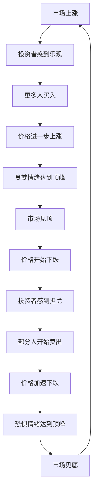

# 投资情绪控制：理性决策的心理基础

## 概述

投资是一场与自己内心的持续博弈。市场每天都在制造噪音，价格每分钟都在波动，而人类大脑在数百万年进化中形成的情绪反应机制，在面对金融市场时往往成为最大的敌人。

诺贝尔经济学奖得主丹尼尔·卡尼曼（Daniel Kahneman）的研究表明，人类在投资决策中系统性地偏离理性。损失带来的痛苦是同等收益带来的快乐的 2-2.5 倍——这种"损失厌恶"让投资者在市场下跌时恐慌性抛售，在市场上涨时追高买入，恰好与"低买高卖"的正确逻辑相反。

**学习目标**：
- 理解投资中主要情绪陷阱的心理机制
- 识别影响决策的常见认知偏差
- 掌握实用的情绪控制技巧和工具
- 建立情绪与理性并存的投资心态

## 投资中的核心情绪陷阱

### 恐惧与贪婪：市场的两极驱动力

沃伦·巴菲特有句名言："在别人贪婪时恐惧，在别人恐惧时贪婪。"这句话道出了市场情绪的本质，也揭示了为什么大多数投资者总是在错误的时间做出错误的决策。

**贪婪的表现**：
- 牛市末期追涨，忽视估值泡沫
- 频繁交易，试图抓住每一次短期波动
- 使用杠杆放大收益，低估风险
- 听信"这次不一样"的市场叙事

**恐惧的表现**：
- 熊市底部恐慌性抛售
- 持有大量现金，错过市场反弹
- 因短期亏损而放弃长期正确的投资
- 对任何负面新闻过度反应

**历史案例：2000年互联网泡沫**

1999年底，纳斯达克指数在一年内上涨了86%。贪婪情绪弥漫市场，连没有盈利的互联网公司也能以天价估值上市。普通投资者纷纷辞职全职炒股，媒体充斥着"新经济"的叙事。

2000年3月，泡沫破裂。纳斯达克从5048点跌至2002年的1114点，跌幅超过78%。那些在顶部追涨的投资者，许多人损失了毕生积蓄。

**教训**：当市场情绪极度乐观、估值严重偏离基本面时，正是最危险的时刻。

### FOMO（错失恐惧）

FOMO（Fear of Missing Out，错失恐惧）是现代投资者面临的特殊挑战。社交媒体让每个人都能实时看到别人的"成功"——朋友买了比特币赚了10倍，同事押注某只股票翻了3倍。

这种比较心理驱使投资者：
- 在没有充分研究的情况下仓促买入
- 追逐已经大幅上涨的热门资产
- 频繁切换投资策略，追逐最新热点
- 忽视自己的风险承受能力和投资目标

**应对FOMO的方法**：
1. 建立清晰的投资标准，只投资符合标准的资产
2. 接受"错过"是投资的常态，不可能抓住每一次机会
3. 关注自己的绝对收益，而非与他人比较
4. 记住：你看到的都是别人愿意分享的成功，失败很少被展示

### 锚定效应与处置效应

**锚定效应**：投资者往往以买入价格作为"锚点"，而非以当前基本面判断股票价值。

典型表现：
- "我买入价是100元，现在跌到70元，等涨回100元再卖"
- 忽视公司基本面已经恶化的事实
- 将账面亏损视为"还没亏"，拒绝止损

**处置效应**：投资者倾向于过早卖出盈利的股票（锁定利润），同时持有亏损的股票过长时间（避免实现损失）。

研究表明，这种行为模式会显著损害投资回报：
- 过早卖出的往往是基本面优秀、值得长期持有的好公司
- 长期持有的往往是基本面已经恶化的问题公司

**正确做法**：以当前基本面和未来预期为决策依据，而非买入成本。问自己："如果我今天没有持有这只股票，我会以当前价格买入吗？"

## 主要认知偏差及其影响

### 确认偏差（Confirmation Bias）

人类大脑天生倾向于寻找支持自己已有观点的信息，而忽视或贬低与之相悖的证据。

**在投资中的表现**：
- 买入某只股票后，只关注看多的分析报告
- 忽视公司出现的负面信号
- 在投资论点已经失效时，仍然坚持原有判断

**案例**：许多投资者在持有某只股票后，会主动搜索"为什么这只股票会涨"，而非客观评估"这只股票是否值得继续持有"。

**应对方法**：
- 主动寻找反对自己观点的论据（"魔鬼代言人"思维）
- 定期重新评估投资论点，假设自己是第一次看这只股票
- 建立投资日志，记录买入理由，定期检验是否仍然成立

### 过度自信（Overconfidence）

研究表明，大多数人认为自己的驾驶技术高于平均水平——这在统计上是不可能的。同样，大多数投资者认为自己的选股能力高于平均水平。

**过度自信的危害**：
- 过度集中持仓，低估风险
- 交易频率过高，增加交易成本
- 低估市场的不确定性
- 忽视专业分析师和市场共识

**数据说话**：标准普尔的研究显示，超过90%的主动管理基金在10年以上的时间维度内跑输指数。如果专业基金经理都难以持续跑赢市场，普通投资者更应保持谦逊。

### 近因偏差（Recency Bias）

人类大脑更容易记住和重视近期发生的事件，而低估长期历史规律。

**表现**：
- 经历了几年牛市后，认为股市"只会涨不会跌"
- 经历了熊市后，对股市长期前景过度悲观
- 根据最近几个月的表现判断一只股票的长期价值

**历史数据的重要性**：美国股市在过去100年中经历了无数次危机，但长期年化回报约为10%。每一次"这次不一样"的恐慌，最终都被历史证明是买入机会。

### 羊群效应（Herding）

当不确定性增加时，人类倾向于跟随群体行动——这在原始社会是生存策略，但在金融市场中往往导致灾难。

**表现**：
- 看到别人买什么就买什么
- 市场下跌时跟随大众恐慌性抛售
- 追逐热门板块和概念股

**反向思考**：真正的投资机会往往出现在大众恐惧的时候。2008年金融危机、2020年新冠疫情初期，都是历史性的买入机会，但当时大多数人选择了卖出。

## 情绪控制的实用技巧

### 建立投资决策框架

情绪控制最有效的方法不是压制情绪，而是建立一套在情绪稳定时制定的决策框架，在情绪波动时严格执行。

**投资政策声明（IPS）**：
- 明确投资目标（收益率目标、时间维度）
- 确定风险承受能力（最大可接受亏损）
- 规定资产配置比例
- 设定再平衡规则
- 列出买入和卖出的具体标准

当市场剧烈波动时，回顾自己的IPS，问自己："我的投资目标和风险承受能力改变了吗？"如果没有，就不应该因为市场波动而改变策略。

### 情绪日志与反思

**每日/每周记录**：
- 今天的市场情绪如何？
- 我有没有因为情绪做出冲动决策？
- 我的投资论点是否发生了变化？

**交易前的"冷静期"**：
- 对于重大投资决策，设定24-48小时的冷静期
- 在冷静期内，写下买入/卖出的理由
- 冷静期结束后，重新审视这些理由是否仍然成立

### 正念与心理健康

投资心理健康与身体健康同样重要。长期处于焦虑状态会损害判断力。

**实用建议**：
- 限制查看投资组合的频率（每天最多一次，甚至每周一次）
- 关闭财经新闻的实时推送
- 建立与投资无关的兴趣爱好
- 保持规律的运动和睡眠

**巴菲特的智慧**：巴菲特说，如果你不能接受持有的股票下跌50%而不恐慌，你就不应该持有股票。这不是说要对亏损麻木，而是要对短期波动有足够的心理准备。

### 分散投资与仓位管理

合理的仓位管理是情绪控制的物质基础。当单一持仓过大时，价格波动会引发强烈的情绪反应，影响判断。

**原则**：
- 单一股票持仓不超过总资产的10-15%（除非有极高确信度）
- 保留一定比例的现金，在市场下跌时有"子弹"可用
- 分批建仓，避免一次性重仓买入

当你知道即使某只股票跌50%，也不会影响你的生活质量时，你才能真正做到理性决策。

## 不同市场环境下的情绪管理

### 牛市中的情绪管理

牛市是最容易让投资者失去理性的时期。持续上涨的市场会让人产生"我很聪明"的错觉，忽视风险。

**牛市中的纪律**：
- 定期检查持仓估值，当估值明显偏高时减仓
- 不因为"错过"某只大涨的股票而懊悔
- 保持资产配置纪律，定期再平衡
- 记住：牛市中赚钱不代表你的方法是正确的

### 熊市中的情绪管理

熊市是真正考验投资者心理素质的时期。持续下跌的市场会让人产生"一切都完了"的绝望感。

**熊市中的纪律**：
- 区分"市场下跌"和"公司基本面恶化"
- 如果基本面没有变化，下跌是买入机会而非卖出信号
- 避免频繁查看账户，减少情绪波动
- 回顾历史：每一次熊市最终都结束了

**2020年3月的案例**：新冠疫情导致美股在一个月内下跌34%。许多投资者恐慌性抛售。但那些坚持持有甚至加仓的投资者，在随后的12个月内获得了超过70%的回报。

### 震荡市中的情绪管理

震荡市是最消耗心理能量的市场环境。市场没有明确方向，频繁的涨跌让人疲惫。

**应对策略**：
- 降低交易频率，减少不必要的操作
- 专注于公司基本面，而非短期价格波动
- 接受"无聊"是投资的常态，不需要每天都有操作

## 建立长期理性投资心态

### 接受不确定性

投资的本质是在不确定性中做决策。没有人能准确预测市场短期走势，接受这一点是情绪控制的基础。

**实践**：
- 不要试图预测市场顶部和底部
- 专注于可以控制的事情（研究质量、仓位管理、成本控制）
- 接受"我不知道"是一个合理的答案

### 长期视角的力量

短期市场波动是噪音，长期趋势才是信号。将投资时间维度拉长，很多短期的情绪波动都会变得微不足道。

**思维实验**：想象你买入一只优秀公司的股票，然后被锁定5年无法交易。你会怎么选择？这个思维实验能帮助你过滤掉短期情绪，专注于真正重要的长期价值。

### 从错误中学习而非自责

每个投资者都会犯错。重要的不是避免所有错误，而是从错误中学习，避免重复同样的错误。

**建立错误档案**：
- 记录每一次重大投资失误
- 分析失误的根本原因（是信息不足、判断错误，还是情绪驱动？）
- 提炼教训，更新投资框架

## 常见误区

**误区1：情绪控制意味着没有情绪**
情绪是人类的正常反应，完全压制情绪既不可能也不健康。目标是识别情绪、理解其影响，然后做出理性决策，而非被情绪驱动。

**误区2：频繁操作能降低风险**
许多投资者认为，通过频繁买卖可以"规避风险"。实际上，频繁操作增加了交易成本，也增加了情绪驱动决策的机会。

**误区3：亏损就是失败**
短期亏损是投资的正常组成部分。真正的失败是因为情绪做出了违背投资原则的决策，或者在错误的时间卖出了正确的资产。

## 实战应用

**每日实践**：
1. 早晨：回顾投资目标和原则，而非查看股价
2. 做决策前：问自己"这是基于分析还是情绪？"
3. 晚上：记录今天的市场情绪和自己的心理状态

**月度检查**：
- 回顾过去一个月的交易记录
- 识别情绪驱动的决策
- 评估投资组合是否仍然符合原始投资论点

**年度复盘**：
- 总结全年的投资决策
- 分析哪些决策是理性的，哪些是情绪驱动的
- 更新投资框架和规则

## 延伸阅读

- 《思考，快与慢》- 丹尼尔·卡尼曼（行为经济学奠基之作）
- 《投资者的未来》- 杰里米·西格尔（长期投资的心理基础）
- 《非理性繁荣》- 罗伯特·席勒（市场情绪与泡沫）
- 《聪明的投资者》- 本杰明·格雷厄姆（第8章：投资者与市场波动）
- 《穷查理宝典》- 查理·芒格（心理偏差与投资决策）

## 参考文献

1. Kahneman, D., & Tversky, A. (1979). Prospect Theory: An Analysis of Decision under Risk. *Econometrica*, 47(2), 263-291.
2. Kahneman, D. (2011). *Thinking, Fast and Slow*. Farrar, Straus and Giroux.
3. Shiller, R. J. (2000). *Irrational Exuberance*. Princeton University Press.
4. Thaler, R. H., & Sunstein, C. R. (2008). *Nudge: Improving Decisions About Health, Wealth, and Happiness*. Yale University Press.
5. Odean, T. (1998). Are Investors Reluctant to Realize Their Losses? *Journal of Finance*, 53(5), 1775-1798.
6. Barber, B. M., & Odean, T. (2000). Trading Is Hazardous to Your Wealth. *Journal of Finance*, 55(2), 773-806.
7. Graham, B. (1949). *The Intelligent Investor*. Harper & Brothers.
8. Munger, C. (2005). *Poor Charlie's Almanack*. Donning Company Publishers.
9. Zweig, J. (2007). *Your Money and Your Brain*. Simon & Schuster.
10. Montier, J. (2010). *The Little Book of Behavioral Investing*. Wiley.
