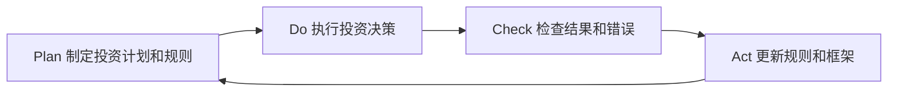

# 从投资错误中学习：失败是最好的老师

## 概述

每一位成功的投资者都有一段充满错误的历史。巴菲特曾投资航空公司并亏损数十亿美元；彼得·林奇承认自己在职业生涯中犯过无数错误；乔治·索罗斯在1987年股灾中损失惨重。区别在于，他们从错误中学习，而不是重复同样的错误。

投资错误不可避免，但可以系统化地从中学习。本文提供一套完整的框架，帮助投资者识别、分析和从错误中提炼智慧，将每一次失败转化为未来成功的基石。

**学习目标**：
- 建立系统化的投资错误分析框架
- 识别常见投资错误的类型和根本原因
- 掌握从错误中提炼可操作教训的方法
- 建立防止重复错误的机制

## 为什么从错误中学习如此重要

### 错误是最昂贵的学费，也是最有价值的教育

在投资领域，错误的代价是真实的金钱损失。但如果能从每次错误中提炼出可操作的教训，这笔"学费"就物有所值。

**错误学习的复利效应**：
- 第一次错误：损失X元，学到教训A
- 避免重复错误A：未来节省10X元
- 将教训A应用到类似情况：未来获得5X元额外收益

随着时间推移，系统性地从错误中学习，会产生显著的复利效应。

### 大多数投资者不从错误中学习的原因

**心理障碍**：
1. **自我保护**：承认错误会伤害自尊，人们倾向于将失败归因于外部因素（"市场不理性"、"黑天鹅事件"）
2. **选择性记忆**：人们更容易记住成功，忘记失败
3. **后见之明偏差**：事后觉得错误"显而易见"，但没有提炼出可操作的教训
4. **情绪回避**：回顾失败会引发负面情绪，人们倾向于回避

**克服这些障碍的关键**：建立系统化的错误记录和分析流程，将情绪化的"后悔"转化为理性的"学习"。

## 投资错误的分类框架

### 第一类：分析错误

分析错误是指在研究和判断过程中出现的失误，通常是可以通过改进研究方法来避免的。

**子类型**：

**1.1 信息不足**
- 没有充分阅读财务报告
- 忽视了重要的行业信息
- 没有了解竞争对手情况

**案例**：某投资者买入一家零售公司，没有注意到电商对该行业的冲击正在加速。如果做了更全面的行业研究，这个风险是可以识别的。

**1.2 分析错误**
- 财务模型假设过于乐观
- 错误理解了商业模式
- 高估了竞争优势的持久性

**案例**：许多投资者在2000年代初期高估了电信公司的成长性，没有意识到行业竞争会导致利润率大幅下降。

**1.3 估值错误**
- 使用了不适合该行业的估值方法
- 对增长率假设过于乐观
- 忽视了资本支出需求

### 第二类：判断错误

判断错误是指在信息充分的情况下，做出了错误的决策，通常与认知偏差有关。

**子类型**：

**2.1 过度自信**
- 在不确定性高的情况下重仓
- 忽视了反对意见
- 没有充分考虑下行风险

**2.2 确认偏差**
- 只寻找支持自己观点的信息
- 忽视了明显的警示信号
- 在投资论点已经失效时仍然坚持

**2.3 锚定效应**
- 以买入价格而非基本面判断是否卖出
- 因为"已经跌了很多"而继续持有
- 因为"还没涨回来"而不愿意卖出

### 第三类：执行错误

执行错误是指在决策正确的情况下，在执行层面出现的失误。

**子类型**：

**3.1 仓位管理错误**
- 在不确定性高时过度集中
- 没有分批建仓，一次性重仓
- 没有设置止损或止损位置不合理

**3.2 时机错误**
- 在市场极度乐观时买入
- 在市场极度悲观时卖出
- 没有耐心等待合适的买入时机

**3.3 纪律失守**
- 违反了自己制定的投资规则
- 在情绪驱动下做出冲动决策
- 没有坚守长期投资计划

### 第四类：不可避免的错误

有些错误是在当时的信息条件下无法避免的，属于"好的错误"——即使重来一次，在相同信息下仍然会做出同样的决策。

**特征**：
- 决策过程是理性的
- 基于当时可获得的最佳信息
- 结果不好是因为不可预见的事件

**重要原则**：不要因为"好的错误"而过度自责。投资的本质是在不确定性中做决策，即使过程完全正确，结果也可能不好。

## 建立投资错误档案

### 什么是投资错误档案

投资错误档案是系统记录和分析投资失误的工具。它将情绪化的"后悔"转化为结构化的"学习"，是投资者持续进步的核心工具。

**错误档案的核心价值**：
- 防止重复同样的错误
- 识别自己的系统性弱点
- 追踪改进进度
- 建立个人投资智慧库

### 错误档案的标准格式

```markdown
## 错误记录 #[编号]

**日期**：[发现错误的日期]
**涉及投资**：[股票/资产名称]
**错误类型**：[分析/判断/执行/不可避免]

### 事件描述
[简要描述发生了什么，包括买入/卖出时间、价格、结果]

### 错误分析
**我做了什么**：[具体行为]
**为什么这是错误的**：[分析原因]
**根本原因**：[深层原因，如认知偏差、信息不足等]

### 警示信号
[事后来看，有哪些信号本应该引起警觉？]

### 可操作的教训
[从这次错误中，我学到了什么具体的、可操作的教训？]

### 规则更新
[是否需要更新投资规则手册？如何更新？]

### 后续跟踪
[3个月后：是否避免了类似错误？]
[6个月后：教训是否已经内化？]
```

### 错误档案的使用方法

**记录时机**：
- 每次重大亏损后（超过总资产1%）
- 每次违反投资规则后
- 每次事后发现明显失误后

**分析深度**：
- 不要停留在表面（"我买贵了"）
- 追问根本原因（"为什么我会在高估值时买入？是FOMO？是确认偏差？"）
- 提炼可操作的教训（"下次在估值超过历史均值30%时，我会减少仓位"）

**定期回顾**：
- 每月：回顾当月的错误记录
- 每季度：分析错误模式，识别系统性弱点
- 每年：总结全年错误，更新投资框架

## 常见投资错误的深度分析

### 错误1：追涨热门股

**典型场景**：某只股票在短期内大涨，媒体广泛报道，朋友圈都在讨论，你在高点买入，随后股价回落。

**根本原因**：
- FOMO（错失恐惧）
- 社会认同偏差（大家都买，应该没问题）
- 近因偏差（最近涨了很多，应该还会涨）

**可操作的教训**：
- 建立"热门股冷静期"规则：当一只股票被广泛讨论时，等待30天再考虑买入
- 在买入前，问自己："如果没有人讨论这只股票，我还会买吗？"
- 检查估值：当前PE是否显著高于历史均值？

**历史案例**：2021年初，GameStop股票在散户投资者的推动下从20美元涨至483美元。许多追涨的投资者在高点买入，随后股价回落至20美元以下，损失惨重。

### 错误2：持有亏损股票过长时间

**典型场景**：买入一只股票后，股价持续下跌，但你一直持有，希望"等它涨回来"，最终亏损越来越大。

**根本原因**：
- 损失厌恶（卖出意味着"实现"亏损）
- 锚定效应（以买入价格为参考点）
- 自我欺骗（"只是暂时的"）

**可操作的教训**：
- 建立"投资论点检查"规则：每季度重新评估，如果论点失效，无论盈亏都卖出
- 问自己："如果我今天没有持有这只股票，我会以当前价格买入吗？"如果答案是否，考虑卖出
- 区分"股价下跌"和"基本面恶化"：前者可能是买入机会，后者是卖出信号

### 错误3：过度集中持仓

**典型场景**：对某只股票极度看好，将大量资金集中投入，结果出现意外情况，损失惨重。

**根本原因**：
- 过度自信
- 忽视了不确定性
- 没有充分考虑"如果我错了会怎样"

**可操作的教训**：
- 建立仓位上限规则：单一股票不超过总资产的15%
- 在建仓前，进行"压力测试"：如果这只股票跌50%，对我的生活有什么影响？
- 越是确信，越要警惕过度自信

**历史案例**：许多投资者在安然（Enron）事件中损失惨重，因为他们将大量资金集中在这只"优质"股票上，没有充分分散风险。

### 错误4：在市场底部恐慌性卖出

**典型场景**：市场大幅下跌，媒体充斥着悲观预测，你在底部附近卖出，随后市场反弹，错过了大幅上涨。

**根本原因**：
- 恐惧情绪压倒理性判断
- 近因偏差（最近跌了很多，还会继续跌）
- 没有长期视角

**可操作的教训**：
- 建立"市场下跌应对规则"：当市场下跌超过20%时，不卖出，考虑加仓
- 回顾历史：每次市场大跌后都出现了反弹，这次也不例外
- 区分"市场下跌"和"公司基本面恶化"：前者不是卖出理由

**历史数据**：2020年3月，美股在一个月内下跌34%。那些在底部卖出的投资者，错过了随后12个月超过70%的反弹。

### 错误5：频繁交易

**典型场景**：频繁买卖，试图抓住每一次短期波动，结果交易成本侵蚀了大部分收益，甚至亏损。

**根本原因**：
- 过度自信（认为自己能预测短期走势）
- 行动偏差（觉得"做点什么"比"什么都不做"更好）
- 对不确定性的不适应

**可操作的教训**：
- 建立"交易冷静期"规则：每次想要交易时，等待48小时
- 计算交易成本：每次交易的成本是多少？一年下来总成本是多少？
- 接受"无聊"是投资的常态：最好的投资往往是买入后长期持有

## 从错误中学习的高级技巧

### 反事实思维

反事实思维是指思考"如果当时做了不同的决策，结果会怎样"。这种思维方式可以帮助识别关键决策点和改进机会。

**使用方法**：
1. 选择一次失败的投资
2. 识别关键决策点（买入时机、仓位大小、卖出时机等）
3. 思考：如果在这个决策点做了不同的选择，结果会如何？
4. 提炼：哪个决策点的改变会产生最大的影响？

**注意事项**：反事实思维容易陷入"后见之明偏差"——事后觉得正确答案显而易见。要区分"在当时的信息条件下，这个决策是否合理"和"事后来看，这个决策是否正确"。

### 模式识别

通过分析多次错误，识别自己的系统性弱点和行为模式。

**分析维度**：
- 错误类型分布：分析错误、判断错误、执行错误各占多少？
- 市场环境：错误更多发生在牛市还是熊市？
- 行业分布：在哪些行业更容易犯错？
- 情绪状态：错误更多发生在什么情绪状态下？

**案例**：如果你发现自己的错误中，70%是在市场热情高涨时追涨买入，那么你的系统性弱点是FOMO。针对这个弱点，可以建立"热门股冷静期"规则。

### 向他人的错误学习

除了从自己的错误中学习，还可以从他人的错误中学习，成本更低。

**学习来源**：
- 投资大师的失败案例（巴菲特、索罗斯等都公开讨论过自己的错误）
- 历史上的重大金融危机（安然、雷曼、长期资本管理公司等）
- 投资书籍中的失败案例分析

**推荐资源**：
- 《投资最重要的事》- 霍华德·马克斯（大量讨论投资错误）
- 《巴菲特致股东的信》- 每年都有对错误的坦诚分析
- 《非理性繁荣》- 罗伯特·席勒（市场泡沫的历史案例）

## 建立持续改进的学习循环

### PDCA循环在投资中的应用

PDCA（Plan-Do-Check-Act）循环是持续改进的经典框架，同样适用于投资学习。



**在投资中的应用**：
- **Plan**：制定投资规则手册，明确买入/卖出标准
- **Do**：按照规则执行投资决策
- **Check**：定期回顾，分析错误，识别改进机会
- **Act**：更新投资规则，改进决策框架

### 建立个人投资智慧库

随着时间推移，从错误中提炼的教训会积累成个人投资智慧库。

**智慧库的组成**：
- 错误档案（记录所有重大错误）
- 教训清单（从错误中提炼的可操作教训）
- 投资规则手册（基于教训更新的规则）
- 案例库（成功和失败的投资案例）

**定期维护**：
- 每月：添加新的错误记录
- 每季度：回顾和更新教训清单
- 每年：全面更新投资规则手册

## 心理健康与错误处理

### 避免过度自责

从错误中学习不等于过度自责。过度自责会：
- 损害心理健康
- 降低未来决策的信心
- 导致过度保守，错过机会

**健康的错误处理方式**：
1. 承认错误，不逃避
2. 分析原因，不归咎他人
3. 提炼教训，不过度自责
4. 更新规则，向前看

**巴菲特的态度**：巴菲特在每年的股东信中都会坦诚讨论自己的错误，但他的语气是分析性的，而非自责性的。他将错误视为学习机会，而非个人失败。

### 区分过程和结果

在投资中，好的过程不一定产生好的结果，坏的结果不一定意味着过程有问题。

**评估标准**：
- 决策过程是否理性？
- 是否基于充分的研究？
- 是否遵守了投资规则？
- 是否充分考虑了风险？

如果以上问题的答案都是肯定的，即使结果不好，也不应该过度自责。投资的本质是在不确定性中做决策，即使过程完全正确，结果也可能不好。

## 实战应用

**立即行动**：
1. 回顾过去一年的投资决策，识别3-5个重大错误
2. 使用错误档案格式，记录这些错误
3. 分析每个错误的根本原因
4. 提炼可操作的教训，更新投资规则

**建立习惯**：
- 每次重大亏损后（超过总资产1%），立即记录错误档案
- 每月回顾错误档案，识别模式
- 每年进行全面的错误总结和规则更新

**心态调整**：
- 将错误视为学费，而非失败
- 接受不确定性，不追求完美
- 专注于改进过程，而非执着于结果

## 常见误区

**误区1：只记录亏损，不记录错误的决策过程**
有些决策过程是错误的，但结果碰巧是好的（运气好）。这些"幸运的错误"同样需要记录和分析，因为下次可能就没有这么幸运了。

**误区2：将所有亏损都归类为错误**
市场下跌导致的账面亏损不一定是错误。如果基本面没有变化，下跌可能是买入机会。真正的错误是决策过程中的失误，而非结果。

**误区3：从错误中学习意味着变得保守**
从错误中学习的目的是改进决策质量，而非变得过度保守。有时候，正确的教训是"我应该更大胆地买入"，而非"我应该更谨慎"。

## 延伸阅读

- 《投资最重要的事》- 霍华德·马克斯（对投资错误的深刻分析）
- 《巴菲特致股东的信》- 沃伦·巴菲特（每年坦诚讨论错误）
- 《思考，快与慢》- 丹尼尔·卡尼曼（认知偏差与决策错误）
- 《黑天鹅》- 纳西姆·塔勒布（不可预见事件与投资错误）
- 《反脆弱》- 纳西姆·塔勒布（从错误和波动中获益）

## 参考文献

1. Marks, H. (2011). *The Most Important Thing*. Columbia University Press.
2. Buffett, W. (1977-2023). *Berkshire Hathaway Annual Letters to Shareholders*.
3. Kahneman, D. (2011). *Thinking, Fast and Slow*. Farrar, Straus and Giroux.
4. Taleb, N. N. (2007). *The Black Swan*. Random House.
5. Taleb, N. N. (2012). *Antifragile*. Random House.
6. Shiller, R. J. (2000). *Irrational Exuberance*. Princeton University Press.
7. Graham, B. (1949). *The Intelligent Investor*. Harper & Brothers.
8. Lynch, P. (1989). *One Up on Wall Street*. Simon & Schuster.
9. Montier, J. (2010). *The Little Book of Behavioral Investing*. Wiley.
10. Zweig, J. (2007). *Your Money and Your Brain*. Simon & Schuster.# 标签
tags:
  - 投资错误
  - 经验教训
  - 反思总结
  - 持续改进
  - 投资成长
prerequisites:
  - "emotional-control.md"
  - "discipline.md"
related_contents:
  - "../practice/record-keeping.md"
  - "../../03-company-analysis/case-studies/failed-companies/index.md"

# 学习信息
estimated_time: 55
difficulty_score: 3

# 元信息
author: "Finance Knowledge System"
created_at: "2024-01-20"
updated_at: "2024-01-20"
version: "1.0"
language: "zh-CN"

# 状态
status: "published"
is_featured: false
---

# 从投资错误中学习：失败是最好的老师

## 概述

投资中犯错是不可避免的，但如何对待错误决定了投资者能否成长。