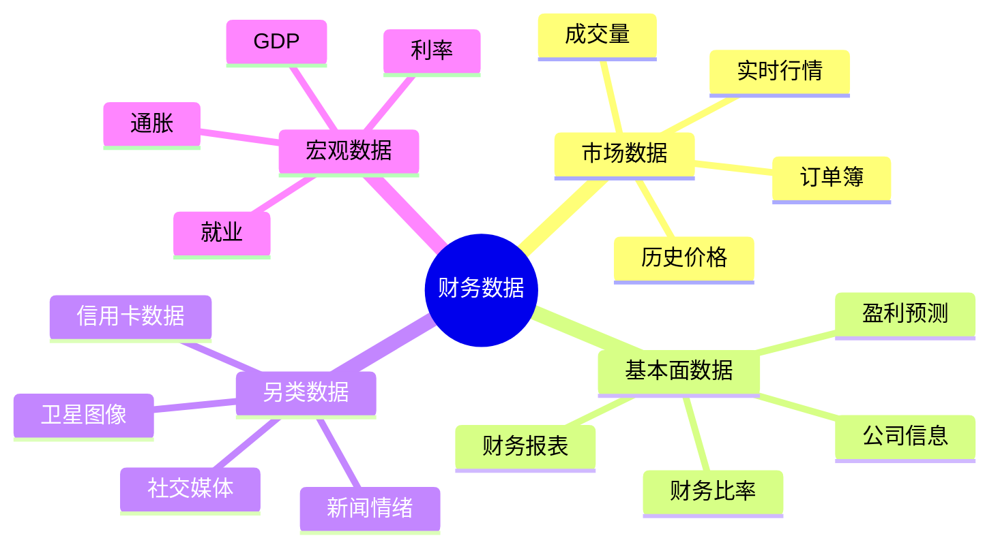

# 财务数据源完全指南

## 概述

高质量的财务数据是投资决策的基础。本指南全面介绍专业级和免费的财务数据源，帮助投资者获取准确、及时、全面的市场数据。

**学习目标**：
- 了解主流财务数据提供商的特点
- 掌握免费数据源的使用方法
- 学会使用API获取数据
- 建立个人数据获取体系

**为什么重要**：
- 数据质量决定分析质量
- 及时数据支持快速决策
- 全面数据提供完整视角
- 自动化数据提升效率

## 数据类型分类



## 专业数据终端

### 1. Bloomberg Terminal

**价格**：$24,000/年/用户

**核心功能**：
- 实时市场数据（全球所有主要市场）
- 新闻和研究
- 分析工具
- 交易执行
- 通讯功能

**数据覆盖**：
- 股票：全球 100+ 交易所
- 债券：政府债、公司债、市政债
- 外汇：所有主要货币对
- 大宗商品：能源、金属、农产品
- 衍生品：期权、期货、掉期

**独特优势**：
- 数据质量最高
- 更新最及时
- 功能最全面
- 行业标准

**常用功能**：
```
DES <Equity>: 公司描述
FA <Equity>: 财务分析
GP <Equity>: 价格图表
CN <Equity>: 公司新闻
ANR <Equity>: 分析师推荐
COMP <Equity>: 可比公司分析
```

**适用用户**：
- 专业投资者
- 机构交易员
- 投资银行
- 对冲基金

### 2. FactSet

**价格**：$12,000-$30,000/年（根据模块）

**核心功能**：
- 财务数据和分析
- 投资组合分析
- 风险管理
- 业绩归因

**数据覆盖**：
- 80,000+ 公司
- 150+ 国家
- 30+ 年历史数据

**独特优势**：
- Excel 集成强大
- 自定义报告
- 数据质量高
- 客户服务好

**适用用户**：
- 资产管理公司
- 研究分析师
- 财务顾问

### 3. Refinitiv (前 Thomson Reuters)

**价格**：$20,000+/年

**核心功能**：
- Eikon 平台
- 市场数据
- 新闻和分析
- 风险管理

**数据覆盖**：
- 全球市场数据
- 企业基本面
- 经济数据
- ESG 数据

**独特优势**：
- 新闻覆盖广
- 数据历史深
- API 功能强

### 4. Wind 资讯（中国市场）

**价格**：¥30,000-¥100,000/年

**核心功能**：
- A股/港股数据
- 宏观经济数据
- 债券数据
- 基金数据

**数据覆盖**：
- 中国市场最全面
- 30+ 年历史数据
- 实时行情
- 研究报告

**独特优势**：
- 中国市场专业
- 数据最全面
- 本地化服务
- Excel 插件

**适用用户**：
- 中国机构投资者
- 研究机构
- 金融从业者

## 免费数据源

### 1. Yahoo Finance

**网址**：https://finance.yahoo.com

**数据覆盖**：
- 全球股票
- ETF
- 指数
- 外汇
- 大宗商品

**可获取数据**：
- 实时/延迟行情
- 历史价格（日/周/月）
- 财务报表（年度/季度）
- 关键统计数据
- 分析师预测

**API 访问**：
```python
import yfinance as yf

# 获取股票数据
stock = yf.Ticker("AAPL")

# 历史价格
hist = stock.history(period="1y")

# 财务报表
financials = stock.financials
balance_sheet = stock.balance_sheet
cash_flow = stock.cashflow

# 公司信息
info = stock.info
```

**优势**：
- 完全免费
- 数据质量好
- API 易用
- 覆盖广泛

**劣势**：
- 无实时数据（15分钟延迟）
- 财务数据更新慢
- 无高级分析功能

### 2. Alpha Vantage

**网址**：https://www.alphavantage.co

**免费额度**：500 API 调用/天

**数据类型**：
- 股票时间序列
- 技术指标
- 基本面数据
- 外汇数据
- 加密货币

**API 示例**：
```python
import requests

API_KEY = 'your_api_key'
symbol = 'AAPL'

# 获取日线数据
url = f'https://www.alphavantage.co/query?function=TIME_SERIES_DAILY&symbol={symbol}&apikey={API_KEY}'
response = requests.get(url)
data = response.json()

# 获取财务报表
url = f'https://www.alphavantage.co/query?function=INCOME_STATEMENT&symbol={symbol}&apikey={API_KEY}'
response = requests.get(url)
financials = response.json()
```

**优势**：
- 免费 API
- 数据类型丰富
- 文档完善
- 技术指标内置

**劣势**：
- 免费版限制多
- 数据更新慢
- 付费版较贵（$49.99/月）

### 3. IEX Cloud

**网址**：https://iexcloud.io

**免费额度**：50,000 消息/月

**数据类型**：
- 实时行情
- 历史数据
- 公司基本面
- 新闻
- 社交情绪

**API 示例**：
```python
import requests

TOKEN = 'your_token'
symbol = 'AAPL'

# 获取报价
url = f'https://cloud.iexapis.com/stable/stock/{symbol}/quote?token={TOKEN}'
response = requests.get(url)
quote = response.json()

# 获取财务数据
url = f'https://cloud.iexapis.com/stable/stock/{symbol}/financials?token={TOKEN}'
response = requests.get(url)
financials = response.json()
```

**优势**：
- 实时数据
- API 设计优秀
- 文档清晰
- 价格合理

### 4. Quandl

**网址**：https://www.quandl.com

**免费数据集**：
- 宏观经济数据
- 期货数据
- 另类数据
- 部分股票数据

**API 示例**：
```python
import quandl

quandl.ApiConfig.api_key = 'your_api_key'

# 获取数据
data = quandl.get('WIKI/AAPL')

# 获取多个数据集
data = quandl.get(['WIKI/AAPL', 'WIKI/MSFT'])
```

**优势**：
- 另类数据丰富
- 宏观数据全面
- 历史数据深
- Python 集成好

**劣势**：
- 股票数据有限
- 部分数据需付费
- WIKI 数据集已停更

### 5. FRED (Federal Reserve Economic Data)

**网址**：https://fred.stlouisfed.org

**数据类型**：
- 宏观经济指标
- 利率数据
- 就业数据
- 通胀数据
- GDP 数据

**API 示例**：
```python
from fredapi import Fred

fred = Fred(api_key='your_api_key')

# 获取 GDP 数据
gdp = fred.get_series('GDP')

# 获取失业率
unemployment = fred.get_series('UNRATE')

# 获取 10 年期国债收益率
treasury_10y = fred.get_series('DGS10')
```

**优势**：
- 完全免费
- 数据权威
- 历史数据长
- 更新及时

### 6. 中国市场免费数据源

#### 东方财富网

**网址**：http://data.eastmoney.com

**数据类型**：
- A股行情
- 财务数据
- 资金流向
- 龙虎榜

**获取方法**：
```python
import akshare as ak

# 获取 A 股行情
stock_zh_a_spot = ak.stock_zh_a_spot()

# 获取财务数据
stock_financial = ak.stock_financial_analysis_indicator(symbol="000001")

# 获取资金流向
stock_fund_flow = ak.stock_individual_fund_flow(stock="000001", market="sz")
```

#### 新浪财经

**网址**：https://finance.sina.com.cn

**数据类型**：
- 实时行情
- 历史数据
- 财务报表
- 公告信息

**获取方法**：
```python
import akshare as ak

# 获取实时行情
stock_zh_a_spot_em = ak.stock_zh_a_spot_em()

# 获取历史数据
stock_zh_a_hist = ak.stock_zh_a_hist(symbol="000001", period="daily")
```

#### Tushare

**网址**：https://tushare.pro

**免费额度**：基础数据免费，高级数据需积分

**数据类型**：
- A股/港股/美股
- 基金数据
- 期货数据
- 财务数据

**API 示例**：
```python
import tushare as ts

ts.set_token('your_token')
pro = ts.pro_api()

# 获取股票列表
stock_list = pro.stock_basic(exchange='', list_status='L')

# 获取日线数据
df = pro.daily(ts_code='000001.SZ', start_date='20230101', end_date='20231231')

# 获取财务数据
income = pro.income(ts_code='000001.SZ', period='20231231')
```

**优势**：
- 中国市场数据全面
- 数据质量高
- 社区活跃
- 文档完善

## API 使用最佳实践

### 1. 速率限制管理

```python
import time
from functools import wraps

def rate_limit(calls_per_second=1):
    """速率限制装饰器"""
    min_interval = 1.0 / calls_per_second
    last_called = [0.0]
    
    def decorator(func):
        @wraps(func)
        def wrapper(*args, **kwargs):
            elapsed = time.time() - last_called[0]
            left_to_wait = min_interval - elapsed
            if left_to_wait > 0:
                time.sleep(left_to_wait)
            ret = func(*args, **kwargs)
            last_called[0] = time.time()
            return ret
        return wrapper
    return decorator

@rate_limit(calls_per_second=5)
def fetch_stock_data(symbol):
    # API 调用
    pass
```

### 2. 错误处理和重试

```python
import requests
from requests.adapters import HTTPAdapter
from requests.packages.urllib3.util.retry import Retry

def requests_retry_session(
    retries=3,
    backoff_factor=0.3,
    status_forcelist=(500, 502, 504),
    session=None,
):
    """创建带重试机制的 session"""
    session = session or requests.Session()
    retry = Retry(
        total=retries,
        read=retries,
        connect=retries,
        backoff_factor=backoff_factor,
        status_forcelist=status_forcelist,
    )
    adapter = HTTPAdapter(max_retries=retry)
    session.mount('http://', adapter)
    session.mount('https://', adapter)
    return session

# 使用示例
try:
    response = requests_retry_session().get(url, timeout=5)
    data = response.json()
except Exception as e:
    print(f"Error: {e}")
```

### 3. 数据缓存

```python
import pickle
from datetime import datetime, timedelta
import os

class DataCache:
    def __init__(self, cache_dir='cache'):
        self.cache_dir = cache_dir
        os.makedirs(cache_dir, exist_ok=True)
    
    def get(self, key, max_age_hours=24):
        """从缓存获取数据"""
        cache_file = os.path.join(self.cache_dir, f"{key}.pkl")
        
        if not os.path.exists(cache_file):
            return None
        
        # 检查缓存是否过期
        file_time = datetime.fromtimestamp(os.path.getmtime(cache_file))
        if datetime.now() - file_time > timedelta(hours=max_age_hours):
            return None
        
        with open(cache_file, 'rb') as f:
            return pickle.load(f)
    
    def set(self, key, data):
        """保存数据到缓存"""
        cache_file = os.path.join(self.cache_dir, f"{key}.pkl")
        with open(cache_file, 'wb') as f:
            pickle.dump(data, f)

# 使用示例
cache = DataCache()

def get_stock_data(symbol):
    # 尝试从缓存获取
    data = cache.get(symbol)
    if data is not None:
        return data
    
    # 从 API 获取
    data = fetch_from_api(symbol)
    
    # 保存到缓存
    cache.set(symbol, data)
    
    return data
```

### 4. 批量数据获取

```python
from concurrent.futures import ThreadPoolExecutor, as_completed

def fetch_multiple_stocks(symbols, max_workers=5):
    """并行获取多只股票数据"""
    results = {}
    
    with ThreadPoolExecutor(max_workers=max_workers) as executor:
        # 提交所有任务
        future_to_symbol = {
            executor.submit(fetch_stock_data, symbol): symbol 
            for symbol in symbols
        }
        
        # 收集结果
        for future in as_completed(future_to_symbol):
            symbol = future_to_symbol[future]
            try:
                data = future.result()
                results[symbol] = data
            except Exception as e:
                print(f"Error fetching {symbol}: {e}")
                results[symbol] = None
    
    return results

# 使用示例
symbols = ['AAPL', 'MSFT', 'GOOGL', 'AMZN', 'META']
data = fetch_multiple_stocks(symbols)
```

## 数据质量检查

### 1. 数据完整性检查

```python
def check_data_completeness(df):
    """检查数据完整性"""
    issues = []
    
    # 检查缺失值
    missing = df.isnull().sum()
    if missing.any():
        issues.append(f"Missing values: {missing[missing > 0].to_dict()}")
    
    # 检查重复行
    duplicates = df.duplicated().sum()
    if duplicates > 0:
        issues.append(f"Duplicate rows: {duplicates}")
    
    # 检查日期连续性
    if 'date' in df.columns:
        df['date'] = pd.to_datetime(df['date'])
        date_diff = df['date'].diff()
        gaps = date_diff[date_diff > pd.Timedelta(days=1)]
        if len(gaps) > 0:
            issues.append(f"Date gaps found: {len(gaps)}")
    
    return issues

# 使用示例
issues = check_data_completeness(stock_data)
if issues:
    print("Data quality issues:")
    for issue in issues:
        print(f"  - {issue}")
```

### 2. 数据异常检测

```python
def detect_outliers(df, column, method='iqr'):
    """检测异常值"""
    if method == 'iqr':
        Q1 = df[column].quantile(0.25)
        Q3 = df[column].quantile(0.75)
        IQR = Q3 - Q1
        lower_bound = Q1 - 1.5 * IQR
        upper_bound = Q3 + 1.5 * IQR
        outliers = df[(df[column] < lower_bound) | (df[column] > upper_bound)]
    elif method == 'zscore':
        z_scores = np.abs((df[column] - df[column].mean()) / df[column].std())
        outliers = df[z_scores > 3]
    
    return outliers

# 使用示例
price_outliers = detect_outliers(stock_data, 'close', method='iqr')
if len(price_outliers) > 0:
    print(f"Found {len(price_outliers)} price outliers")
```

## 构建个人数据管道

### 完整数据获取系统

```python
import pandas as pd
import yfinance as yf
from datetime import datetime
import logging

class FinancialDataPipeline:
    def __init__(self, cache_dir='data_cache'):
        self.cache = DataCache(cache_dir)
        self.logger = self.setup_logger()
    
    def setup_logger(self):
        """设置日志"""
        logging.basicConfig(
            level=logging.INFO,
            format='%(asctime)s - %(levelname)s - %(message)s'
        )
        return logging.getLogger(__name__)
    
    def fetch_stock_data(self, symbol, start_date, end_date):
        """获取股票数据"""
        cache_key = f"{symbol}_{start_date}_{end_date}"
        
        # 尝试从缓存获取
        data = self.cache.get(cache_key)
        if data is not None:
            self.logger.info(f"Loaded {symbol} from cache")
            return data
        
        # 从 API 获取
        try:
            self.logger.info(f"Fetching {symbol} from API")
            stock = yf.Ticker(symbol)
            data = stock.history(start=start_date, end=end_date)
            
            # 数据质量检查
            issues = check_data_completeness(data)
            if issues:
                self.logger.warning(f"Data quality issues for {symbol}: {issues}")
            
            # 保存到缓存
            self.cache.set(cache_key, data)
            
            return data
        except Exception as e:
            self.logger.error(f"Error fetching {symbol}: {e}")
            return None
    
    def fetch_financials(self, symbol):
        """获取财务数据"""
        cache_key = f"{symbol}_financials"
        
        data = self.cache.get(cache_key, max_age_hours=168)  # 1周缓存
        if data is not None:
            return data
        
        try:
            stock = yf.Ticker(symbol)
            data = {
                'financials': stock.financials,
                'balance_sheet': stock.balance_sheet,
                'cash_flow': stock.cashflow,
                'info': stock.info
            }
            self.cache.set(cache_key, data)
            return data
        except Exception as e:
            self.logger.error(f"Error fetching financials for {symbol}: {e}")
            return None
    
    def build_dataset(self, symbols, start_date, end_date):
        """构建多股票数据集"""
        all_data = {}
        
        for symbol in symbols:
            data = self.fetch_stock_data(symbol, start_date, end_date)
            if data is not None:
                all_data[symbol] = data
        
        # 合并数据
        combined = pd.DataFrame()
        for symbol, data in all_data.items():
            data['symbol'] = symbol
            combined = pd.concat([combined, data])
        
        return combined

# 使用示例
pipeline = FinancialDataPipeline()

# 获取单只股票
aapl_data = pipeline.fetch_stock_data('AAPL', '2023-01-01', '2023-12-31')

# 获取财务数据
aapl_financials = pipeline.fetch_financials('AAPL')

# 构建多股票数据集
symbols = ['AAPL', 'MSFT', 'GOOGL']
dataset = pipeline.build_dataset(symbols, '2023-01-01', '2023-12-31')
```

## 延伸阅读

### 推荐资源

1. **API 文档**
   - Yahoo Finance API: https://github.com/ranaroussi/yfinance
   - Alpha Vantage: https://www.alphavantage.co/documentation/
   - IEX Cloud: https://iexcloud.io/docs/

2. **数据科学工具**
   - pandas: https://pandas.pydata.org/
   - numpy: https://numpy.org/
   - requests: https://requests.readthedocs.io/

3. **中国市场工具**
   - akshare: https://akshare.akfamily.xyz/
   - Tushare: https://tushare.pro/
   - efinance: https://github.com/Micro-sheep/efinance

## 参考文献

1. McKinney, W. (2017). *Python for Data Analysis*. O'Reilly Media.

2. VanderPlas, J. (2016). *Python Data Science Handbook*. O'Reilly Media.

3. Hilpisch, Y. (2018). *Python for Finance*. O'Reilly Media.

4. Jansen, S. (2020). *Machine Learning for Algorithmic Trading*. Packt Publishing.

5. Chan, E. (2013). *Algorithmic Trading: Winning Strategies and Their Rationale*. Wiley.

6. Bloomberg L.P. (2023). *Bloomberg Terminal User Guide*.

7. FactSet Research Systems. (2023). *FactSet Workstation Documentation*.

8. Refinitiv. (2023). *Eikon Data API Documentation*.

9. Wind Information Co. (2023). *Wind资讯终端使用手册*.

10. Federal Reserve Bank of St. Louis. (2023). *FRED API Documentation*.
