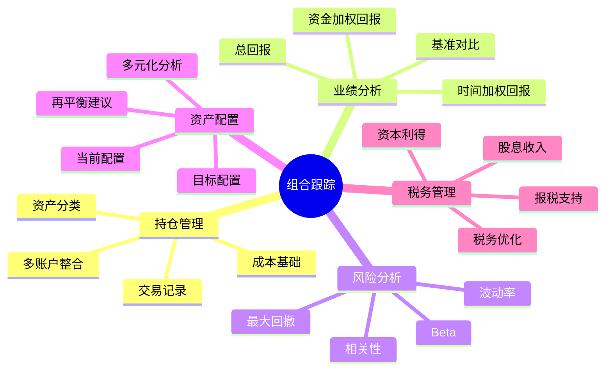

# 投资组合跟踪工具指南

## 概述

投资组合跟踪工具是投资者管理多元化投资、监控业绩表现、评估风险暴露的核心工具。无论是管理几只股票还是复杂的多资产组合，选择合适的跟踪工具都能显著提升投资管理效率。

**学习目标**：
- 了解主流投资组合跟踪工具的功能
- 学会选择适合自己的跟踪工具
- 掌握组合分析和优化方法
- 建立系统化的投资组合管理流程

**为什么重要**：
- 全局视角：了解整体投资组合状况
- 业绩监控：实时跟踪投资回报
- 风险管理：识别和控制风险暴露
- 决策支持：基于数据做出调整决策

## 核心功能需求

### 投资组合跟踪工具的核心功能



### 必备功能清单

**基础功能**：
- 多账户管理
- 实时价格更新
- 持仓成本跟踪
- 盈亏计算
- 交易历史记录

**进阶功能**：
- 业绩归因分析
- 风险指标计算
- 资产配置分析
- 再平衡建议
- 税务优化

**高级功能**：
- 情景分析
- 蒙特卡洛模拟
- 因子暴露分析
- 自定义报告
- API 集成

## 主流工具对比

### 免费工具

#### 1. Google Sheets / Excel

**优势**：
- 完全免费
- 高度可定制
- 数据完全掌控
- 无限灵活性

**劣势**：
- 需要手动更新价格
- 需要自己构建公式
- 无自动化功能
- 学习曲线较陡

**适用场景**：
- 简单组合（< 20 只持仓）
- 喜欢 DIY 的投资者
- 需要完全定制化

**基础模板结构**：

| 股票代码 | 数量 | 买入价 | 当前价 | 市值 | 成本 | 盈亏 | 盈亏% | 权重% |
|---------|------|--------|--------|------|------|------|-------|-------|
| AAPL | 100 | $150 | $175 | $17,500 | $15,000 | $2,500 | 16.7% | 35% |
| MSFT | 50 | $300 | $350 | $17,500 | $15,000 | $2,500 | 16.7% | 35% |
| GOOGL | 100 | $100 | $150 | $15,000 | $10,000 | $5,000 | 50.0% | 30% |
| **总计** | - | - | - | **$50,000** | **$40,000** | **$10,000** | **25.0%** | **100%** |

**Google Sheets 高级功能**：
```
使用 GOOGLEFINANCE 函数自动获取价格：
=GOOGLEFINANCE("AAPL", "price")

获取历史数据：
=GOOGLEFINANCE("AAPL", "close", DATE(2023,1,1), DATE(2023,12,31), "DAILY")
```

#### 2. Yahoo Finance Portfolio

**优势**：
- 完全免费
- 自动价格更新
- 简单易用
- 移动端友好

**功能**：
- 多组合管理
- 实时行情
- 新闻集成
- 基础图表

**劣势**：
- 功能较基础
- 无高级分析
- 无税务功能
- 数据导出受限

**适用场景**：
- 初学者
- 简单股票组合
- 快速查看持仓

#### 3. Seeking Alpha Portfolio

**优势**：
- 免费基础版
- 股息跟踪
- 新闻和分析集成
- 社区讨论

**独特功能**：
- 股息日历
- 收益预测
- 分析师评级汇总
- 作者观点

**适用场景**：
- 股息投资者
- 需要研究支持
- 活跃交易者

### 付费专业工具

#### 1. Personal Capital

**价格**：免费（基础版），财富管理服务收费

**核心功能**：
- 自动账户同步
- 净值追踪
- 现金流分析
- 退休规划
- 费用分析

**独特优势**：
- 银行级安全
- 全面财务视图（不仅投资）
- 免费财务顾问咨询
- 优秀的移动应用

**适用投资者**：
- 高净值个人（$100K+）
- 需要全面财务管理
- 美国投资者

**功能亮点**：

1. **投资检查工具**：
   - 分析投资组合费用
   - 识别高费用基金
   - 提供低成本替代方案

2. **退休规划器**：
   - 蒙特卡洛模拟
   - 多种退休情景
   - 社保整合

3. **费用分析器**：
   - 计算总费用比率
   - 估算费用对长期回报的影响

#### 2. Morningstar Portfolio Manager

**价格**：$34.95/月（Premium）

**核心功能**：
- X-Ray 分析
- 晨星评级
- 资产配置分析
- 股票和基金研究

**X-Ray 分析**：
- 股票板块暴露
- 股票风格箱
- 地理分布
- 费用分析
- 持股重叠

**适用投资者**：
- 基金投资者
- 需要深度分析
- 长期投资者

**独特价值**：
- 晨星独家数据和评级
- 深度基金分析
- 投资组合诊断

#### 3. Sharesight

**价格**：$19/月（Investor），$29/月（Expert）

**核心功能**：
- 多国市场支持
- 自动股息再投资
- 税务报告
- 业绩归因

**独特优势**：
- 支持 40+ 国家市场
- 详细的税务报告
- 货币转换
- 经纪商集成

**适用场景**：
- 国际投资者
- 需要税务报告
- 澳洲/新西兰投资者

**税务功能**：
- 资本利得/损失报告
- 股息收入追踪
- 成本基础计算
- 税务优化建议

#### 4. Kubera

**价格**：$150/年

**核心功能**：
- 全资产类别追踪
- 加密货币支持
- 房地产追踪
- 净值监控

**独特优势**：
- 支持另类资产
- 加密货币集成
- 遗产规划功能
- 隐私保护

**适用投资者**：
- 多元化资产配置
- 加密货币投资者
- 高净值个人

#### 5. Empower (前 Personal Capital)

**价格**：免费

**核心功能**：
- 账户聚合
- 投资分析
- 退休规划
- 费用分析器

**适用场景**：
- 美国投资者
- 需要全面财务管理
- 退休规划

### 专业机构级工具

#### 1. Bloomberg Terminal

**价格**：$24,000/年

**功能**：
- 实时市场数据
- 高级分析工具
- 新闻和研究
- 交易执行

**适用用户**：
- 专业投资者
- 机构交易员
- 基金经理

#### 2. FactSet

**价格**：定制报价（$10,000+/年）

**功能**：
- 全面数据覆盖
- 投资组合分析
- 风险管理
- 业绩归因

**适用用户**：
- 资产管理公司
- 对冲基金
- 投资银行

### 中国市场工具

#### 1. 雪球组合

**优势**：
- 免费使用
- 社区驱动
- 实时行情
- 移动端友好

**功能**：
- A股/港股/美股
- 组合跟踪
- 收益曲线
- 社区讨论

**适用场景**：
- 中国投资者
- 社交投资
- 多市场投资

#### 2. 且慢

**优势**：
- 基金组合管理
- 智能定投
- 组合策略
- 投顾服务

**功能**：
- 基金组合
- 定投计划
- 收益分析
- 风险评估

**适用场景**：
- 基金投资者
- 定投策略
- 需要投顾服务

#### 3. 蛋卷基金

**优势**：
- 基金超市
- 组合管理
- 智能定投
- 低费率

**功能**：
- 基金筛选
- 组合跟踪
- 定投管理
- 收益分析

## 高级分析功能

### 1. 业绩归因分析

**目的**：了解投资回报的来源

**分解维度**：
```
总回报 = 资产配置回报 + 选股回报 + 交互效应

资产配置回报：
- 股票 vs 债券配置决策的贡献

选股回报：
- 在每个资产类别内选择具体证券的贡献

交互效应：
- 配置和选股的联合效应
```

**实战示例**：
```
组合总回报：15%
基准回报：10%
超额回报：5%

归因分析：
- 资产配置贡献：+2%（超配科技股）
- 选股贡献：+3%（选择优质个股）
- 交互效应：0%
```

### 2. 风险分析

**关键指标**：

**波动率（Volatility）**：
```
年化波动率 = 日波动率 × √252

示例：
日波动率：1.5%
年化波动率：1.5% × √252 = 23.8%
```

**最大回撤（Maximum Drawdown）**：
```
MDD = (谷底价值 - 峰值价值) / 峰值价值

示例：
峰值：$100,000
谷底：$80,000
MDD = -20%
```

**夏普比率（Sharpe Ratio）**：
```
Sharpe = (组合回报 - 无风险利率) / 组合波动率

示例：
组合回报：12%
无风险利率：3%
波动率：15%
Sharpe = (12% - 3%) / 15% = 0.60
```

**Beta**：
```
Beta = Cov(组合, 市场) / Var(市场)

Beta = 1.2：组合波动性比市场高 20%
Beta = 0.8：组合波动性比市场低 20%
```

### 3. 资产配置分析

**当前配置 vs 目标配置**：

| 资产类别 | 当前配置 | 目标配置 | 偏差 | 再平衡操作 |
|---------|---------|---------|------|-----------|
| 美国股票 | 45% | 40% | +5% | 卖出 $2,500 |
| 国际股票 | 15% | 20% | -5% | 买入 $2,500 |
| 债券 | 30% | 30% | 0% | 无需调整 |
| 现金 | 10% | 10% | 0% | 无需调整 |

**再平衡触发条件**：
- 偏差 > 5%：考虑再平衡
- 偏差 > 10%：必须再平衡
- 时间触发：每季度/每年

### 4. 税务优化

**税收损失收割（Tax-Loss Harvesting）**：

**策略**：
1. 识别亏损持仓
2. 卖出实现损失
3. 买入类似但不同的证券
4. 用损失抵消利得

**示例**：
```
持仓 A：成本 $10,000，当前 $8,000，亏损 $2,000
持仓 B：成本 $5,000，当前 $8,000，利得 $3,000

操作：
1. 卖出持仓 A，实现 $2,000 损失
2. 买入类似的持仓 C
3. 用 $2,000 损失抵消持仓 B 的部分利得
4. 净应税利得：$3,000 - $2,000 = $1,000
```

**注意事项**：
- 避免洗售规则（30天内不能买回相同证券）
- 考虑交易成本
- 保持投资策略一致性

## 构建个人跟踪系统

### Excel/Google Sheets 高级模板

**工作表结构**：

1. **持仓明细**
2. **交易记录**
3. **业绩分析**
4. **资产配置**
5. **风险指标**
6. **税务报告**

**持仓明细表**：
```excel
列：
A: 股票代码
B: 名称
C: 数量
D: 平均成本
E: 当前价格（GOOGLEFINANCE）
F: 市值 = C × E
G: 成本基础 = C × D
H: 未实现盈亏 = F - G
I: 未实现盈亏% = H / G
J: 权重% = F / 总市值
K: 资产类别
L: 行业
M: 地理区域
```

**业绩分析表**：
```excel
指标计算：
- 总回报 = (当前价值 - 初始投资 + 提取 - 存入) / 初始投资
- 年化回报 = (1 + 总回报)^(1/年数) - 1
- 波动率 = STDEV(日回报) × SQRT(252)
- 夏普比率 = (年化回报 - 无风险利率) / 波动率
- 最大回撤 = MIN(回撤序列)
```

**自动化功能**：
```excel
使用 Google Sheets 脚本自动更新：

function updatePrices() {
  var sheet = SpreadsheetApp.getActiveSheet();
  var range = sheet.getRange("A2:A100");
  var tickers = range.getValues();
  
  for (var i = 0; i < tickers.length; i++) {
    if (tickers[i][0] != "") {
      var price = getStockPrice(tickers[i][0]);
      sheet.getRange(i+2, 5).setValue(price);
    }
  }
}

function getStockPrice(ticker) {
  var formula = '=GOOGLEFINANCE("' + ticker + '", "price")';
  return formula;
}

// 设置定时触发器：每小时运行一次
```

### Python 自动化跟踪系统

```python
import yfinance as yf
import pandas as pd
import numpy as np
from datetime import datetime, timedelta

class PortfolioTracker:
    def __init__(self, holdings):
        """
        初始化投资组合跟踪器
        
        holdings: dict, 格式 {ticker: {'shares': 100, 'cost_basis': 150}}
        """
        self.holdings = holdings
        self.tickers = list(holdings.keys())
        self.data = self.fetch_data()
    
    def fetch_data(self):
        """获取股票数据"""
        data = {}
        for ticker in self.tickers:
            stock = yf.Ticker(ticker)
            data[ticker] = {
                'info': stock.info,
                'history': stock.history(period="1y")
            }
        return data
    
    def calculate_portfolio_value(self):
        """计算组合总价值"""
        total_value = 0
        positions = []
        
        for ticker, holding in self.holdings.items():
            shares = holding['shares']
            cost_basis = holding['cost_basis']
            current_price = self.data[ticker]['info'].get('currentPrice', 0)
            
            market_value = shares * current_price
            cost = shares * cost_basis
            unrealized_gain = market_value - cost
            unrealized_gain_pct = (unrealized_gain / cost) * 100 if cost > 0 else 0
            
            positions.append({
                'Ticker': ticker,
                'Shares': shares,
                'Cost Basis': cost_basis,
                'Current Price': current_price,
                'Market Value': market_value,
                'Cost': cost,
                'Unrealized Gain': unrealized_gain,
                'Unrealized Gain %': unrealized_gain_pct
            })
            
            total_value += market_value
        
        # 计算权重
        for pos in positions:
            pos['Weight %'] = (pos['Market Value'] / total_value) * 100
        
        df = pd.DataFrame(positions)
        return df, total_value
    
    def calculate_returns(self):
        """计算投资回报"""
        # 获取历史价格
        prices = pd.DataFrame()
        for ticker in self.tickers:
            prices[ticker] = self.data[ticker]['history']['Close']
        
        # 计算每日回报
        returns = prices.pct_change().dropna()
        
        # 计算组合回报（等权重简化版）
        portfolio_returns = returns.mean(axis=1)
        
        # 计算累计回报
        cumulative_returns = (1 + portfolio_returns).cumprod()
        
        return portfolio_returns, cumulative_returns
    
    def calculate_risk_metrics(self):
        """计算风险指标"""
        portfolio_returns, _ = self.calculate_returns()
        
        # 年化回报
        annual_return = portfolio_returns.mean() * 252
        
        # 年化波动率
        annual_volatility = portfolio_returns.std() * np.sqrt(252)
        
        # 夏普比率（假设无风险利率 3%）
        risk_free_rate = 0.03
        sharpe_ratio = (annual_return - risk_free_rate) / annual_volatility
        
        # 最大回撤
        cumulative_returns = (1 + portfolio_returns).cumprod()
        running_max = cumulative_returns.expanding().max()
        drawdown = (cumulative_returns - running_max) / running_max
        max_drawdown = drawdown.min()
        
        metrics = {
            'Annual Return': f"{annual_return:.2%}",
            'Annual Volatility': f"{annual_volatility:.2%}",
            'Sharpe Ratio': f"{sharpe_ratio:.2f}",
            'Max Drawdown': f"{max_drawdown:.2%}"
        }
        
        return metrics
    
    def generate_report(self):
        """生成投资组合报告"""
        print("=" * 80)
        print("投资组合报告")
        print("=" * 80)
        print(f"报告日期: {datetime.now().strftime('%Y-%m-%d')}")
        print()
        
        # 持仓明细
        positions_df, total_value = self.calculate_portfolio_value()
        print("持仓明细：")
        print(positions_df.to_string(index=False))
        print()
        print(f"组合总价值: ${total_value:,.2f}")
        print()
        
        # 风险指标
        metrics = self.calculate_risk_metrics()
        print("风险指标：")
        for key, value in metrics.items():
            print(f"{key}: {value}")
        print("=" * 80)

# 使用示例
holdings = {
    'AAPL': {'shares': 100, 'cost_basis': 150},
    'MSFT': {'shares': 50, 'cost_basis': 300},
    'GOOGL': {'shares': 30, 'cost_basis': 100}
}

tracker = PortfolioTracker(holdings)
tracker.generate_report()
```

## 最佳实践

### 1. 定期审查

**建议频率**：
- 每日：快速查看（5分钟）
- 每周：详细审查（30分钟）
- 每月：深度分析（2小时）
- 每季度：全面评估（半天）
- 每年：战略审查（1天）

**审查清单**：
```
每日：
□ 查看总价值变化
□ 检查重大新闻
□ 确认无异常交易

每周：
□ 审查个股表现
□ 检查资产配置偏差
□ 评估市场环境

每月：
□ 计算月度回报
□ 更新业绩记录
□ 评估再平衡需求
□ 审查投资论点

每季度：
□ 深度业绩分析
□ 风险指标评估
□ 税务规划
□ 策略调整

每年：
□ 年度业绩总结
□ 投资目标审查
□ 资产配置调整
□ 税务优化
```

### 2. 数据备份

**重要性**：
- 防止数据丢失
- 历史记录保存
- 税务审计需要

**备份策略**：
```
本地备份：
- 每周导出 Excel/CSV
- 保存在多个位置

云端备份：
- 使用云存储服务
- 自动同步

版本控制：
- 保留历史版本
- 标注重要变更
```

### 3. 隐私和安全

**安全措施**：
- 使用强密码
- 启用两步验证
- 定期更改密码
- 不在公共网络访问

**隐私保护**：
- 了解工具的数据政策
- 限制第三方访问
- 定期审查权限

## 延伸阅读

### 推荐书籍

1. **《The Intelligent Asset Allocator》** - William Bernstein
   - 资产配置经典

2. **《A Random Walk Down Wall Street》** - Burton Malkiel
   - 投资组合理论

3. **《The Little Book of Common Sense Investing》** - John Bogle
   - 指数投资和组合管理

### 在线资源

1. **Bogleheads Wiki**
   - https://www.bogleheads.org/wiki/
   - 投资组合管理指南

2. **Portfolio Visualizer**
   - https://www.portfoliovisualizer.com/
   - 免费组合分析工具

3. **Morningstar Portfolio Tools**
   - https://www.morningstar.com/portfolio
   - 专业组合分析

## 参考文献

1. Markowitz, H. (1952). "Portfolio Selection." *Journal of Finance*, 7(1), 77-91.

2. Sharpe, W. F. (1966). "Mutual Fund Performance." *Journal of Business*, 39(1), 119-138.

3. Bogle, J. C. (2007). *The Little Book of Common Sense Investing*. Wiley.

4. Bernstein, W. J. (2001). *The Intelligent Asset Allocator*. McGraw-Hill.

5. Swensen, D. F. (2009). *Pioneering Portfolio Management*. Free Press.

6. Ellis, C. D. (2013). *Winning the Loser's Game*. McGraw-Hill.

7. Ferri, R. A. (2010). *All About Asset Allocation*. McGraw-Hill.

8. Malkiel, B. G. (2019). *A Random Walk Down Wall Street*. W. W. Norton.

9. Siegel, J. J. (2014). *Stocks for the Long Run*. McGraw-Hill.

10. Damodaran, A. (2012). *Investment Philosophies*. Wiley.
