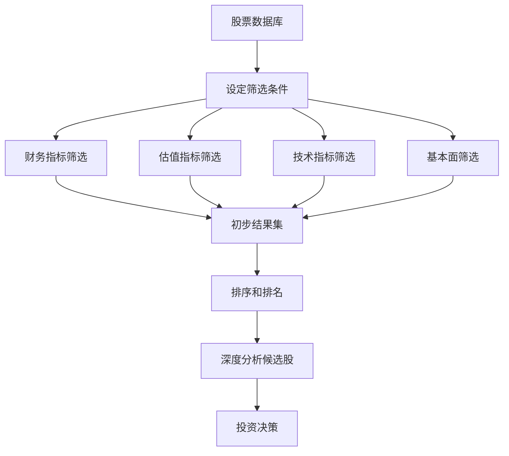

# 选股工具完全指南

## 概述

选股工具（Stock Screener）是投资者从数千只股票中快速筛选出符合特定标准的股票的强大工具。无论是价值投资者寻找低估值股票，还是成长投资者寻找高增长公司，选股工具都能大幅提高投资效率。

**学习目标**：
- 掌握主流选股工具的功能和使用方法
- 学会设计有效的筛选策略
- 了解不同投资风格的筛选标准
- 避免选股工具的常见误区

**为什么重要**：
- 提高投资效率：从数千只股票中快速定位目标
- 系统化投资：建立可重复的选股流程
- 发现机会：找到被市场忽视的优质股票
- 量化标准：将投资理念转化为可执行的筛选条件

## 核心概念

### 选股工具的工作原理

选股工具通过以下步骤帮助投资者筛选股票：



### 筛选条件的三大类别

**1. 基本面指标**
- 市值规模
- 行业分类
- 地理位置
- 上市时间

**2. 财务指标**
- 盈利能力：ROE、ROA、净利率
- 成长性：收入增长率、利润增长率
- 财务健康：负债率、流动比率
- 现金流：自由现金流、经营现金流

**3. 估值指标**
- 市盈率（P/E）
- 市净率（P/B）
- 市销率（P/S）
- EV/EBITDA
- 股息率

## 主流选股工具对比

### 免费工具

#### 1. Yahoo Finance Stock Screener

**优势**：
- 完全免费
- 界面简洁易用
- 覆盖全球主要市场
- 实时数据更新

**功能**：
- 50+ 筛选条件
- 预设筛选模板
- 自定义筛选组合
- 结果导出功能

**适用场景**：
- 初学者入门
- 快速筛选美股
- 基础财务指标筛选

**使用示例**：
```
筛选条件设置：
- Market Cap: > $10B（大盘股）
- P/E Ratio: < 15（低估值）
- ROE: > 15%（高盈利能力）
- Debt/Equity: < 0.5（低负债）
- Dividend Yield: > 2%（有分红）

结果：可能筛选出 50-100 只符合条件的股票
```

#### 2. Finviz

**优势**：
- 强大的可视化功能
- 热力图展示
- 技术分析集成
- 新闻和情绪指标

**独特功能**：
- 股票热力图（按行业、市值、涨跌幅）
- 内部人交易追踪
- 分析师评级汇总
- 期权数据

**筛选策略示例**：

**价值投资筛选**：
```
- P/E: < 15
- P/B: < 1.5
- Debt/Equity: < 0.5
- ROE: > 15%
- Current Ratio: > 1.5
- Dividend Yield: > 2%
```

**成长投资筛选**：
```
- Revenue Growth (5Y): > 20%
- EPS Growth (5Y): > 20%
- ROE: > 20%
- Gross Margin: > 40%
- Market Cap: > $1B
```

#### 3. TradingView Stock Screener

**优势**：
- 强大的技术分析功能
- 实时图表集成
- 社区分享筛选策略
- 多市场支持

**适用场景**：
- 技术分析为主的投资者
- 短期交易者
- 需要图表分析的投资者

### 专业付费工具

#### 1. Morningstar Premium

**价格**：$249/年

**核心功能**：
- Morningstar 独家评级
- 公允价值估算
- 经济护城河评级
- 详细的财务分析

**适用投资者**：
- 长期价值投资者
- 注重质量分析
- 需要深度研究报告

**独特优势**：
- 护城河评级（Wide/Narrow/None）
- 公允价值 vs 市场价格
- 不确定性评级
- 管理层评估

#### 2. Seeking Alpha Premium

**价格**：$239/年

**核心功能**：
- 量化评级系统
- 因子分析
- 卖方分析师追踪
- 收益预测

**Quant Rating 系统**：
- 盈利能力
- 成长性
- 估值
- 动量
- 修正趋势

#### 3. Zacks Premium

**价格**：$249/年

**核心功能**：
- Zacks Rank 系统（1-5 评级）
- 盈利预测修正追踪
- 行业排名
- 投资组合工具

**Zacks Rank 说明**：
- Rank 1 (Strong Buy): 预期跑赢市场
- Rank 2 (Buy): 预期表现良好
- Rank 3 (Hold): 预期与市场持平
- Rank 4 (Sell): 预期表现不佳
- Rank 5 (Strong Sell): 预期大幅跑输

#### 4. Stock Rover

**价格**：$27.99/月 或 $279/年

**核心功能**：
- 650+ 筛选指标
- 强大的数据可视化
- 投资组合分析
- 回测功能

**适用场景**：
- 量化投资者
- 需要深度数据分析
- 投资组合管理

### 中国市场专用工具

#### 1. 东方财富 Choice

**优势**：
- A股数据最全面
- 实时行情
- 财务数据详细
- 研报集成

**筛选功能**：
- 100+ 财务指标
- 技术指标筛选
- 概念板块筛选
- 资金流向分析

#### 2. 同花顺 iFinD

**优势**：
- 专业级数据终端
- 深度财务分析
- 行业对比
- 估值模型

**适用用户**：
- 专业投资者
- 机构研究员
- 需要深度数据

#### 3. 雪球选股器

**优势**：
- 免费使用
- 社区驱动
- 简单易用
- 移动端友好

**特色功能**：
- 大V筛选策略分享
- 组合跟踪
- 讨论区集成

## 实战筛选策略

### 策略 1：巴菲特式价值投资筛选

**投资理念**：寻找具有强大护城河、稳定盈利、合理估值的优质企业

**筛选条件**：
```
基本面：
- Market Cap: > $10B（大盘股，稳定性高）
- Years Public: > 10（经营历史长）

盈利能力：
- ROE: > 15%（持续 5 年）
- Net Margin: > 10%
- ROA: > 8%

财务健康：
- Debt/Equity: < 0.5
- Current Ratio: > 1.5
- Interest Coverage: > 5

估值：
- P/E: < 20
- P/B: < 3
- PEG: < 1.5

股息：
- Dividend Yield: > 2%
- Payout Ratio: 30-60%
- Dividend Growth (5Y): > 5%
```

**预期结果**：
- 筛选出 20-50 只股票
- 多为消费、医疗、金融等稳定行业
- 需要进一步深度分析护城河

### 策略 2：彼得·林奇成长股筛选

**投资理念**：寻找高成长、合理估值的中小盘股

**筛选条件**：
```
规模：
- Market Cap: $1B - $10B（中盘股）

成长性：
- Revenue Growth (5Y): > 15%
- EPS Growth (5Y): > 15%
- EPS Growth (Next 5Y Est): > 15%

盈利能力：
- ROE: > 15%
- Gross Margin: > 30%
- Operating Margin: > 10%

估值：
- PEG: < 1.0（成长股的关键指标）
- P/E: < 25

财务：
- Debt/Equity: < 1.0
- Current Ratio: > 1.2
```

**行业偏好**：
- 消费品
- 医疗保健
- 科技（非热门）
- 工业

### 策略 3：格雷厄姆防御型投资筛选

**投资理念**：寻找极度低估、财务稳健的股票

**筛选条件**：
```
估值（极度保守）：
- P/E: < 10
- P/B: < 1.0
- P/S: < 0.5

财务健康（极度保守）：
- Current Ratio: > 2.0
- Debt/Equity: < 0.3
- Quick Ratio: > 1.5

盈利：
- Positive Earnings: 过去 10 年
- ROE: > 10%

股息：
- Dividend Yield: > 3%
- Dividend History: > 10 years
```

**注意事项**：
- 筛选结果可能很少（10-20 只）
- 多为传统行业、周期性行业
- 需要深入分析为何被低估

### 策略 4：高质量成长股筛选（GARP）

**投资理念**：Growth at Reasonable Price - 合理价格的成长股

**筛选条件**：
```
质量指标：
- ROE: > 20%
- ROIC: > 15%
- Gross Margin: > 40%
- Operating Margin: > 15%
- Free Cash Flow Margin: > 10%

成长指标：
- Revenue Growth (3Y): > 15%
- EPS Growth (3Y): > 15%
- Free Cash Flow Growth (3Y): > 15%

估值（合理）：
- PEG: 0.5 - 1.5
- P/E: 15 - 30
- EV/EBITDA: < 20

财务健康：
- Debt/Equity: < 0.5
- Current Ratio: > 1.5
```

### 策略 5：股息贵族筛选

**投资理念**：寻找持续增长股息的优质公司

**筛选条件**：
```
股息历史：
- Dividend Growth Years: > 25（股息贵族标准）
- Dividend Yield: 2% - 6%
- Payout Ratio: 30% - 70%

财务稳定：
- ROE: > 12%
- Debt/Equity: < 0.7
- Interest Coverage: > 5

估值：
- P/E: < 20
- P/B: < 3
```

**典型结果**：
- 美国约 65 只股息贵族股票
- 多为消费、工业、材料行业
- 适合长期持有、追求稳定收入

## 高级筛选技巧

### 1. 多阶段筛选法

**第一阶段：宽松筛选**
- 使用较宽松的条件
- 筛选出 200-500 只股票
- 目的：不遗漏潜在机会

**第二阶段：核心指标筛选**
- 应用关键财务指标
- 筛选至 50-100 只
- 目的：聚焦高质量股票

**第三阶段：深度分析**
- 人工审查每只股票
- 阅读财报和研报
- 最终选出 10-20 只

### 2. 相对筛选法

不使用绝对数值，而是使用相对排名：

```
示例：
- ROE: Top 20% in Industry
- P/E: Bottom 30% in Industry
- Revenue Growth: Top 25% in Industry
```

**优势**：
- 考虑行业差异
- 更公平的对比
- 发现行业内的优秀公司

### 3. 动态筛选法

根据市场环境调整筛选条件：

**牛市策略**：
- 侧重成长性
- 放宽估值要求
- 关注动量指标

**熊市策略**：
- 侧重防御性
- 严格估值要求
- 关注股息和现金流

**震荡市策略**：
- 平衡成长和价值
- 中等估值要求
- 关注质量指标

### 4. 因子组合筛选

结合多个因子构建筛选策略：

```
质量因子（40%权重）：
- ROE > 15%
- ROIC > 12%
- Gross Margin > 30%

价值因子（30%权重）：
- P/E < 行业中位数
- P/B < 行业中位数
- EV/EBITDA < 行业中位数

动量因子（30%权重）：
- 6个月回报 > 市场
- 相对强度 > 70
- 盈利预测上调
```

## 常见误区与陷阱

### 误区 1：过度依赖筛选结果

**问题**：
- 筛选只是起点，不是终点
- 数据可能有误差或滞后
- 无法捕捉定性因素

**解决方案**：
- 将筛选结果作为候选清单
- 必须进行深度基本面分析
- 阅读财报、研报、新闻

### 误区 2：条件设置过于严格

**问题**：
```
错误示例：
- P/E < 10
- ROE > 25%
- Revenue Growth > 30%
- Debt/Equity < 0.2
- Dividend Yield > 4%

结果：可能筛选出 0 只股票
```

**解决方案**：
- 从宽松条件开始
- 逐步收紧
- 保持灵活性

### 误区 3：忽视行业特性

**问题**：
- 不同行业有不同的正常指标范围
- 科技公司 vs 公用事业公司

**示例**：
```
科技公司：
- 高 P/E（30-50）正常
- 低股息率正常
- 高增长率预期

公用事业：
- 低 P/E（10-15）正常
- 高股息率（4-6%）正常
- 低增长率正常
```

**解决方案**：
- 使用行业相对指标
- 分行业设置不同标准
- 了解行业特性

### 误区 4：数据质量问题

**常见问题**：
- 财务数据滞后（季度报告）
- 一次性项目扭曲指标
- 会计准则差异

**解决方案**：
- 使用多个数据源交叉验证
- 查看原始财报
- 调整一次性项目

### 误区 5：回测偏差

**问题**：
- 幸存者偏差：只看到存活的公司
- 前视偏差：使用未来信息
- 数据挖掘：过度拟合历史数据

**解决方案**：
- 使用包含退市股票的数据库
- 严格使用历史可得信息
- 样本外测试

## 实战案例分析

### 案例 1：2020 年疫情后的价值股筛选

**背景**：
- 2020 年 3 月市场暴跌
- 许多优质股票被错杀
- 寻找恢复性投资机会

**筛选条件**：
```
基本面：
- Market Cap: > $5B
- Years Public: > 10

财务健康（关键）：
- Current Ratio: > 1.5
- Debt/Equity: < 0.5
- Interest Coverage: > 5
- Cash/Debt: > 0.3

估值（历史低位）：
- P/E: < 10
- P/B: < 1.5
- P/E vs 5Y Average: < 70%

质量：
- ROE (Pre-COVID): > 12%
- Positive FCF: Last 5 years
```

**筛选结果示例**：
- 金融股：JPMorgan, Bank of America
- 工业股：Caterpillar, 3M
- 能源股：Chevron, ExxonMobil

**后续表现**：
- 2020-2021 年多数股票涨幅 50-100%
- 验证了危机中的价值投资机会

### 案例 2：2021 年寻找高质量科技股

**背景**：
- 科技股估值普遍偏高
- 寻找质量和估值平衡的机会

**筛选条件**：
```
行业：
- Sector: Technology
- Sub-Industry: Software, Semiconductors

质量（严格）：
- ROE: > 25%
- ROIC: > 20%
- Gross Margin: > 60%
- Operating Margin: > 20%
- FCF Margin: > 15%

成长：
- Revenue Growth (3Y): > 20%
- EPS Growth (3Y): > 20%

估值（相对合理）：
- PEG: < 2.0
- P/S: < 15
- EV/Sales: < 15

财务：
- Net Cash Position（现金 > 债务）
```

**筛选结果**：
- Microsoft（满足所有条件）
- Adobe（高质量，估值略高）
- NVIDIA（成长性强，估值合理）

## 工具选择建议

### 初学者（0-2 年经验）

**推荐工具**：
1. Yahoo Finance（免费）
2. Finviz（免费）
3. 雪球（中国市场）

**理由**：
- 免费
- 界面友好
- 功能够用
- 学习曲线平缓

### 中级投资者（2-5 年经验）

**推荐工具**：
1. Seeking Alpha Premium（$239/年）
2. Morningstar Premium（$249/年）
3. 东方财富 Choice（中国市场）

**理由**：
- 更深度的分析
- 专业评级系统
- 研报和分析师观点
- 性价比高

### 高级投资者（5+ 年经验）

**推荐工具**：
1. Stock Rover（$279/年）
2. Bloomberg Terminal（$24,000/年，机构）
3. FactSet（机构级）

**理由**：
- 最全面的数据
- 高级分析功能
- 回测和建模
- 专业级工具

### 量化投资者

**推荐工具**：
1. Stock Rover（强大的数据导出）
2. Quandl（API 数据）
3. Alpha Vantage（免费 API）
4. Python + pandas（自建系统）

**理由**：
- 数据可导出
- API 接口
- 可编程
- 灵活性高

## 构建个人筛选系统

### 步骤 1：明确投资理念

**问题清单**：
- 你的投资风格是什么？（价值/成长/GARP）
- 你的持有期限？（长期/中期/短期）
- 你的风险承受能力？
- 你关注哪些行业？

### 步骤 2：设计筛选标准

**核心指标（3-5 个）**：
- 必须满足的硬性条件
- 例如：ROE > 15%, P/E < 20

**次要指标（5-10 个）**：
- 加分项，不是必须
- 例如：股息率 > 2%, 行业领导者

### 步骤 3：建立筛选流程


### 步骤 4：记录和优化

**建立筛选日志**：
- 筛选日期
- 使用的条件
- 筛选结果数量
- 最终选择的股票
- 后续表现

**定期回顾**：
- 每季度回顾筛选效果
- 调整不合理的条件
- 学习成功和失败案例

## 延伸阅读

### 推荐书籍

1. **《聪明的投资者》** - 本杰明·格雷厄姆
   - 价值投资筛选的理论基础

2. **《彼得·林奇的成功投资》** - 彼得·林奇
   - 成长股筛选的实战经验

3. **《股市真规则》** - 帕特·多尔西
   - Morningstar 的选股方法论

4. **《量化投资：策略与技术》** - 丁鹏
   - 量化筛选的系统方法

### 在线资源

1. **Investopedia - Stock Screener Guide**
   - https://www.investopedia.com/stock-screener-guide

2. **AAII Stock Screening Strategies**
   - https://www.aaii.com/stock-screens

3. **Morningstar Investing Classroom**
   - https://www.morningstar.com/investing-classroom

### 相关工具

- [财务数据源](financial-data-sources.html) - 了解数据来源
- [估值计算器](valuation-calculators.html) - 深度估值分析
- [投资组合跟踪](portfolio-trackers.html) - 管理筛选结果

## 参考文献

1. Graham, B., & Zweig, J. (2006). *The Intelligent Investor*. Harper Business.

2. Lynch, P., & Rothchild, J. (2000). *One Up On Wall Street*. Simon & Schuster.

3. Dorsey, P. (2004). *The Five Rules for Successful Stock Investing*. Wiley.

4. Greenblatt, J. (2010). *The Little Book That Still Beats the Market*. Wiley.

5. O'Shaughnessy, J. (2011). *What Works on Wall Street*. McGraw-Hill.

6. Morningstar. (2023). *Stock Screening Methodology*. Morningstar Research.

7. Zacks Investment Research. (2023). *Zacks Rank System Handbook*.

8. AAII. (2023). *Stock Screening Strategies Guide*. American Association of Individual Investors.

9. Damodaran, A. (2012). *Investment Valuation*. Wiley Finance.

10. Piotroski, J. (2000). "Value Investing: The Use of Historical Financial Statement Information to Separate Winners from Losers." *Journal of Accounting Research*, 38, 1-41.
