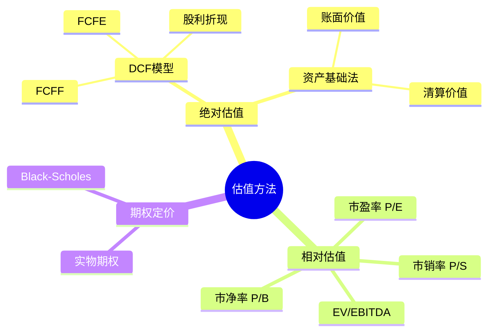

# 估值计算器完全指南

## 概述

估值计算器是投资者评估公司内在价值的核心工具。无论是使用现金流折现（DCF）模型、相对估值法，还是其他估值方法，掌握估值计算器的使用都是专业投资者的必备技能。

**学习目标**：
- 掌握 DCF 计算器的构建和使用
- 学会使用 Excel 构建估值模型
- 了解 Python 实现估值计算的方法
- 理解估值模型的假设和局限性

**为什么重要**：
- 量化投资价值：将定性分析转化为定量结果
- 提高决策质量：基于数据而非情绪
- 理解价值驱动因素：识别关键变量
- 建立投资纪律：系统化的估值流程

## 核心概念

### 估值方法分类




### DCF 模型核心公式

**企业价值（Enterprise Value）**：

$$
EV = \sum_{t=1}^{n} \frac{FCF_t}{(1+WACC)^t} + \frac{Terminal\ Value}{(1+WACC)^n}
$$

**终值（Terminal Value）**：

$$
TV = \frac{FCF_{n+1}}{WACC - g}
$$

其中：
- $FCF_t$ = 第 t 年的自由现金流
- $WACC$ = 加权平均资本成本
- $g$ = 永续增长率
- $n$ = 预测期年数

**股权价值（Equity Value）**：

$$
Equity\ Value = EV - Net\ Debt + Non-operating\ Assets
$$

## 在线估值计算器

### 1. GuruFocus DCF Calculator

**网址**：https://www.gurufocus.com/dcf-calculator

**优势**：
- 免费使用
- 自动获取财务数据
- 预设合理假设
- 敏感性分析

**使用步骤**：

1. **输入股票代码**
   - 自动加载历史财务数据
   - 显示过去 5-10 年的关键指标

2. **设置增长假设**
   ```
   Year 1-5: 15% 增长（高增长期）
   Year 6-10: 8% 增长（成熟期）
   Terminal Growth: 3%（永续增长）
   ```

3. **设置折现率**
   ```
   WACC 计算：
   - Risk-free Rate: 4%（10年期国债）
   - Market Risk Premium: 6%
   - Beta: 1.2
   - Cost of Equity = 4% + 1.2 × 6% = 11.2%
   ```

4. **查看结果**
   - 内在价值估算
   - 安全边际
   - 敏感性分析表

**实战案例：Apple (AAPL) 估值**

```
输入数据（2023年）：
- 当前 FCF: $100B
- 增长率 Year 1-5: 10%
- 增长率 Year 6-10: 5%
- Terminal Growth: 3%
- WACC: 9%

计算结果：
- 预测期现值: $550B
- 终值现值: $1,200B
- 企业价值: $1,750B
- 减：净债务: -$50B（净现金）
- 股权价值: $1,800B
- 股票数量: 16B
- 每股价值: $112.50

当前股价: $175
安全边际: -36%（高估）
```

### 2. Finbox DCF Model

**网址**：https://finbox.com

**特色功能**：
- 多种估值模型
- 自动更新数据
- 对比分析
- 专业级输出

**支持的模型**：
1. DCF (FCFF)
2. DCF (FCFE)
3. Dividend Discount Model
4. Residual Income Model
5. Comparable Companies

**高级功能**：
- 蒙特卡洛模拟
- 情景分析
- 历史估值追踪

### 3. Old School Value Stock Analyzer

**网址**：https://www.oldschoolvalue.com

**价格**：$199/年

**核心功能**：
- 多种估值方法集成
- 格雷厄姆公式
- 彼得·林奇公允价值
- DCF 模型
- 相对估值

**独特优势**：
- 价值投资导向
- 质量评分系统
- 历史估值区间
- 买入/卖出信号

## Excel 估值模板

### 基础 DCF 模板结构

**工作表组织**：

```
Sheet 1: 输入参数
Sheet 2: 历史财务数据
Sheet 3: 预测假设
Sheet 4: 现金流预测
Sheet 5: WACC 计算
Sheet 6: DCF 估值
Sheet 7: 敏感性分析
Sheet 8: 情景分析
```

### Sheet 1: 输入参数

```excel
公司信息：
- 公司名称: [输入]
- 股票代码: [输入]
- 分析日期: [输入]
- 当前股价: [输入]
- 股票数量: [输入]

关键假设：
- 预测期: 10 年
- 终值增长率: 3%
- 税率: 25%
```

### Sheet 4: 现金流预测模板

| 项目 | Year 0 | Year 1 | Year 2 | Year 3 | ... | Year 10 |
|------|--------|--------|--------|--------|-----|---------|
| 收入 | 100 | 110 | 121 | 133 | ... | 259 |
| 增长率 | - | 10% | 10% | 10% | ... | 5% |
| EBIT | 20 | 22 | 24.2 | 26.6 | ... | 51.8 |
| EBIT Margin | 20% | 20% | 20% | 20% | ... | 20% |
| 税后 EBIT | 15 | 16.5 | 18.2 | 20.0 | ... | 38.9 |
| + 折旧摊销 | 5 | 5.5 | 6.1 | 6.7 | ... | 13.0 |
| - 资本支出 | 8 | 8.8 | 9.7 | 10.6 | ... | 20.7 |
| - 营运资本变动 | 2 | 2.2 | 2.4 | 2.7 | ... | 5.2 |
| = 自由现金流 | 10 | 11.0 | 12.1 | 13.3 | ... | 26.0 |

### Sheet 5: WACC 计算

```excel
权益成本（Cost of Equity）：
- 无风险利率: 4.0%
- Beta: 1.2
- 市场风险溢价: 6.0%
- 权益成本 = 4% + 1.2 × 6% = 11.2%

债务成本（Cost of Debt）：
- 利息费用: $5M
- 总债务: $100M
- 税前债务成本: 5.0%
- 税率: 25%
- 税后债务成本 = 5% × (1-25%) = 3.75%

资本结构：
- 股权市值: $500M
- 债务市值: $100M
- 总资本: $600M
- 权益比例: 83.3%
- 债务比例: 16.7%

WACC 计算：
WACC = 11.2% × 83.3% + 3.75% × 16.7% = 9.96%
```

### Sheet 6: DCF 估值

```excel
现金流折现：
Year 1: $11.0 / (1.0996)^1 = $10.0
Year 2: $12.1 / (1.0996)^2 = $10.0
Year 3: $13.3 / (1.0996)^3 = $10.0
...
Year 10: $26.0 / (1.0996)^10 = $10.0

预测期现值总和: $100M

终值计算：
Year 11 FCF = $26.0 × 1.03 = $26.8M
终值 = $26.8M / (9.96% - 3%) = $385M
终值现值 = $385M / (1.0996)^10 = $150M

企业价值：
预测期现值: $100M
终值现值: $150M
企业价值: $250M

股权价值：
企业价值: $250M
- 债务: $100M
+ 现金: $50M
股权价值: $200M

每股价值：
股权价值: $200M
股票数量: 10M
每股价值: $20.00

估值结论：
当前股价: $25.00
内在价值: $20.00
高估/低估: -20%（高估）
```

### Sheet 7: 敏感性分析

**WACC vs 终值增长率敏感性表**：

|  | g=2% | g=2.5% | g=3% | g=3.5% | g=4% |
|---|------|--------|------|--------|------|
| WACC=8% | $25 | $27 | $30 | $33 | $38 |
| WACC=9% | $22 | $24 | $26 | $28 | $31 |
| WACC=10% | $20 | $21 | $23 | $25 | $27 |
| WACC=11% | $18 | $19 | $20 | $22 | $24 |
| WACC=12% | $16 | $17 | $18 | $20 | $21 |

**Excel 公式**：
```excel
=DCF_Value(WACC_cell, Growth_cell)
```

### 高级 Excel 技巧

**1. 数据验证**
```excel
数据 > 数据验证 > 列表
允许值: 5%, 10%, 15%, 20%
```

**2. 条件格式**
```excel
如果估值 > 当前价格 → 绿色（低估）
如果估值 < 当前价格 → 红色（高估）
```

**3. 动态图表**
```excel
插入 > 图表 > 瀑布图
显示价值构成：
- 预测期现值
- 终值现值
- 债务调整
- 现金调整
```

**4. 宏自动化**
```vba
Sub RunDCF()
    ' 更新数据
    UpdateFinancialData
    ' 计算WACC
    CalculateWACC
    ' 预测现金流
    ForecastCashFlows
    ' 计算DCF
    CalculateDCF
    ' 生成报告
    GenerateReport
End Sub
```

## Python 估值脚本

### 基础 DCF 实现

```python
import numpy as np
import pandas as pd

class DCFCalculator:
    def __init__(self, fcf_0, growth_rates, terminal_growth, wacc):
        """
        初始化 DCF 计算器
        
        参数:
        fcf_0: 当前年度自由现金流
        growth_rates: 预测期增长率列表
        terminal_growth: 永续增长率
        wacc: 加权平均资本成本
        """
        self.fcf_0 = fcf_0
        self.growth_rates = growth_rates
        self.terminal_growth = terminal_growth
        self.wacc = wacc
        
    def forecast_fcf(self):
        """预测未来现金流"""
        fcf_list = [self.fcf_0]
        for growth in self.growth_rates:
            fcf_list.append(fcf_list[-1] * (1 + growth))
        return fcf_list[1:]  # 排除 Year 0
    
    def calculate_terminal_value(self, final_fcf):
        """计算终值"""
        terminal_fcf = final_fcf * (1 + self.terminal_growth)
        terminal_value = terminal_fcf / (self.wacc - self.terminal_growth)
        return terminal_value
    
    def discount_cash_flows(self, fcf_list):
        """折现现金流"""
        pv_list = []
        for i, fcf in enumerate(fcf_list, 1):
            pv = fcf / ((1 + self.wacc) ** i)
            pv_list.append(pv)
        return pv_list
    
    def calculate_enterprise_value(self):
        """计算企业价值"""
        # 预测现金流
        fcf_list = self.forecast_fcf()
        
        # 折现预测期现金流
        pv_list = self.discount_cash_flows(fcf_list)
        pv_forecast = sum(pv_list)
        
        # 计算终值
        terminal_value = self.calculate_terminal_value(fcf_list[-1])
        
        # 折现终值
        n = len(fcf_list)
        pv_terminal = terminal_value / ((1 + self.wacc) ** n)
        
        # 企业价值
        enterprise_value = pv_forecast + pv_terminal
        
        return {
            'fcf_forecast': fcf_list,
            'pv_forecast': pv_list,
            'pv_forecast_sum': pv_forecast,
            'terminal_value': terminal_value,
            'pv_terminal': pv_terminal,
            'enterprise_value': enterprise_value
        }
    
    def calculate_equity_value(self, net_debt, non_operating_assets=0):
        """计算股权价值"""
        ev = self.calculate_enterprise_value()['enterprise_value']
        equity_value = ev - net_debt + non_operating_assets
        return equity_value
    
    def calculate_price_per_share(self, net_debt, shares_outstanding, 
                                  non_operating_assets=0):
        """计算每股价值"""
        equity_value = self.calculate_equity_value(net_debt, non_operating_assets)
        price_per_share = equity_value / shares_outstanding
        return price_per_share

# 使用示例
if __name__ == "__main__":
    # 输入参数
    fcf_0 = 100  # 当前 FCF: $100M
    growth_rates = [0.15, 0.15, 0.12, 0.12, 0.10, 
                   0.10, 0.08, 0.08, 0.05, 0.05]  # 10年增长率
    terminal_growth = 0.03  # 3% 永续增长
    wacc = 0.10  # 10% WACC
    
    # 创建计算器
    dcf = DCFCalculator(fcf_0, growth_rates, terminal_growth, wacc)
    
    # 计算企业价值
    result = dcf.calculate_enterprise_value()
    
    print("DCF 估值结果：")
    print(f"预测期现值: ${result['pv_forecast_sum']:.2f}M")
    print(f"终值: ${result['terminal_value']:.2f}M")
    print(f"终值现值: ${result['pv_terminal']:.2f}M")
    print(f"企业价值: ${result['enterprise_value']:.2f}M")
    
    # 计算每股价值
    net_debt = 50  # 净债务 $50M
    shares = 10  # 10M 股
    price = dcf.calculate_price_per_share(net_debt, shares)
    print(f"\n每股内在价值: ${price:.2f}")
```

### 高级功能：敏感性分析

```python
import matplotlib.pyplot as plt
import seaborn as sns

def sensitivity_analysis(fcf_0, growth_rates, terminal_growth_range, 
                        wacc_range, net_debt, shares):
    """
    敏感性分析：WACC vs 终值增长率
    """
    results = np.zeros((len(wacc_range), len(terminal_growth_range)))
    
    for i, wacc in enumerate(wacc_range):
        for j, tg in enumerate(terminal_growth_range):
            dcf = DCFCalculator(fcf_0, growth_rates, tg, wacc)
            price = dcf.calculate_price_per_share(net_debt, shares)
            results[i, j] = price
    
    # 创建热力图
    plt.figure(figsize=(10, 8))
    sns.heatmap(results, 
                xticklabels=[f"{tg:.1%}" for tg in terminal_growth_range],
                yticklabels=[f"{wacc:.1%}" for wacc in wacc_range],
                annot=True, fmt='.2f', cmap='RdYlGn')
    plt.xlabel('Terminal Growth Rate')
    plt.ylabel('WACC')
    plt.title('DCF Sensitivity Analysis: Price per Share')
    plt.show()
    
    return results

# 使用示例
wacc_range = np.arange(0.08, 0.13, 0.01)
terminal_growth_range = np.arange(0.02, 0.05, 0.005)

sensitivity_results = sensitivity_analysis(
    fcf_0=100,
    growth_rates=[0.15]*5 + [0.10]*5,
    terminal_growth_range=terminal_growth_range,
    wacc_range=wacc_range,
    net_debt=50,
    shares=10
)
```

### 蒙特卡洛模拟

```python
import numpy as np

def monte_carlo_dcf(fcf_0, mean_growth, std_growth, mean_wacc, std_wacc,
                   terminal_growth, net_debt, shares, simulations=10000):
    """
    蒙特卡洛模拟 DCF 估值
    
    参数:
    mean_growth: 平均增长率
    std_growth: 增长率标准差
    mean_wacc: 平均 WACC
    std_wacc: WACC 标准差
    simulations: 模拟次数
    """
    results = []
    
    for _ in range(simulations):
        # 随机生成增长率
        growth_rates = np.random.normal(mean_growth, std_growth, 10)
        growth_rates = np.clip(growth_rates, -0.2, 0.5)  # 限制范围
        
        # 随机生成 WACC
        wacc = np.random.normal(mean_wacc, std_wacc)
        wacc = np.clip(wacc, 0.05, 0.20)  # 限制范围
        
        # 计算估值
        try:
            dcf = DCFCalculator(fcf_0, growth_rates, terminal_growth, wacc)
            price = dcf.calculate_price_per_share(net_debt, shares)
            results.append(price)
        except:
            continue
    
    # 统计结果
    results = np.array(results)
    
    print("蒙特卡洛模拟结果：")
    print(f"模拟次数: {len(results)}")
    print(f"平均估值: ${np.mean(results):.2f}")
    print(f"中位数估值: ${np.median(results):.2f}")
    print(f"标准差: ${np.std(results):.2f}")
    print(f"5th 百分位: ${np.percentile(results, 5):.2f}")
    print(f"95th 百分位: ${np.percentile(results, 95):.2f}")
    
    # 绘制分布图
    plt.figure(figsize=(12, 6))
    plt.hist(results, bins=50, edgecolor='black', alpha=0.7)
    plt.axvline(np.mean(results), color='red', linestyle='--', 
                label=f'Mean: ${np.mean(results):.2f}')
    plt.axvline(np.median(results), color='green', linestyle='--', 
                label=f'Median: ${np.median(results):.2f}')
    plt.xlabel('Price per Share ($)')
    plt.ylabel('Frequency')
    plt.title('Monte Carlo Simulation: DCF Valuation Distribution')
    plt.legend()
    plt.grid(True, alpha=0.3)
    plt.show()
    
    return results

# 使用示例
mc_results = monte_carlo_dcf(
    fcf_0=100,
    mean_growth=0.12,
    std_growth=0.05,
    mean_wacc=0.10,
    std_wacc=0.02,
    terminal_growth=0.03,
    net_debt=50,
    shares=10,
    simulations=10000
)
```

### 完整估值系统

```python
class ComprehensiveValuation:
    """综合估值系统"""
    
    def __init__(self, ticker):
        self.ticker = ticker
        self.data = self.fetch_data()
    
    def fetch_data(self):
        """获取财务数据（需要 API）"""
        # 使用 yfinance 或其他 API
        import yfinance as yf
        stock = yf.Ticker(self.ticker)
        
        # 获取财务数据
        financials = stock.financials
        balance_sheet = stock.balance_sheet
        cash_flow = stock.cashflow
        info = stock.info
        
        return {
            'financials': financials,
            'balance_sheet': balance_sheet,
            'cash_flow': cash_flow,
            'info': info
        }
    
    def calculate_fcf(self):
        """计算自由现金流"""
        cf = self.data['cash_flow']
        operating_cf = cf.loc['Total Cash From Operating Activities'].iloc[0]
        capex = cf.loc['Capital Expenditures'].iloc[0]
        fcf = operating_cf + capex  # capex 是负数
        return fcf
    
    def estimate_wacc(self):
        """估算 WACC"""
        info = self.data['info']
        beta = info.get('beta', 1.0)
        
        # 权益成本
        risk_free_rate = 0.04  # 4%
        market_premium = 0.06  # 6%
        cost_of_equity = risk_free_rate + beta * market_premium
        
        # 债务成本
        bs = self.data['balance_sheet']
        total_debt = bs.loc['Total Debt'].iloc[0] if 'Total Debt' in bs.index else 0
        interest_expense = self.data['financials'].loc['Interest Expense'].iloc[0] if 'Interest Expense' in self.data['financials'].index else 0
        cost_of_debt = abs(interest_expense / total_debt) if total_debt > 0 else 0.05
        
        # 税率
        tax_rate = 0.25
        after_tax_cost_of_debt = cost_of_debt * (1 - tax_rate)
        
        # 资本结构
        market_cap = info.get('marketCap', 0)
        total_capital = market_cap + total_debt
        equity_weight = market_cap / total_capital if total_capital > 0 else 1
        debt_weight = 1 - equity_weight
        
        # WACC
        wacc = equity_weight * cost_of_equity + debt_weight * after_tax_cost_of_debt
        
        return wacc
    
    def run_dcf(self):
        """运行 DCF 估值"""
        # 获取当前 FCF
        fcf_0 = self.calculate_fcf()
        
        # 估算增长率（简化版）
        growth_rates = [0.15] * 5 + [0.08] * 5
        
        # 估算 WACC
        wacc = self.estimate_wacc()
        
        # 终值增长率
        terminal_growth = 0.03
        
        # 创建 DCF 计算器
        dcf = DCFCalculator(fcf_0, growth_rates, terminal_growth, wacc)
        
        # 计算企业价值
        result = dcf.calculate_enterprise_value()
        
        # 获取净债务和股票数量
        bs = self.data['balance_sheet']
        total_debt = bs.loc['Total Debt'].iloc[0] if 'Total Debt' in bs.index else 0
        cash = bs.loc['Cash'].iloc[0] if 'Cash' in bs.index else 0
        net_debt = total_debt - cash
        
        shares = self.data['info'].get('sharesOutstanding', 1)
        
        # 计算每股价值
        price = dcf.calculate_price_per_share(net_debt, shares)
        
        # 当前股价
        current_price = self.data['info'].get('currentPrice', 0)
        
        # 输出结果
        print(f"\n{self.ticker} DCF 估值结果：")
        print(f"当前 FCF: ${fcf_0/1e9:.2f}B")
        print(f"WACC: {wacc:.2%}")
        print(f"企业价值: ${result['enterprise_value']/1e9:.2f}B")
        print(f"净债务: ${net_debt/1e9:.2f}B")
        print(f"股票数量: {shares/1e9:.2f}B")
        print(f"\n内在价值: ${price:.2f}")
        print(f"当前股价: ${current_price:.2f}")
        print(f"高估/低估: {(price/current_price - 1):.1%}")
        
        return price

# 使用示例
valuation = ComprehensiveValuation('AAPL')
intrinsic_value = valuation.run_dcf()
```

## 常见误区与最佳实践

### 误区 1：过度精确

**问题**：
- 计算到小数点后 4 位
- 忽视模型的不确定性
- 对单一估值结果过度自信

**解决方案**：
- 使用估值区间而非单一数值
- 进行敏感性分析
- 考虑多种情景

**最佳实践**：
```
不要说："内在价值是 $47.23"
应该说："内在价值在 $40-$55 之间"
```

### 误区 2：垃圾进，垃圾出（GIGO）

**问题**：
- 使用不准确的输入数据
- 不合理的增长假设
- 错误的 WACC 计算

**解决方案**：
- 验证所有输入数据
- 基于历史和行业数据设定假设
- 多次检查计算公式

### 误区 3：忽视定性因素

**问题**：
- 只关注数字
- 忽视管理层质量
- 忽视竞争优势

**解决方案**：
- 将定性分析与定量分析结合
- 调整假设反映定性因素
- 使用情景分析

### 误区 4：终值占比过高

**问题**：
- 终值占企业价值 80%+
- 对终值假设过度敏感

**解决方案**：
- 延长预测期（10-15 年）
- 使用保守的终值增长率
- 进行敏感性分析

**合理范围**：
```
终值占比：50-70%
如果 > 80%：预测期太短或增长假设太激进
如果 < 40%：可能低估长期价值
```

## 延伸阅读

### 推荐书籍

1. **《Investment Valuation》** - Aswath Damodaran
   - 估值圣经，全面系统

2. **《Valuation: Measuring and Managing the Value of Companies》** - McKinsey
   - 实务导向，案例丰富

3. **《Financial Modeling》** - Simon Benninga
   - Excel 建模详解

### 在线资源

1. **Damodaran Online**
   - http://pages.stern.nyu.edu/~adamodar/
   - 免费估值模板和数据

2. **CFI Financial Modeling Course**
   - https://corporatefinanceinstitute.com/
   - 专业建模培训

3. **Wall Street Prep**
   - https://www.wallstreetprep.com/
   - 投行级建模课程

## 参考文献

1. Damodaran, A. (2012). *Investment Valuation: Tools and Techniques for Determining the Value of Any Asset*. Wiley Finance.

2. Koller, T., Goedhart, M., & Wessels, D. (2020). *Valuation: Measuring and Managing the Value of Companies*. Wiley.

3. Benninga, S. (2014). *Financial Modeling*. MIT Press.

4. Rosenbaum, J., & Pearl, J. (2013). *Investment Banking: Valuation, Leveraged Buyouts, and Mergers & Acquisitions*. Wiley.

5. Penman, S. (2013). *Financial Statement Analysis and Security Valuation*. McGraw-Hill.

6. Copeland, T., Koller, T., & Murrin, J. (2000). *Valuation: Measuring and Managing the Value of Companies*. Wiley.

7. Graham, B., & Dodd, D. (2008). *Security Analysis*. McGraw-Hill.

8. Fernández, P. (2007). "Company valuation methods." *IESE Business School Working Paper*.

9. Damodaran, A. (2006). "Valuation approaches and metrics: A survey of the theory and evidence." *Foundations and Trends in Finance*, 1(8), 693-784.

10. McKinsey & Company. (2015). *Valuation: Measuring and Managing the Value of Companies, University Edition*. Wiley.


## 深度分析

### 核心机制解析

理解本主题需要从多个维度进行系统性分析。以下从理论基础、实践应用和历史验证三个层面展开深度探讨。

**理论基础层面**：本主题的核心逻辑建立在经济学和金融学的基本原理之上。通过对基础理论的深入理解，投资者能够建立起稳固的分析框架，避免被市场短期噪音所干扰。

**实践应用层面**：理论必须与实践相结合才能产生价值。在实际投资决策中，需要将抽象的概念转化为具体的分析工具和决策标准。

**历史验证层面**：金融市场有着丰富的历史记录，通过研究历史案例，我们可以验证理论的有效性，并从中提炼出具有普遍意义的规律。

### 关键影响因素

影响本主题的关键因素可以从以下几个维度进行分析：

1. **宏观经济环境**：利率水平、通货膨胀率、经济增长速度等宏观变量对本主题有着深远影响。在不同的宏观经济周期中，相关指标的表现会呈现出显著差异。

2. **市场结构因素**：市场参与者的构成、信息传播机制、流动性状况等市场结构因素决定了价格发现的效率和准确性。

3. **政策监管环境**：政府政策、监管框架的变化会直接影响相关市场的运作规则和参与者行为。

4. **技术创新驱动**：技术进步不断改变着金融市场的运作方式，从算法交易到区块链技术，每一次技术革新都带来新的机遇和挑战。

5. **全球化与地缘政治**：在全球化背景下，各国市场之间的联动性日益增强，地缘政治风险的影响也越来越不可忽视。

### 量化分析框架

为了更精确地分析和评估，可以采用以下量化框架：

| 分析维度 | 关键指标 | 参考基准 | 分析方法 |
|---------|---------|---------|---------|
| 规模评估 | 绝对值与相对值 | 历史均值 | 趋势分析 |
| 质量评估 | 稳定性指标 | 行业对标 | 横向比较 |
| 风险评估 | 波动率指标 | 风险阈值 | 情景分析 |
| 价值评估 | 估值倍数 | 历史区间 | 回归分析 |

通过系统性地应用上述框架，投资者可以对目标进行全面、客观的评估，从而做出更加理性的投资决策。


## 高级分析与前沿研究

### 学术研究进展

近年来，学术界对本领域的研究取得了重要进展。以下是几个值得关注的研究方向：

**行为金融学视角**：传统金融理论假设市场参与者是完全理性的，但行为金融学的研究表明，认知偏差和情绪因素在投资决策中扮演着重要角色。诺贝尔经济学奖得主丹尼尔·卡尼曼（Daniel Kahneman）和理查德·塞勒（Richard Thaler）的研究为我们理解市场非理性行为提供了重要框架。

**因子投资研究**：尤金·法玛（Eugene Fama）和肯尼斯·弗伦奇（Kenneth French）的三因子模型，以及后续发展的五因子模型，为系统性地解释股票收益差异提供了理论基础。这些研究表明，市值、账面市值比、盈利能力和投资模式等因子能够解释大部分股票收益的横截面差异。

**市场微观结构研究**：对市场流动性、价格发现机制和交易成本的深入研究，帮助我们更好地理解市场的运作机制，并为优化交易策略提供指导。

### 实战案例深度解析

**案例一：长期价值创造的典范**

以沃伦·巴菲特（Warren Buffett）的伯克希尔·哈撒韦（Berkshire Hathaway）为例，其长达数十年的卓越投资业绩证明了价值投资理念的有效性。从1965年至今，伯克希尔的账面价值年均增长率约为19.8%，远超同期标普500指数的约10.2%年均回报。

巴菲特的成功秘诀在于：
- 专注于具有持久竞争优势的优质企业
- 以合理价格买入，而非追求最低价格
- 长期持有，让复利效应充分发挥
- 保持充足的安全边际，控制下行风险

**案例二：危机中的机遇识别**

2008年金融危机期间，大多数投资者恐慌性抛售，但少数具有前瞻性的投资者却在危机中发现了历史性的投资机会。约翰·保尔森（John Paulson）通过做空次级抵押贷款相关证券，在危机中获得了约150亿美元的利润，成为金融史上最成功的单笔交易之一。

这个案例告诉我们：
- 深入的基本面研究能够发现市场定价错误
- 逆向思维往往能够发现被市场忽视的机会
- 风险管理和仓位控制是成功的关键

### 跨市场比较分析

不同市场在结构、监管、投资者构成等方面存在显著差异，这些差异对投资策略的选择有重要影响：

**美国市场特征**：
- 机构投资者主导，市场效率较高
- 信息披露制度完善，分析师覆盖广泛
- 衍生品市场发达，对冲工具丰富
- 长期牛市历史，但也经历过多次重大调整

**中国市场特征**：
- 散户投资者比例较高，市场波动性较大
- 政策因素影响显著，需要密切关注监管动向
- 新兴行业发展迅速，成长投资机会丰富
- A股、港股、美股中概股形成多层次市场体系

**欧洲市场特征**：
- 价值股比例较高，估值相对保守
- 受地缘政治和欧元区政策影响较大
- 部分行业（如奢侈品、工业）具有全球竞争优势
- ESG投资理念推广较为领先

