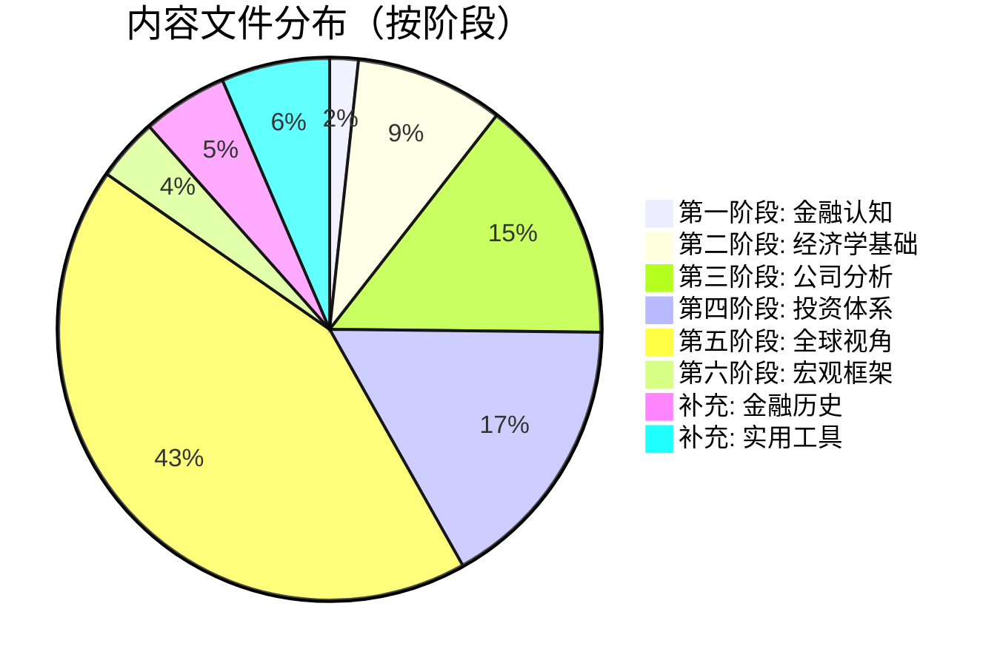
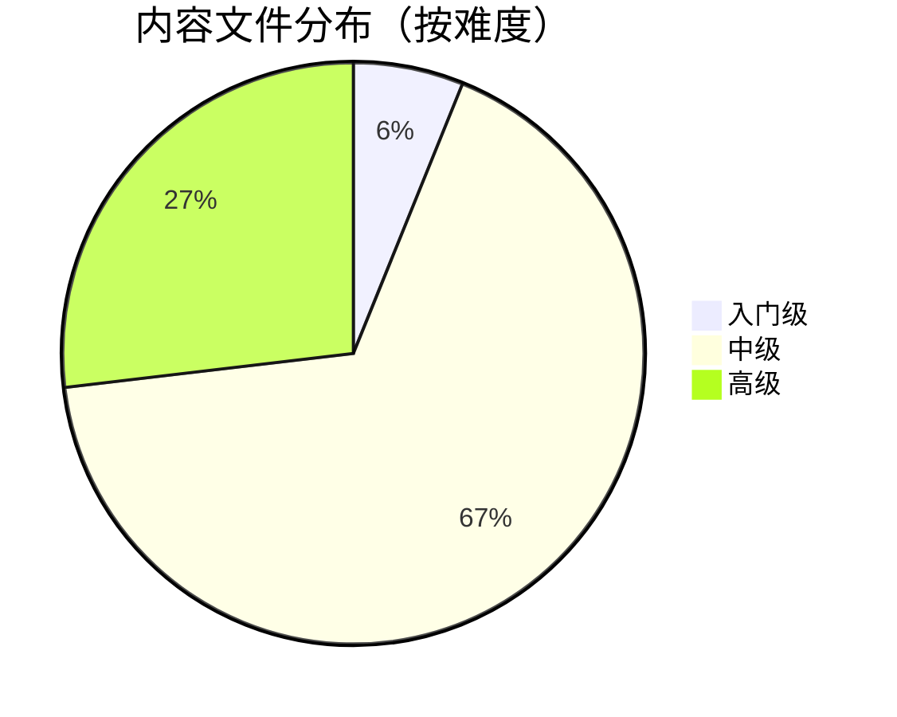

# 金融知识体系 - 统计仪表板

> 自动生成于 2026-03-18 00:24

---

## 系统规模概览

| 指标 | 数值 | 目标 | 状态 |
|------|------|------|------|
| 内容文件总数 | 294 | 200+ | ✅ |
| 总字数 | 119.6 万字 | 60-100 万字 | ✅ |
| 投资大师档案 | 4 | 20+ | 🔄 |
| 公司案例研究 | 22 | 50+ | 🔄 |
| 行业分析文章 | 29 | 30+ | 🔄 |
| Mermaid 图表 | 395 | — | — |
| 参考文献条目 | 3503 | 200+ | — |

---

## 内容分布（按学习阶段）



| 学习阶段 | 文件数 | 字数 | 图表数 |
|----------|--------|------|--------|
| 第一阶段：金融认知 | 5 | 2.3 万字 | 7 |
| 第二阶段：经济学基础 | 26 | 10.5 万字 | 56 |
| 第三阶段：公司分析 | 43 | 18.1 万字 | 49 |
| 第四阶段：投资体系 | 49 | 21.8 万字 | 69 |
| 第五阶段：全球视角 | 126 | 47.3 万字 | 181 |
| 第六阶段：宏观框架 | 11 | 5.7 万字 | 14 |
| 补充：金融历史 | 15 | 6.5 万字 | 4 |
| 补充：实用工具 | 19 | 7.5 万字 | 15 |

---

## 内容分布（按难度级别）



---

## 质量指标

| 质量维度 | 达标文件数 | 总文件数 | 达标率 |
|----------|-----------|---------|--------|
| 元数据完整 | 294 | 294 | 100.0% |
| 包含可视化图表 | 187 | 294 | 63.6% |
| 包含参考文献 | 270 | 294 | 91.8% |

**综合质量评分：85.1/100** `████████░░`

---

## 学习进度跟踪

使用以下清单跟踪你的学习进度：

- [ ] **第一阶段：金融认知**（5 篇文章）
- [ ] **第二阶段：经济学基础**（26 篇文章）
- [ ] **第三阶段：公司分析**（43 篇文章）
- [ ] **第四阶段：投资体系**（49 篇文章）
- [ ] **第五阶段：全球视角**（126 篇文章）
- [ ] **第六阶段：宏观框架**（11 篇文章）

---

## 如何更新此仪表板

在 `knowledge/05-insights/finance/` 目录下运行：

```bash
python generate_dashboard.py
```

脚本会自动扫描所有内容文件并更新 `dashboard.md`。

*最后更新：2026-03-18 00:24*