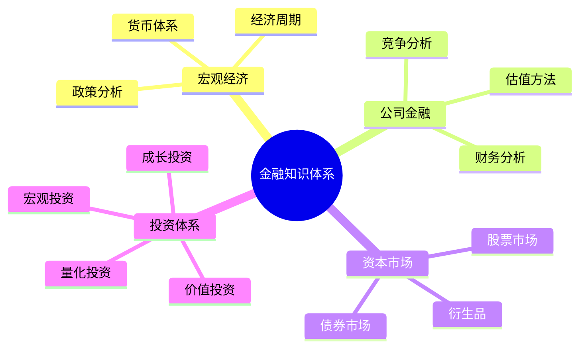
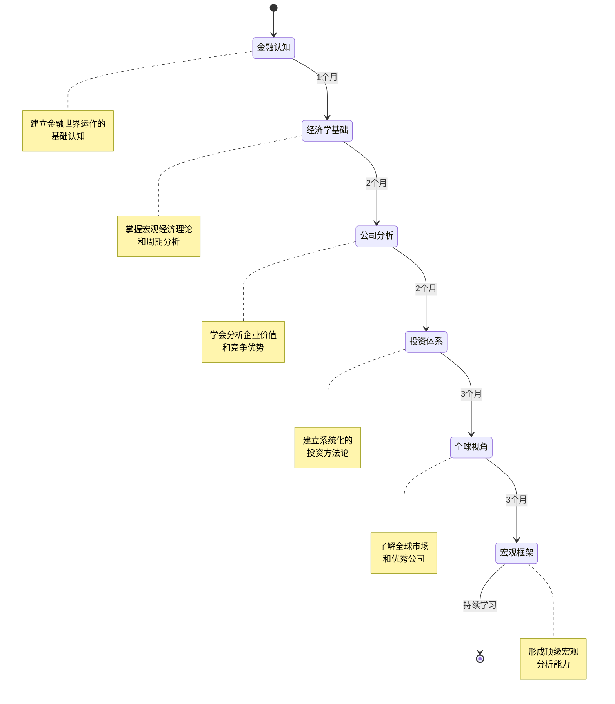

# 金融知识体系

## 概述

欢迎来到系统化的金融知识学习之旅。本知识体系专为工程师背景的学习者设计，将金融投资的核心知识组织成清晰的学习路径。通过 12 个月的系统学习，你将建立从宏观经济到公司分析、从投资理论到实战应用的完整认知框架。

金融投资的本质是：**识别优秀资产，以合理价格买入，长期持有**。这个看似简单的原则，需要建立在深厚的知识基础之上。本体系将帮助你构建这个基础，让你能够：

- 理解宏观经济运行规律和货币体系
- 分析企业财务状况和竞争优势
- 掌握多种投资方法论和估值技术
- 建立全球视野和跨市场投资能力
- 形成系统化的投资决策框架

## 知识框架总览

## 五阶段学习流程

## 12 个月系统学习路径

### 第一阶段：金融认知（1 个月）

**学习目标**：建立对金融世界运作的基础认知

**核心主题**：
- 货币创造机制与银行体系
- 金融市场结构与参与者
- 通胀理论与中央银行运作
- 金融系统的整体架构

**学习产出**：
- 理解货币如何创造和流通
- 认识四大金融市场的运作机制
- 掌握央行政策的基本逻辑
- 建立金融系统的全局视角

**时间分配**：每天 1.5-2 小时，共 30 天

[→ 进入第一阶段学习](01-financial-cognition/index.html)

---

### 第二阶段：经济学基础（2 个月）

**学习目标**：掌握宏观经济理论和经济周期分析

**核心主题**：
- 宏观经济学核心概念（GDP、CPI、利率、就业）
- 经济周期理论（基钦、朱格拉、康波、美林时钟）
- 货币政策工具与传导机制
- 财政政策与经济指标体系

**学习产出**：
- 能够解读主要经济数据
- 理解经济周期的运行规律
- 掌握货币和财政政策的影响
- 建立宏观分析的基础框架

**时间分配**：每天 1.5-2 小时，共 60 天

[→ 进入第二阶段学习](02-economic-foundation/index.html)

---

### 第三阶段：公司分析（2 个月）

**学习目标**：学会分析企业财务和竞争力

**核心主题**：
- 财务报表深度解析（资产负债表、利润表、现金流量表）
- 估值方法体系（DCF、相对估值、资产估值）
- 竞争分析框架（波特五力、经济护城河）
- 商业模式评估与案例研究

**学习产出**：
- 能够独立分析企业财务报表
- 掌握多种估值方法和应用场景
- 识别企业的竞争优势和护城河
- 通过 30+ 案例建立分析直觉

**时间分配**：每天 2 小时，共 60 天

[→ 进入第三阶段学习](03-company-analysis/index.html)

---

### 第四阶段：投资体系（3 个月）

**学习目标**：建立系统化的投资方法论

**核心主题**：
- 价值投资（格雷厄姆、巴菲特、芒格）
- 成长投资（费雪、GARP 策略）
- 宏观投资（达里奥、索罗斯）
- 量化投资（因子模型、统计套利）
- 指数投资与资产配置
- 风险管理与行为金融
- 20+ 位投资大师思想研究

**学习产出**：
- 深入理解多种投资流派
- 找到适合自己的投资风格
- 建立投资决策框架
- 学习顶级投资者的思维方式

**时间分配**：每天 2 小时，共 90 天

[→ 进入第四阶段学习](04-investment-system/index.html)

---

### 第五阶段：全球投资视角（3 个月）

**学习目标**：了解全球市场和优秀公司

**核心主题**：
- 美国市场深度研究（50+ 公司，6 大板块）
- 中国市场分析（50+ 公司，5 大板块）
- 全球其他市场概览
- 30+ 行业深度分析
- 公司研究方法论

**学习产出**：
- 建立全球投资视野
- 深入了解 100+ 优秀公司
- 掌握行业分析框架
- 形成跨市场投资能力

**时间分配**：每天 2 小时，共 90 天

[→ 进入第五阶段学习](05-global-perspective/index.html)

---

### 第六阶段：宏观框架（持续学习）

**学习目标**：形成顶级宏观分析能力

**核心主题**：
- 货币周期与债务周期
- 三层金融世界模型
- 全球资本流动与地缘政治
- 金融危机模式与应对
- 综合投资决策框架

**学习产出**：
- 建立宏观分析的顶层框架
- 理解金融世界的深层运作逻辑
- 形成危机意识和风险管理能力
- 整合所有知识形成投资智慧

**时间分配**：持续学习和实践

[→ 进入第六阶段学习](06-macro-framework/index.html)

## 工程师学习金融的四大优势

### 1. 系统思维能力

工程师习惯于将复杂系统分解为模块和接口，这种思维方式完美适用于理解金融系统。金融市场本身就是一个复杂的系统，包含多个相互作用的子系统（货币系统、银行系统、资本市场）。工程师的系统思维能够帮助你：

- 快速理解金融系统的整体架构
- 识别各个组件之间的因果关系
- 建立清晰的分析框架和决策流程

### 2. 逻辑分析能力

编程训练培养的严密逻辑思维，在金融分析中同样重要。无论是分析财务报表、评估商业模式，还是判断投资机会，都需要严谨的逻辑推理。工程师能够：

- 快速识别论证中的逻辑漏洞
- 建立因果关系的分析链条
- 避免情绪化决策，坚持理性分析

### 3. 数据处理能力

工程师熟悉数据结构和算法，这在处理大量财务数据和市场信息时是巨大优势。你可以：

- 快速掌握财务指标的计算和分析
- 理解量化投资模型和统计方法
- 使用编程工具自动化投资分析
- 建立数据驱动的投资决策流程

### 4. 技术理解优势

在科技驱动的时代，理解技术趋势是重要的投资优势。工程师能够：

- 深入理解科技公司的技术壁垒
- 判断技术创新的商业价值
- 识别技术驱动的投资机会（AI、半导体、云计算）
- 避免被技术概念炒作误导

## 核心投资原则

### 买优秀资产 + 长期持有

这是贯穿整个知识体系的核心理念：

**什么是优秀资产？**
- 具有强大竞争优势（经济护城河）
- 优秀的管理团队和企业文化
- 持续的盈利能力和现金流
- 合理的估值水平

**为什么长期持有？**
- 复利的力量需要时间积累
- 避免频繁交易的成本和税收
- 让优秀企业的价值充分释放
- 减少市场波动的情绪影响

**如何实践？**
- 深入研究，只投资真正理解的公司
- 以合理价格买入，不追高
- 建立投资组合，分散风险
- 保持耐心，忽略短期波动
- 持续学习，不断优化认知

## 每日学习时间建议

### 工作日（周一至周五）

**1.5 小时分配**：
- 理论学习：45 分钟（阅读核心文章）
- 案例研究：30 分钟（分析公司或案例）
- 实践应用：15 分钟（记录笔记、整理框架）

### 周末（周六、周日）

**2-3 小时分配**：
- 深度阅读：60 分钟（完整文章或书籍章节）
- 综合分析：45 分钟（完整公司研究或行业分析）
- 复习总结：30 分钟（整理本周学习，更新知识图谱）
- 延伸阅读：30 分钟（推荐书籍或论文）

### 学习建议

- **循序渐进**：严格按照五阶段顺序学习，不要跳跃
- **理论结合实践**：学习理论的同时，关注实际市场动态
- **建立笔记系统**：记录关键概念、投资框架、案例分析
- **定期复习**：每周复习本周内容，每月复习本月重点
- **保持好奇心**：主动探索感兴趣的主题，深入研究

## 学习阶段导航

### [第一阶段：金融认知（1 个月）](01-financial-cognition/index.html)
建立金融世界运作的基础认知，理解货币、银行、市场的本质

### [第二阶段：经济学基础（2 个月）](02-economic-foundation/index.html)
掌握宏观经济理论和经济周期分析，理解政策对市场的影响

### [第三阶段：公司分析（2 个月）](03-company-analysis/index.html)
学会分析企业财务和竞争力，掌握估值方法和商业模式评估

### [第四阶段：投资体系（3 个月）](04-investment-system/index.html)
建立系统化的投资方法论，学习顶级投资者的思想和实践

### [第五阶段：全球投资视角（3 个月）](05-global-perspective/index.html)
了解全球市场和优秀公司，建立跨市场投资能力

### [第六阶段：宏观框架（持续学习）](06-macro-framework/index.html)
形成顶级宏观分析能力，整合所有知识建立投资智慧

### [金融历史（补充模块）](07-financial-history/index.html)
通过历史案例深化对金融市场的理解，学习危机与繁荣的规律

### [实用工具（补充模块）](08-practical-tools/index.html)
投资工具、学习资源、实践指南和心理建设，将理论转化为实践

## 开始你的学习之旅

建议从 [第一阶段：金融认知](01-financial-cognition/index.html) 开始，按照顺序逐步深入。每个阶段都为下一阶段打下基础，系统化学习将帮助你建立完整的知识体系。

记住：投资是一场马拉松，不是短跑。保持耐心，享受学习的过程，让知识的复利为你创造长期价值。
