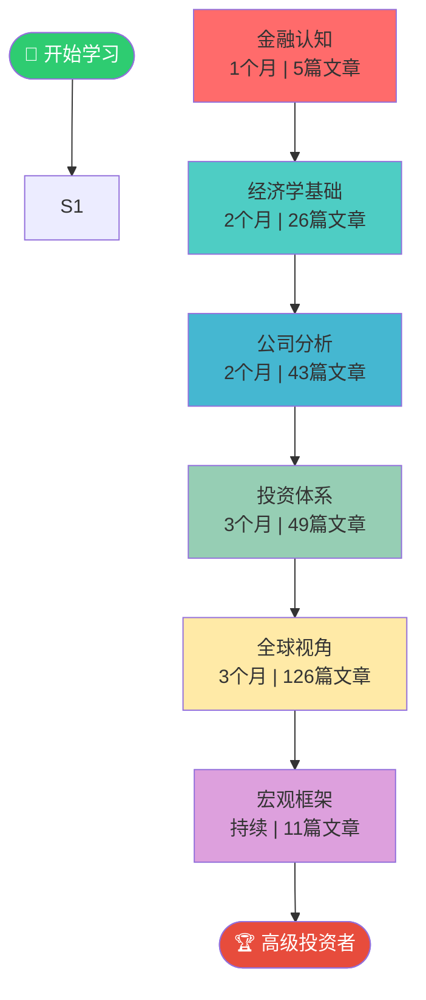
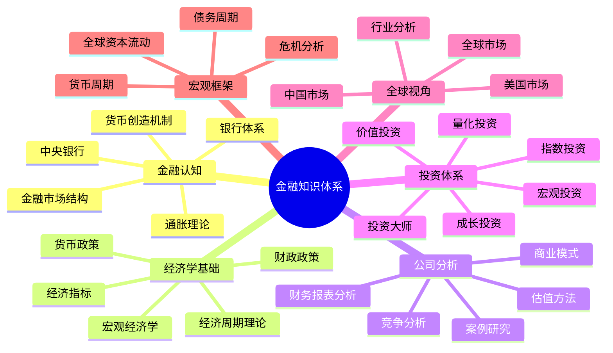
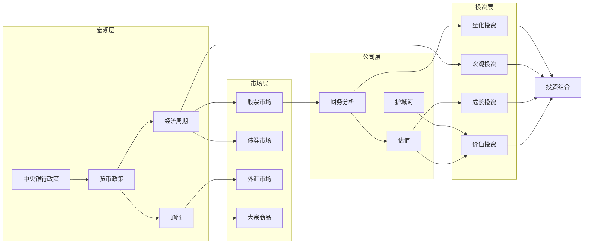

# 金融知识体系 - 全局导航地图

> 本文档提供金融知识体系的完整导航地图，包括知识结构图、学习路径可视化和主题关系图。

**系统规模**：359 个文件 | 294 篇内容文章 | 65 个导航索引

---

## 一、学习路径图

按照以下路径系统学习，从基础到高级循序渐进：

---

## 二、知识结构图

金融知识体系的完整思维导图：

---

## 三、核心概念关系图

宏观、市场、公司、投资四个层次的关键概念关系：

---

## 四、六大学习阶段

| 阶段 | 名称 | 时长 | 文章数 | 核心主题 |
|------|------|------|--------|----------|
| 第1阶段 | [金融认知](01-financial-cognition/index.html) | 1个月 | 5 | 货币创造、银行体系、金融市场... |
| 第2阶段 | [经济学基础](02-economic-foundation/index.html) | 2个月 | 26 | 宏观经济学、经济周期、货币政策... |
| 第3阶段 | [公司分析](03-company-analysis/index.html) | 2个月 | 43 | 财务报表、估值方法、竞争分析... |
| 第4阶段 | [投资体系](04-investment-system/index.html) | 3个月 | 49 | 价值投资、成长投资、宏观投资... |
| 第5阶段 | [全球视角](05-global-perspective/index.html) | 3个月 | 126 | 美国市场、中国市场、全球市场... |
| 第6阶段 | [宏观框架](06-macro-framework/index.html) | 持续 | 11 | 货币周期、债务周期、三层模型... |

---

## 五、补充模块

| 模块 | 名称 | 内容 |
|------|------|------|
| [金融历史](07-financial-history/index.html) | 金融历史 | 金融危机史、投资思想史、市场演进 (15篇) |
| [实用工具](08-practical-tools/index.html) | 实用工具 | 投资工具箱、学习资源、实践指南 (19篇) |

---

## 六、快速导航

### 按投资风格

| 投资风格 | 核心文章 |
|----------|----------|
| 价值投资 | [格雷厄姆原则](04-investment-system/value-investing/graham-principles.html) · [安全边际](04-investment-system/value-investing/margin-of-safety.html) · [巴菲特演进](04-investment-system/value-investing/buffett-evolution.html) |
| 成长投资 | [费雪方法论](04-investment-system/growth-investing/fisher-methodology.html) · [成长指标](04-investment-system/growth-investing/growth-metrics.html) · [科技成长股](04-investment-system/growth-investing/technology-growth.html) |
| 宏观投资 | [达里奥原则](04-investment-system/macro-investing/dalio-principles.html) · [索罗斯反身性](04-investment-system/macro-investing/soros-reflexivity.html) · [全球宏观策略](04-investment-system/macro-investing/global-macro-strategies.html) |
| 量化投资 | [因子投资](04-investment-system/quantitative-investing/factor-investing.html) · [Fama-French模型](04-investment-system/quantitative-investing/fama-french-model.html) · [回测方法论](04-investment-system/quantitative-investing/backtesting.html) |
| 指数投资 | [被动投资理论](04-investment-system/index-investing/passive-investing.html) · [ETF指南](04-investment-system/index-investing/etf-guide.html) · [资产配置](04-investment-system/index-investing/asset-allocation.html) |

### 按市场

| 市场 | 入口 |
|------|------|
| 美国市场 | [美国市场总览](05-global-perspective/us-market/index.html) |
| 中国市场 | [中国市场总览](05-global-perspective/china-market/index.html) |
| 全球市场 | [全球市场对比](05-global-perspective/global-markets/index.html) |
| 行业分析 | [行业分析框架](05-global-perspective/industry-analysis/index.html) |

### 按工具

| 工具类型 | 脚本名称 |
|----------|----------|
| 元数据验证 | `validate_metadata.py` |
| 链接检查 | `check_links.py` |
| 双向链接检查 | `check_bidirectional_links.py` |
| 导航结构检查 | `check_navigation.py` |

---

## 七、投资大师快速索引

| 大师 | 风格 | 档案 |
|------|------|------|
| 沃伦·巴菲特 | 价值/质量 | [warren-buffett.md](04-investment-system/investor-profiles/warren-buffett.html) |
| 查理·芒格 | 价值/多元思维 | [charlie-munger.md](04-investment-system/investor-profiles/charlie-munger.html) |
| 瑞·达里奥 | 宏观/全天候 | [ray-dalio.md](04-investment-system/investor-profiles/ray-dalio.html) |
| 乔治·索罗斯 | 宏观/反身性 | [george-soros.md](04-investment-system/investor-profiles/george-soros.html) |
| 本杰明·格雷厄姆 | 深度价值 | *(未创建)* |
| 菲利普·费雪 | 成长投资 | *(未创建)* |
| 彼得·林奇 | 成长/GARP | *(未创建)* |
| 霍华德·马克斯 | 价值/风险 | *(未创建)* |

---

*本地图由 `generate_knowledge_map.py` 自动生成*  
*最后更新：2026-03-17*
