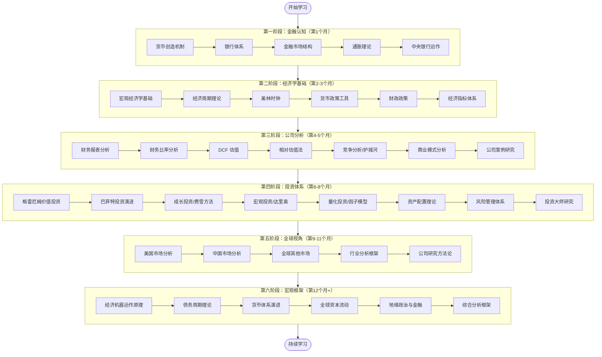
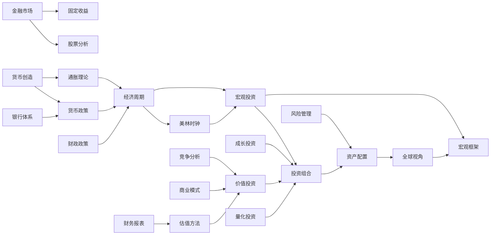
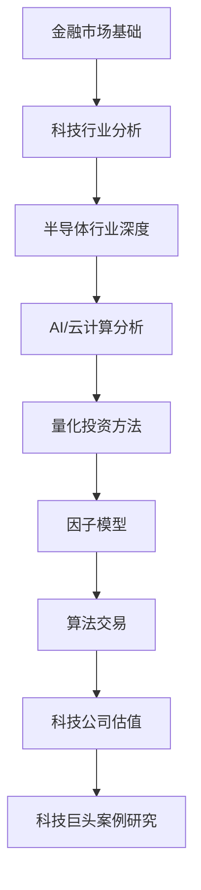

# 学习路径图

本文档提供可视化的学习路径、知识依赖图和个性化学习建议，帮助你规划最适合自己的学习计划。

## 完整学习路径（12 个月）



---

## 知识依赖图

理解各知识模块之间的依赖关系，确保按正确顺序学习：



---

## 个性化学习路径

### 路径 A：快速入门（3 个月）

适合：时间有限，想快速建立基础认知


**推荐文章**（按顺序）：
1. `01-financial-cognition/money-creation.md`
2. `01-financial-cognition/banking-system.md`
3. `01-financial-cognition/financial-markets.md`
4. `02-economic-foundation/macroeconomics/gdp-analysis.md`
5. `02-economic-foundation/economic-cycles/cycle-overview.md`
6. `03-company-analysis/financial-statements/ratio-analysis.md`
7. `03-company-analysis/valuation-methods/pe-ratio.md`
8. `04-investment-system/value-investing/graham-principles.md`

**预计时间**：每天 1 小时，共 90 天

---

### 路径 B：系统学习（12 个月）

适合：希望建立完整知识体系的学习者

按照完整学习路径图，每天投入 1.5-2 小时，系统完成全部 6 个阶段。

**月度里程碑**：

| 月份 | 完成内容 | 关键成果 |
|------|----------|----------|
| 第 1 月 | 阶段 1：金融认知 | 理解货币体系和金融市场运作 |
| 第 2-3 月 | 阶段 2：经济学基础 | 掌握宏观经济分析框架 |
| 第 4-5 月 | 阶段 3：公司分析 | 能够分析企业财务和竞争优势 |
| 第 6-8 月 | 阶段 4：投资体系 | 建立系统化投资方法论 |
| 第 9-11 月 | 阶段 5：全球视角 | 了解全球主要市场和优秀公司 |
| 第 12 月+ | 阶段 6：宏观框架 | 形成顶级宏观分析能力 |

---

### 路径 C：工程师专项（6 个月）

适合：工程师背景，重点关注科技投资和量化方法



**重点文章**：
- `05-global-perspective/industry-analysis/technology/ai-industry.md`
- `05-global-perspective/industry-analysis/technology/semiconductor-industry.md`
- `04-investment-system/quantitative-investing/factor-investing.md`
- `04-investment-system/quantitative-investing/portfolio-optimization.md`
- `05-global-perspective/us-market/technology/semiconductors/nvidia.md`

---

### 路径 D：中国市场专项（4 个月）

适合：重点关注 A 股和港股投资的学习者

**重点内容**：
1. `01-financial-cognition/central-banking.md`（人民银行部分）
2. `05-global-perspective/china-market/` 全部内容
3. `05-global-perspective/industry-analysis/consumer/` 消费行业
4. `03-company-analysis/case-studies/chinese-companies/` 中国公司案例

---

## 时间规划工具

### 每日学习计划模板

```
早晨（30 分钟）
├── 阅读新文章（20 分钟）
└── 记录关键概念和问题（10 分钟）

午间（20 分钟）
├── 复习昨天内容（10 分钟）
└── 整理笔记（10 分钟）

晚间（40-70 分钟）
├── 深度阅读（30 分钟）
├── 案例分析（20 分钟）
└── 延伸阅读（可选，20 分钟）
```

### 周学习计划模板

| 天 | 学习内容 | 时间 |
|----|----------|------|
| 周一 | 新文章阅读 | 1.5 小时 |
| 周二 | 深化理解，查阅参考资料 | 1.5 小时 |
| 周三 | 案例分析 | 1.5 小时 |
| 周四 | 新文章阅读 | 1.5 小时 |
| 周五 | 本周内容复习总结 | 1 小时 |
| 周六 | 延伸阅读，实践练习 | 2 小时 |
| 周日 | 休息或轻度复习 | 可选 |

### 进度自检清单

完成每个学习阶段后，用以下问题检验掌握程度：

**阶段 1 完成标准**：
- [ ] 能解释货币是如何被创造出来的
- [ ] 能描述中央银行的主要职能和工具
- [ ] 能说明四大金融市场的运作机制
- [ ] 能解释通胀的三种类型及其影响

**阶段 2 完成标准**：
- [ ] 能解读 GDP、CPI、就业等主要经济指标
- [ ] 能识别经济周期的四个阶段
- [ ] 能运用美林时钟进行资产配置判断
- [ ] 能分析货币政策和财政政策的传导机制

**阶段 3 完成标准**：
- [ ] 能阅读和分析三张财务报表
- [ ] 能计算并解读 20+ 个财务比率
- [ ] 能进行基础的 DCF 估值
- [ ] 能分析企业的竞争优势和护城河

**阶段 4 完成标准**：
- [ ] 能运用格雷厄姆的安全边际原则
- [ ] 能区分价值投资、成长投资、宏观投资的核心差异
- [ ] 能构建基础的资产配置组合
- [ ] 能识别和管理主要投资风险

**阶段 5 完成标准**：
- [ ] 能分析美国主要行业的投资逻辑
- [ ] 能分析中国主要行业的特点和机会
- [ ] 能运用行业分析框架评估投资机会
- [ ] 能撰写基础的公司研究报告

**阶段 6 完成标准**：
- [ ] 能运用达里奥的经济机器模型分析宏观形势
- [ ] 能识别债务周期的不同阶段
- [ ] 能分析全球资本流动对市场的影响
- [ ] 能构建综合的宏观-行业-公司分析框架

---

*学习路径图版本：1.0 | 最后更新：2024 年*
